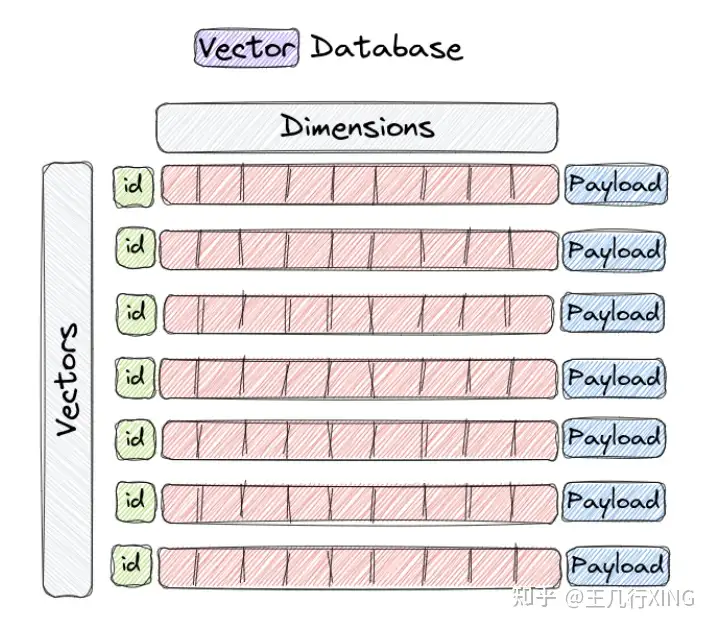
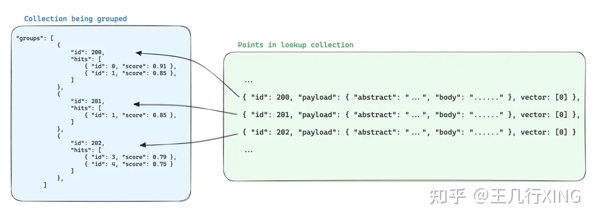

#  Qdrant Docker 安装

参考：https://qdrant.tech/documentation/quick-start/


##  Docker 安装

```
docker pull qdrant/qdrant

docker run -p 6333:6333 -p 6334:6334 \
    -v $(pwd)/qdrant_storage:/qdrant/storage:z \
    qdrant/qdrant   
```


##  Qdrant URL

- REST API: [localhost:6333](http://localhost:6333/)
- Web UI: [localhost:6333/dashboard](http://localhost:6333/dashboard)
- GRPC API: [localhost:6334](http://localhost:6334/)


## Initialize the client

```python
from qdrant_client import QdrantClient
client = QdrantClient(url="http://localhost:6333")
```


##  Create a collection

```python
from qdrant_client.models import Distance, VectorParams

client.create_collection(
    collection_name="test_collection",
    vectors_config=VectorParams(size=4, distance=Distance.DOT),
)
```


##  Add vectors

```python
from qdrant_client.models import PointStruct

operation_info = client.upsert(
    collection_name="test_collection",
    wait=True,
    points=[
        PointStruct(id=1, vector=[0.05, 0.61, 0.76, 0.74], payload={"city": "Berlin"}),
        PointStruct(id=2, vector=[0.19, 0.81, 0.75, 0.11], payload={"city": "London"}),
        PointStruct(id=3, vector=[0.36, 0.55, 0.47, 0.94], payload={"city": "Moscow"}),
        PointStruct(id=4, vector=[0.18, 0.01, 0.85, 0.80], payload={"city": "New York"}),
        PointStruct(id=5, vector=[0.24, 0.18, 0.22, 0.44], payload={"city": "Beijing"}),
        PointStruct(id=6, vector=[0.35, 0.08, 0.11, 0.44], payload={"city": "Mumbai"}),
    ],
)

print(operation_info)
```

输出：

```
operation_id=0 status=<UpdateStatus.COMPLETED: 'completed'>
```


##  Run a query

```python
search_result = client.search(
    collection_name="test_collection", query_vector=[0.2, 0.1, 0.9, 0.7], limit=3
)

print(search_result)
```

输出：

```
[ScoredPoint(id=4, version=0, score=1.362, payload={'city': 'New York'}, vector=None, shard_key=None), ScoredPoint(id=1, 
version=0, score=1.273, payload={'city': 'Berlin'}, vector=None, shard_key=None), ScoredPoint(id=3, version=0, score=1.208, 
payload={'city': 'Moscow'}, vector=None, shard_key=None)]

```


##  Add a filter

```python
from qdrant_client.models import Filter, FieldCondition, MatchValue

search_result = client.search(
    collection_name="test_collection",
    query_vector=[0.2, 0.1, 0.9, 0.7],
    query_filter=Filter(
        must=[FieldCondition(key="city", match=MatchValue(value="London"))]
    ),
    with_payload=True,
    limit=3,
)

print(search_result)
```

输出：

```
[ScoredPoint(id=2, version=0, score=0.871, payload={'city': 'London'}, vector=None, shard_key=None)]
```


### Delete collection

```python
client.delete_collection(collection_name="{test_collection}")
```


## Update collection parameters

```python
client.update_collection(
    collection_name="{collection_name}",
    optimizer_config=models.OptimizersConfigDiff(indexing_threshold=10000),
)
```


## Demo


```
# 2.Split 将Documents切分成块以便后续进行嵌入和向量存储
from langchain.text_splitter import RecursiveCharacterTextSplitter

text_splitter = RecursiveCharacterTextSplitter(chunk_size=200, chunk_overlap=10)
chunked_documents = text_splitter.split_documents(documents)

# 3.Store 将分割嵌入并存储在矢量数据库Qdrant中
from langchain.vectorstores import Qdrant
from langchain_openai import OpenAIEmbeddings

vectorstore = Qdrant.from_documents(
    documents=chunked_documents,  # 以分块的文档
    embedding=OpenAIEmbeddings(),  # 用OpenAI的Embedding Model做嵌入
    url="http://localhost:6333",  # in-memory 存储
    prefer_grpc=True,
    collection_name="my_documents", )  # 指定collection_name
```


往本地向量数据库存数据


## 向量数据库结构


### Collection

在Qdrant中，**Collection** 是一个包含点（向量和负载）的命名集合，你可以在这些点之间进行搜索。所有在同一个集合中的点的向量必须具有相同的维度，并通过单一度量标准进行比较。




### Payload


在Qdrant文档中提到的**Payload**，中文可以翻译为**负载**或**载荷**。**Payload** 则是附加到集合中每个点的向量上的数据，可以用于存储额外的信息，如标签或任何相关属性，进而在搜索时用于过滤或排序结果。换句话说，Payload 指的是附加在向量上的数据，这些数据用于存储额外的信息，如标签或属性，可以在搜索过程中用于过滤或排序结果。简而言之，payload 就是附加在集合中每个点的额外信息。


### Points


**Points** 指的是collection中的基本元素，每个点包含一个向量和可选的payload。简单来说，collection是一个装点的盒子，点是盒子里的内容，而payload是点上附加的标签信息。




