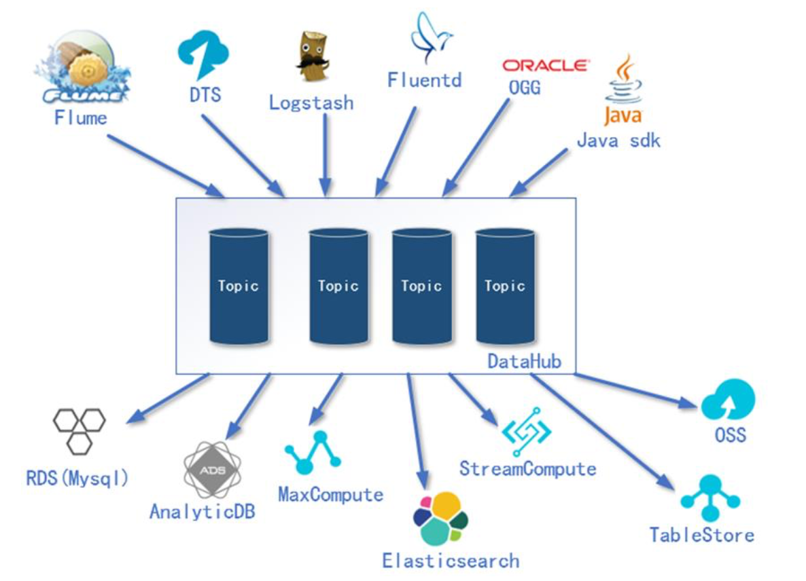
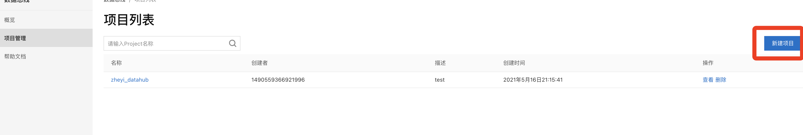
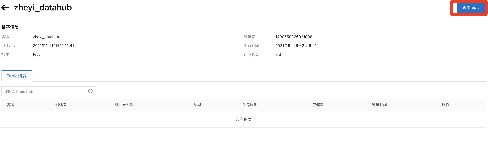

# 3. 创建DataHub

## 概念

DataHub 类似于传统大数据解决方案中 Kafka 的角色，提供了一个数据队列功能。

DataHub 除了供了一个缓冲的队列作用。同时由于 DataHub 提供了各种与其他阿里云 上下游产品的对接功能，所以 DataHub 又扮演了一个数据的分发枢纽工作。

### 1)DataHub 输入组件

####Flume:

主流的开源日志采集框架

####DTS:

类似 Canal，日志实时监控采集框架 

#### Logstash
也是日志采集框架，通常和 Elasticsearch、Kibana 集合使用 

##### Fluentd:
Fluentd 是一个实时开源的数据收集器

#### OGG:
实时监控 Oracle 中数据变化

#### Java Sdk:
支持 JavaAPI 方式访问

### 2)DataHub 输出组件

#### RDS

类似与传统 MySQL 数据库 

#### AnalyticDB:
面向分析型的分布式数据库 

#### MaxCompute:
离线分析框架 

##### Elasticsearch:
数据分析，倒排索引 

#### StreamCompute
实时分析框架 

#### TableSotre:
类似于 Redis，KV 形式存储数据 

#### OSS:
类似于 HDFS，存储图片、视频

## 创建

免费开通

## 创建项目

做好了这一步等于创建好了一个kafka

如果选择创建topic就等于往kafka里创建了一个topic。本次项目不创建

