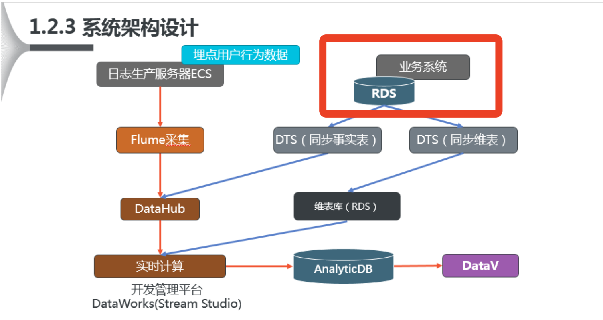
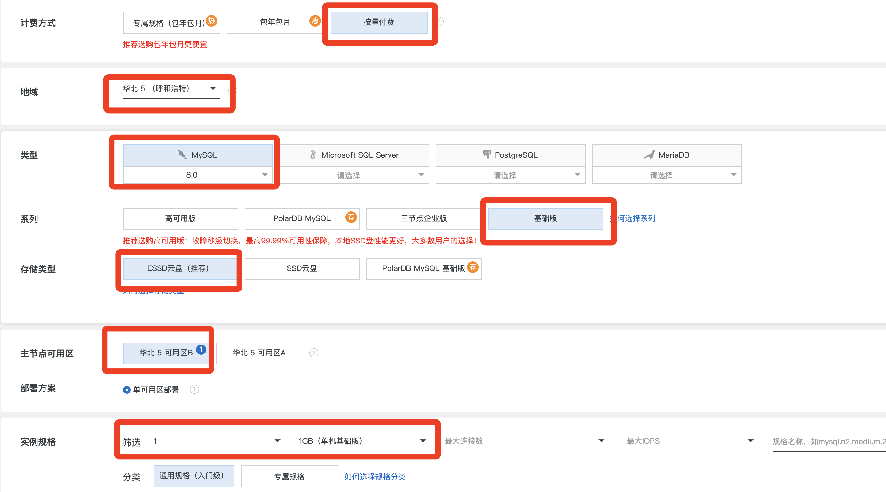
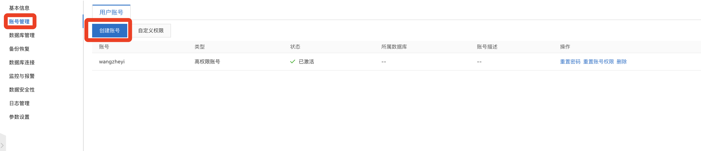
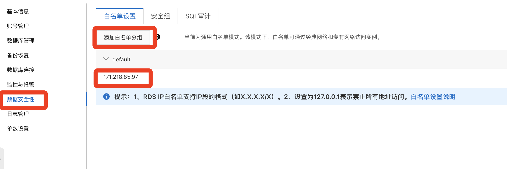
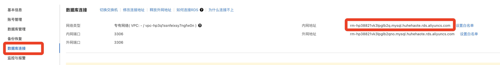
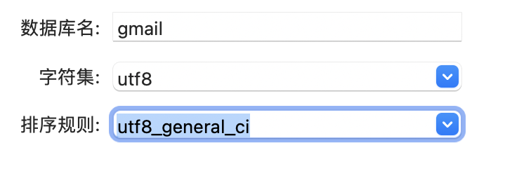
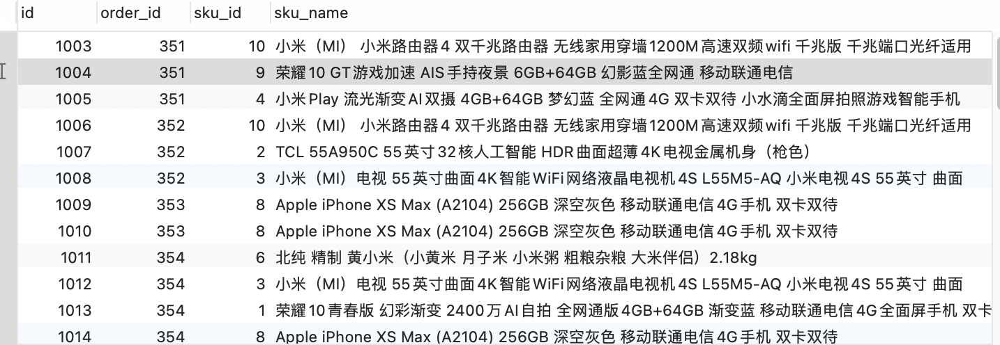

# 2. 创建RDB

RDB类似mysql

## 步骤

###开启服务

### 设置账号密码

	#账号密码
	root/root

### 设置白名单

### 获得外网访问地址

## 连接数据库

连接上数据库后

### 建表

###  导入数据

gmall_aliyun.sql

### 生成数据

 MySQL 中执行以下语句：
 
  作用:调用存储过程生成某天的业务数据，初始化数据
  
	CALL init_data('2019-10-08',100,30,TRUE)

参数 1:数据生成的日期，比如订单日期。 

参数 2:生成的订单数。

参数 3:生成的用户数。

参数 4 :是否清楚之前的订单及用户信息。

### 查询生成的数据

	SELECT * from order_detail

