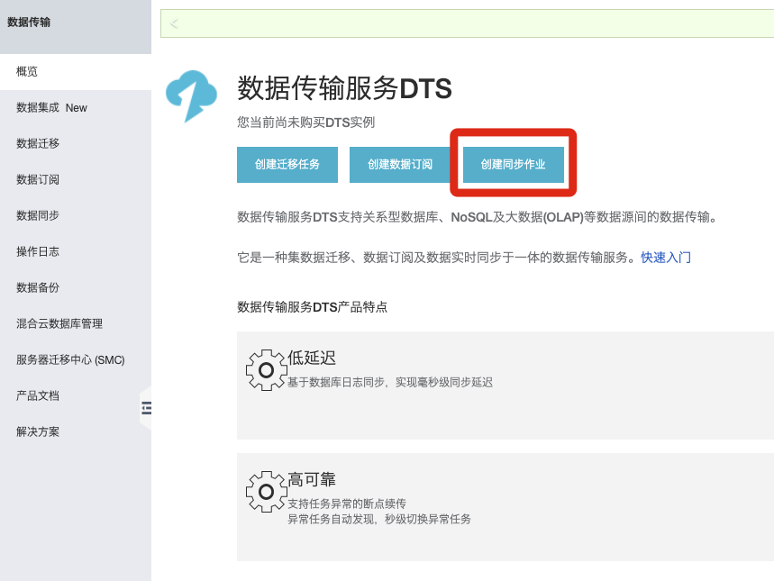
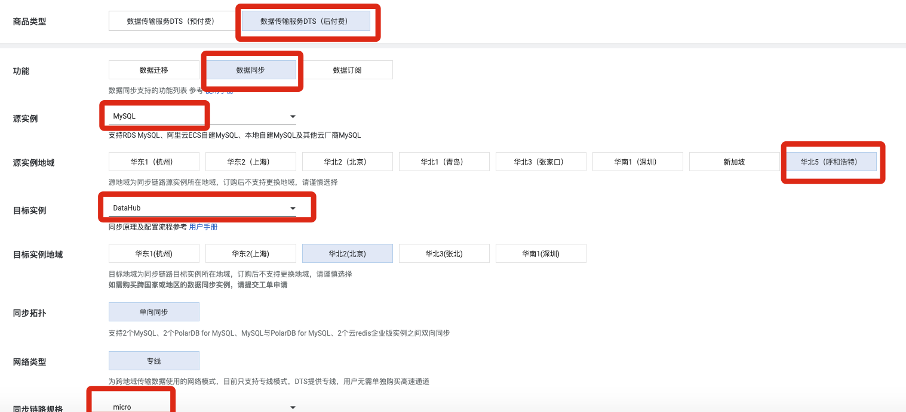
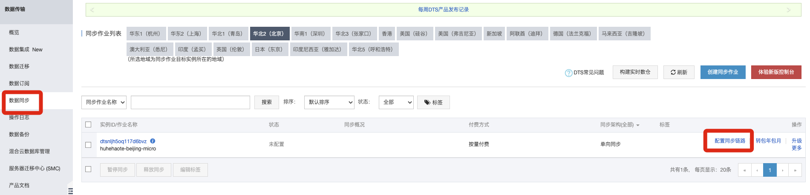
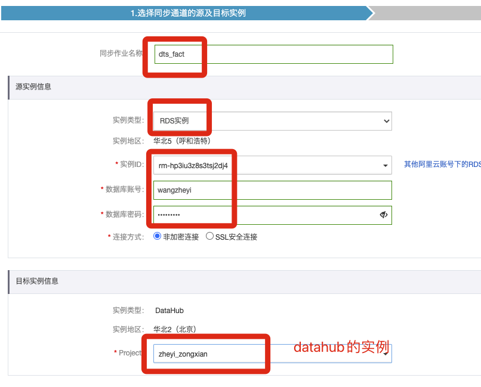
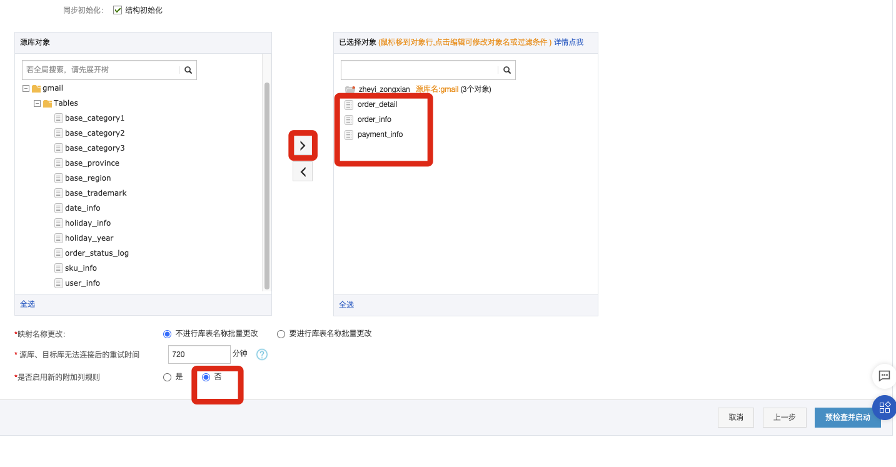
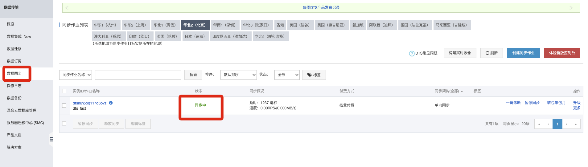
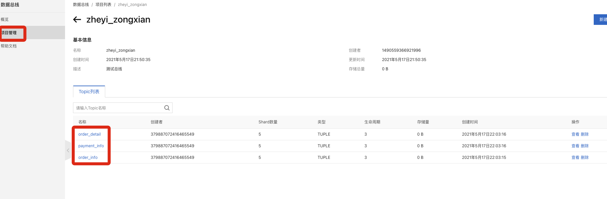
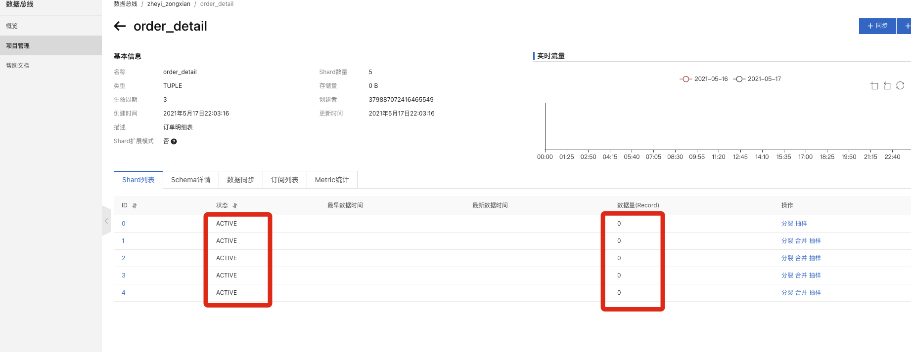
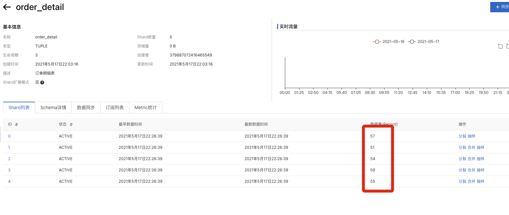
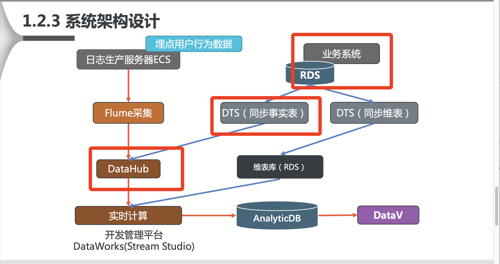

# 4. 创建DTS同步数据

## 概念

数据传输服务(Data Transmission Service) DTS 支持关系型数据库、NoSQL、大数据 (OLAP)等数据源间的数据传输。它是一种集数据迁移、数据订阅及数据实时同步于一体的 数据传输服务。数据传输致力于在公共云、混合云场景下，解决远距离、毫秒级异步数据传 输难题。它底层的数据流基础设施为阿里双 11 异地多活基础架构，为数千下游应用提供实 时数据流，已在线上稳定运行 5 年之久。您可以使用数据传输轻松构建安全、可扩展、高可 用的数据架构。

## 购买

## 配置

### 选择同步通道的源及目标实例

### 选择同步对象

通过点选，将事实表选中

## 同步启动

DTS 状态

Datahub状态

可以看到数据量都为0。因为此时datahub采集的是增量数据。

## 变动数据源

	CALL init_data('2019-10-09',100,30,FALSE)

可以看到数据变化

## 总结

至此，打通了RDS到 DTS 到 Datahub的全链路

