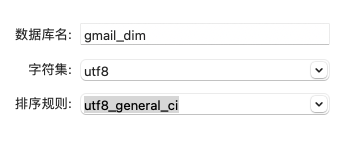
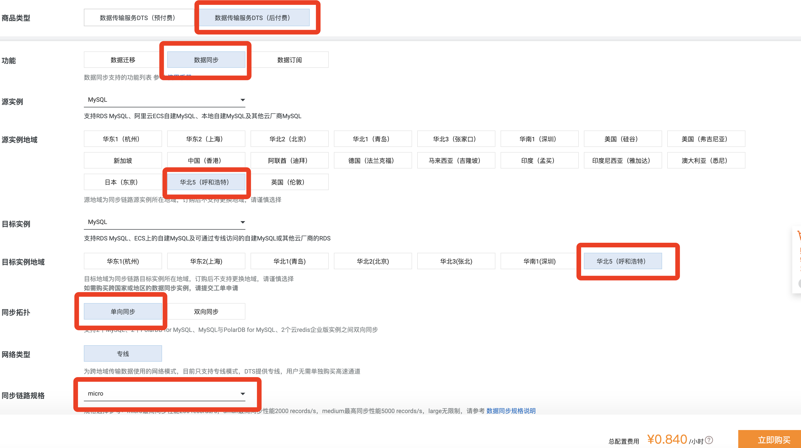
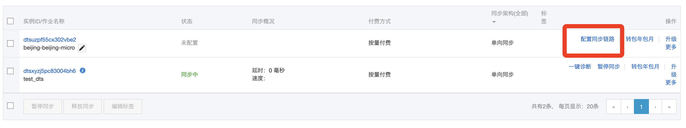
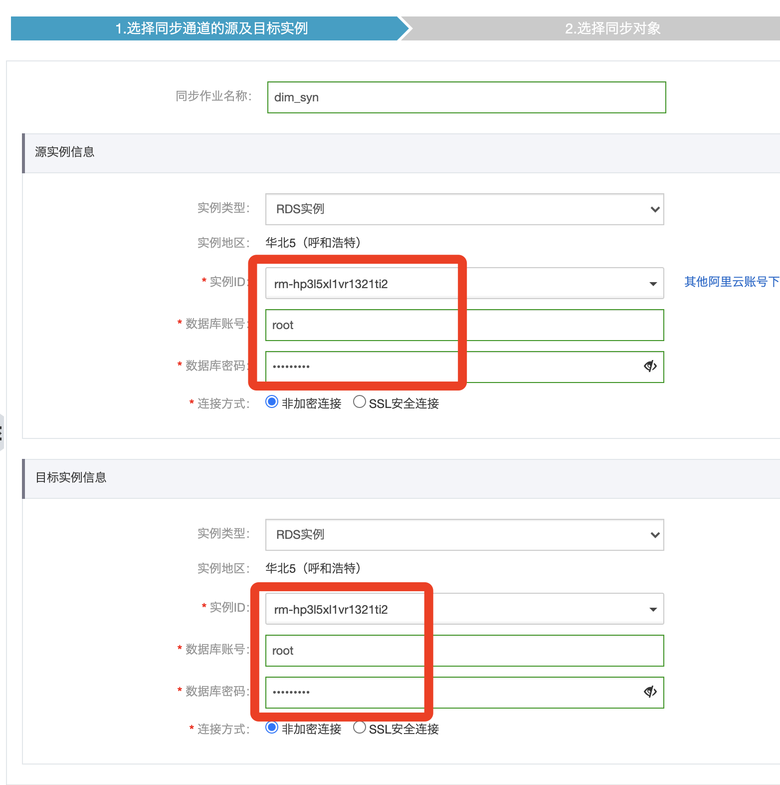
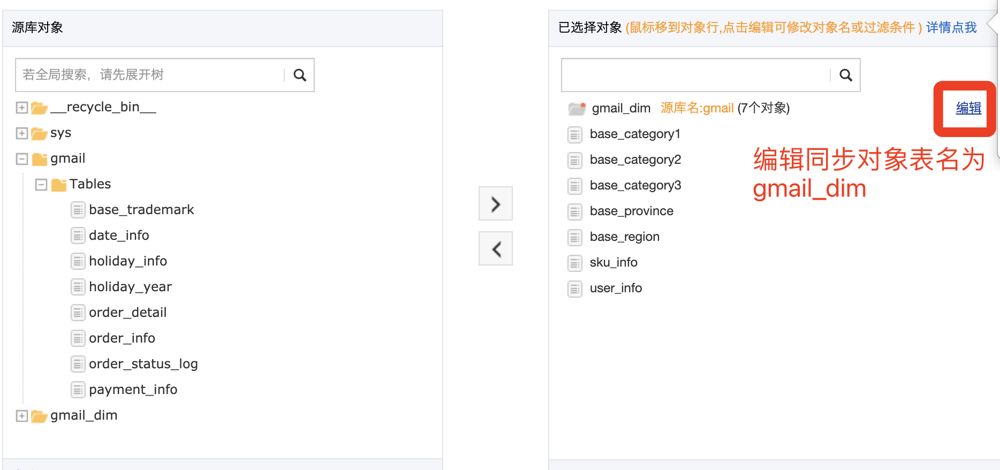
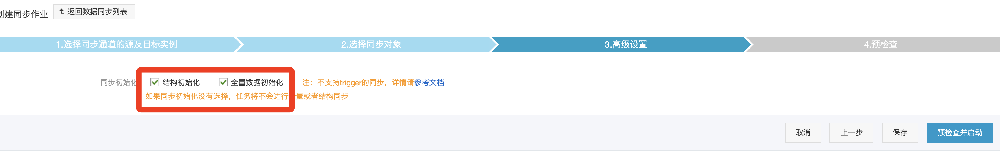
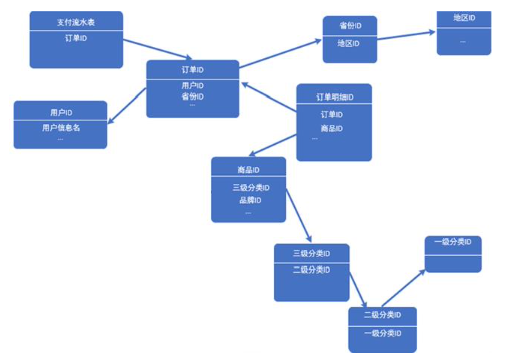
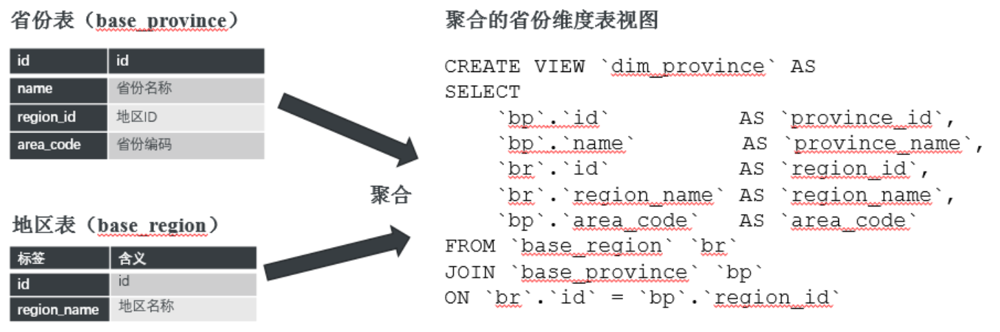
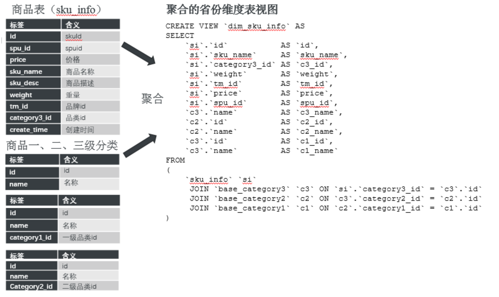

# 5. 同步维度表到Mysql

## 在RDB中创建维度表

## 新购一台DTS服务

## 配置同步链路

## 现有的数据表依赖关系

## 聚合表

**选择gmail_dim表**

### 在维表库中建立省份和地区视图

	CREATE VIEW dim_province AS
	SELECT
		bp.id AS province_id,
		bp.name AS province_name,
		br.id AS region_Id,
		br.region_name AS region_name,
		bp.area_code AS area_code
	FROM base_region br JOIN base_province bp ON br.id = bp.region_id

### 在维表库中建立商品和商品分类视图

	CREATE VIEW dim_sku_info AS
	SELECT
		si.id AS id, 
		si.sku_name AS sku_name, 
		si.category3_id AS c3_id,
		si.weight AS weight,
		si.tm_id  AS tm_id,
		si.price  AS price,
		si.spu_id  AS spu_id,
		c3.name  AS c3_name,
		c2.id  AS c2_id,
		c2.name  AS c2_name,
		c3.id  AS c1_id,
		c3.name  AS c1_name
	FROM (
		sku_info si 
		JOIN base_category3 c3 ON si.category3_id = c3.id
		JOIN base_category2 c2 ON c3.category2_id = c2.id
		JOIN base_category1 c1 ON c2.category1_id = c1.id
	)