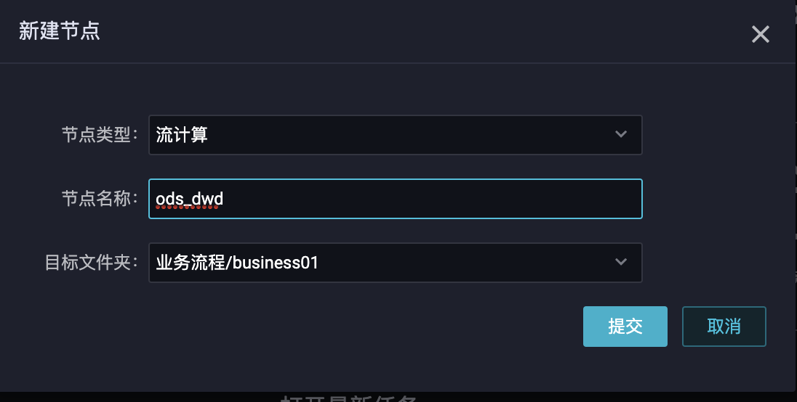

# 6.实时数仓

## 结构

## 流程

## 环境准备

#### Data Works

DataWorks（数据工场，原大数据开发套件）是阿里云重要的PaaS（Platform-as-a-Service）平台产品，为您提供数据集成、数据开发、数据地图、数据质量和数据服务等全方位的产品服务，一站式开发管理的界面，帮助企业专注于数据价值的挖掘和探索。

DataWorks支持多种计算和存储引擎服务，包括离线计算MaxCompute、开源大数据引擎E-MapReduce、实时计算（基于Flink）、机器学习PAI、图计算服务Graph Compute和交互式分析服务等，并且支持用户自定义接入计算和存储服务。DataWorks为您提供全链路智能大数据及AI开发和治理服务。

跳转到实时计算购买服务

完成购买后：

#### 实时计算

创建项目：

完成后去data works购买流程中继续操作。

保证CPU核数为2

### 数据开发

## 搭建数据仓库

右键点击business01，点击“新建任务”

开发桌面如下：

可拖拽可配置：

通过sql编写：

### ODS 到 DWD层的业务流程

需求:将订单信息中支付完成的信息和订单详情进行 Join 操作

#### order_info 数据源表

* 注意 1:由于数据都是 DTS 推送过来的，推送过来的字段都在原来的表字段前面加上了一个 dts_前缀。
* 注意 2:dts_utc_timestamp、dts_operation_flag、dts_after_flag 是 DataHub 框架提供的字段。dts_operation_flag=‘U’表示修改、 ‘I’表示插入、‘D’表示删除，dts_after_flag=‘Y’ 
* 注意 3:dts_order_status=1 表示下单，dts_order_status=2 表示已支付

sql:

	CREATE TABLE ods_order_info
	(
	dts_id BIGINT
	,dts_user_id BIGINT
	,dts_create_time BIGINT
	,dts_operate_time BIGINT
	,dts_province_id BIGINT
	,dts_order_status VARCHAR
	,dts_operation_flag VARCHAR
	,dts_after_flag VARCHAR ) WITH (
	type='datahub'
	,project='zheyi_zongxian'
	,topic='order_info' 
	,endPoint='http://dh-cn-beijing-int-vpc.aliyuncs.com' 
	,accessId='123123sdsf2' 
	,accessKey='111gHTwxfUnBuPCPlGYXntuMaMdvZjN0p111' 
	,startTime='2019-10-09 01:15:00'
	);

#### order_detail 数据源表

	CREATE TABLE ods_order_detail
	(
	dts_id BIGINT
	,dts_order_id BIGINT
	,dts_sku_id BIGINT
	,dts_sku_name VARCHAR
	,dts_sku_num BIGINT
	,dts_order_price DOUBLE
	,dts_utc_timestamp BIGINT
	,dts_operation_flag VARCHAR
	,dts_after_flag VARCHAR ) WITH (
	type='datahub'
	,project='zheyi_zongxian'
	,topic='order_detail' 
	,endPoint='http://dh-cn-beijing-int-vpc.aliyuncs.com' 
	,accessId='231331sdf24sdf' 
	,accessKey='111gHTwxfUnBuPCPlGYXntuMaMdvZjN0p111' 
	,startTime='2019-10-09 01:15:00'
	);
	
#### dwd_paid_order_detail 数据结果表

	CREATE TABLE dwd_paid_order_detail (
	   detail_id BIGINT
	   ,order_id BIGINT
	   ,user_id BIGINT
	   ,province_id BIGINT
	   ,sku_id BIGINT
	   ,sku_name VARCHAR
	,sku_num BIGINT
	,order_price DOUBLE
	,create_time VARCHAR
	,pay_time VARCHAR ) WITH (
	type='datahub'
	,project='zheyi_zongxian' 
	,topic='dwd_paid_order_detail' ,
	endPoint='http://dh-cn-beijing-int-vpc.aliyuncs.com' ,
	accessId='oooLTAI4sqK1231BCWsVrAKif9ooo'
	,accessKey='111gHTwxfUnBuPCPlGYXntuMaMdvZjN0p111'
	,startTime='2019-10-09 01:15:00' );
	
	
#### 上面的参数来源

endpoint:

accesskey:

#### 新建topic

去datahub中新建

从前面的sql中复制schema

#### 执行计算sql

	insert into dwd_paid_order_detail select
	od.dts_id
	,oi.dts_id order_id
	,oi.dts_user_id
	,oi.dts_province_id
	,od.dts_sku_id
	,od.dts_sku_name
	,od.dts_sku_num
	,od.dts_order_price ,FROM_UNIXTIME(cast(oi.dts_create_time/1000000 as BIGINT))
	create_time ---业务数据是秒，datahub 中数据是微秒，需要转换 
	,FROM_UNIXTIME(cast(oi.dts_operate_time/1000000 as BIGINT))
	pay_time
	from
	(
	select *  from ods_order_info
	where dts_operation_flag='U' and dts_order_status = '2'
	and dts_after_flag = 'Y' ) oi
	join (
	select *
	from ods_order_detail
	where dts_operation_flag='I'
	) od --双流join
	on oi.dts_id = od.dts_order_id;

### 检查代码

此时，整个sql已经编写完毕，通过点击执行计划校验代码是否存在问题

点击发布

运维

点击 od_dwd，监控过程

### 测试数据

	CALL init_data('2021-05-30',100,30,FALSE)
	
	
### 附录

#### SQL完整代码

	CREATE TABLE ods_order_info
	(
	dts_id BIGINT
	,dts_user_id BIGINT
	,dts_create_time BIGINT
	,dts_operate_time BIGINT
	,dts_province_id BIGINT
	,dts_order_status VARCHAR
	,dts_operation_flag VARCHAR
	,dts_after_flag VARCHAR ) WITH (
	type='datahub'
	,project='zheyi_zongxian'
	,topic='order_info' 
	,endPoint='http://dh-cn-beijing-int-vpc.aliyuncs.com' 
	,accessId='2342342342342424ssf' 
	,accessKey='gHTwxfUnBuPCPlGYXntuMaMdvZjN0p' 
	,startTime='2019-10-09 01:15:00'
	);
	
	
	CREATE TABLE ods_order_detail
	(
	dts_id BIGINT
	,dts_order_id BIGINT
	,dts_sku_id BIGINT
	,dts_sku_name VARCHAR
	,dts_sku_num BIGINT
	,dts_order_price DOUBLE
	,dts_utc_timestamp BIGINT
	,dts_operation_flag VARCHAR
	,dts_after_flag VARCHAR ) WITH (
	type='datahub'
	,project='zheyi_zongxian'
	,topic='order_detail' 
	,endPoint='http://dh-cn-beijing-int-vpc.aliyuncs.com' 
	,accessId='123123123123fsd23' 
	,accessKey='gHTwxfUnBuPCPlGYXntuMaMdvZjN0p' 
	,startTime='2019-10-09 01:15:00'
	);
	
	
	
	CREATE TABLE dwd_paid_order_detail (
	   detail_id BIGINT
	   ,order_id BIGINT
	   ,user_id BIGINT
	   ,province_id BIGINT
	   ,sku_id BIGINT
	   ,sku_name VARCHAR
	,sku_num BIGINT
	,order_price DOUBLE
	,create_time VARCHAR
	,pay_time VARCHAR ) WITH (
	type='datahub'
	,project='zheyi_zongxian' 
	,topic='dwd_paid_order_detail' ,
	endPoint='http://dh-cn-beijing-int-vpc.aliyuncs.com' ,
	accessId='123123123asd1'
	,accessKey='gHTwxfUnBuPCPlGYXntuMaMdvZjN0p'
	,startTime='2019-10-09 01:15:00' );
	
	
	insert into dwd_paid_order_detail select
	od.dts_id
	,oi.dts_id order_id
	,oi.dts_user_id
	,oi.dts_province_id
	,od.dts_sku_id
	,od.dts_sku_name
	,od.dts_sku_num
	,od.dts_order_price ,FROM_UNIXTIME(cast(oi.dts_create_time/1000000 as BIGINT))
	create_time ---业务数据是秒，datahub 中数据是微秒，需要转换 
	,FROM_UNIXTIME(cast(oi.dts_operate_time/1000000 as BIGINT))
	pay_time
	from
	(
	select * from ods_order_info
	where dts_operation_flag='U' and dts_order_status = '2'
	and dts_after_flag = 'Y' ) oi
	join (
	select *
	from ods_order_detail
	where dts_operation_flag='I'
	) od --双流join
	on oi.dts_id = od.dts_order_id;
