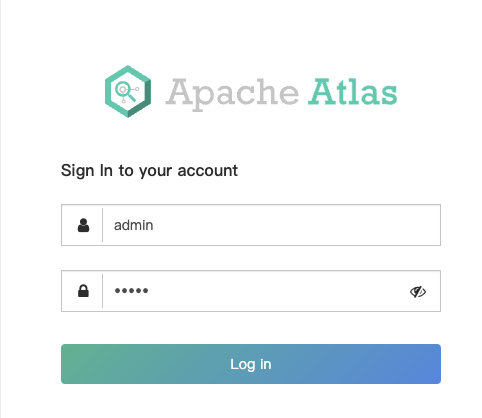
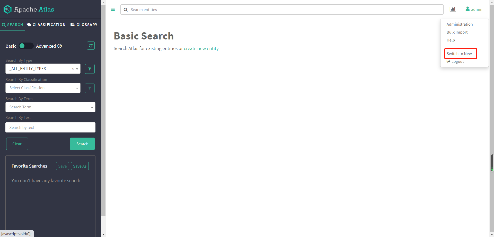

# Docker安裝apache atlas

	
## 启动容器
	
	docker run -d \
	    -p 21000:21000 \
	    --name atlas \
	    sburn/apache-atlas \
	    /opt/apache-atlas-2.1.0/bin/atlas_start.py
	
通过http://ip:21000访问

## 登录

默认用户名和密码是admin/admin

进入主页，点击右上角 switch to new ，使用新版界面，更直观：

