# CDH 安装

参考：https://www.jianshu.com/p/2baee4238fad

## 服务器准备

* CDH101：192.168.3.111
* CDH102：192.168.3.112
* CDH103：192.168.3.113

##  修改IP和主机名

	#CDH101
	hostnamectl set-hostname cdh1
	
	#CDH102
	hostnamectl set-hostname cdh2
	
	#CDH103
	hostnamectl set-hostname cdh3
	

## 搭建本地YUM仓库

在Master节点（CDH1）搭建本地YUM源作为离线安装CM的仓库，让其他主机也使用该源下载CM相关的软件

	systemctl stop firewalld
	yum install -y httpd createrepo
	systemctl start httpd && systemctl enable httpd
	

### 放置安装包

	cd /var/www/html
	mkdir CM6.3.1
	mkdir CDH6.3.2
	mkdir JDK1.8
	mkdir MySQL5.7
	chmod -R 777 /var/www/html/CM6.3.1
	chmod -R 777 /var/www/html/CDH6.3.2/
	chmod -R 777 /var/www/html/JDK1.8
	chmod -R 777 /var/www/html/MySQL5.7
	
###查看是否完成上传

	[root@cdh1 html]# tree
	.
	├── CDH6.3.2
	│   ├── CDH-6.3.2-1.cdh6.3.2.p0.1605554-el7.parcel
	│   ├── CDH-6.3.2-1.cdh6.3.2.p0.1605554-el7.parcel.sha1
	│   ├── CDH-6.3.2-1.cdh6.3.2.p0.1605554-el7.parcel.sha256
	│   ├── manifest.json
	│   └── repodata
	│       ├── 01a3b489a465bcac22a43492163df43451dc6ce47d27f66de289756b91635523-filelists.sqlite.bz2
	│       ├── 401dc19bda88c82c403423fb835844d64345f7e95f5b9835888189c03834cc93-filelists.xml.gz
	│       ├── 5dc1e6e73c84803f059bb3065e684e56adfc289a7e398946574d79dac6643945-primary.sqlite.bz2
	│       ├── 6bf9672d0862e8ef8b8ff05a2fd0208a922b1f5978e6589d87944c88259cb670-other.xml.gz
	│       ├── 7c36572015e075add2b38b900837bcdbb8a504130ddff49b2351a7fc0affa3d4-other.sqlite.bz2
	│       ├── dabe2ce5481d23de1f4f52bdcfee0f9af98316c9e0de2ce8123adeefa0dd08b9-primary.xml.gz
	│       └── repomd.xml
	├── CM6.3.1
	│   ├── allkeys.asc
	│   ├── cloudera-manager-agent-6.3.1-1466458.el7.x86_64.rpm
	│   ├── cloudera-manager-daemons-6.3.1-1466458.el7.x86_64.rpm
	│   ├── cloudera-manager-server-6.3.1-1466458.el7.x86_64.rpm
	│   ├── cloudera-manager-server-db-2-6.3.1-1466458.el7.x86_64.rpm
	│   ├── enterprise-debuginfo-6.3.1-1466458.el7.x86_64.rpm
	│   ├── oracle-j2sdk1.8-1.8.0+update181-1.x86_64.rpm
	│   └── repodata
	│       ├── 477117da349e68be7e2fbd7dbf704b1904381953c9465d12799252f8e4e24bb0-other.sqlite.bz2
	│       ├── 6580085e6cf4d0e43c3846630bee0ac5e3239695dca26cc4fa4f9beefe3df42f-primary.xml.gz
	│       ├── 7ae2ca783be50887569cda6d4d4a6235b6240a0abaa05a7b94ad372d86d7e1cf-filelists.sqlite.bz2
	│       ├── 972c67399bd6846c906ba5db88901fb548b60576c5556fa2216f703baf925f39-other.xml.gz
	│       ├── bf77ba88f7cc72570b0a962fa425df52521ba131b3bcb99b7dbb5607707f747a-primary.sqlite.bz2
	│       ├── d3e795d4db6f02b1565662011690c8d73800a4e671936c3eea169d21e4ecbef0-filelists.xml.gz
	│       └── repomd.xml
	├── JDK1.8
	│   └── jdk-8u202-linux-x64.rpm
	└── MySQL5.7
	    ├── 01_mysql-community-common-5.7.16-1.el7.x86_64.rpm
	    ├── 02_mysql-community-libs-5.7.16-1.el7.x86_64.rpm
	    ├── 03_mysql-community-libs-compat-5.7.16-1.el7.x86_64.rpm
	    ├── 04_mysql-community-client-5.7.16-1.el7.x86_64.rpm
	    ├── 05_mysql-community-server-5.7.16-1.el7.x86_64.rpm
	    └── mysql-connector-java-5.1.48.jar

	
	6 directories, 32 files
	
### 配置本地yum源

	createrepo /var/www/html/CM6.3.1/
	createrepo /var/www/html/CDH6.3.2/
	

## 环境准备

在3台服务器上

###  设置/etc/hosts

	vi /etc/hosts

插入：

	192.168.3.111 cdh1
	192.168.3.112 cdh2
	192.168.3.113 cdh3
	
###  免密登陆

	ssh-keygen -t rsa 

直接回车回车就OK

### 复制key

	cd ~/.ssh
	ssh-copy-id 192.168.3.111
	ssh-copy-id 192.168.3.112
	ssh-copy-id 192.168.3.113
	
### 关闭防火墙和 SELinux

	systemctl stop firewalld && systemctl disable firewalld
	sed -i 's/^SELINUX=.*/SELINUX=disabled/' /etc/selinux/config  && setenforce 0
	

### 时间同步配置

	yum install -y ntpdate
	(echo "*/5 * * * * /usr/sbin/ntpdate -u cn.pool.ntp.org") | crontab
	systemctl restart crond
	
### 安装 JDK环境

####  卸载自带的openjdk

	rpm -qa | grep openjdk |xargs -I {} rpm -e --nodeps {}

#### 安装oracle-jdk1.8

将jdk安装RPM包上传到服务器上，执行如下命令安装：

	cd /var/www/html/JDK1.8
	rpm -ivh jdk-8u202-linux-x64.rpm

### 配置本地的yum仓库

	cat > /etc/yum.repos.d/manager-repos.repo <<EOF
	[manager-repos]
	name = Cloudera Manager, Version 6.3.1
	baseurl = http://192.168.3.111/CM6.3.1/
	enabled = 1
	gpgcheck = 0
	EOF

### 禁止透明大页

	echo never > /sys/kernel/mm/transparent_hugepage/enabled
	echo never > /sys/kernel/mm/transparent_hugepage/defrag
	
开机自动配置

	vim /etc/rc.local
	
	#插入
	echo never > /sys/kernel/mm/transparent_hugepage/defrag
	echo never > /sys/kernel/mm/transparent_hugepage/enabled

#### 减少集群使用交换内存

	sysctl -w vm.swappiness=0
	echo 'vm.swappiness=0' >> /etc/sysctl.conf
	sysctl -p
	
	
## 在CDH1上操作

### 安装mysql

	cd /var/www/html/MySQL5.7
	yum install -y ./*.rpm
	
### 启动

	systemctl start mysqld && systemctl enable mysqld
	
### 进入Mysql

查看临时密码：

	[root@cdh1 MySQL5.7]# grep 'temporary password' /var/log/mysqld.log
	2022-02-09T14:59:06.646039Z 1 [Note] A temporary password is generated for root@localhost: fC)tZ3-qJweW
	
进入mysql

	mysql -uroot -p
	
#### 第一次登陆需要修改密码 

	mysql> alter user root@localhost identified by '1qa2ws#ED';
	mysql> flush privileges;
	mysql> quit

#### mysql 驱动

**在三台机器上都需要**

	yum install -y wget
	mkdir -p /usr/share/java/
	wget -P /usr/share/java/  https://repo1.maven.org/maven2/mysql/mysql-connector-java/5.1.47/mysql-connector-java-5.1.47.jar
	mv /usr/share/java/mysql-connector-java-5.1.47.jar /usr/share/java/mysql-connector-java.jar
	
### 创建数据库

	CREATE DATABASE scm DEFAULT CHARACTER SET utf8 DEFAULT COLLATE utf8_general_ci;
	GRANT ALL ON scm.* TO 'scm'@'%' IDENTIFIED BY '1qa2ws#ED';
	
	CREATE DATABASE amon DEFAULT CHARACTER SET utf8 DEFAULT COLLATE utf8_general_ci;
	GRANT ALL ON amon.* TO 'amon'@'%' IDENTIFIED BY '1qa2ws#ED';
	
	CREATE DATABASE rman DEFAULT CHARACTER SET utf8 DEFAULT COLLATE utf8_general_ci;
	GRANT ALL ON rman.* TO 'rman'@'%' IDENTIFIED BY '1qa2ws#ED';
	
	CREATE DATABASE hue DEFAULT CHARACTER SET utf8 DEFAULT COLLATE utf8_general_ci;
	GRANT ALL ON hue.* TO 'hue'@'%' IDENTIFIED BY '1qa2ws#ED';
	
	CREATE DATABASE metastore DEFAULT CHARACTER SET utf8 DEFAULT COLLATE utf8_general_ci;
	GRANT ALL ON metastore.* TO 'hive'@'%' IDENTIFIED BY '1qa2ws#ED';
	
	CREATE DATABASE sentry DEFAULT CHARACTER SET utf8 DEFAULT COLLATE utf8_general_ci;
	GRANT ALL ON sentry.* TO 'sentry'@'%' IDENTIFIED BY '1qa2ws#ED';
	
	CREATE DATABASE nav DEFAULT CHARACTER SET utf8 DEFAULT COLLATE utf8_general_ci;
	GRANT ALL ON nav.* TO 'nav'@'%' IDENTIFIED BY '1qa2ws#ED';
	
	CREATE DATABASE navms DEFAULT CHARACTER SET utf8 DEFAULT COLLATE utf8_general_ci;
	GRANT ALL ON navms.* TO 'navms'@'%' IDENTIFIED BY '1qa2ws#ED';
	
	CREATE DATABASE oozie DEFAULT CHARACTER SET utf8 DEFAULT COLLATE utf8_general_ci;
	GRANT ALL ON oozie.* TO 'oozie'@'%' IDENTIFIED BY '1qa2ws#ED';
	
	

## 安装CM

### CDH1 安装

	yum install -y cloudera-manager-daemons cloudera-manager-agent cloudera-manager-server

### CDH2和CDH3 安装

	yum install -y cloudera-manager-daemons cloudera-manager-agent
	

### 配置CM数据库

在cdh1机器上：

	/opt/cloudera/cm/schema/scm_prepare_database.sh mysql scm -h localhost scm 1qa2ws#ED
	
最后提示："All done, your SCM database is configured correctly!"代表配置成功，忽略可能的WARN信息。

### 启动CM服务

####在cdh1机器上：

	systemctl start cloudera-scm-server
	
观察日志输出，当看到Started Jetty server.时表示服务已经启动成功了(大约需要等待3~5分钟左右)。

	tail -f /var/log/cloudera-scm-server/cloudera-scm-server.log

#### 所有节点启动agent

	systemctl start cloudera-scm-agent
	
## 访问 CM 控制台

浏览器访问

	http://192.168.3.111:7180/cmf/login

账号密码统一为admin。

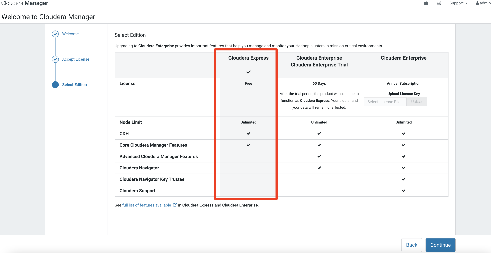

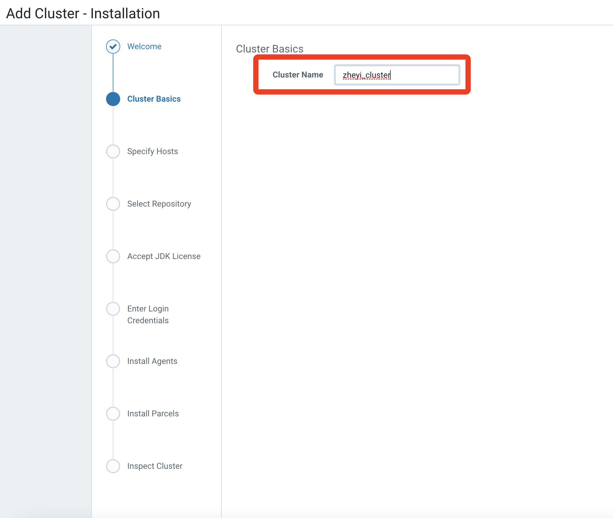

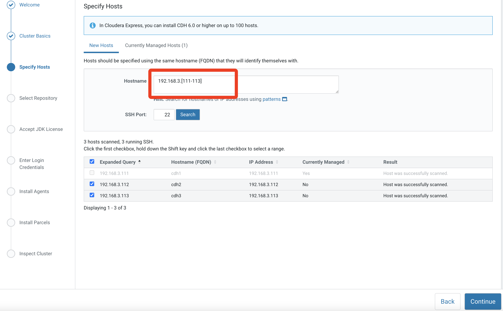

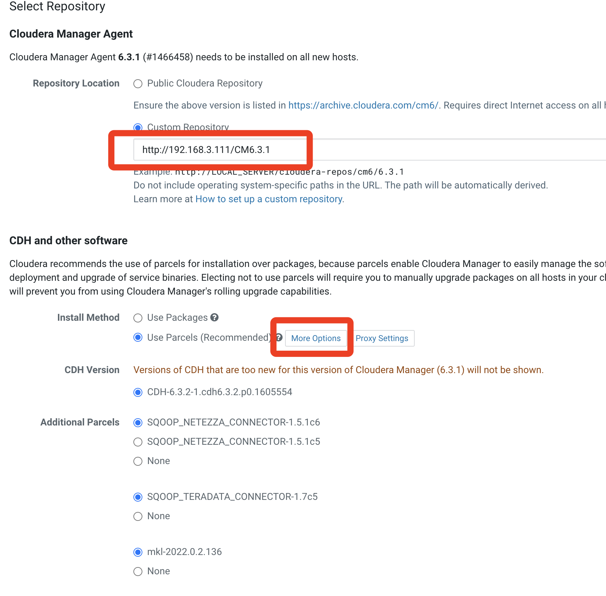

	http://192.168.3.111/CM6.3.1

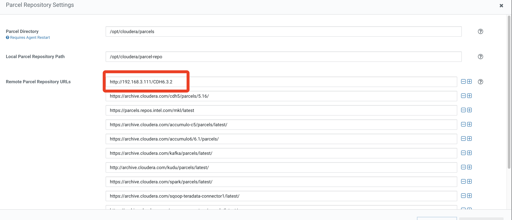

	http://192.168.3.111/CDH6.3.2
	
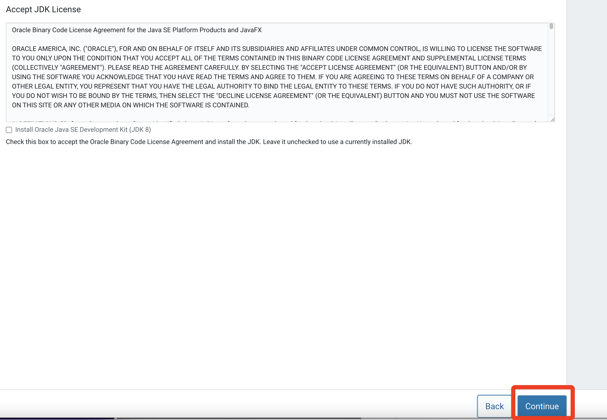	

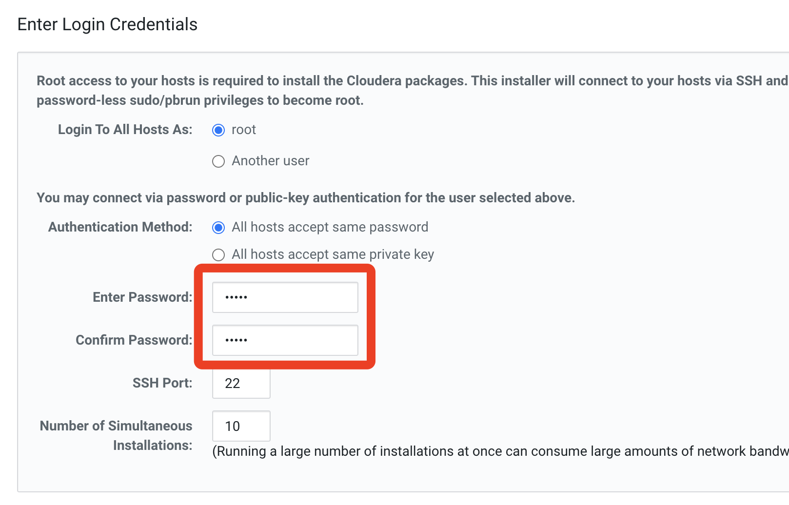

输入宿主机的密码

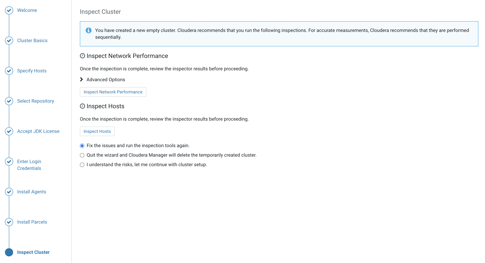

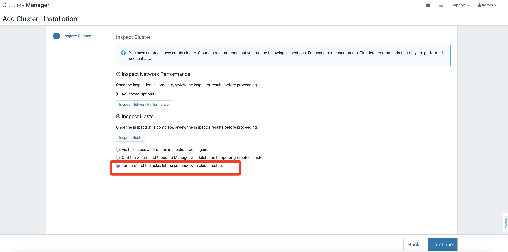	

选择初始安装内容：

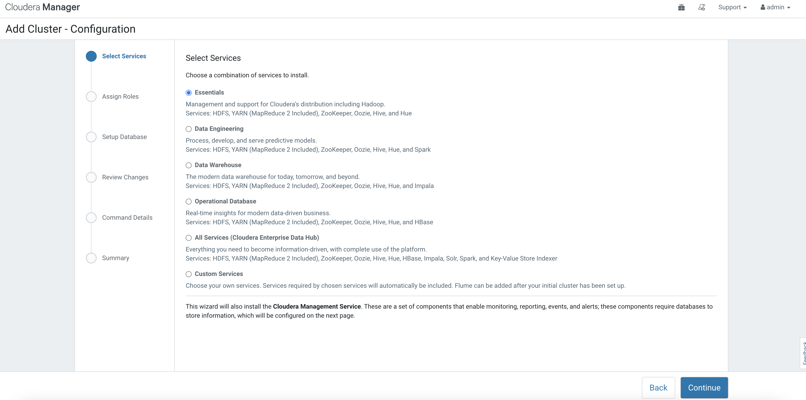

### 以datawarehouse为例

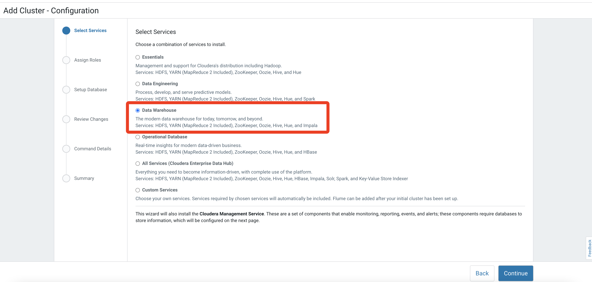

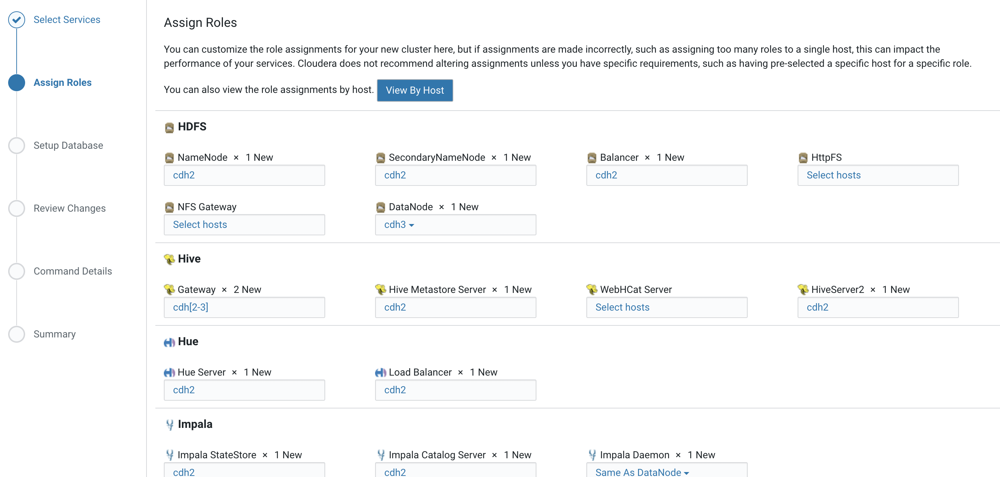

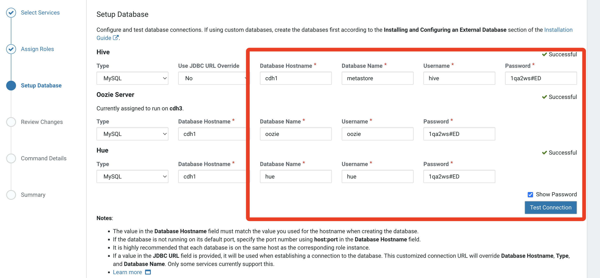

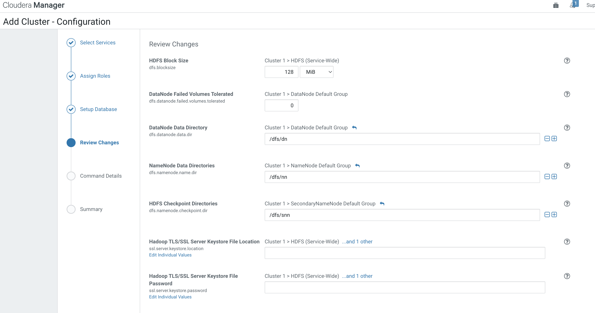

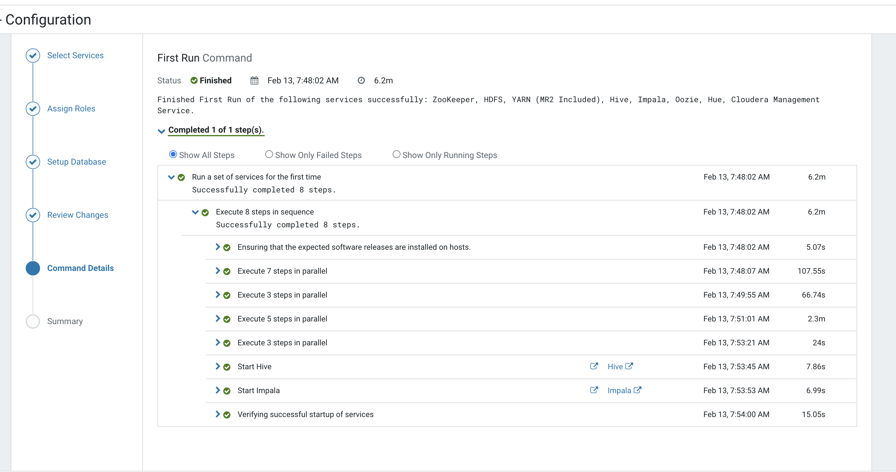

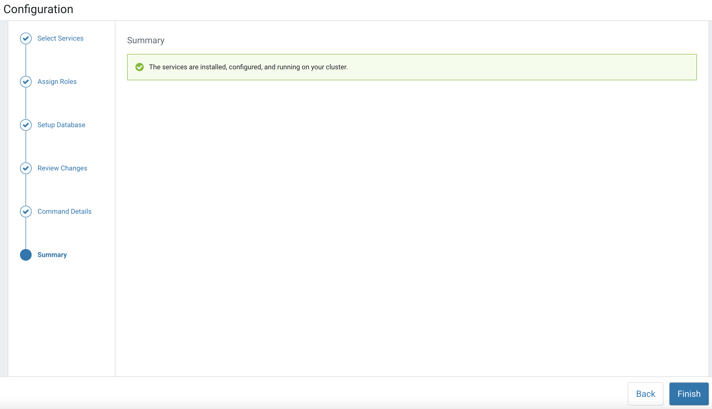

### 监控界面

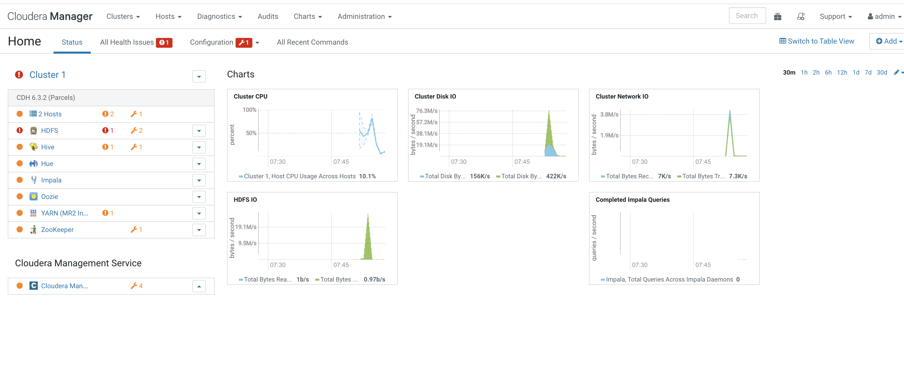

http://192.168.3.111/cmf/home