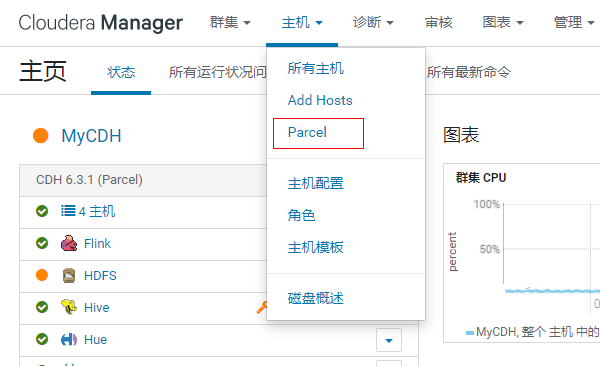
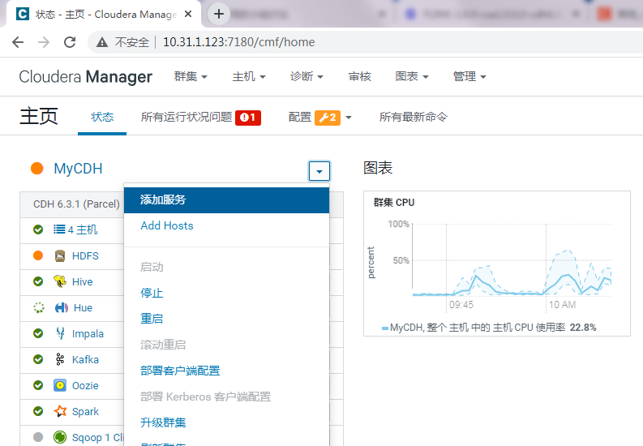
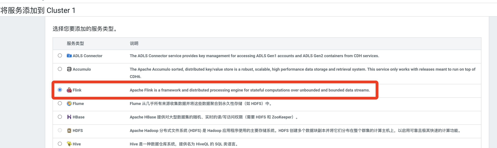

# 在CDH6.3.2下安装Flink
参考：https://blog.csdn.net/u010520724/article/details/120744520?utm_medium=distribute.pc_relevant.none-task-blog-2~default~baidujs_baidulandingword~default-0-120744520-blog-105388649.235^v38^pc_relevant_sort_base3&spm=1001.2101.3001.4242.1&utm_relevant_index=3

## 服务器准备

* CDH101：192.168.3.111
* CDH102：192.168.3.112
* CDH103：192.168.3.113

## 放置文件

在CDH1下

	mkdir /var/www/html/flink-1.9.0
	sudo chmod -R 777 /var/www/html/flink-1.9.0

	sudo cp /home/zheyi/flink1.9/FLINK-1.9.0-csa1.0.0.0-cdh6.3.0.jar opt/cloudera/csd/
	
	sudo cp /home/zheyi/flink1.9/FLINK-1.9.0-csa1.0.0.0-cdh6.3.0-el7.parcel /opt/cloudera/parcel-repo
	sudo cp /home/zheyi/flink1.9/FLINK-1.9.0-csa1.0.0.0-cdh6.3.0-el7.parcel.sha /opt/cloudera/parcel-repo
	sudo cp /home/zheyi/flink1.9/manifest.json /opt/cloudera/parcel-repo
	

## 在Cloudera Manager界面部署

### 重启CM server服务可在 添加服务里发现flink
	systemctl stop cloudera-scm-server
	systemctl stop cloudera-scm-agent
	systemctl start cloudera-scm-server
	systemctl start cloudera-scm-agent
	

点击分配 -》 激活

### 开始安装Flink

