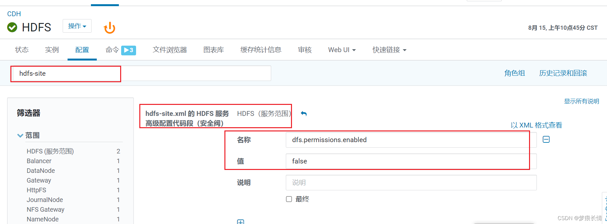

# 没有读写权限的处理办法
https://blog.csdn.net/m0_48830183/article/details/126303297

## 取消权限限制

在hdfs-site.xml中添加设置。这种方法可让所有用户访问hdfs了，不用进入hdfs用户再执行命令。
CDH中没有这个配置需要自己加进去，步骤如下：

* 1、找到hdfs-site.xml 的 HDFS 服务高级配置代码段（安全阀）
* 2、添加设置如下，保存更改，重启hdfs。

dfs.permissions.enabled 的值设置为false

