# CDP 实践

参考：https://baijiahao.baidu.com/s?id=1724173513745227556&wfr=spider&for=pc

## CDP定义

* Packaged software：基于企业自身资源部署，使用统一软件包部署、升级平台，不做定制开发。
* Persistent, unified customer database：抽取企业多类业务系统数据，基于数据某些标识形成客户的统一视图，长期存储，并且可以基于客户行为进行个性化营销。
* Accessible to other systems：企业可以使用CDP数据分析、管理客户，并且可以通过多种形式取走重组、加工的客户数据。

## CDP分类

CDP本身的C（Customer）是指all customer-related functions, not just marketing。面向不同场景也对应不同类型的CDP，不同类别的CDP主要是功能范围不同，但是类别之间是递进关系。

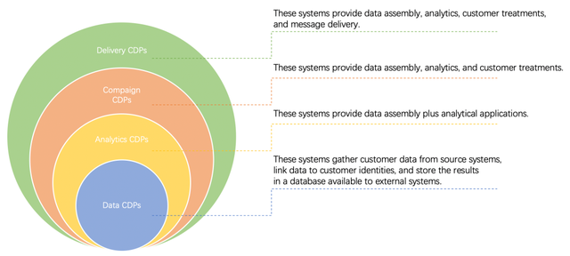

#### Data CDPs：

主要是客户数据管理，包括多源数据采集、身份识别，以及统一的客户存储、访问控制等。

#### Analytics CDPs：

在包含Data CDPs相关功能的同时，还包括客户细分，有时也扩展到机器学习、预测建模、收入归因分析等。

#### Campaign CDPs：

在包含Analytics CDPs相关功能的同时，还包括跨渠道的客户策略（Customer Treatments），比如个性化营销、内容推荐等实时交互动作。

#### Delivery CDPs：

在包括Campaign CDPs相关功能的同时，还包括信息触达（Message Delivery），比如邮件、站点、APP、广告等。

## 挑战与目标

### 面临挑战

实时CDP（Real-Time CDP，缩写为RT-CDP）驱动上层营销业务，面临诸多挑战

#### 【业务层面】

##### 1. 企业数据渠道多，数据形态各异。

一个企业除了官网、文件、App、自有系统，还包括目前众多的企业自有媒体（比如微信公众号、抖音企业号、百家号、各类小程序等）等各种场景的数据结构不统一

##### 2.不同生态无法打通，无法360度洞察用户

数据分散导致难以识别唯一用户身份，无法建立全面且持续更新的用户画像，导致对用户的认知碎片化片面化，洞察不足。比如在实际营销场景下，企业期望对同时访问官网和其小程序的同一用户发放优惠券促活时，但因为一个人的行为以不同标识分散在各渠道数据中，无法进行跨渠道用户行为分析，也就无法实现企业诉求。

##### 3.人群划分规则复杂

我们不同企业的业务是不同的，所以我们可以根据业务特点，为不同的客户打上个性化的标签，比如企业进行营销活动时，想给经过迭代旅程节点的用户、参与某个直播等等的打上不同场景的标签，这样才能对不同的人群进行细分，做更精细化的营销。

#### 【技术层面】

##### 1.全渠道实时精准识别要求高

一个客户行为跨源跨设备跨媒体，行为轨迹碎片化严重。多源多身份中做到高性能的实时识别也是个很大挑战。

##### 2. 需要具有实时、低延迟处理海量数据的能力

实时把握y用户变化，才能更高效地促进营销活动的转化。

##### 3.需要可扩展的架构

在多租户背景下，做到高性能、低延迟、可伸缩、高容错，也是很大的技术挑战。

## RT-CDP建设目标

在传统数据库、数据处理上，还主要是『数据被动，查询主动』的方式。现在讲求领域事件驱动业务，『数据主动、查询被动』

### 一体化实践

#### 【批流一体】

Kappa、Kappa+架构是旨在简化分布式计算架构，以实时事件处理架构为核心兼顾批流两种场景。

#### 【算存分离】

在不同场景下有时仅需要高处理能力，有时仅需要海量数据存储。传统存算一体架构，如果要满足两种场景，就需要高配置（多核、多内存、高性能本地盘等）服务节点，显然存在资源利用不合理，也会引发集群稳定性问题，比如节点过多导致数据分散，引发数据一致性降低等。算存分离的架构才符合分布式架构的思想，针对业务场景进行计算资源、存储资源的分别控制，实现资源合理分配。也利于集群数据一致性、可靠性、扩展性、稳定性等方面的能力保证。

#### 【动态伸缩】

动态伸缩主要为了提高资源利用率，降低企业成本。实际业务中，有时候平台需要应对在业务平稳期短时间段内的流量（实时消息量）波峰波谷需要短期扩容，比如在各个重要节日大量企业同时需要做很多营销活动，导致消息量陡升；有时候随着爱番番服务的企业量不断增长，也会导致消息量线性增加，进而需要长期扩容。针对前者，一方面不好预见，另一方面也存在很高的运维成本。所以一个可以基于时间、负载等组合规则动态扩缩容的集群资源管理能力也是架构建设的重要考虑。

## 技术选型

### 身份关系存储

#### 传统的idmapping是怎么做？

1.使用关系型数据库存储身份关系一般是将身份关系存成多表、多行进行管理。该方案存在两个问题：

* （1） 数据高并发实时写入能力有限

一般身份识别都需要多跳数据关系查询，关系型数据库要查出来期望数据就需要多次Join，查询性能很低。

* （2） 实时性差

离线聚合、定时对用户做动作；

随着数据量增加计算耗时会越来越高，数据结果延迟也会越来越高。

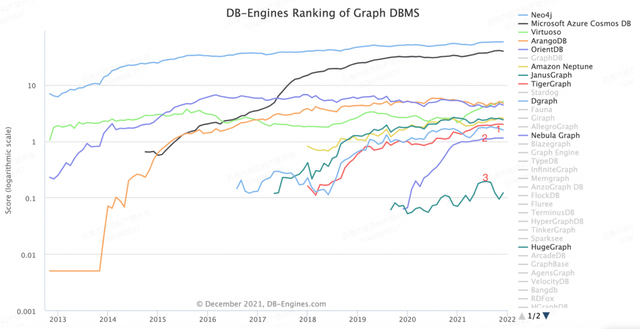

生产环境主要使用了DGraph和Nebula

#### DGraph和Nebula对比

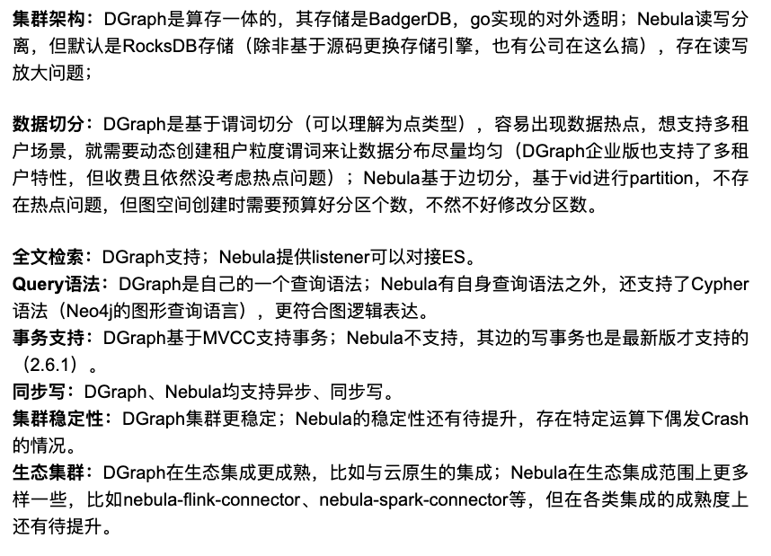

### 流式计算引擎选择

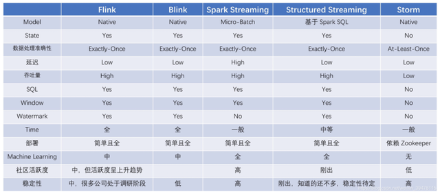

#### 选择Apache Flink做为流批计算引擎

使用广泛的Spark还是以微批的方式进行流计算。而Flink是流的方式。Apache Flink是近几年发展很快的一个用于分布式流、批处理数据处理的开源平台。它是最贴合DataFlow模型实现的分布式计算框架。基于流计算进行高性能计算，具有良好的容错、状态管理机制和高可用能力；其他组件于Flink的集成也越来越多、也日趋成熟；所以选择我们Apache Flink做为我们的流批计算引擎。

#### 选择Apache Beam做为编程框架

分布式数据处理技术不断发展，优秀的分布式数据处理框架也会层出不穷。Apache Beam是Google在2016年贡献给Apache基金会的孵化项目，它的目标是统一批处理和流处理的编程范式，做到企业开发的数据处理程序可以执行在任意的分布式计算引擎上。Beam在统一编程范式的同时也提供了强大的扩展能力，对新版本计算框架的支持也很及时。所以我们选择Apache Beam做为我们的编程框架。

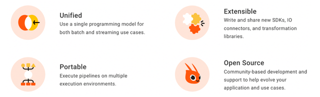

####  海量存储引擎取舍

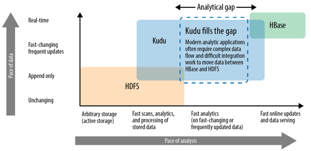

结合我们的平台建设理念，实时、高吞吐的数据存储、更新是核心目标，在数据复杂查询、数据应用的QPS上不高（因为核心的业务场景是基于实时流的实时客户处理），再加上Cloudera Impala无缝集成Kudu，我们最终确定Impala+Kudu做为平台的数据存储、查询引擎。

#### 分析增强：Doris

基于Impala+Kudu的选型，在支持OP部署时是完全没有问题的，因为各个企业的数据体量、数据查询QPS都有限。

这样企业只需要很简单的架构就可以支持其数据管理需求，提高了平台稳定性、可靠性，同时也可以降低企业运维、资源成本。但由于Impala并发能力有限（当然在Impala4.0开始引入多线程，并发处理能力提升不少），爱番番的私域服务目前还是以Saas服务为重，想在Saas场景下做到高并发下的毫秒级数据分析，这种架构性能很难达标，所以我们在分析场景引入了分析引擎Doris。之所以选择Doris，基于 MPP 架构的 OLAP 引擎。

相对于Druid、ClickHouse等开源分析引擎，Doris具有如下特点：l支持多种数据模型，包括聚合模型、Uniq模型、Duplicate模型；l支持Rollup、物化视图；l在单表、多表上的查询性能都表现很好；l支持MySQL协议，接入、学习成本低；l无需集成Hadoop生态，集群运维成本也低很多。

#### 规则引擎调研

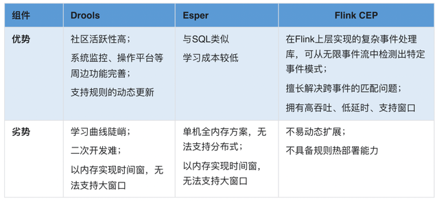

## 平台架构

RT-CDP和MA，两者叠加近似等同于Deliver CDP所包含的功能范围。本文所讲的RT-CDP所包含的功能范围等同于Analytics CDPs，简单来讲，主要就是客户数据管理、数据分析洞察。

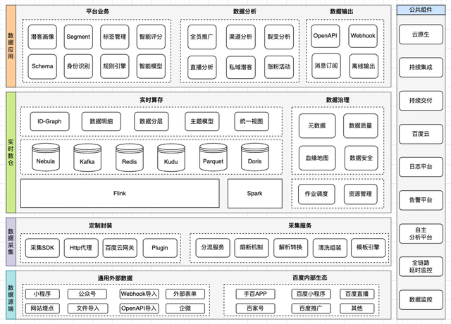

### 核心模块

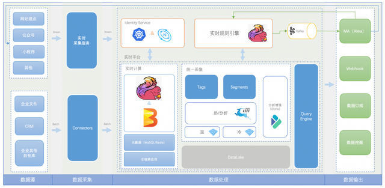

## 关键实现

### 为什么需要Schema？

企业的多个渠道的数据特征结构各异。再加上不同租户业务特点不同，企业需要数据自定义的扩展性。RT-CDP为了两类问题需要具备数据结构灵活定义的能力来对接企业数据。

RT-CDP本身管理两类数据：碎片化客户数据和用户统一画像。

对于前者来说，不需要关系数据内容本身，利用数据湖等技术即可为企业提供数据存储、查询、分析能力，是偏Schemaless的数据管理；对于后者来说，更多需要按不同维度组合查询、圈群、分析，本身需要结构化的数据管理。后者能否通过Schemaless的方式提供服务呢？罗列增删改查的场景，反证一下局限明显。

### Schema是什么？

Schema是一个数据结构的描述，Schema可以相互引用，可以对数据中字段以及字段类型、值进行约束，也可以自定义字段。企业可以用一个统一的规范快速接入、灵活管理自己的数据，比如企业可以根据自己的行业特性，抽象不同的业务实体、属性，再给不同的业务实体定义不同的Schema。企业可以对业务实体有交集的信息抽离新Schema，然后多个Schema引用这个新Schema；也可以对每个Schema自定义自己的业务字段。企业只需要按相应的Schema结构接入数据，就可以按特定的标准使用这些数据。

Schema的特点，如下图：

* Field：字段是最基本的数据单元，是组成Schema的最小粒度元素。
* Schema：是一组字段、Schema的集合，它本身可以包含多个字段（Field），字段可以自定义，比如字段名、类型、值列表等；也可以引用一个或多个其他Schema，引用时也可以以数组的形式承载，比如一个Schema里面可以包含多个Identity结构的数据。
* Behavior：是潜客或企业的不同行为，本身也是通过Schema承载，不同的Behavior也可以自定义其特有的Field。

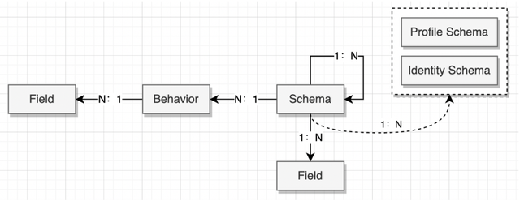

### Schema如何简化数据接入？

这里需要先说一个Dataset的概念。Dataset是通过Schema定义结构的一个数据集，企业对不同的数据源定义成不同的数据集。在数据源管理时，企业可以根据不同的数据集结构化导入的数据，一个数据集可以对应多个数据源，也可以对应一个数据源中的一类数据，一般后者使用较多。

另外，一个数据集也可以包含多批次的数据，也就是企业可以周期性的按批次导入同一数据集数据。在数据接入时，如下图，针对不同的Dataset，企业可以绑定不同的Schema，每个Schema可以引用、复用其他子Schema，然后经过RT-CDP的Schema解析，自动将数据持久化到存储引擎，根据数据的定义不同，会持久化到不同数据表中。对应实时的客户行为也是通过定义不同的Schema来定义数据结构，然后进行持续的数据接入。

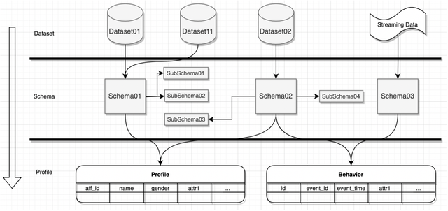

