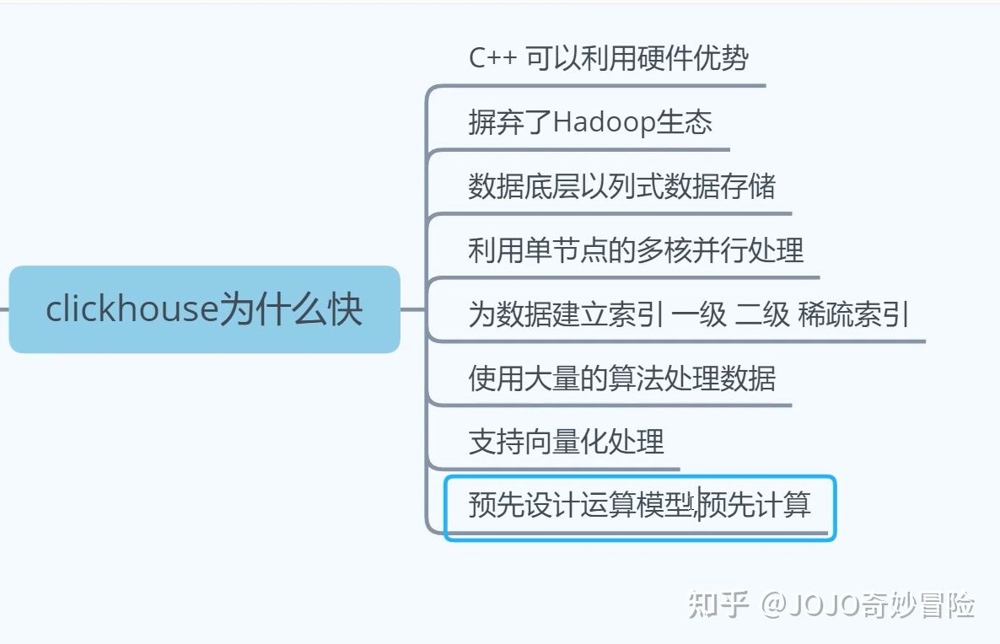
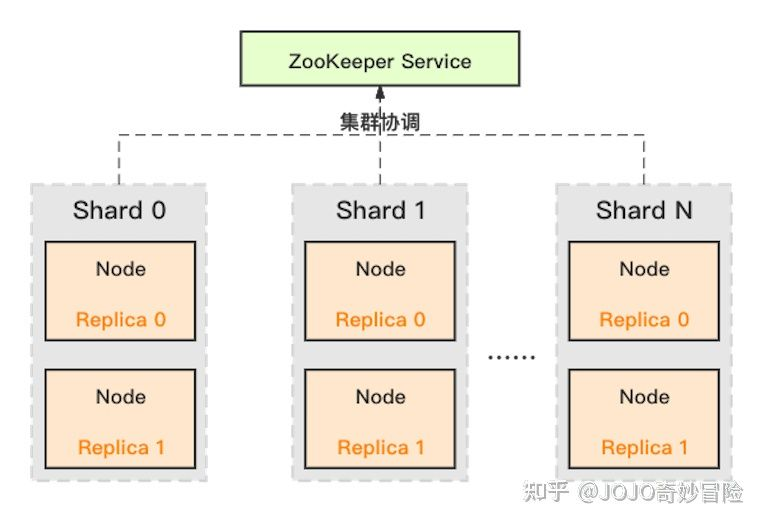
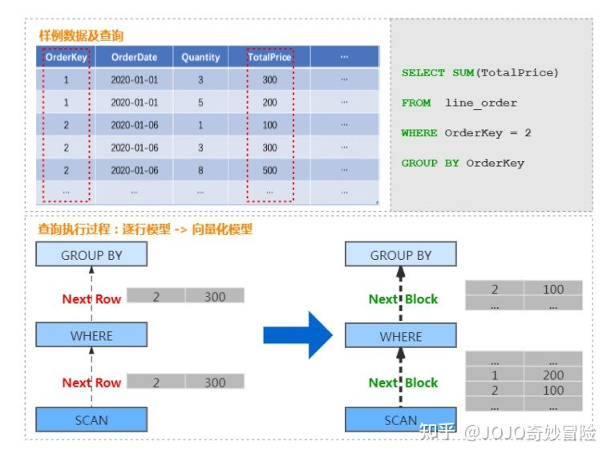

# Clickhouse 面试题

## 为什么那么快？

## 架构

ClickHouse 采用典型的分组式的分布式架构，具体集群架构如上图所示：

* Shard： 集群内划分为多个分片或分组（Shard 0 … Shard N），通过 Shard 的线性扩展能力，支持海量数据的分布式存储计算。
* Node： 每个 Shard 内包含一定数量的节点（Node，即进程），同一 Shard 内的节点互为副本，保障数据可靠。ClickHouse 中副本数可按需建设，且逻辑上不同 Shard 内的副本数可不同。
* ZooKeeper Service： 集群所有节点对等，节点间通过 ZooKeeper 服务进行分布式协调

## 向量化执行是什么？

在支持列存的基础上，ClickHouse 实现了一套面向向量化处理的计算引擎，大量的处理操作都是向量化执行的。

相比于传统火山模型中的逐行处理模式，向量化执行引擎采用批量处理模式，可以大幅减少函数调用开销，降低指令、数据的 Cache Miss，提升 CPU 利用效率。

并且 ClickHouse 可利用 SIMD 指令进一步加速执行效率。这部分是 ClickHouse 优于大量同类 OLAP 产品的重要因素。

以商品订单数据为例，查询某个订单总价格的处理过程，由传统的按行遍历处理的过程，转换为按 Block 处理的过程。

具体如下图：

