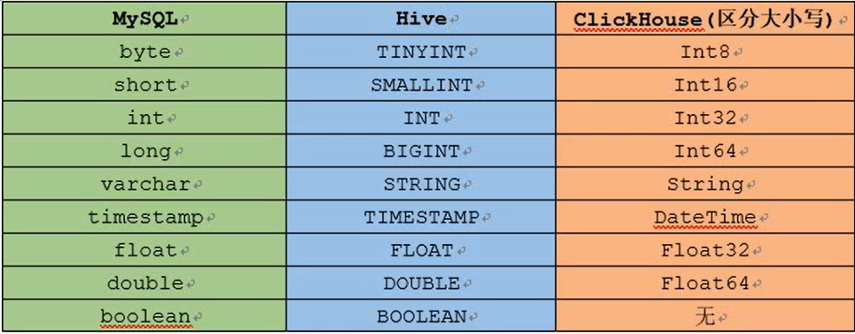

# 操作语法

## 数据类型对比

## 建表示例

	create database if not exists {database name}
	use {database name}
	create table {table_name}(
	)ENGINE={engine type}
	
	例子：
	
	create database if not exists doit20;
	use doit20;
	create table tb_a(
	id Int32,
	name String,
	age Int32,
	gender String
	)ENGINE=Memory();
	
	#查看
	desc tb_a;
	
	# 插入内容
	insert into tb_a values (1,'zhang san',23,'M'),(2,'li si',22,'F');
	

## 建表示例（从HDFS）

	CREATE TABLE tb_shop
	(
	`name` String,
	`cdate` String,
	`cost` Float64
	)
	ENGINE = HDFS('hdfs://linux01:8020/ck/data/shop.txt', 'CSV')
	

## 删表语法

### 删视图表与本地表

	DROP table db.视图表 ON CLUSTER cluster_name;
	DROP table db.本地表 ON CLUSTER cluster_name;
	
### 删表的列

	ALTER TABLE db.视图表 ON CLUSTER cluster_name DROP COLUMN column_name1, DROP COLUMN column_name2;
	ALTER TABLE db.本地表 ON CLUSTER cluster_name DROP COLUMN column_name1, DROP COLUMN column_name2;

### 删表的行

	DELETE FROM db.表 ON CLUSTER cluster_name WHERE 要删除行的条件;

### 增加表的列

	ALTER TABLE db.视图表 ON CLUSTER cluster_name ADD COLUMN column_name1, ADD COLUMN column_name2;
	ALTER TABLE db.本地表 ON CLUSTER cluster_name ADD COLUMN column_name1, ADD COLUMN column_name2;
	
## 临时表

生命周期是会话绑定的，所以它只支持Memory表引擎，如果会话结束，数据表就会被销毁。

临时表不属于任何数据库所以在它的建表语句中，既没有数据库参数也没有表引擎参数。

常用作数据之间的迁移

	Create Temporary Table table_name (
	name1 [type],
	name2 [type]
	)

## 视图

### 普通视图

不会存储数据，只保存了一个query，一般用作子查询，当base表删除后不可用

例子：

	CREATE VIEW view_name AS
	 SELECT 
		  gmt, 
		  D1, 
		  D2, 
		  D3, 
		  D4, 
		  D5, 
		  D6
		FROM c1.t1 
		ANY INNER JOIN c2.t2 USING (M1)	

### 物化视图

物化视图是查询结果集的一份持久化存储，所以它与普通视图完全不同，而非常趋近于表。“查询结果集”的范围很宽泛，可以是基础表中部分数据的一份简单拷贝，也可以是多表join之后产生的结果或其子集，或者原始数据的聚合指标等等。所以，物化视图不会随着基础表的变化而变化，所以它也称为快照（snapshot）。如果要更新数据的话，需要用户手动进行，如周期性执行SQL，或利用触发器等机制。

存储执行query后得到的数据，创建视图时必须制定engine。

	CREATE [MATERIALIZED] VIEW [IF NOT EXISTS] [db.]table_name [TO[db.]name] [ENGINE = engine] [POPULATE] AS SELECT 

物化视图的数据更新:

1.物化视图创建好之后，若源表被写入新数据则物化视图也会同步更新

2.POPULATE 关键字决定了物化视图的更新策略：

若有POPULATE 则在创建视图的过程会将源表已经存在的数据一并导入，类似于 create table ... as

若无POPULATE 则物化视图在创建之后没有数据，只会在创建只有同步之后写入源表的数据.

clickhouse 官方并不推荐使用populated，因为在创建物化视图的过程中同时写入的数据不能被插入物化视图。

3.物化视图不支持同步删除，若源表的数据不存在（删除了）则物化视图的数据仍然保留

4.物化视图是野种特殊的数据表，可以用show tables 查看

5.物化视图数据的删除：

## DDL

### 插入数据

	Insert into tb_user(id , name , age) values(1,’zss’,21) ;
	
INSERT 语句在单个数据块的写入过程中是具有原子性的。在默认的情况下，每个数据块最多可以写入 1048576 行数据(由max_insert_block_size 参数控制)。也就是说，如果一条 INSERT 语句写入的数据少于 max_insert_block_size 行，那么这批数据的写入是具有原子性的，即要么 全部成功，要么全部失败。

### 添加字段

	alter table test_alter add column gender String after name ;
	
### 修改字段类型

ALTER TABLE tb_name MODIFY COLUMN [IF EXISTS] name [type] [default_expr]

例子：

	ALTER TABLE test_alter MODIFY COLUMN `gender` UInt8 DEFAULT 0
	
	
### 删除字段

	ALTER TABLE test_alter DROP COLUMN age
	
#### 修改字段注释

	ALTER TABLE test_alter COMMENT COLUMN name '用户名'
	
	
#### 移动表

	RENAME TABLE [db_name11.]tb_name11 TO [db_name12.]tb_name12, [db_name21.]tb_name21 TO [db_name22.]tb_name22, ...
	
	
	#例子
	Rename table t1 to new_db.t1 ; -- 将当前数据库中的表移动到另一个数据库中 
	Rename table t2 to new_db.t_2 ; --移动表并且修改表的名称
	
需要注意的是，数据表的移动只能在单个节点的范围内。换言之，数据表移动的目标数据 库和原始数 据库必须处在同一个服务节点内，而不能是集群中的远程节点。

#### 删除数据

	ALTER TABLE test_ud DELETE WHERE id = '1'