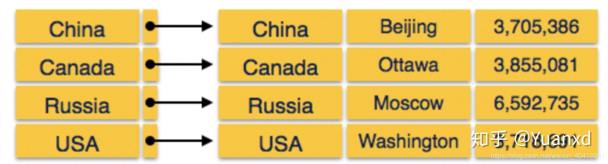
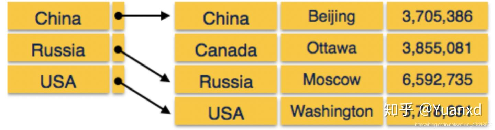

# 稠密索引和稀疏索引

参考：https://zhuanlan.zhihu.com/p/261130303

## 基本概念

###稠密索引： 

在密集索引中，数据库中的每个搜索键值都有一个索引记录。这样可以加快搜索速度，但需要更多空间来存储索引记录本身。索引记录包含搜索键值和指向磁盘上实际记录的指针。

###稀疏索引： 

在稀疏索引中，不会为每个搜索关键字创建索引记录。此处的索引记录包含搜索键和指向磁盘上数据的实际指针。要搜索记录，我们首先按索引记录进行操作，然后到达数据的实际位置。如果我们要寻找的数据不是我们通过遵循索引直接到达的位置，那么系统将开始顺序搜索，直到找到所需的数据为止。

