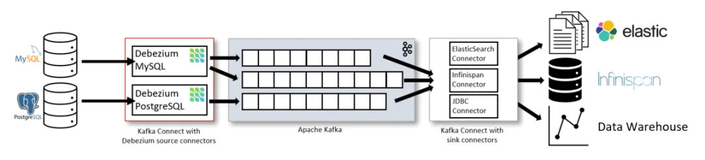
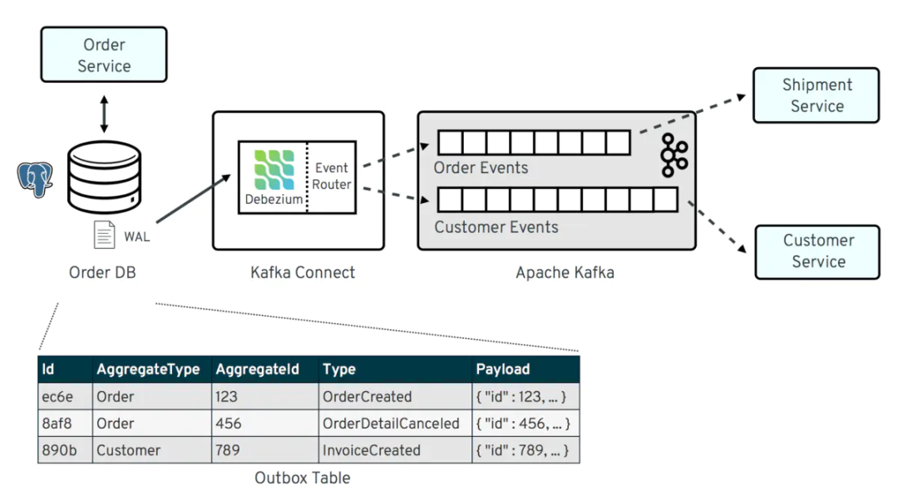

# Debezium 介绍

debezium是一种CDC（Change Data Capture）工具，工作原理类似Canal, DataBus, Maxwell等，是通过抽取数据库日志来获取变更。

Debezium最初设计成一个Kafka Connect 的Source Plugin，目前开发者虽致力于将其与Kafka Connect解耦，但当前的代码实现还未变动。下图引自Debeizum官方文档，可以看到一个Debezium在一个完整CDC系统中的位置。

### 基于kafka connector部署Debezium

Debezium MySQL 架构:

