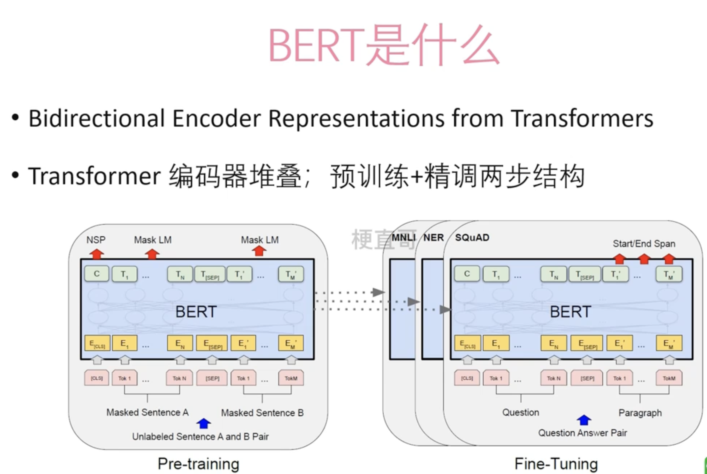
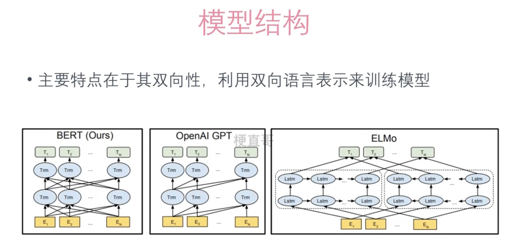
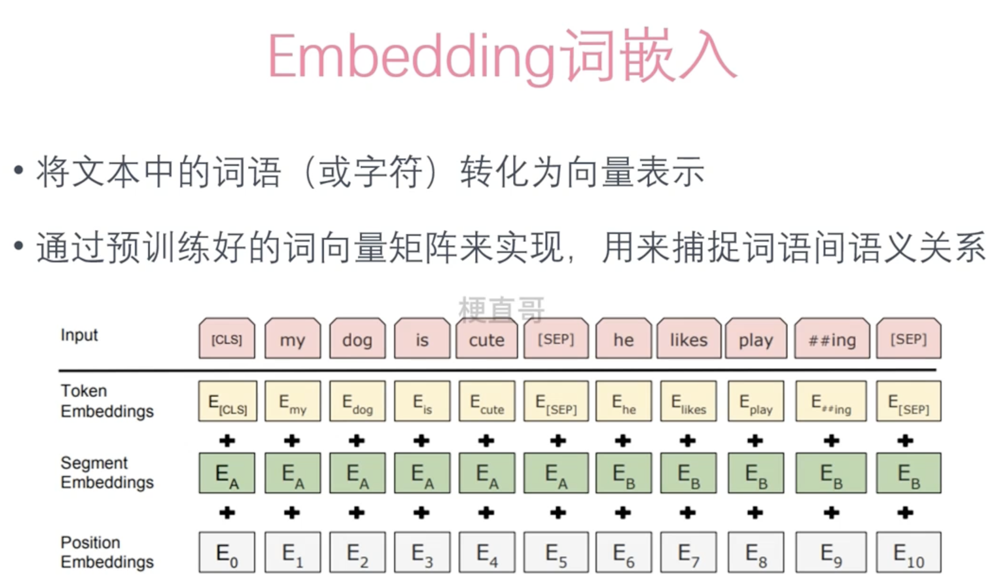
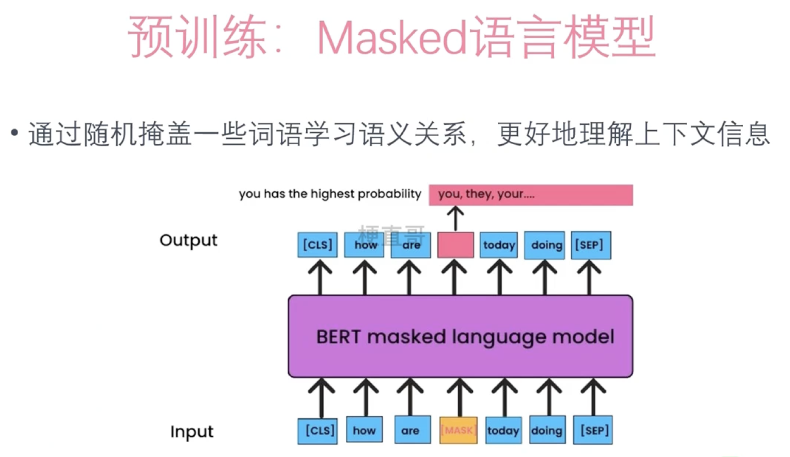
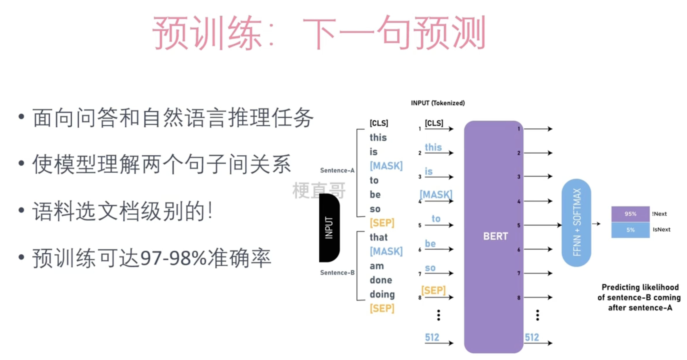
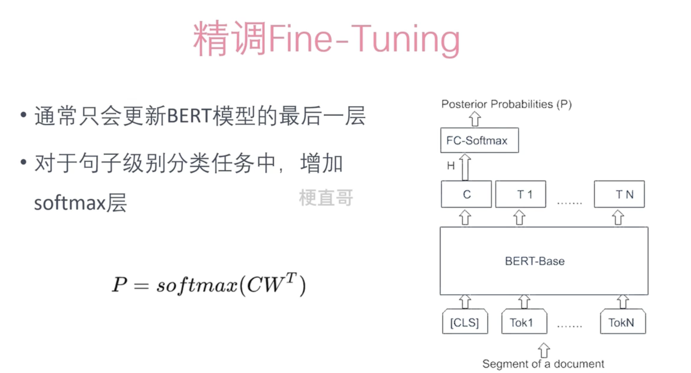
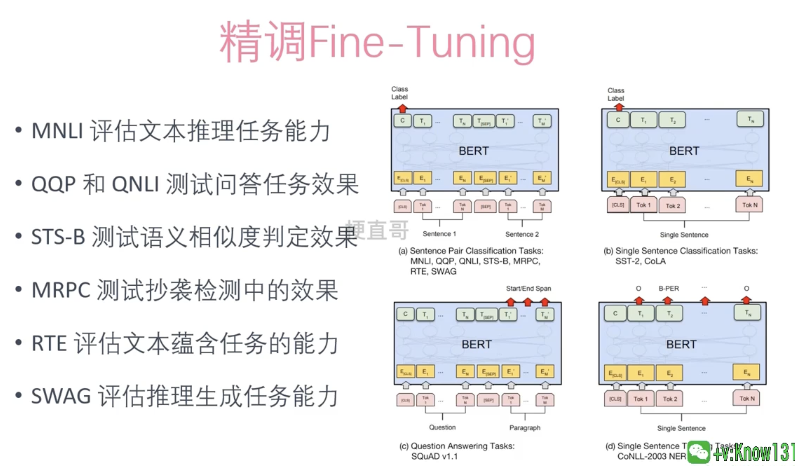
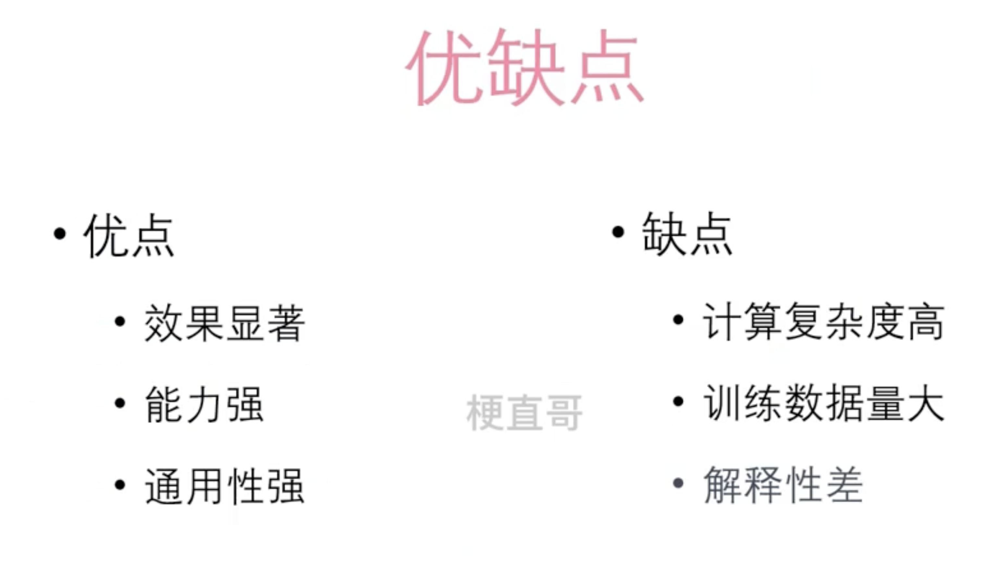

# BERT 模型


## 概念





## 结构





BERT（Bidirectional Encoder Representations from Transformers）和OpenAI的GPT（Generative Pre-trained Transformer）模型都是基于Transformer架构的深度学习模型，但它们在设计、目的和应用方面存在一些关键的区别：

1. **训练目标和架构**：
   - **BERT**：BERT使用双向Transformer编码器。这意味着它在处理文本时可以同时考虑前文和后文的信息。BERT主要是为了改善各种自然语言处理任务（如问答、情感分析和命名实体识别）的性能而设计的。它通过掩码语言模型（MLM）和下一句预测（NSP）两种方式进行预训练。
   - **GPT**：GPT则是使用单向Transformer解码器。它在生成文本时只能考虑之前的上下文信息，不能像BERT那样考虑整个句子的上下文。GPT主要用于生成文本，如写作、对话生成等，并且通过自回归的方式进行语言模型的预训练。
2. **双向性与单向性**：
   - **BERT**的双向性使得它在理解文本的上下文方面表现得更好，这对于理解语言的复杂性和获取更深层次的语义信息非常重要。
   - **GPT**的单向性则更适合文本生成任务，因为在生成文本时，模型只能基于已生成的文本来预测下一个词。
3. **应用领域**：
   - **BERT**由于其双向特性，通常在需要深入理解文本含义的任务中表现更佳，如文本分类、情感分析、问答系统等。
   - **GPT**则在需要生成连贯文本的应用上更加突出，比如自动写作、对话系统、代码生成等。
4. **预训练和微调**：
   - 两者都采用了预训练加微调的策略，先在大规模文本数据上进行预训练，然后针对特定任务进行微调。但是，由于它们的预训练任务不同，所以微调的方式和效果也有所不同。


## BERT特色-EMbeeding词嵌入





在BERT模型中，输入表示是通过三种嵌入的结合来构建的：Token Embeddings、Segment Embeddings和Position Embeddings。这三种嵌入共同工作，为模型提供丰富的信息，帮助它理解输入文本。

1. **Token Embeddings**：
   - Token嵌入是指将输入文本中的每个单词或标记（Token）转换为高维空间中的向量。这种转换允许模型捕捉单词的语义和使用上下文。在BERT中，通常首先使用WordPiece分词算法将文本切分成更细粒度的标记，然后将这些标记转换为固定大小的向量。这些向量是在预训练过程中学习得到的，能够捕捉大量的语言知识和单词间的关系。
2. **Segment Embeddings**：
   - Segment嵌入用于区分两种不同的句子或文本片段。在BERT中，由于模型设计用来处理成对的句子（如问答对、文本和假设的配对等），需要有一种方式来告诉模型哪些标记属于第一个句子，哪些属于第二个句子。Segment嵌入就是这种区分机制。一般来说，对于第一个句子的每个标记，模型会加上一个相同的Segment嵌入A，对于第二个句子的每个标记，加上另一个Segment嵌入B。
3. **Position Embeddings**：
   - Position嵌入是为了让模型理解单词在句子中的位置。由于BERT使用的Transformer架构不像传统的RNN那样自然地处理序列中的顺序信息，因此需要通过添加位置嵌入来提供这种信息。每个位置嵌入是一个向量，它被加到相应位置上的Token嵌入和Segment嵌入上。这样，模型就能根据加入的位置信息来理解单词顺序和句子结构。


## 预训练





1. **双向上下文理解**：在传统的语言模型中，模型通常只能从左到右或从右到左学习上下文。而BERT通过使用MLM，能够让模型在预测当前单词时同时考虑前面和后面的词，从而更好地理解词语在句子中的意义。
2. **预训练和微调**：BERT模型的一个关键特性是它可以在大量文本数据上进行预训练，然后在特定任务上进行微调。通过Masked Language Model的预训练，BERT能够学习到丰富的语言表示，这些表示随后可以被用来提高特定下游任务（如情感分析、问答系统等）的性能。
3. **深入理解语言结构**：通过随机掩盖一些词语，并让模型预测这些被掩盖的词，BERT能够深入学习词语之间的关系和语言的内部结构。这种训练方式迫使模型不仅仅关注表面的词序，还要理解词语之间更深层次的联系。
4. **泛化能力**：通过这种方式训练的模型具有更强的泛化能力。由于BERT在训练过程中学习到了丰富的上下文信息，它能够更好地处理在训练数据中未见过的词语或句子结构。

简而言之，Masked Language Model使BERT能够更全面地学习语言的双向上下文，提高模型对语言理解的深度和广度，从而在各种自然语言处理任务中取得更好的性能。


## 预训练





## 精调








## Fine-tuning Demo


```python
from transformers import BertTokenizer, BertForSequenceClassification
from transformers import Trainer, TrainingArguments
import torch

# 使用一个小数据集作为示例
train_texts = ["I love this!", "This is so good!", "I hate this!", "This is terrible!"]
train_labels = [1, 1, 0, 0]  # 1代表正面情绪，0代表负面情绪

# 加载预训练的BERT模型和分词器
model = BertForSequenceClassification.from_pretrained('bert-base-uncased')
tokenizer = BertTokenizer.from_pretrained('bert-base-uncased')

# 编码文本
train_encodings = tokenizer(train_texts, truncation=True, padding=True, max_length=128, return_tensors="pt")

# 准备数据集
class SentimentDataset(torch.utils.data.Dataset):
    def __init__(self, encodings, labels):
        self.encodings = encodings
        self.labels = labels

    def __getitem__(self, idx):
        item = {key: torch.tensor(val[idx]) for key, val in self.encodings.items()}
        item['labels'] = torch.tensor(self.labels[idx])
        return item

    def __len__(self):
        return len(self.labels)

train_dataset = SentimentDataset(train_encodings, train_labels)

# 定义训练参数
training_args = TrainingArguments(
    output_dir='./results',          # 输出目录
    num_train_epochs=3,              # 训练轮数
    per_device_train_batch_size=8,   # 每个设备的批量大小
    warmup_steps=500,                # 预热步数
    weight_decay=0.01,               # 权重衰减
    logging_dir='./logs',            # 日志目录
)

# 初始化Trainer
trainer = Trainer(
    model=model,
    args=training_args,
    train_dataset=train_dataset,
)

# 开始训练
trainer.train()

```


## 优缺点




