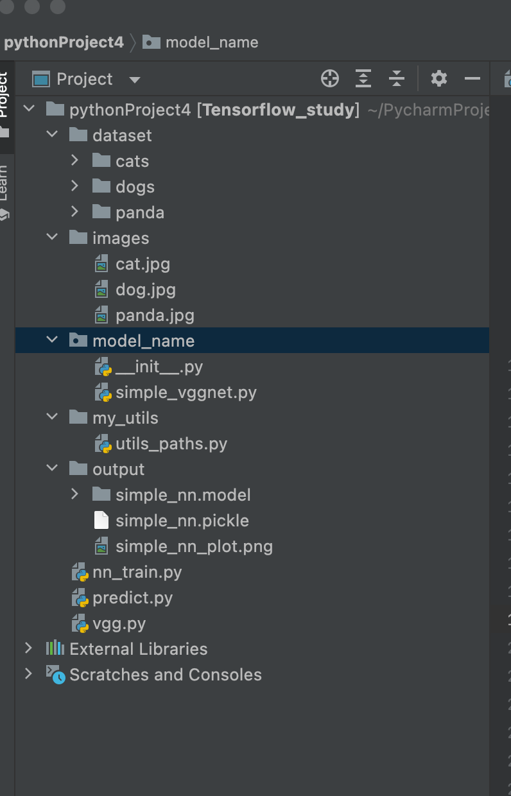

# 1.传统神经网络

## 设置配置项

run -> Edit configuration 

Edit configuration

	--dataset ./dataset
	--model ./output/simple_nn.model
	--label-bin ./output/simple_nn.pickle
	--plot ./output/simple_nn_plot.png
	
	

## 代码结构

	

## 代码

### nn_train.py

	# 导入所需工具包 #keras工具包
	from sklearn.preprocessing import LabelBinarizer
	from sklearn.model_selection import train_test_split
	from sklearn.metrics import classification_report
	from keras.models import Sequential
	from keras.layers import Dropout
	from keras.layers.core import Dense
	from keras.optimizers import SGD
	from keras import initializers
	from keras import regularizers
	from my_utils import utils_paths
	import matplotlib.pyplot as plt
	import numpy as np
	import argparse
	import random
	import pickle
	import cv2
	import os
	
	# --dataset --model --label-bin --plot
	# 输入参数
	ap = argparse.ArgumentParser()
	ap.add_argument("-d", "--dataset", required=True,
	                help="path to input dataset of images")
	ap.add_argument("-m", "--model", required=True,
	                help="path to output trained model")
	ap.add_argument("-l", "--label-bin", required=True,
	                help="path to output label binarizer")
	ap.add_argument("-p", "--plot", required=True,
	                help="path to output accuracy/loss plot")
	args = vars(ap.parse_args())
	
	print("[INFO] 开始读取数据")
	data = []
	labels = []
	
	# 拿到图像数据路径，方便后续读取
	imagePaths = sorted(list(utils_paths.list_images(args["dataset"])))    #['./dataset/cats/cats_00001.jpg', './dataset/cats/cats_00002.jpg',...]
	random.seed(42) # 保证随机结果一样
	random.shuffle(imagePaths)
	
	# 遍历读取数据
	for imagePath in imagePaths:
	    # 读取图像数据，由于使用神经网络，需要给定成一维
	    image = cv2.imread(imagePath)
	    image = cv2.resize(image, (32, 32)).flatten()  #压缩为32*32*3 的图片，然后拉长为3072的特征数据
	    data.append(image)
	
	    # 读取标签
	    label = imagePath.split(os.path.sep)[-2]
	    labels.append(label)
	
	# scale图像数据
	data = np.array(data, dtype="float") / 255.0  # 归一化：因为原始数据在0-255之间，为了快速训练，需要压缩至0-1之间
	labels = np.array(labels) #转为为np格式，方便后面操作
	
	# 数据集切分
	(trainX, testX, trainY, testY) = train_test_split(data,
	                                                  labels, test_size=0.25, random_state=42)
	
	# 转换标签，one-hot格式
	lb = LabelBinarizer()
	trainY = lb.fit_transform(trainY)
	testY = lb.transform(testY)  # [1,0,0],[0,1,0],[0,0,1],....,[0,0,1]
	
	# 网络模型结构：3072-512-256-3 
	model = Sequential()
	
	
	model.add(Dense(512, input_shape=(3072,), activation="relu",
	                kernel_initializer=initializers.TruncatedNormal(mean=0.0, stddev=0.05, seed=None),
	                kernel_regularizer=regularizers.l2(0.01)))  # Dense 全链接层，512个神经元
	model.add(Dropout(0.5)) # 随机杀死50%的神经元，防止过拟合
	model.add(
	    Dense(256, activation="relu", kernel_initializer=initializers.TruncatedNormal(mean=0.0, stddev=0.05, seed=None),
	          kernel_regularizer=regularizers.l2(0.01)))
	model.add(Dropout(0.5))
	model.add(Dense(len(lb.classes_), activation="softmax",
	                kernel_initializer=initializers.TruncatedNormal(mean=0.0, stddev=0.05, seed=None),
	                kernel_regularizer=regularizers.l2(0.01)))
	
	# 初始化参数
	INIT_LR = 0.001  # 学习率
	EPOCHS = 2000  #遍历次数
	
	# 给定损失函数和评估方法
	print("[INFO] 准备训练网络...")
	opt = SGD(lr=INIT_LR) # 优化器
	model.compile(loss="categorical_crossentropy", optimizer=opt,
	              metrics=["accuracy"])
	
	# 训练网络模型
	H = model.fit(trainX, trainY, validation_data=(testX, testY),
	              epochs=EPOCHS, batch_size=32)
	
	# 测试网络模型
	print("[INFO] 正在评估模型")
	predictions = model.predict(testX, batch_size=32)
	print(classification_report(testY.argmax(axis=1),
	                            predictions.argmax(axis=1), target_names=lb.classes_))
	
	# 当训练完成时，绘制结果曲线
	N = np.arange(0, EPOCHS)
	plt.style.use("ggplot")
	plt.figure()
	plt.plot(N[150:], H.history["loss"][150:], label="train_loss")
	plt.plot(N[150:], H.history["val_loss"][150:], label="val_loss") # validation loss
	plt.plot(N[150:], H.history["accuracy"][150:], label="train_acc")
	plt.plot(N[150:], H.history["val_accuracy"][150:], label="val_acc") # validation accuracy
	plt.title("Training Loss and Accuracy (Simple NN)")
	plt.xlabel("Epoch #")
	plt.ylabel("Loss/Accuracy")
	plt.legend()
	plt.savefig(args["plot"])
	
	# 保存模型到本地
	print("[INFO] 正在保存模型")
	model.save(args["model"])
	f = open(args["label_bin"], "wb")
	f.write(pickle.dumps(lb))
	f.close()

## 模型效果

	              precision    recall  f1-score   support
	
	        cats       0.54      0.60      0.57       236
	        dogs       0.51      0.50      0.50       236
	       panda       0.83      0.77      0.79       278
	
	    accuracy                           0.63       750
	   macro avg       0.63      0.62      0.62       750
	weighted avg       0.64      0.63      0.63       750

## 图片

