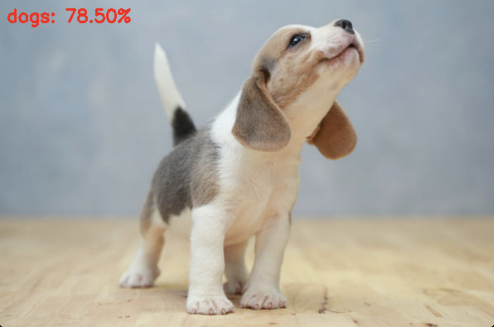

#2. 预测

## ## 设置配置项

	--model ./output/simple_nn.model
	--label-bin ./output/simple_nn.pickle
	--image ./images/dog.jpg
	--width 32
	--height 32
	--flatten 1

## 代码

	# 导入所需工具包
	from keras.models import load_model
	import argparse
	import pickle
	import cv2
	
	# 设置输入参数
	ap = argparse.ArgumentParser()
	ap.add_argument("-i", "--image", required=True,
		help="path to input image we are going to classify")
	ap.add_argument("-m", "--model", required=True,
		help="path to trained Keras model")
	ap.add_argument("-l", "--label-bin", required=True,
		help="path to label binarizer")
	ap.add_argument("-w", "--width", type=int, default=28,
		help="target spatial dimension width")
	ap.add_argument("-e", "--height", type=int, default=28,
		help="target spatial dimension height")
	ap.add_argument("-f", "--flatten", type=int, default=-1,
		help="whether or not we should flatten the image")
	args = vars(ap.parse_args())
	
	# 加载测试数据并进行相同预处理操作
	image = cv2.imread(args["image"])
	output = image.copy()
	image = cv2.resize(image, (args["width"], args["height"]))
	
	# scale the pixel values to [0, 1]
	image = image.astype("float") / 255.0
	
	# 是否要对图像就行拉平操作
	if args["flatten"] > 0:
		image = image.flatten()
		image = image.reshape((1, image.shape[0]))
	
	# CNN的时候需要原始图像
	else:
		image = image.reshape((1, image.shape[0], image.shape[1],
			image.shape[2]))
	
	# 读取模型和标签
	print("[INFO] loading network and label binarizer...")
	model = load_model(args["model"]) # 加载模型
	lb = pickle.loads(open(args["label_bin"], "rb").read()) # 加载标签
	
	# 预测
	preds = model.predict(image)
	
	# 得到预测结果以及其对应的标签
	i = preds.argmax(axis=1)[0]  #寻找概率值最大的一项
	label = lb.classes_[i]  #对应的label
	
	# 在图像中把结果画出来
	text = "{}: {:.2f}%".format(label, preds[0][i] * 100)
	cv2.putText(output, text, (10, 30), cv2.FONT_HERSHEY_SIMPLEX, 0.7,
		(0, 0, 255), 2)
	
	# 绘图
	cv2.imshow("Image", output)
	cv2.waitKey(0)

## 结果

