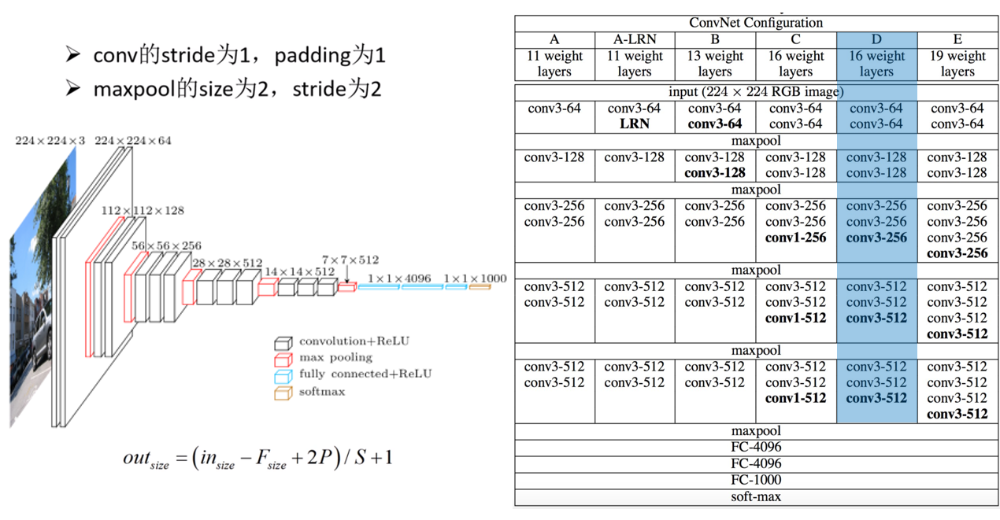

# 3. 卷积神经网络

## VGG 结构

## 设置配置项

run -> Edit configuration 

Edit configuration

	--dataset ./dataset
	--model ./output/vggnet.model
	--label-bin ./output/vggnet_lb.pickle
	--plot ./output/vggnet_plot.png

## 模型评价

	              precision    recall  f1-score   support
	        cats       0.73      0.67      0.70       236
	        dogs       0.71      0.54      0.61       236
	       panda       0.77      0.97      0.86       278
	    accuracy                           0.74       750
	   macro avg       0.73      0.73      0.72       750
	weighted avg       0.74      0.74      0.73       750

## plot

	

## vgg.py

	# 导入所需工具包
	from model_name.simple_vggnet import SimpleVGGNet
	from sklearn.preprocessing import LabelBinarizer
	from sklearn.model_selection import train_test_split
	from sklearn.metrics import classification_report
	from keras.optimizers import SGD
	from keras.preprocessing.image import ImageDataGenerator
	from my_utils import utils_paths
	import matplotlib.pyplot as plt
	import numpy as np
	import argparse
	import random
	import pickle
	import cv2
	import os
	
	import warnings
	warnings.filterwarnings("ignore")
	
	# 设置参数
	ap = argparse.ArgumentParser()
	ap.add_argument("-d", "--dataset", required=True,
		help="path to input dataset of images")
	ap.add_argument("-m", "--model", required=True,
		help="path to output trained model")
	ap.add_argument("-l", "--label-bin", required=True,
		help="path to output label binarizer")
	ap.add_argument("-p", "--plot", required=True,
		help="path to output accuracy/loss plot")
	args = vars(ap.parse_args())
	
	# 读取数据和标签
	print("[INFO] loading images...")
	data = []
	labels = []
	
	# 拿到路径
	imagePaths = sorted(list(utils_paths.list_images(args["dataset"])))
	random.seed(42)
	random.shuffle(imagePaths)
	
	# 读取数据
	for imagePath in imagePaths:
		# 读取图像数据，
		image = cv2.imread(imagePath)
		image = cv2.resize(image, (64, 64)) #正常的vgg是224*224，此处为了减少运算量选择了64*64
		data.append(image)
	
		# 读取标签
		label = imagePath.split(os.path.sep)[-2]
		labels.append(label)
	
	# 预处理
	data = np.array(data, dtype="float") / 255.0
	labels = np.array(labels)
	
	# 数据集切分
	(trainX, testX, trainY, testY) = train_test_split(data,
		labels, test_size=0.25, random_state=42)
	
	# 标签转换
	lb = LabelBinarizer()
	trainY = lb.fit_transform(trainY)
	testY = lb.transform(testY)
	
	# 数据增强
	aug = ImageDataGenerator(rotation_range=30, width_shift_range=0.1,
		height_shift_range=0.1, shear_range=0.2, zoom_range=0.2,
		horizontal_flip=True, fill_mode="nearest")
	
	# 建立卷积神经网络
	model = SimpleVGGNet.build(width=64, height=64, depth=3,
		classes=len(lb.classes_))
	
	# 初始化超参数
	INIT_LR = 0.01
	EPOCHS = 30
	BS = 32 #batch size
	
	# 损失函数
	print("[INFO] 训练网络...")
	opt = SGD(lr=INIT_LR, decay=INIT_LR / EPOCHS) #decay 动态进行衰减
	model.compile(loss="categorical_crossentropy", optimizer=opt,
		metrics=["accuracy"])
	
	# 训练网络
	
	H = model.fit_generator(aug.flow(trainX, trainY, batch_size=BS),
		validation_data=(testX, testY), steps_per_epoch=len(trainX) // BS,
		epochs=EPOCHS)
	"""
	H = model.fit(trainX, trainY, validation_data=(testX, testY),
		epochs=EPOCHS, batch_size=32)
	"""
	
	
	# 测试
	print("[INFO] 测试网络...")
	predictions = model.predict(testX, batch_size=32)
	print(classification_report(testY.argmax(axis=1),
		predictions.argmax(axis=1), target_names=lb.classes_))
	
	# 展示结果
	N = np.arange(0, EPOCHS)
	plt.style.use("ggplot")
	plt.figure()
	plt.plot(N, H.history["loss"], label="train_loss")
	plt.plot(N, H.history["val_loss"], label="val_loss")
	plt.plot(N, H.history["accuracy"], label="train_acc")
	plt.plot(N, H.history["val_accuracy"], label="val_acc")
	plt.title("Training Loss and Accuracy (SmallVGGNet)")
	plt.xlabel("Epoch #")
	plt.ylabel("Loss/Accuracy")
	plt.legend()
	plt.savefig(args["plot"])
	
	# 保存模型
	print("[INFO] 保存模型...")
	model.save(args["model"])
	f = open(args["label_bin"], "wb")
	f.write(pickle.dumps(lb))
	f.close()

## simple_vggnet.py

	# 导入所需模块
	from keras.models import Sequential
	from keras.layers.normalization.batch_normalization_v1 import BatchNormalization
	from keras.layers.convolutional import Conv2D
	from keras.layers.convolutional import MaxPooling2D
	from keras.initializers.initializers_v1 import TruncatedNormal
	from keras.layers.core import Activation
	from keras.layers.core import Flatten
	from keras.layers.core import Dropout
	from keras.layers.core import Dense
	from keras import backend as K
	
	
	# kernel_initializer=TruncatedNormal(mean=0.0, stddev=0.05)
	
	class SimpleVGGNet:
	    @staticmethod
	    def build(width, height, depth, classes):
	        # 不同工具包颜色通道位置可能不一致
	        model = Sequential()
	        inputShape = (height, width, depth)
	        chanDim = -1
	
	        if K.image_data_format() == "channels_first":
	            inputShape = (depth, height, width)
	            chanDim = 1
	
	        # CONV => RELU => POOL 
	        model.add(Conv2D(32, (3, 3), padding="same",
	                         input_shape=inputShape, kernel_initializer=TruncatedNormal(mean=0.0,
	                                                                                    stddev=0.01)))  # Conv2D用来做图像任务比较多。 格式为Conv2D(filter, kernel_size,...)
	        model.add(Activation("relu"))
	        model.add(BatchNormalization(
	            axis=chanDim))  # 修正结果。maintain mean activation close to 0 and the activation standard deviation close to 1
	        model.add(MaxPooling2D(pool_size=(2, 2)))
	        # model.add(Dropout(0.25))
	
	        # (CONV => RELU) * 2 => POOL 
	        model.add(Conv2D(64, (3, 3), padding="same", kernel_initializer=TruncatedNormal(mean=0.0, stddev=0.01)))
	        model.add(Activation("relu"))
	        model.add(BatchNormalization(axis=chanDim))
	        model.add(Conv2D(64, (3, 3), padding="same", kernel_initializer=TruncatedNormal(mean=0.0, stddev=0.01)))
	        model.add(Activation("relu"))
	        model.add(BatchNormalization(axis=chanDim))
	        model.add(MaxPooling2D(pool_size=(2, 2)))
	        # model.add(Dropout(0.25))
	
	        # (CONV => RELU) * 3 => POOL 
	        model.add(Conv2D(128, (3, 3), padding="same", kernel_initializer=TruncatedNormal(mean=0.0, stddev=0.01)))
	        model.add(Activation("relu"))
	        model.add(BatchNormalization(axis=chanDim))
	        model.add(Conv2D(128, (3, 3), padding="same", kernel_initializer=TruncatedNormal(mean=0.0, stddev=0.01)))
	        model.add(Activation("relu"))
	        model.add(BatchNormalization(axis=chanDim))
	        model.add(Conv2D(128, (3, 3), padding="same", kernel_initializer=TruncatedNormal(mean=0.0, stddev=0.01)))
	        model.add(Activation("relu"))
	        model.add(BatchNormalization(axis=chanDim))
	        model.add(MaxPooling2D(pool_size=(2, 2)))
	        # model.add(Dropout(0.25))
	
	        # FC层
	        model.add(Flatten())
	        model.add(Dense(512, kernel_initializer=TruncatedNormal(mean=0.0, stddev=0.01)))
	        model.add(Activation("relu"))
	        model.add(BatchNormalization())
	        model.add(Dropout(0.6))
	
	        # softmax 分类
	        model.add(Dense(classes, kernel_initializer=TruncatedNormal(mean=0.0, stddev=0.01)))
	        model.add(Activation("softmax"))
	
	        return model
