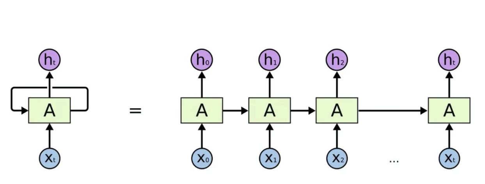
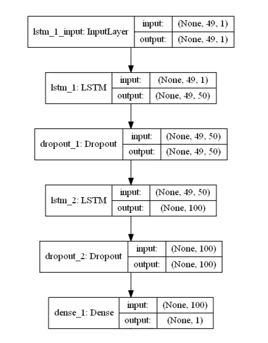
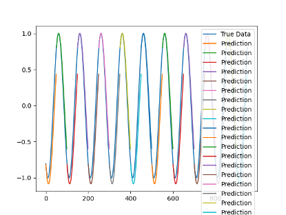
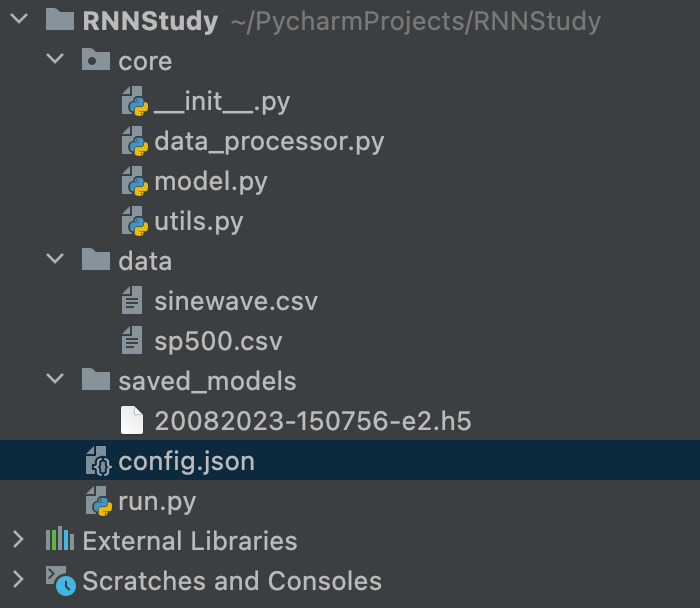

# 4. RNN 

参考：https://github.com/jaungiers/LSTM-Neural-Network-for-Time-Series-Prediction

## 网络结构

* (None,49,1) 表示每一个时间序列包含49个数，1维
* (None,49,50) 表示每一个时间序列包含49个数，50维
* (None,100) 表示一个100纬的向量
* dense_1:将(None,100) 转化为(None,1) 输出结果 

#### config.json （定义网络结构）

	{
		"data": {
			"filename": "sinewave.csv",
			"columns": [
				"sinewave"
			],
			"sequence_length": 50,
			"train_test_split": 0.85,
			"normalise": false
		},
		"training": {
			"epochs": 2,
			"batch_size": 32
		},
		"model": {
			"loss": "mse",
			"optimizer": "adam",
			"save_dir": "saved_models",
			"layers": [
				{
					"type": "lstm",
					"neurons": 50,
					"input_timesteps": 49,
					"input_dim": 1,
					"return_seq": true
				},
				{
					"type": "dropout",
					"rate": 0.05
				},
				{
					"type": "lstm",
					"neurons": 100,
					"return_seq": false
				},
				{
					"type": "dropout",
					"rate": 0.05
				},
				{
					"type": "dense",
					"neurons": 1,
					"activation": "linear"
				}
			]
		}
	}

#### 关键参数解释

					"type": "lstm",
					"neurons": 50,
					"input_timesteps": 49,
					"input_dim": 1,
					"return_seq": true,

* input_timesteps 表示一个时间序列包含49个数
* neurons 有50个
* input_dim 输入参数1维
* "return_seq": true 得到的是 （49，50）的数，过程数据都返回了

                "type": "lstm",
                "neurons": 100,
                "return_seq": false
                
                
* neurons： 神经元100个
* "return_seq": false ： 只保留结果               

                "type": "dense",
                "neurons": 1,
                "activation": "linear"
             
全连接层

	"normalise": false

归一化设置为false

## 模型预测结果

## 代码

###  run.py

	import os
	import json
	import matplotlib.pyplot as plt
	from core.data_processor import DataLoader
	from core.model import Model
	
	
	def plot_results(predicted_data, true_data):
	    fig = plt.figure(facecolor='white')
	    ax = fig.add_subplot(111)
	    ax.plot(true_data, label='True Data')
	    plt.plot(predicted_data, label='Prediction')
	    plt.legend()
	    plt.show()
	
	
	def plot_results_multiple(predicted_data, true_data, prediction_len):
	    fig = plt.figure(facecolor='white')
	    ax = fig.add_subplot(111)
	    ax.plot(true_data, label='True Data')
	    # Pad the list of predictions to shift it in the graph to it's correct start
	    for i, data in enumerate(predicted_data):
	        padding = [None for p in range(i * prediction_len)]
	        plt.plot(padding + data, label='Prediction')
	        plt.legend()
	    plt.show()
	
	
	# RNN 时间序列
	def main():
	    # 读取所需配置参数
	    configs = json.load(open('config.json', 'r'))
	    if not os.path.exists(configs['model']['save_dir']): os.makedirs(configs['model']['save_dir'])
	
	    data = DataLoader(  # 调用core包 data_processor.py 下的 DataLoader，传入filename, 测试数据占比，column
	        os.path.join('data', configs['data']['filename']),
	        configs['data']['train_test_split'],
	        configs['data']['columns']
	    ) # 以本例，得到data_test(size:1001,1), data_train(4000,1)
	
	    # 创建RNN模型
	    model = Model()
	    model.build_model(configs) # 生成一个5层的LSTM模型，包括LSTM，dropout，LSTM，dropout，dense
	
	    # 加载训练数据
	    x, y = data.get_train_data(
	        seq_len=configs['data']['sequence_length'],
	        normalise=configs['data']['normalise']
	    )  # x: (3950,49,1), y:(3950,1)
	
	    model.train(
	        x,
	        y,
	        epochs= configs['training']['epochs'],
	        batch_size= configs['training']['batch_size'],
	        save_dir= configs['model']['save_dir']
	    )
	
	    #测试结果
	    x_test, y_test = data.get_test_data(
	        seq_len=configs['data']['sequence_length'],
	        normalise=configs['data']['normalise']
	    )
	
	    # 展示测试效果
	    predictions = model.predict_sequences_multiple(x_test, configs['data']['sequence_length'], configs['data']['sequence_length'])
	
	    plot_results_multiple(predictions, y_test, configs['data']['sequence_length'])
	
	if __name__ == '__main__':
	    main()

### model.py

	import os
	import math
	import numpy as np
	import datetime as dt
	from numpy import newaxis
	from core.utils import Timer
	from keras.layers import Dense, Activation, Dropout, LSTM
	from keras.models import Sequential, load_model
	from keras.callbacks import EarlyStopping, ModelCheckpoint
	
	class Model():
		"""LSTM 模型"""
	
		def __init__(self):
			self.model = Sequential()
	
		def load_model(self, filepath):
			print('[Model] Loading model from file %s' % filepath)
			self.model = load_model(filepath)
	
		def build_model(self, configs):
			timer = Timer()
			timer.start()
	
			for layer in configs['model']['layers']:
				neurons = layer['neurons'] if 'neurons' in layer else None   # 神经元的数量
				dropout_rate = layer['rate'] if 'rate' in layer else None
				activation = layer['activation'] if 'activation' in layer else None
				return_seq = layer['return_seq'] if 'return_seq' in layer else None
				input_timesteps = layer['input_timesteps'] if 'input_timesteps' in layer else None
				input_dim = layer['input_dim'] if 'input_dim' in layer else None
	
				if layer['type'] == 'dense':
					self.model.add(Dense(neurons, activation=activation))
				if layer['type'] == 'lstm':
					self.model.add(LSTM(neurons, input_shape=(input_timesteps, input_dim), return_sequences=return_seq))
				if layer['type'] == 'dropout':
					self.model.add(Dropout(dropout_rate))
	
			self.model.compile(loss=configs['model']['loss'], optimizer=configs['model']['optimizer'])
	
			print('[Model] Model Compiled')
			timer.stop()
	
		def train(self, x, y, epochs, batch_size, save_dir):
			timer = Timer()
			timer.start()
			print('[Model] Training Started')
			print('[Model] %s epochs, %s batch size' % (epochs, batch_size))
			
			save_fname = os.path.join(save_dir, '%s-e%s.h5' % (dt.datetime.now().strftime('%d%m%Y-%H%M%S'), str(epochs)))
			callbacks = [
				EarlyStopping(monitor='val_loss', patience=2), # 监视功能，如果监听值val_loss一直不变2次，则停止训练
				ModelCheckpoint(filepath=save_fname, monitor='val_loss', save_best_only=True)  # 模型checkpoint保存
			]
			self.model.fit(
				x,
				y,
				epochs=epochs,
				batch_size=batch_size,
				callbacks=callbacks
			)
			self.model.save(save_fname)
	
			print('[Model] Training Completed. Model saved as %s' % save_fname)
			timer.stop()
	
		def train_generator(self, data_gen, epochs, batch_size, steps_per_epoch, save_dir):
			timer = Timer()
			timer.start()
			print('[Model] Training Started')
			print('[Model] %s epochs, %s batch size, %s batches per epoch' % (epochs, batch_size, steps_per_epoch))
			
			save_fname = os.path.join(save_dir, '%s-e%s.h5' % (dt.datetime.now().strftime('%d%m%Y-%H%M%S'), str(epochs)))
			callbacks = [
				ModelCheckpoint(filepath=save_fname, monitor='loss', save_best_only=True)
			]
			self.model.fit_generator(
				data_gen,
				steps_per_epoch=steps_per_epoch,
				epochs=epochs,
				callbacks=callbacks,
				workers=1
			)
			
			print('[Model] Training Completed. Model saved as %s' % save_fname)
			timer.stop()
	
		def predict_point_by_point(self, data):
			#Predict each timestep given the last sequence of true data, in effect only predicting 1 step ahead each time
			print('[Model] Predicting Point-by-Point...')
			predicted = self.model.predict(data)
			predicted = np.reshape(predicted, (predicted.size,))
			return predicted
	
		def predict_sequences_multiple(self, data, window_size, prediction_len):
			#Predict sequence of 50 steps before shifting prediction run forward by 50 steps
			print('[Model] Predicting Sequences Multiple...')
			prediction_seqs = []
			for i in range(int(len(data)/prediction_len)):
				curr_frame = data[i*prediction_len]
				predicted = []
				for j in range(prediction_len):
					predicted.append(self.model.predict(curr_frame[newaxis,:,:])[0,0])
					curr_frame = curr_frame[1:]
					curr_frame = np.insert(curr_frame, [window_size-2], predicted[-1], axis=0)
				prediction_seqs.append(predicted)
			return prediction_seqs
	
		def predict_sequence_full(self, data, window_size):
			#Shift the window by 1 new prediction each time, re-run predictions on new window
			print('[Model] Predicting Sequences Full...')
			curr_frame = data[0]
			predicted = []
			for i in range(len(data)):
				predicted.append(self.model.predict(curr_frame[newaxis,:,:])[0,0])
				curr_frame = curr_frame[1:]
				curr_frame = np.insert(curr_frame, [window_size-2], predicted[-1], axis=0)
			return predicted

### data_processor.py

	import math
	import numpy as np
	import pandas as pd
	
	
	class DataLoader():
	    """A class for loading and transforming data for the lstm model"""
	
	    def __init__(self, filename, split, cols):
	        dataframe = pd.read_csv(filename)
	        i_split = int(len(dataframe) * split)
	        self.data_train = dataframe.get(cols).values[:i_split]
	        self.data_test = dataframe.get(cols).values[i_split:]
	        self.len_train = len(self.data_train)
	        self.len_test = len(self.data_test)
	        self.len_train_windows = None
	
	    def get_test_data(self, seq_len, normalise):
	        '''
	        Create x, y test data windows
	        Warning: batch method, not generative, make sure you have enough memory to
	        load data, otherwise reduce size of the training split.
	        '''
	        data_windows = []
	        for i in range(self.len_test - seq_len):
	            data_windows.append(self.data_test[i:i + seq_len])
	
	        data_windows = np.array(data_windows).astype(float)
	        data_windows = self.normalise_windows(data_windows, single_window=False) if normalise else data_windows
	
	        x = data_windows[:, :-1]
	        y = data_windows[:, -1, [0]]
	        return x, y
	
	    def get_train_data(self, seq_len, normalise):
	        '''
	        Create x, y train data windows
	        Warning: batch method, not generative, make sure you have enough memory to
	        load data, otherwise use generate_training_window() method.
	        '''
	        data_x = []
	        data_y = []
	        for i in range(self.len_train - seq_len):  # 用for实现滑动窗口
	            x, y = self._next_window(i, seq_len, normalise)
	            data_x.append(x)
	            data_y.append(y)
	        return np.array(data_x), np.array(data_y)
	
	    def generate_train_batch(self, seq_len, batch_size, normalise):
	        '''Yield a generator of training data from filename on given list of cols split for train/test'''
	        i = 0
	        while i < (self.len_train - seq_len):
	            x_batch = []
	            y_batch = []
	            for b in range(batch_size):
	                if i >= (self.len_train - seq_len):
	                    # stop-condition for a smaller final batch if data doesn't divide evenly
	                    yield np.array(x_batch), np.array(y_batch)
	                    i = 0
	                x, y = self._next_window(i, seq_len, normalise)
	                x_batch.append(x)
	                y_batch.append(y)
	                i += 1
	            yield np.array(x_batch), np.array(y_batch)
	
	    def _next_window(self, i, seq_len, normalise):
	        '''Generates the next data window from the given index location i'''
	        window = self.data_train[i:i + seq_len]
	        window = self.normalise_windows(window, single_window=True)[0] if normalise else window
	        x = window[:-1]
	        y = window[-1, [0]]
	        return x, y
	
	    def normalise_windows(self, window_data, single_window=False):
	        '''Normalise window with a base value of zero'''
	        normalised_data = []
	        window_data = [window_data] if single_window else window_data
	        for window in window_data:
	            normalised_window = []
	            for col_i in range(window.shape[1]):
	                normalised_col = [((float(p) / float(window[0, col_i])) - 1) for p in window[:, col_i]]
	                normalised_window.append(normalised_col)
	            normalised_window = np.array(
	                normalised_window).T  # reshape and transpose array back into original multidimensional format
	            normalised_data.append(normalised_window)
	        return np.array(normalised_data)

### utils.py

	import datetime as dt
	
	class Timer():
	
		def __init__(self):
			self.start_dt = None
	
		def start(self):
			self.start_dt = dt.datetime.now()
	
		def stop(self):
			end_dt = dt.datetime.now()
			print('Time taken: %s' % (end_dt - self.start_dt))

