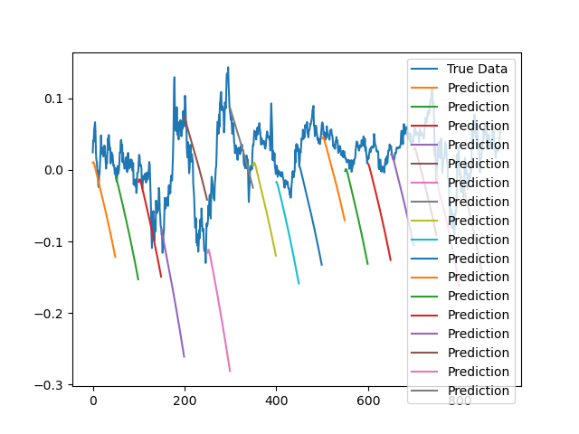

# 5. LSTM 股票预测

## 网络结构图

## 配置文件

	{
		"data": {
			"filename": "sp500.csv",
			"columns": [
				"Close"
			],
			"sequence_length": 50,
			"train_test_split": 0.8,
			"normalise": true
		},
		"training": {
			"epochs": 2,
			"batch_size": 32
		},
		"model": {
			"loss": "mse",
			"optimizer": "adam",
			"save_dir": "saved_models",
			"layers": [
				{
					"type": "lstm",
					"neurons": 100,
					"input_timesteps": 49,
					"input_dim": 1,
					"return_seq": true
				},
				{
					"type": "dropout",
					"rate": 0.05
				},
				{
					"type": "lstm",
					"neurons": 100,
					"return_seq": true
				},
				{
					"type": "lstm",
					"neurons": 100,
					"return_seq": false
				},
				{
					"type": "dropout",
					"rate": 0.05
				},
				{
					"type": "dense",
					"neurons": 1,
					"activation": "linear"
				}
			]
		}
	}

## 关键代码

### data_processor.py

	import math
	import numpy as np
	import pandas as pd
	
	
	class DataLoader():
	    """A class for loading and transforming data for the lstm model"""
	
	    def __init__(self, filename, split, cols):
	        dataframe = pd.read_csv(filename)
	        i_split = int(len(dataframe) * split)
	        self.data_train = dataframe.get(cols).values[:i_split]
	        self.data_test = dataframe.get(cols).values[i_split:]
	        self.len_train = len(self.data_train)
	        self.len_test = len(self.data_test)
	        self.len_train_windows = None
	
	    def get_test_data(self, seq_len, normalise):
	        '''
	        Create x, y test data windows
	        Warning: batch method, not generative, make sure you have enough memory to
	        load data, otherwise reduce size of the training split.
	        '''
	        data_windows = []
	        for i in range(self.len_test - seq_len):
	            data_windows.append(self.data_test[i:i + seq_len])
	
	        data_windows = np.array(data_windows).astype(float)
	        data_windows = self.normalise_windows(data_windows, single_window=False) if normalise else data_windows
	
	        x = data_windows[:, :-1]
	        y = data_windows[:, -1, [0]]
	        return x, y
	
	    def get_train_data(self, seq_len, normalise):
	        '''
	        Create x, y train data windows
	        Warning: batch method, not generative, make sure you have enough memory to
	        load data, otherwise use generate_training_window() method.
	        '''
	        data_x = []
	        data_y = []
	        for i in range(self.len_train - seq_len):  # 用for实现滑动窗口
	            x, y = self._next_window(i, seq_len, normalise)
	            data_x.append(x)
	            data_y.append(y)
	        return np.array(data_x), np.array(data_y)
	
	    def generate_train_batch(self, seq_len, batch_size, normalise):
	        '''Yield a generator of training data from filename on given list of cols split for train/test'''
	        i = 0
	        while i < (self.len_train - seq_len):
	            x_batch = []
	            y_batch = []
	            for b in range(batch_size):
	                if i >= (self.len_train - seq_len):
	                    # stop-condition for a smaller final batch if data doesn't divide evenly
	                    yield np.array(x_batch), np.array(y_batch)
	                    i = 0
	                x, y = self._next_window(i, seq_len, normalise)
	                x_batch.append(x)
	                y_batch.append(y)
	                i += 1
	            yield np.array(x_batch), np.array(y_batch)
	
	    def _next_window(self, i, seq_len, normalise):
	        '''Generates the next data window from the given index location i'''
	        window = self.data_train[i:i + seq_len]
	        window = self.normalise_windows(window, single_window=True)[0] if normalise else window
	        x = window[:-1]
	        y = window[-1, [0]]
	        return x, y
	
	    def normalise_windows(self, window_data, single_window=False):
	        '''Normalise window with a base value of zero'''
	        normalised_data = []
	        window_data = [window_data] if single_window else window_data  # 如果数据是单纬的返回single_window, 如果是多列的返回window_data
	        for window in window_data:
	            normalised_window = []
	            for col_i in range(window.shape[1]):  # shape(1) 代表列
	
	                normalised_col = [((float(p) / float(window[0, col_i])) - 1) for p in window[:, col_i]] # 每一个数跟该纬度第一个数做对比，查看趋势
	                normalised_window.append(normalised_col)
	            normalised_window = np.array(
	                normalised_window).T  # reshape and transpose array back into original multidimensional format
	            normalised_data.append(normalised_window)
	        return np.array(normalised_data)

解释：

 	normalised_col = [((float(p) / float(window[0, col_i])) - 1) for p in window[:, col_i]]
 
 记录了每一个数和起始值的趋势，>1 表示比起始值打，<1 表示比起始值小。归一化后方便LSTM模型快速收敛

## 模型效果

## 增加一维

### config文件

	{
		"data": {
			"filename": "sp500.csv",
			"columns": [
				"Close",
				"Volume"
			],
			"sequence_length": 50,
			"train_test_split": 0.8,
			"normalise": true
		},
		"training": {
			"epochs": 2,
			"batch_size": 32
		},
		"model": {
			"loss": "mse",
			"optimizer": "adam",
			"save_dir": "saved_models",
			"layers": [
				{
					"type": "lstm",
					"neurons": 100,
					"input_timesteps": 49,
					"input_dim": 2,
					"return_seq": true
				},
				{
					"type": "dropout",
					"rate": 0.05
				},
				{
					"type": "lstm",
					"neurons": 100,
					"return_seq": true
				},
				{
					"type": "lstm",
					"neurons": 100,
					"return_seq": false
				},
				{
					"type": "dropout",
					"rate": 0.05
				},
				{
					"type": "dense",
					"neurons": 1,
					"activation": "linear"
				}
			]
		}
	}

## 模型效果

