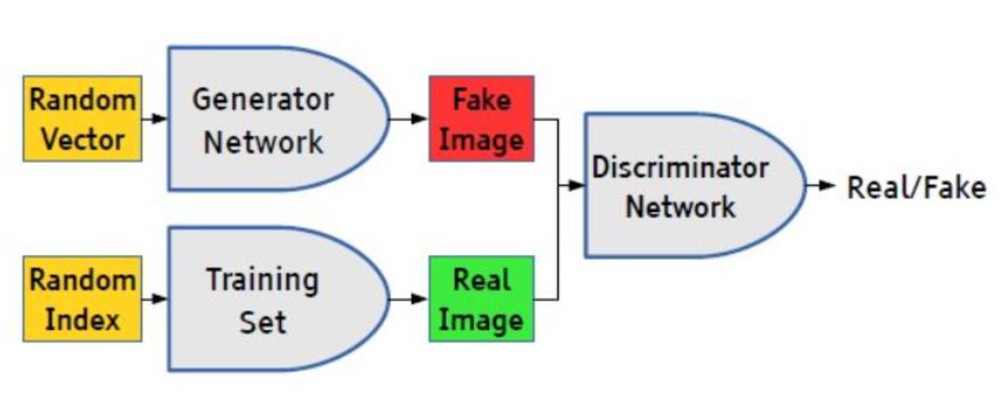
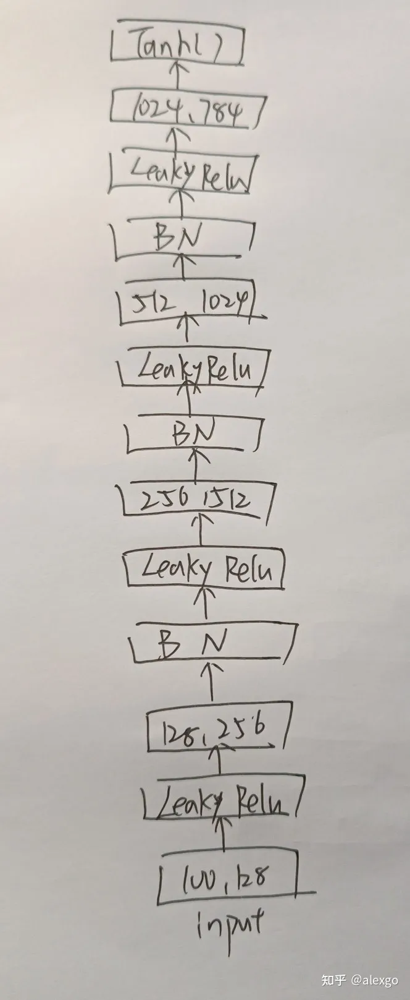
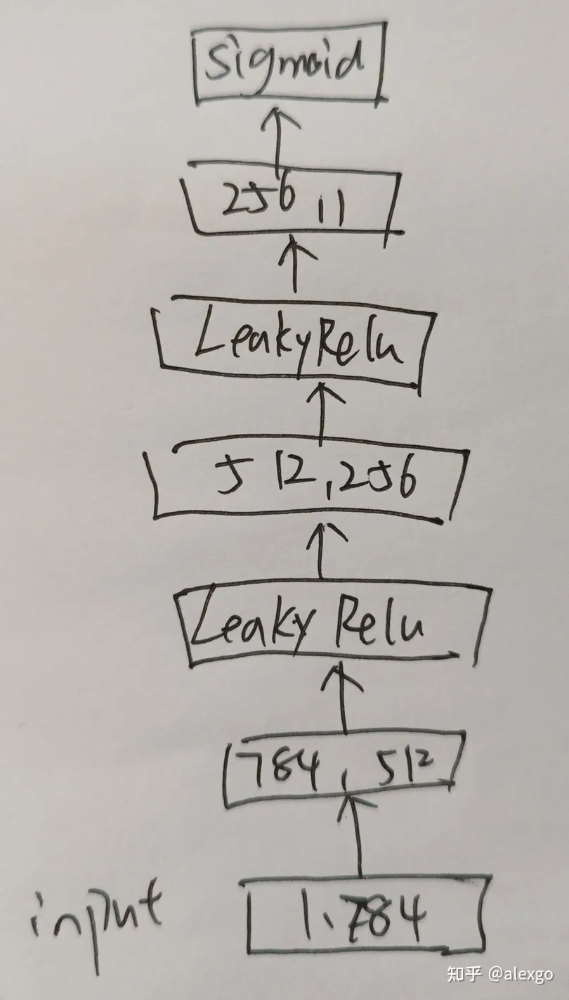

# 6. GAN
参考：https://zhuanlan.zhihu.com/p/534586185

## 代码

### 前提

安装pytorch

### 代码

·

##  解释

### 打印

opt：

	Namespace(n_epochs=200, batch_size=256, lr=0.0002, b1=0.5, b2=0.999, n_cpu=8, latent_dim=100, img_size=28, channels=1, sample_interval=400)
	
transforms.Resize：
	
	Resize(size=28, interpolation=bilinear, max_size=None, antialias=warn)

### Generator

### Discriminator

