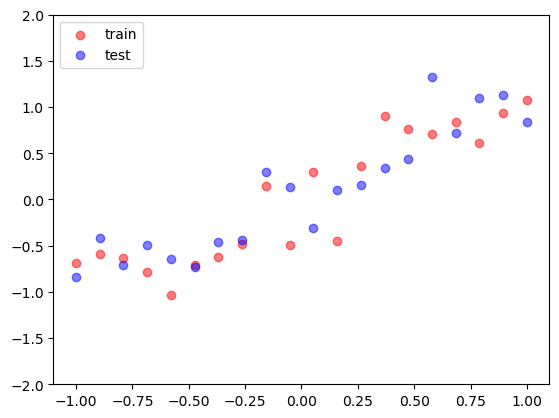
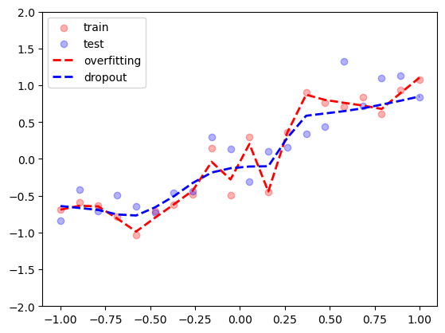

```python
import torch
import torch.nn as nn
import matplotlib.pylab as plt

# 随机数种子
torch.manual_seed(2333)

# 定义超参数
num_samples = 20 #样本数
hidden_size = 200 # 隐藏层大小
num_epochs = 500 # 训练轮数
```

## 数据生成


```python
# 生成训练集
x_train = torch.unsqueeze(torch.linspace(-1,1,num_samples),1)  
y_train = x_train + 0.3 * torch.randn(num_samples,1)

# 测试集
x_test = torch.unsqueeze(torch.linspace(-1,1,num_samples),1)
y_test = x_test + 0.3 * torch.randn(num_samples,1)

# 绘制训练集和测试集
plt.scatter(x_train,y_train, c='r', alpha=0.5, label='train')
plt.scatter(x_test,y_test, c='b', alpha=0.5, label='test')
plt.legend(loc='upper left')
plt.ylim(-2,2)
plt.show()
```

`torch.linspace()` 是 PyTorch 中的一个函数，用于生成指定范围内均匀间隔的一维张量。。例如torch.linspace(3, 8, steps=5)，表示生成一个在区间[3, 8]内的长度为5的张量。这将生成一个形状为 `(5,)` 的张量，其中的元素是 `[3.0000, 4.2500, 5.5000, 6.7500, 8.0000]`

`torch.unsqueeze()` 是 PyTorch 中的一个函数，用于在指定位置增加一个维度。它可以用来改变张量的形状。他的语法是torch.unsqueeze(input, dim)

`torch.randn()` 是 PyTorch 中的一个函数，用于生成服从标准正态分布（均值为0，方差为1）的随机数的张量。 例子：tensor = torch.randn(2, 3)表示生成一个形状为 (2, 3) 的张量，元素服从标准正态分布。

在 `plt.scatter` 中，`alpha` 是用来控制绘制的点的透明度的参数。透明度的取值范围是 0（完全透明）到 1（完全不透明）之间的浮点数。


    


# 模型定义


```python
# 定义一个可能会过拟合的网络
net_overfitting = torch.nn.Sequential(
    torch.nn.Linear(1,hidden_size),
    torch.nn.ReLU(),
    torch.nn.Linear(hidden_size,hidden_size),
    torch.nn.ReLU(),
    torch.nn.Linear(hidden_size,1)
)

# 定义一个含dropout的网络
net_dropout = torch.nn.Sequential(
    torch.nn.Linear(1,hidden_size),
    torch.nn.Dropout(0.5),
    torch.nn.ReLU(),
    torch.nn.Linear(hidden_size,hidden_size),
    torch.nn.Dropout(0.5),
    torch.nn.ReLU(),
    torch.nn.Linear(hidden_size,1)
)
```

`torch.nn.Sequential` 是 PyTorch 中的一个模型容器，它允许将多个神经网络层按顺序排列，构建一个神经网络模型。

`torch.nn.Linear` 是 PyTorch 中的一个线性变换层，也称为全连接层或仿射层。它将输入张量与权重矩阵相乘，然后加上偏置向量，以实现线性变换。

# 模型训练


```python
# 定义优化器和损失函数
optimizer_overfitting = torch.optim.Adam(net_overfitting.parameters(), lr=0.01)
optimizer_dropout = torch.optim.Adam(net_dropout.parameters(),lr=0.01)

# 损失函数
criterion = nn.MSELoss()

# 分别进行训练
for i in range(num_epochs):
    # overfitting的网络：预测、损失函数、反向传播
    pred_overfitting = net_overfitting(x_train)
    loss_overfitting = criterion(pred_overfitting,y_train)
    optimizer_overfitting.zero_grad()
    loss_overfitting.backward()
    optimizer_overfitting.step()

for i in range(num_epochs):
    # dropout的网络：预测、损失函数、反向传播
    pred_dropout = net_dropout(x_train)
    loss_dropput = criterion(pred_dropout,y_train)
    optimizer_dropout.zero_grad()
    loss_dropput.backward()
    optimizer_dropout.step()
```

`torch.optim.Adam` 是 PyTorch 中的一个优化器，用于实现 Adam 算法进行模型参数的优化更新。Adam 算法是一种自适应学习率的优化算法，结合了 AdaGrad 和 RMSProp 算法的优点。它能够有效地处理稀疏梯度和非平稳目标。


```python
# 可视化
```


```python
#在测试中国不适用dropout
net_overfitting.eval()
net_dropout.eval()

#预测
test_pred_overfitting = net_overfitting(x_test)
test_pred_dropout = net_dropout(x_test)

#绘制拟合效果
plt.scatter(x_train,y_train,c='r',alpha=0.3, label ='train')
plt.scatter(x_test,y_test,c='b',alpha=0.3, label ='test')
plt.plot(x_test,test_pred_overfitting.data.numpy(),'r--',lw=2,label='overfitting')
plt.plot(x_test,test_pred_dropout.data.numpy(),'b--',lw=2,label='dropout')
plt.legend(loc='upper left')
plt.ylim((-2,2))
plt.show()
```


​    

​    

