# GPT

## 发展历程

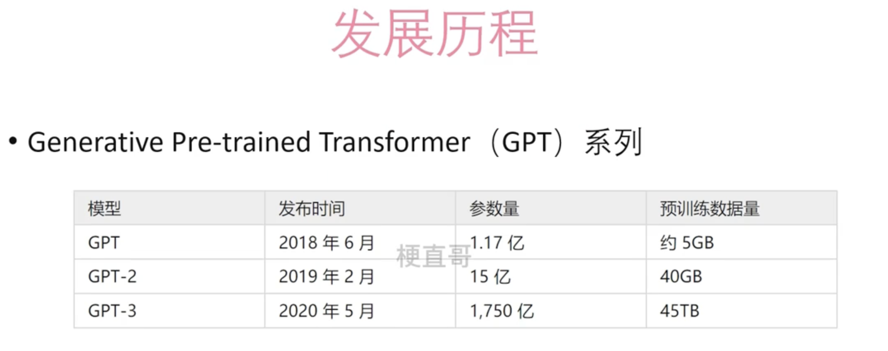

## GPT-1

用Decoder生成大量的数据预训练，因此叫做生成式（Generative）

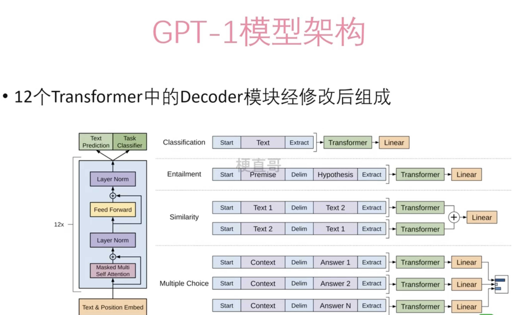

12个全是Decoder

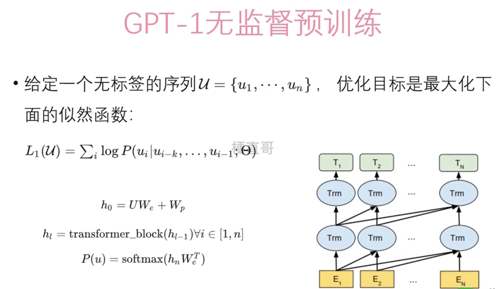

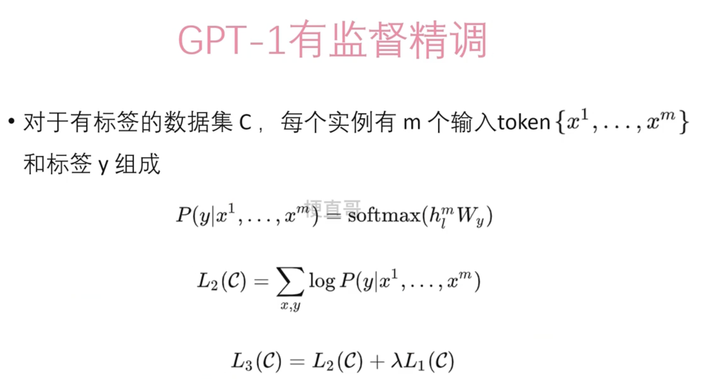

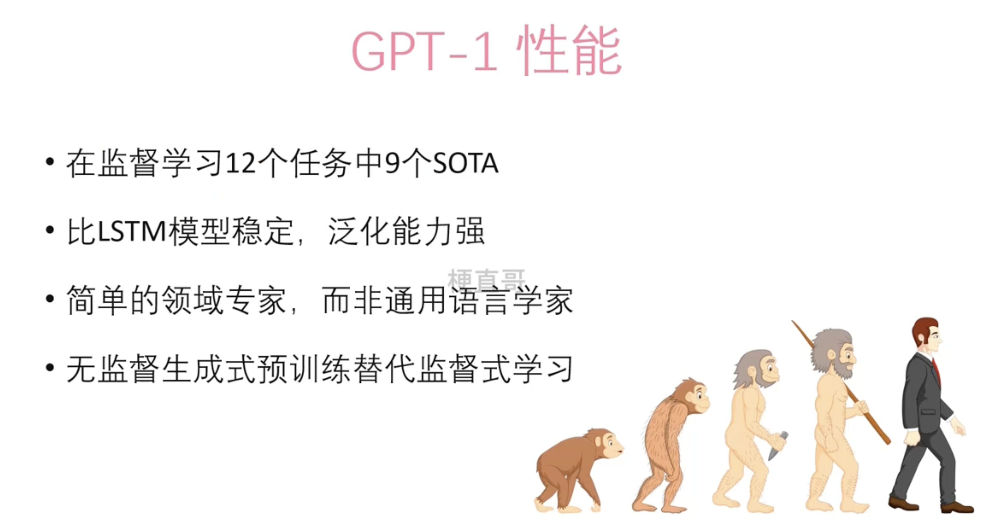

## GPT-2

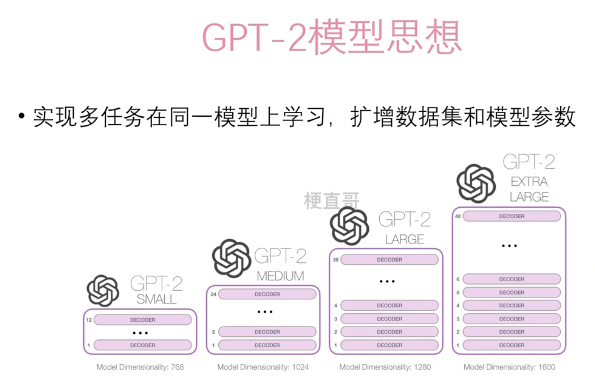

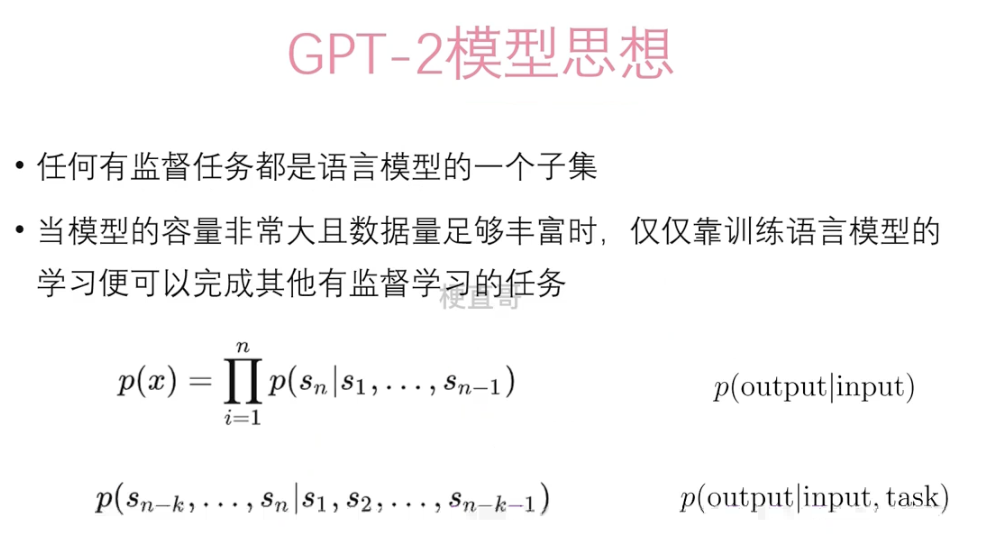

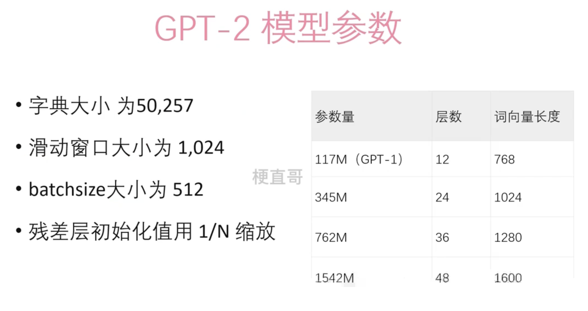

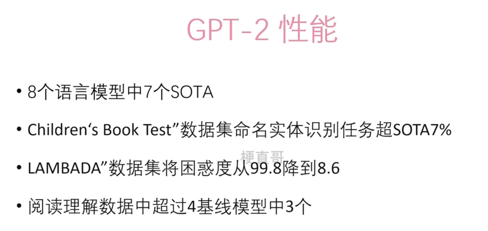

## GPT-3

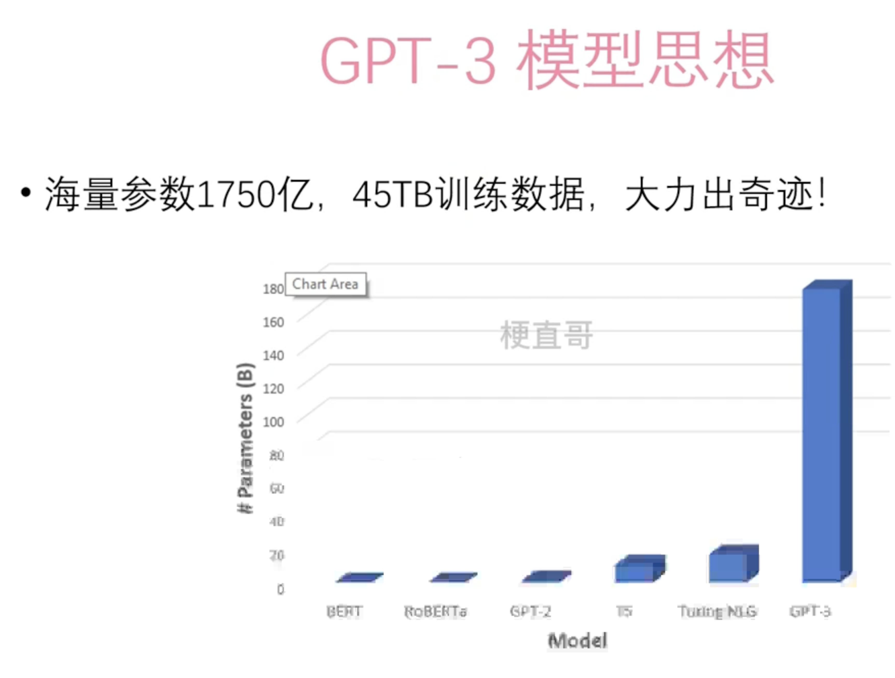

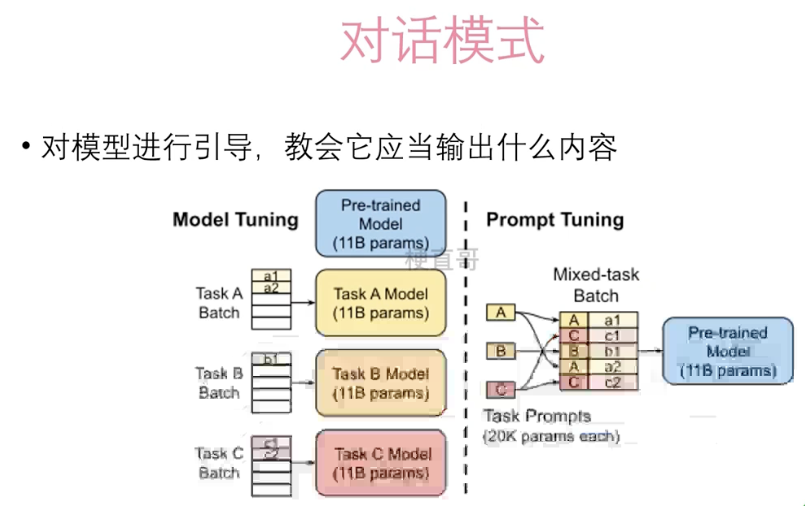

GPT-3 借鉴了元学习的思想。

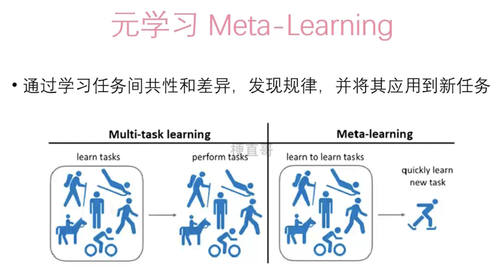

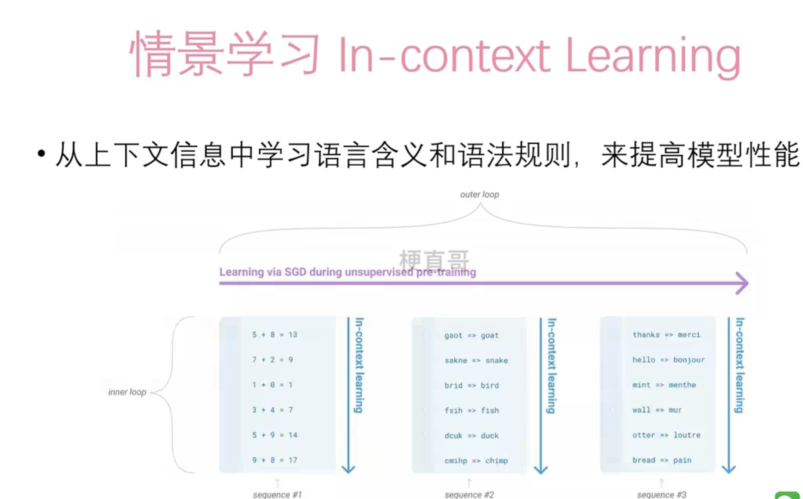

引导式学习还可以分为很多种情况：

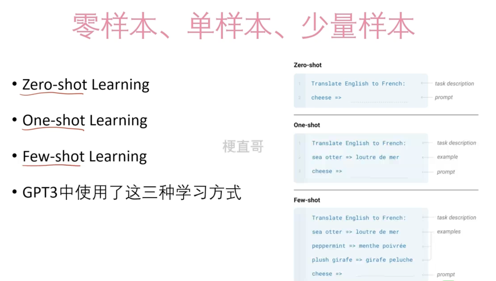

GPT-3 不用Fine tunning的方法，而是用提示词的方式进行调优。

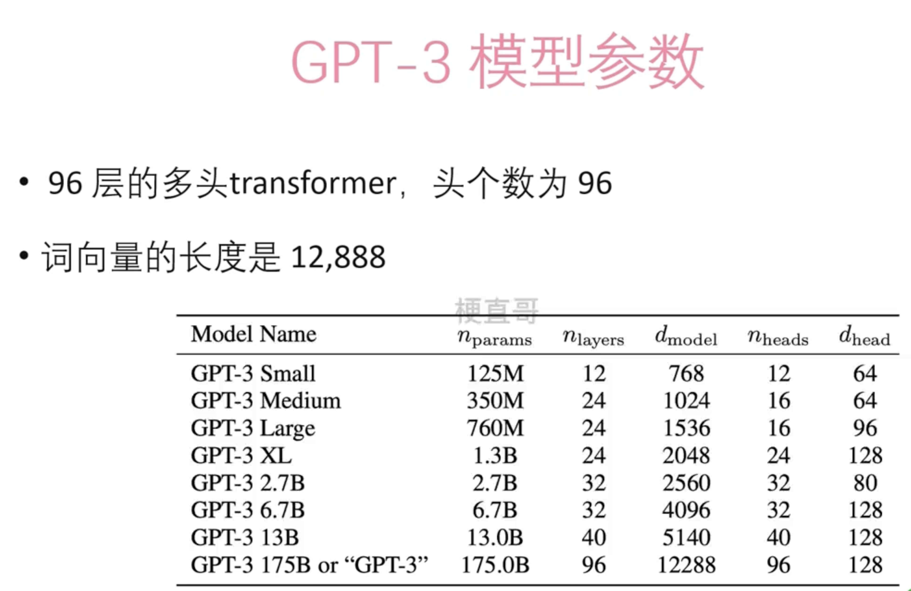

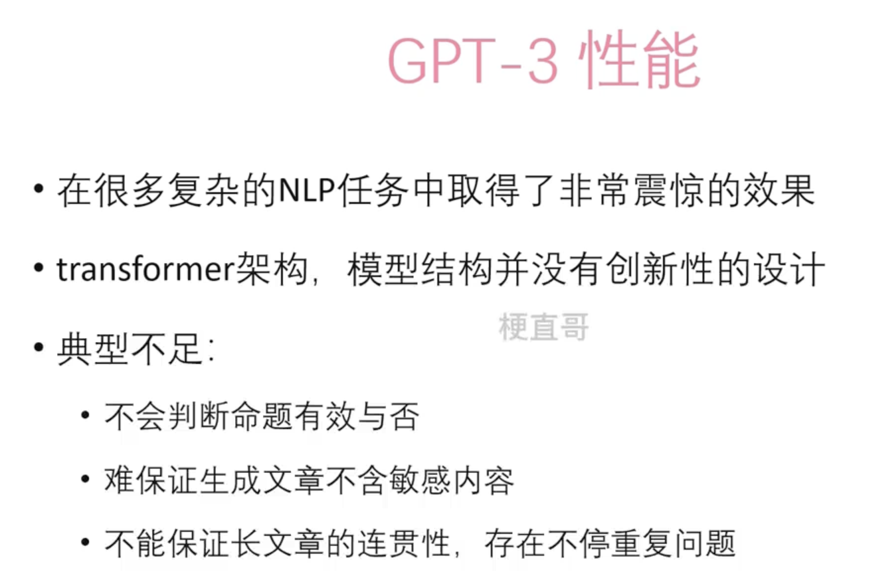