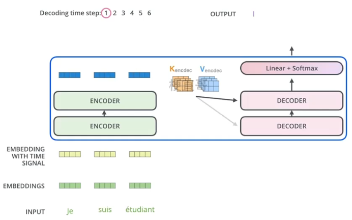

# Transformer 

## 模型结构

### 编码器结构

整个的流程如下：

得到不同的注意力权重Z，再拼接到一起Wo。 举个例子：

多头类似于卷积中的不同卷积核。

### 编解码器协同工作

## 工作流程

​    Transformer模型的工作流程主要包含三个步骤：

​    第一步：获取输入句子的每一个单词的表示向量 X，X 由单词的 Embedding 和单词位置的 Embedding 相加得到。

​    第二步：将得到的单词表示向量矩阵 (如上图所示，每一行是一个单词的表示 x ，传入 Encoder 中，经过 6 个 Encoder block 后可以得到句子所有单词的编码信息矩阵 C，如下图 2。

​    单词向量矩阵用 X(n×d)表示， n 是句子中单词个数，d 是表示向量的维度 (论文中 d=512)。每一个 Encoder block 输出的矩阵维度与输入完全一致。

​    第三步：将 Encoder 输出的编码信息矩阵 C传递到 Decoder 中，Decoder 依次会根据当前翻译过的单词 1~ i 翻译下一个单词 i+1，如下图所示。在使用的过程中，翻译到单词 i+1 的时候需要通过 Mask (掩盖) 操作遮盖住 i+1 之后的单词。

​    需要特别说明的是Transformer中使用了多头注意力机制

​    上图 Decoder 接收了 Encoder 的编码矩阵 C，然后首先输入一个翻译开始符 Begin，预测第一个单词 I；然后输入翻译开始符 Begin 和单词 I，预测单词 have，以此类推。这是 Transformer 使用时候的大致流程，接下来是里面各个部分的细节。 

## 优缺点

​    Transformer 与 RNN 不同，可以比较好地并行训练。

​    Transformer 本身是不能利用单词的顺序信息的，因此需要在输入中添加位置 Embedding，否则 Transformer 就是一个词袋模型了。

​    Transformer 的重点是 Self-Attention 结构，其中用到的 Q, K, V矩阵通过输出进行线性变换得到。

​    Transformer 中 Multi-Head Attention 中有多个 Self-Attention，可以捕获单词之间多种维度上的相关系数 attention score。

