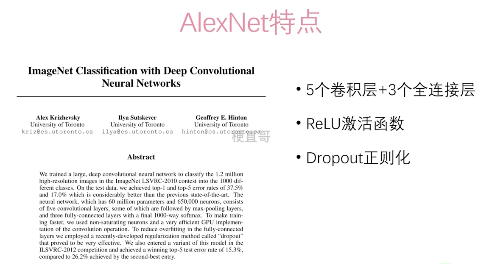

# AlexNet 网络





# 代码实现


```
import torch
import torch.nn as nn
from torchinfo import summary

# 定义AlexNet的网络结构

class AlexNet(nn.Module):
    def __init__(self, num_classes=1000, dropout=0.5):
        super().__init__()
        # 定义卷积层
        self.features = nn.Sequential(
        		#卷积+ReLU+最大池化
            nn.Conv2d(3, 64, kernel_size=11, stride=4, padding=2),
            nn.ReLU(inplace=True),
            nn.MaxPool2d(kernel_size=3, stride=2),
            #卷积+ReLU+最大池化
            nn.Conv2d(64, 192, kernel_size=5, padding=2),
            nn.ReLU(inplace=True),
            nn.MaxPool2d(kernel_size=3, stride=2),
            #卷积+ReLU
            nn.Conv2d(192, 384, kernel_size=3, padding=1),
            nn.ReLU(inplace=True),
            #卷积+ReLU
            nn.Conv2d(384, 256, kernel_size=3, padding=1),
            nn.ReLU(inplace=True),
            #卷积+ReLU
            nn.Conv2d(256, 256, kernel_size=3, padding=1),
            nn.ReLU(inplace=True),
            #最大池化
            nn.MaxPool2d(kernel_size=3, stride=2),
        )
        # 定义全连接层
        self.classifier = nn.Sequential(
        		# Dropout + 全连接层+ ReLU
            nn.Dropout(p=dropout),
            nn.Linear(256 * 6 * 6, 4096),
            nn.ReLU(inplace=True),
            # Dropout + 全连接层 + ReLu
            nn.Dropout(p=dropout),
            nn.Linear(4096, 4096),
            nn.ReLU(inplace=True),
            # 全连接层
            nn.Linear(4096, num_classes),
        )

    def forward(self, x):
        x = self.features(x)
        x = torch.flatten(x, 1)
        x = self.classifier(x)
        return x

# 查看模型结构以及参数量，input_size表示示例输入数据的维度信息
summary(AlexNet(), input_size=(1,3,224,224))
```

代码解释：


### nn.Conv2d

`nn.Conv2d` 是 PyTorch 中的一个类，用于创建 2 维卷积层。

**参数**：

- `in_channels`：输入张量的通道数（或深度）。

- `out_channels`：卷积层输出的通道数。

- `kernel_size`：卷积核的大小。可以是一个整数或一个元组 `(height, width)`。

- `stride`：卷积的步幅。它控制了卷积时核的步长。

- `padding`：在输入两侧添加零填充。它控制了输出的空间维度。

- `dilation`：扩张卷积的扩张率。它控制了核元素之间的间距。

- `groups`：从输入通道到输出通道的阻塞连接数。

- `bias`：一个布尔值，指示是否在卷积操作中包含可学习的偏置项。

- `padding_mode`：字符串，指示使用的填充类型（如果指定了填充）。

  

### nn.ReLU(inplace=True)

`nn.ReLU(inplace=True)` 是 PyTorch 中的一个类，用于创建 Rectified Linear Unit (ReLU) 激活函数层。ReLU 是深度学习中最常用的激活函数之一，在神经网络的隐藏层中广泛使用。`inplace=True` 参数表示在原地执行操作，即将激活函数应用于输入张量并替换原始张量，而不是创建一个新的张量作为输出。


### nn.MaxPool2d

`nn.MaxPool2d` 是 PyTorch 中的一个类，用于创建 2 维最大池化层。

其中 **nn.Conv2d(3, 64, kernel_size=11, stride=4, padding=2)** 3表示3通道，64表示输出通道数量，原结构是96，这里为了简化计算，变为了64。


```
import torch
import torch.nn as nn
import torch.optim as optim
from torch.utils.data import DataLoader
from torchvision import datasets, transforms, models
from tqdm import *
import numpy as np
import matplotlib.pyplot as plt
import sys


# 设备检测,若未检测到cuda设备则在CPU上运行
#device = torch.device("cuda" if torch.cuda.is_available() else "cpu")

#如果是苹果M芯片
device = torch.device("mps" if torch.backends.mps.is_available() else "cpu")

# 设置随机种子
torch.manual_seed(0)

# 定义模型、优化器、损失函数

model = AlexNet(num_classes=102).to(device)
optimizer = optim.SGD(model.parameters(), lr=0.002, momentum=0.9)
criterion = nn.CrossEntropyLoss()

# 设置训练集的数据变换，进行数据增强

transform_train = transforms.Compose([
    transforms.RandomRotation(30),  # 随机旋转 -30度到30度之间
    transforms.RandomResizedCrop((224, 224)),  # 随机比例裁剪并进行resize
    transforms.RandomHorizontalFlip(p=0.5),  # 随机水平翻转
    transforms.RandomVerticalFlip(p=0.5),  # 随机垂直翻转
    transforms.ToTensor(),  # 将数据转换为张量
    # 对三通道数据进行归一化（均值，标准差）， 数值是从ImageNet数据集上的百万张图片中随机抽样计算得到
    transforms.Normalize(mean=[0.485, 0.456, 0.406], std=[0.229, 0.224, 0.225])  # 对数据进行归一化
])

# 设置测试集的数据变换，进行数据增强

transform_test = transforms.Compose([
    transforms.Resize((224, 224)),  # resize
    transforms.ToTensor(),  # 将数据转化为张量
    # 对三通道数据进行归一化（均值，标准差），数值是从ImageNet数据集上的百万张图片中随机抽样计算得到
    transforms.Normalize(mean=[0.485, 0.456, 0.406], std=[0.229, 0.224, 0.225])
])

# 加载训练数据，需要特别注意的是Flowers102数据集，test簇的数据量较多些，所以这里使用"test"作为训练集

train_dataset = datasets.Flowers102(root='./data/flowers102', split="test",
                                    download=True, transform=transform_train)

# 实例化训练数据加载器

train_loader = DataLoader(train_dataset, batch_size=256, shuffle=True, num_workers=6, drop_last=False)

# 加载测试数据，使用“train”作为测试集

test_dataset = datasets.Flowers102(root='./data/flowers102', split="train",
                                   download=True, transform=transform_test)

# 实例化测试数据加载器

test_loader = DataLoader(test_dataset, batch_size=256, shuffle=False, num_workers=6, drop_last=False)

# 设置epoch数并开始训练

num_epochs = 500  # 设置epoch数
n_classes = 102  # 根据你的具体任务设置这个值, 这里对应num_classes=102
loss_history = []  # 创建损失历史记录列表
acc_history = []  # 创建准确率历史记录列表

# tqdm用于显示进度条并评估任务时间开销

for epoch in tqdm(range(num_epochs), file=sys.stdout):
    # 记录损失和预测正确数
    total_loss = 0
    total_correct = 0

    # 批量训练
    model.train()
    for inputs, labels in train_loader:
      
        # 将数据转换到指定计算资源设备上
        inputs = inputs.to(device)
        labels = labels.to(device)
     
        # 预测、损失函数、反向传播
        optimizer.zero_grad()
        outputs = model(inputs)
        loss = criterion(outputs, labels)
        loss.backward()
        optimizer.step()
     
        # 记录训练集loss
        total_loss += loss.item()
     
    # 测试模型，不计算梯度
    model.eval()
    with torch.no_grad():
        for inputs, labels in test_loader:
            # 将数据转换到指定计算资源设备上
            inputs = inputs.to(device)
            labels = labels.to(device)
     
            # 预测
            outputs = model(inputs)
            # 记录测试集预测正确数
            total_correct += (outputs.argmax(1) == labels).sum().item()
     
    # 记录训练集损失和测试集准确率
    loss_history.append(np.log10(total_loss))  # 将损失加入损失历史记录列表，由于数值有时较大，这里取对数
    acc_history.append(total_correct / len(test_dataset))  # 将准确率加入准确率历史记录列表
     
    # 打印中间值
    # 每50个epoch打印一次中间值
    if epoch % 50 == 0:
        tqdm.write("Epoch: {0} Loss: {1} Acc: {2}".format(epoch, loss_history[-1], acc_history[-1]))

# 使用Matplotlib绘制损失和准确率的曲线图

plt.plot(loss_history, label='loss')
plt.plot(acc_history, label='accuracy')
plt.legend()
plt.show()

# 输出准确率

print("Accuracy:", acc_history[-1])
```

```
Epoch: 0 Loss: 2.063062885805584 Acc: 0.012745098039215686
Epoch: 50 Loss: 1.922388301372408 Acc: 0.10196078431372549
Epoch: 100 Loss: 1.8969939743467372 Acc: 0.1803921568627451
Epoch: 150 Loss: 1.7400496275657285 Acc: 0.3303921568627451
Epoch: 200 Loss: 1.6654206938613005 Acc: 0.4323529411764706
Epoch: 250 Loss: 1.6308773602992934 Acc: 0.48333333333333334
```


代码解释：

### transforms.Compose

`transforms.Compose` 是 PyTorch 中的一个类，用于创建图像转换的组合。在深度学习中，数据预处理通常是一个重要的步骤，特别是在图像处理任务中。`transforms.Compose` 允许将多个图像转换操作串联起来，形成一个转换管道，以便对图像进行一系列预处理操作。

以下是一些常见的图像数据增强操作，可以通过 `transforms.Compose` 结合起来应用在训练数据上：

1. **随机裁剪（Random Crop）**：随机从图像中裁剪出固定大小的区域，以增加图像的多样性。
2. **随机翻转（Random Flip）**：随机水平或垂直翻转图像，以增加数据集的多样性。
3. **随机旋转（Random Rotation）**：随机旋转图像一定角度，以增加数据集的多样性。
4. **随机缩放（Random Resize）**：随机调整图像大小，以增加数据集的多样性。
5. **颜色抖动（Color Jittering）**：随机调整图像的亮度、对比度、饱和度等颜色属性，以增加数据集的多样性。
6. **随机噪声（Random Noise）**：向图像中添加随机噪声，以增加数据集的多样性。

`transforms.Compose` 本身不会增加图像的数量，它只是用来定义一系列对图像的转换操作。增加图像数量的过程是通过应用这些转换操作来生成新的图像副本。

`transforms.Normalize` 函数用于对图像进行标准化处理，以便更好地适应深度学习模型的训练过程。它的参数是一个均值和一个标准差，用于将输入图像的像素值进行归一化处理。这些参数通常是根据训练数据的统计信息来定义的。

通常情况下，均值和标准差的定义是基于整个数据集的像素值进行计算的。例如，在 ImageNet 数据集上，均值通常是 `[0.485, 0.456, 0.406]`，标准差通常是 `[0.229, 0.224, 0.225]`。

`transforms.Resize` 是 PyTorch 中的一个类，用于调整图像的大小。它是数据预处理中常用的一个转换操作，可以将输入图像的尺寸调整为指定的大小。


# Alexnet 适用场景


AlexNet 的适用场景主要包括以下几个方面：

1. **图像分类**：AlexNet 最初是设计用于 ImageNet 上的图像分类任务，它能够有效地识别图像中的对象类别。因此，对于需要进行图像分类的应用场景，AlexNet是一个很好的选择。
2. **特征提取**：即使在图像分类以外的任务中，AlexNet 也可以作为一个强大的特征提取器。通过将预训练的 AlexNet 模型的卷积部分提取的特征作为输入，可以在其他任务上进行迁移学习，如目标检测、图像分割等。
3. **迁移学习**：AlexNet 在 ImageNet 数据集上进行了大规模的预训练，学习到了丰富的图像特征。这些预训练的模型可以作为迁移学习的基础模型，用于解决新任务的样本较少或标记不足的问题。
4. **计算资源有限的场景**：相比于更深层次的神经网络模型，如 VGG、ResNet 或 DenseNet，AlexNet 的网络结构相对较浅，参数量较少。因此，在计算资源有限的情况下，AlexNet 可能更易于训练和部署。


# 优缺点


AlexNet 是深度学习领域的里程碑之一，它开创了深度卷积神经网络在图像识别任务中的新时代。然而，就像任何其他模型一样，AlexNet 也有其优点和缺点。

### 优点：

1. **创新性架构**：AlexNet 提出了一种新颖的深度卷积神经网络架构，包括多层卷积层和池化层，以及使用 ReLU 激活函数和 Dropout 技术等。这些创新架构为后续深度学习模型的发展奠定了基础。
2. **效果显著**：AlexNet 在 2012 年的 ImageNet 挑战赛上取得了显著的成功，将图像分类的错误率大幅降低。它证明了深度卷积神经网络在图像识别任务中的有效性。
3. **特征学习**：AlexNet 通过在大规模数据集上进行训练，学习到了丰富的图像特征。这些特征可以被用于其他视觉任务的迁移学习，如目标检测、图像分割等。
4. **模型简单**：相对于后续的深度学习模型，AlexNet 的结构相对较简单，包含较少的层和参数。这使得它更易于训练和理解，同时也降低了计算和存储成本。

### 缺点：

1. **计算资源要求高**：尽管相对于后续的深度学习模型，AlexNet 的结构相对简单，但仍然需要大量的计算资源进行训练。在当时，使用 GPU 进行训练是必需的，而且对于一般的硬件设备来说，训练速度可能较慢。
2. **过拟合倾向**：AlexNet 的模型比较大，并且参数较多，容易出现过拟合的问题。这也是它在训练过程中采用了 Dropout 技术来减少过拟合的原因之一。
3. **不适用于小数据集**：AlexNet 在 ImageNet 数据集上取得了显著的成功，但对于小数据集来说，可能会出现过拟合的问题。这需要使用迁移学习等技术来解决。
4. **网络结构相对简单**：尽管 AlexNet 是一个创新的深度卷积神经网络架构，但相对于后续的模型，如 VGG、ResNet、Inception 等，它的网络结构相对较简单，可能限制了它的表达能力和性能。