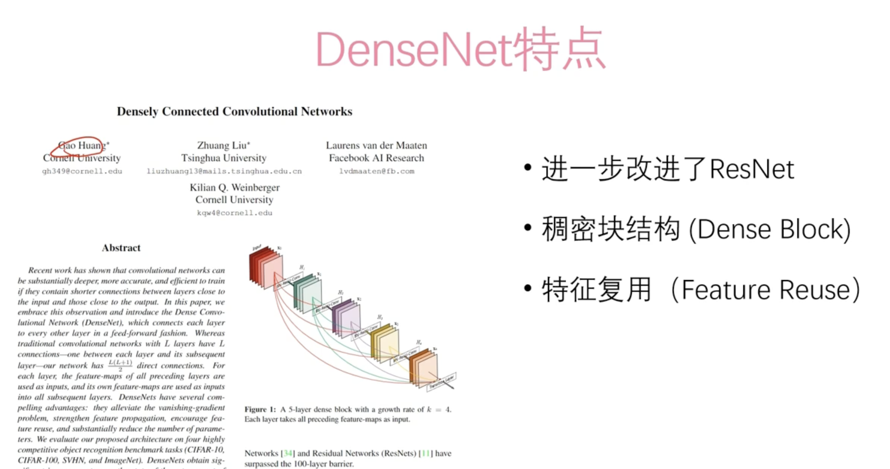
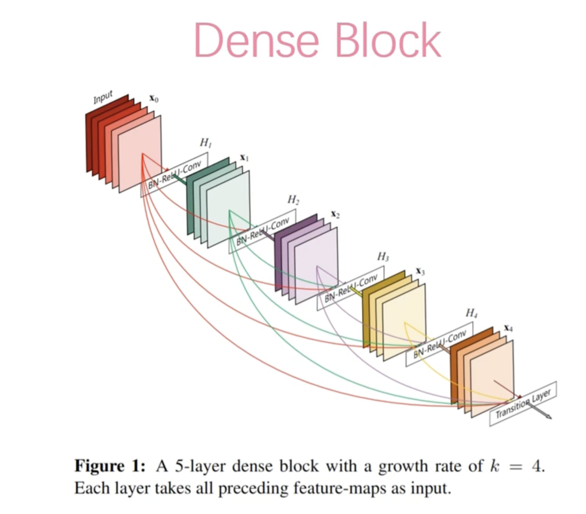
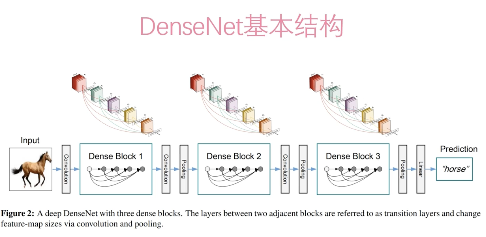

# DenseNet


DenseNet（密集连接网络）是一种深度学习架构，其主要特点是每个层连接到后面所有层，这种密集连接的结构有助于信息和梯度的流动，使得网络更容易训练，并且可以在较深的层次上获得更好的性能。DenseNet 适用于许多计算机视觉任务和其他领域，包括但不限于：

1. **图像分类**：DenseNet 在图像分类任务中表现出色，特别是当训练数据集较大时，其密集连接的结构有助于网络捕获更多的特征信息，从而提高分类准确率。
2. **目标检测**：密集连接的特性使得 DenseNet 在目标检测任务中表现良好，它可以作为骨干网络用于检测任务的特征提取，而且可以很好地应对各种尺度和形状的目标。
3. **语义分割**：DenseNet 也被广泛用于语义分割任务，如对图像中的每个像素进行分类。由于其密集连接的结构，DenseNet 在像素级别的分类任务中能够捕获更多的上下文信息，从而提高了分割的准确性。
4. **医学影像分析**：在医学图像分析领域，DenseNet 也被广泛应用于诸如肿瘤检测、病变分析等任务中，由于其在特征提取方面的优势，能够更好地辅助医生进行诊断。
5. **视频分类**：对于视频分类任务，DenseNet 也可以作为骨干网络，提取视频序列中的特征，从而实现对视频内容的分类。

总的来说，DenseNet 适用于需要处理复杂特征和大量数据的任务，并且在许多计算机视觉和医学图像分析等领域都取得了良好的效果。











## DenseNet与ResNet的异同

DenseNet（密集连接网络）和 ResNet（残差网络）是两种流行的深度学习架构，它们在网络设计和训练方式上有一些显著的异同点。

**相同点：**

1. **共享参数：** DenseNet 和 ResNet 都使用了跨层连接的方式，允许信息和梯度在网络中更容易地流动。这种设计使得网络的训练更加稳定，并且有助于解决梯度消失和梯度爆炸的问题。
2. **适用于深层网络：** 两者都被证明在构建深层网络时非常有效，能够训练非常深的神经网络，以获得更好的性能。

**不同点：**

1. **连接方式：**
   - **DenseNet：** 在 DenseNet 中，每个层都与后续所有层进行连接，这种称为密集连接的方式使得每个层都能够直接访问其前面层的输出。这种密集连接的结构有助于网络的信息传递和梯度传播，使得网络更容易训练，并且能够获得更好的性能。
   - **ResNet：** 在 ResNet 中，每个残差块包含了跨层的跳跃连接，将前一层的输出添加到后续层的输入中。这种跳跃连接使得网络能够学习残差信息，从而更容易地训练非常深的网络。
2. **网络参数量：**
   - **DenseNet：** 由于每一层都连接到后续所有层，因此 DenseNet 的参数量相对较大，导致 DenseNet 模型相对更大。
   - **ResNet：** 虽然 ResNet 也具有跨层连接，但是每个块中的连接是相对稀疏的，因此 ResNet 的参数量相对较少，模型规模相对较小。
3. **特征传递方式：**
   - **DenseNet：** 密集连接的方式允许网络在每一层中都可以访问到之前层的特征信息，这种特征的密集传递有助于网络学习到更加丰富的特征表示。
   - **ResNet：** ResNet 中的跳跃连接允许网络学习残差信息，即每个残差块的输出相对于输入的差异，这种残差信息有助于解决梯度消失问题，使得网络更易于训练。

综上所述，DenseNet 和 ResNet 在网络连接方式和参数量等方面存在差异，但都在构建深层网络和解决训练困难等方面取得了显著的成果。选择使用哪种架构取决于具体的任务需求和性能要求。


## Demo


```python
import torch
import torch.nn as nn
import torch.optim as optim
import torchvision
import torchvision.transforms as transforms
from torchvision.models import densenet121

# 定义数据转换
transform = transforms.Compose([
    transforms.ToTensor(), # 将图像转换为Tensor
    transforms.Normalize((0.5, 0.5, 0.5), (0.5, 0.5, 0.5)) # 标准化图像
])

# 下载并加载 CIFAR-10 数据集
trainset = torchvision.datasets.CIFAR10(root='./data', train=True, download=True, transform=transform)
trainloader = torch.utils.data.DataLoader(trainset, batch_size=64, shuffle=True)

# 定义 DenseNet 模型
class DenseNet(nn.Module):
    def __init__(self, num_classes):
        super(DenseNet, self).__init__()
        self.densenet = densenet121(pretrained=True) # 加载预训练的 DenseNet 模型
        num_ftrs = self.densenet.classifier.in_features # 获取全连接层的输入特征数
        self.densenet.classifier = nn.Linear(num_ftrs, num_classes) # 替换全连接层

    def forward(self, x):
        x = self.densenet(x)
        return x

# 初始化模型并移动到 GPU（如果可用）
device = torch.device("cuda:0" if torch.cuda.is_available() else "cpu")
num_classes = 10  # CIFAR-10 有 10 个类别
model = DenseNet(num_classes=num_classes).to(device)

# 定义损失函数和优化器
criterion = nn.CrossEntropyLoss()
optimizer = optim.SGD(model.parameters(), lr=0.001, momentum=0.9)

# 训练模型
for epoch in range(5):  # 循环多次遍历数据集
    running_loss = 0.0
    for i, data in enumerate(trainloader, 0):
        inputs, labels = data[0].to(device), data[1].to(device)

        # 梯度清零
        optimizer.zero_grad()

        # 前向传播 + 反向传播 + 优化
        outputs = model(inputs)
        loss = criterion(outputs, labels)
        loss.backward()
        optimizer.step()

        # 打印统计信息
        running_loss += loss.item()
        if i % 200 == 199:  # 每 200 个小批次打印一次
            print('[%d, %5d] loss: %.3f' %
                  (epoch + 1, i + 1, running_loss / 200))
            running_loss = 0.0

print('Finished Training')
```


在这个示例中：

1. 我们导入必要的库，包括 PyTorch 和 torchvision。
2. 我们定义了一个转换，用于对 CIFAR-10 数据集中的图像进行处理，并使用 DataLoader 加载数据集。
3. 我们定义了 DenseNet 模型类，将最后一个全连接层替换为输出 10 个类别（适用于 CIFAR-10）。
4. 我们初始化模型，并将其移动到 GPU（如果可用）。
5. 我们定义了损失函数（交叉熵损失）和优化器（SGD）。
6. 我们对模型进行了 5 轮的训练，并且每 200 个小批次打印一次损失。
