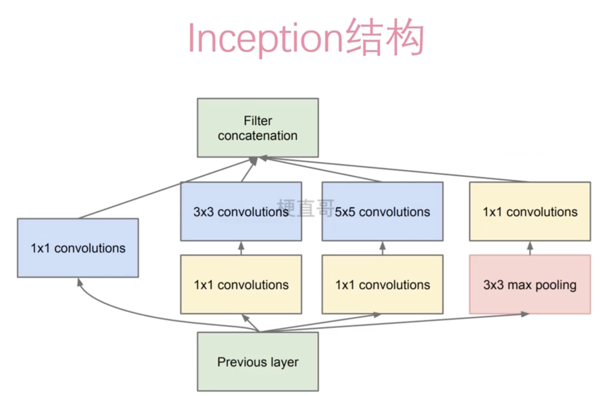

# GoogLeNet




该结构的核心思想是通过不同大小的卷积核和池化操作来并行提取图像特征，然后将这些特征串联在一起。这种结构旨在解决深度神经网络中参数数量过大的问题，并且在一定程度上提高了网络的性能。

一个典型的Inception模块可能包含以下几个组件：

1. **1x1卷积层（1x1 Convolution）**：用来降低输入数据的维度，并且引入非线性变换。
2. **3x3卷积层（3x3 Convolution）**：用来捕捉局部信息。
3. **5x5卷积层（5x5 Convolution）**：用来捕捉更大范围的特征。
4. **池化层（Pooling）**：用来降低特征图的空间维度，减少计算量。
5. **拼接层（Concatenation）**：将不同尺寸的特征图在通道维度上进行拼接。


## 适用场景


1. **图像分类（Image Classification）**：GoogleNet可以用于对图像进行分类，例如识别图像中的物体、动物、人物等。
2. **目标检测（Object Detection）**：由于GoogleNet具有较强的特征提取能力，可以作为目标检测任务的基础模型，例如检测图像中的物体位置和类别。
3. **语义分割（Semantic Segmentation）**：GoogleNet可以用于对图像进行像素级别的分类，将图像中的每个像素分配到相应的类别，例如分割图像中的不同物体或场景。
4. **图像特征提取（Feature Extraction）**：GoogleNet可以用作特征提取器，将图像转换为高维特征向量，然后可以用于其他机器学习任务，如图像检索、相似性匹配等。
5. **图像生成（Image Generation）**：GoogleNet的特征提取能力可以用于生成图像，例如通过对特征空间进行插值或优化来生成与给定图像特征相似的新图像。
6. **迁移学习（Transfer Learning）**：GoogleNet可以作为预训练模型，用于其他图像相关任务的迁移学习，通过在少量标注数据上微调模型，可以快速适应新任务。


## 代码


```python
import torch
import torch.nn as nn
import torch.nn.functional as F

# noinspection PyUnresolvedReferences

from torchsummary import summary   #torchsummary功能：查看网络层形状、参数

 

'''-------------------------第一步：定义基础卷积模块（卷积+ReLU+前向传播函数）--------'''
class BasicConv2d(nn.Module):
    # init()：进行初始化，申明模型中各层的定义
    def __init__(self, in_channels, out_channels, **kwargs):
        '''
        :param in_channels: 输入特征矩阵的深度
        :param out_channels:输出特征矩阵的深度
        :param kwargs:*args代表任何多个无名参数，返回的是元组；**kwargs表示关键字参数，所有传入的key=value，返回字典；
        '''
        super(BasicConv2d, self).__init__()#BasicConv2d()：卷积激活
        '''卷积层'''
        self.conv = nn.Conv2d(in_channels, out_channels, **kwargs)
        '''Relu层'''
        self.relu = nn.ReLU(inplace=True) # ReLU(inplace=True)：将tensor直接修改，不找变量做中间的传递，节省运算内存，不用多存储额外的变量
        '''前向传播函数'''
    def forward(self, x):
        x = self.conv(x)
        x = self.relu(x)
        return x


'''-------------------------第二步：定义Inception模块----------------------------'''
class Inception(nn.Module):
    def __init__(self, in_channels, ch1x1, ch3x3red, ch3x3, ch5x5red, ch5x5, pool_proj):
        super(Inception, self).__init__()

        '''branch1——单个1x1卷积层'''
        #使用1*1的卷积核，将(Hin,Win,in_channels)-> (Hin,Win,ch1x1)，特征图大小不变，主要改变的是通道数得到第一张特征图(Hin,Win,ch1x1)。
        self.branch1 = BasicConv2d(in_channels, ch1x1, kernel_size=1)
     
        '''branch2——1x1卷积层后接3x3卷积层'''
        #先使用1*1的卷积核，将(Hin,Win,in_channels)-> (Hin,Win,ch3x3red)，特征图大小不变，缩小通道数，减少计算量，然后在使用大小3*3填充1的卷积核，保持特征图大小不变，改变通道数为ch3x3，得到第二张特征图(Hin,Win,ch3x3)。
        self.branch2 = nn.Sequential(
            BasicConv2d(in_channels, ch3x3red, kernel_size=1),
            # 保证输出大小等于输入大小
            BasicConv2d(ch3x3red, ch3x3, kernel_size=3, padding=1)
        )
     
        '''branch3——1x1卷积层后接5x5卷积层'''
        #先使用1*1的卷积核，将(Hin,Win,in_channels)-> (Hin,Win,ch5x5red)，特征图大小不变，缩小通道数，减少计算量，然后在使用大小5*5填充2的卷积核，保持特征图大小不变，改变通道数为ch5x5，得到第三张特征图(Hin,Win,ch5x5)。
        self.branch3 = nn.Sequential(
            BasicConv2d(in_channels, ch5x5red, kernel_size=1),
            # 保证输出大小等于输入大小
            BasicConv2d(ch5x5red, ch5x5, kernel_size=5, padding=2)
        )
     
        '''branch4——3x3最大池化层后接1x1卷积层'''
        #先经过最大池化层，因为stride=1，特征图大小不变，然后在使用大小1*1的卷积核，保持特征图大小不变，改变通道数为pool_proj，得到第四张特征图(Hin,Win,pool_proj)。
        self.branch4 = nn.Sequential(
            nn.MaxPool2d(kernel_size=3, stride=1, padding=1),
            BasicConv2d(in_channels, pool_proj, kernel_size=1)
        )
     
    # forward()：定义前向传播过程,描述了各层之间的连接关系
    def forward(self, x):
        branch1 = self.branch1(x)
        branch2 = self.branch2(x)
        branch3 = self.branch3(x)
        branch4 = self.branch4(x)
     
        # 在通道维上拼接输出最终特征图。(Hin,Win,ch1x1+ch1x1+ch5x5+pool_proj)
        outputs = [branch1, branch2, branch3, branch4]
        # cat()：在给定维度上对输入的张量序列进行连接操作
        return torch.cat(outputs, 1)

 

'''---------------------第三步：定义辅助分类器InceptionAux----------------------'''
class InceptionAux(nn.Module):
    def __init__(self, in_channels, num_classes):
        super(InceptionAux, self).__init__()
        '''均值池化'''
        # nn.AvgPool2d(kernel_size=5, stride=3)：平均池化下采样。核大小为5x5，步长为3。
        self.averagePool = nn.AvgPool2d(kernel_size=5, stride=3)
        '''1×1卷积'''
        self.conv = BasicConv2d(in_channels, 128, kernel_size=1)
        '''全连接输出'''
        # nn.Linear(2048, 1024)、nn.Linear(1024, num_classes)：经过两个全连接层得到分类的一维向量。
        # 上一层output[batch, 128, 4, 4]，128X4X4=2048
        self.fc1 = nn.Linear(2048, 1024)
        self.fc2 = nn.Linear(1024, num_classes)

    # 前向传播过程：即如何根据输入x计算返回所需要的模型输出
    def forward(self, x):
        # 输入：aux1: N x 512 x 14 x 14, aux2: N x 528 x 14 x 14
        x = self.averagePool(x)
        # 输入：aux1: N x 512 x 4 x 4, aux2: N x 528 x 4 x 4
        x = self.conv(x)
        # 输入：N x 128 x 4 x 4
        x = torch.flatten(x, 1)#torch.flatten(x, 1)：从深度方向对特征矩阵进行推平处理，从三维降到二维。
        # 设置.train()时为训练模式，self.training=True
        x = F.dropout(x, 0.5, training=self.training)
        # 输入：N x 2048
        x = F.relu(self.fc1(x), inplace=True)
        x = F.dropout(x, 0.5, training=self.training)
        # 输入：N x 1024
        x = self.fc2(x)
        # 返回值：N*num_classes
        return x

 


'''-------------------------第四步：GoogLeNet网络----------------------'''
class GoogLeNet(nn.Module):

    def __init__(self, num_classes=2, aux_logits=True, init_weights=False):
        '''
        init()：进行初始化，申明模型中各层的定义
        :param num_classes: 需要分类的类别个数
        :param aux_logits: 训练过程是否使用辅助分类器，init_weights：是否对网络进行权重初始化
        :param init_weights:初始化权重
        '''
        super(GoogLeNet, self).__init__()

 

        # aux_logits: 是否使用辅助分类器（训练的时候为True, 验证的时候为False)
        self.aux_logits = aux_logits
     
        '''第一部分：一个卷积层＋一个最大池化层'''
        self.conv1 = BasicConv2d(3, 64, kernel_size=7, stride=2, padding=3)
        # 最大池化层类MaxPool2d（）参数含义：kernel_size ：表示做最大池化的窗口大小，stride ：步长， padding ：填充，dilation ：控制窗口中元素步幅，return_indices ：布尔类型，返回最大值位置索引，
        # ceil_mode ：布尔类型，为True，用向上取整的方法，计算输出形状；默认是向下取整。
        self.maxpool1 = nn.MaxPool2d(3, stride=2, ceil_mode=True)
     
        '''第二部分：两个卷积层＋一个最大池化层'''
        self.conv2 = BasicConv2d(64, 64, kernel_size=1)
        self.conv3 = BasicConv2d(64, 192, kernel_size=3, padding=1)
        self.maxpool2 = nn.MaxPool2d(3, stride=2, ceil_mode=True)

 

        '''第三部分：3a层和3b层＋最大池化层'''
        self.inception3a = Inception(192, 64, 96, 128, 16, 32, 32)
        '''
         # Inception(192, 64, 96, 128, 16, 32, 32)中参数分别代表输入深度为192的特征矩阵，
         第一层卷积核数量为64，输出深度64。
         第二层卷积核数量为96，输出深度96。
         第三层卷积核数量为128，输出深度128。
         第四层卷积核数量为16，输出深度16。
         第五层卷积核数量为32，输出深度32。
         第六层最大池化输出深度32不变。
        '''
        self.inception3b = Inception(256, 128, 128, 192, 32, 96, 64)
        self.maxpool3 = nn.MaxPool2d(3, stride=2, ceil_mode=True)
     
        '''第四部分：4a层、4b层、4c层、4d层、4e层＋最大池化层'''
        self.inception4a = Inception(480, 192, 96, 208, 16, 48, 64)
        self.inception4b = Inception(512, 160, 112, 224, 24, 64, 64)
        self.inception4c = Inception(512, 128, 128, 256, 24, 64, 64)
        self.inception4d = Inception(512, 112, 144, 288, 32, 64, 64)
        self.inception4e = Inception(528, 256, 160, 320, 32, 128, 128)
        self.maxpool4 = nn.MaxPool2d(3, stride=2, ceil_mode=True)
     
        '''第五部分：5a层和5b层'''
        self.inception5a = Inception(832, 256, 160, 320, 32, 128, 128)
        self.inception5b = Inception(832, 384, 192, 384, 48, 128, 128)
     
        # 如果为真，则使用辅助分类器
        if self.aux_logits:
           self.aux1 = InceptionAux(512, num_classes)  # aux1传入的深度是来自于inception4a的输出深度，所以为512.即为4a提供分类服务
           self.aux2 = InceptionAux(528, num_classes)  # aux2传入的深度是来自于inception4d的输出深度，所以为528.即为4d提供分类服务
     
        '''均值池化 '''
        # AdaptiveAvgPool2d：自适应平均池化，指定输出（H，W）
        self.avgpool = nn.AdaptiveAvgPool2d((1, 1))
        self.dropout = nn.Dropout(0.4)
        '''全连接输出 '''
        self.fc = nn.Linear(1024, num_classes)
        # 如果为真，则对网络参数进行初始化
        if init_weights:
            self._initialize_weights()
     
    # forward()：定义前向传播过程,描述了各层之间的连接关系
    def forward(self, x):
        # N x 3 x 224 x 224
        x = self.conv1(x)
        # N x 64 x 112 x 112
        x = self.maxpool1(x)
        # N x 64 x 56 x 56
        x = self.conv2(x)
        # N x 64 x 56 x 56
        x = self.conv3(x)
        # N x 192 x 56 x 56
        x = self.maxpool2(x)
     
        # N x 192 x 28 x 28
        x = self.inception3a(x)
        # N x 256 x 28 x 28
        x = self.inception3b(x)
        # N x 480 x 28 x 28
        x = self.maxpool3(x)
        # N x 480 x 14 x 14
     
        '''在4a层和4b层、4d和4e层之间会有一个判断：如果使用辅助分类器会调用辅助分类器aux1并返回一个分类结果'''
        x = self.inception4a(x)
        # N x 512 x 14 x 14
        # 设置.train()时为训练模式，self.training=True
        if self.training and self.aux_logits:
            aux1 = self.aux1(x)
     
        x = self.inception4b(x)
        # N x 512 x 14 x 14
        x = self.inception4c(x)
        # N x 512 x 14 x 14
        x = self.inception4d(x)
        # N x 528 x 14 x 14
        if self.training and self.aux_logits:
            aux2 = self.aux2(x)
     
        x = self.inception4e(x)
        # N x 832 x 14 x 14
        x = self.maxpool4(x)
        # N x 832 x 7 x 7
        x = self.inception5a(x)
        # N x 832 x 7 x 7
        x = self.inception5b(x)
        # N x 1024 x 7 x 7
     
        '''最终分类部分'''
        '''由平均池化层+dropout+全连接层输出x，
        如果使用到辅助分类器就输出x, aux2, aux1。
        其中采用了平均池化层来代替全连接层,事实证明这样可以提高准确率0.6%。
        最后还是加了一个全连接层，主要是为了方便对输出进行灵活调整。'''
        x = self.avgpool(x)
        # N x 1024 x 1 x 1
        x = torch.flatten(x, 1)
        # N x 1024
        x = self.dropout(x)
        x = self.fc(x)
     
        '''最后在全连接层之后还会有一个判断：判断模型若处于训练状态并且调用辅助分类器则返回3个结果：主分类结果，分类器1和分类器2生成的分类结果。'''
        # N x 1000 (num_classes)
        if self.training and self.aux_logits:
            return x, aux2, aux1
        return x

 

    '''-------------------------------网络结构参数初始化---------------------------'''
    #目的：使网络更好收敛，准确率更高
    def _initialize_weights(self):# 将各种初始化方法定义为一个initialize_weights()的函数并在模型初始后进行使用。
     
        # 遍历网络中的每一层
        for m in self.modules():
            # isinstance(object, type)，如果指定的对象拥有指定的类型，则isinstance()函数返回True
     
            '''如果是卷积层Conv2d'''
            if isinstance(m, nn.Conv2d):
                # Kaiming正态分布方式的权重初始化
                nn.init.kaiming_normal_(m.weight, mode='fan_out', nonlinearity='relu')
     
                '''判断是否有偏置：'''
                # 如果偏置不是0，将偏置置成0，对偏置进行初始化
                if m.bias is not None:
                    # torch.nn.init.constant_(tensor, val)，初始化整个矩阵为常数val
                    nn.init.constant_(m.bias, 0)
     
                '''如果是全连接层'''
            elif isinstance(m, nn.Linear):
                # init.normal_(tensor, mean=0.0, std=1.0)，使用从正态分布中提取的值填充输入张量
                # 参数：tensor：一个n维Tensor，mean：正态分布的平均值，std：正态分布的标准差
                nn.init.normal_(m.weight, 0, 0.01)
                nn.init.constant_(m.bias, 0)


if __name__ == '__main__':

    # 随机输入，测试网络结构是否通

​    net = GoogLeNet(num_classes=2).cuda()
​    summary(net, (3, 224, 224))
```

