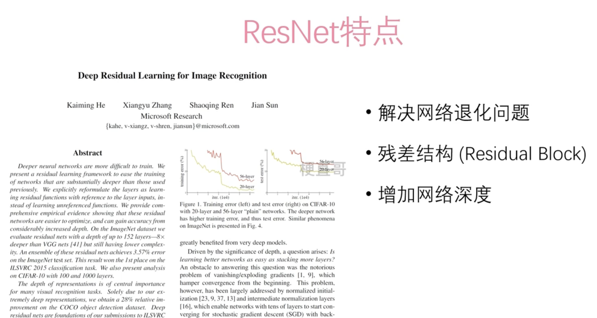

# ResNet 

ResNet（Residual Networks）是由微软研究院提出的深度卷积神经网络结构，旨在解决深度神经网络训练过程中的梯度消失和训练时间增加等问题。它通过引入残差块（Residual Block）来构建非常深的网络，允许网络学习恒等映射（identity mapping），从而更有效地训练深层网络。

ResNet的核心思想是利用残差学习（residual learning），即通过添加跨层的连接（shortcut connection）来将前后相邻的层的输出进行相加，从而使得网络可以直接学习残差（residual），而不是原始的映射。这样的设计可以使得网络更加容易优化，因为即使在网络很深的情况下，梯度仍然可以通过这些跨层连接直接传播。

**网络中的亮点：**

- 超深的网络结构（突破1000层）
- 提出**residual模块（主分支和shortcut分支的输出特征矩阵shape必须相同）**
- 使用**Batch Normalization**加速训练（丢弃Dropout。**Batch Normalization和Dropout不能同时存在**）

$$
H(x) = F(x) + x
$$

## ResNet版本

1. **ResNet-18**：ResNet-18是较轻量级的ResNet版本，由4个残差块组成，每个残差块包含两个卷积层。它通常用于需要较小模型的任务或者作为基准模型进行快速测试。
2. **ResNet-34**：ResNet-34是稍深一点的ResNet版本，由4个阶段组成，每个阶段包含多个残差块。它比ResNet-18更深，但相对于更深层次的ResNet模型，计算资源消耗较少。
3. **ResNet-50、ResNet-101、ResNet-152**：这些版本是较深的ResNet模型，分别由50、101和152个卷积层组成。它们采用了更多的残差块和更深的网络结构，在更复杂的任务上通常表现更好。
4. **ResNeXt**：ResNeXt是ResNet的扩展版本，引入了“组卷积（group convolution）”的概念，通过增加通道的维度来提高网络的表现。
5. **Wide ResNet**：Wide ResNet通过增加每个残差块中的卷积层数量（即增加通道数）来提高网络的宽度，从而增加模型的容量和表达能力。
6. **ResNet with Bottleneck**：这是一种改进的ResNet结构，通过引入瓶颈层（bottleneck layer），即使用1x1、3x3、1x1的卷积层序列来减少参数数量，同时保持网络的表达能力。

### ResNet 和 Vgg 对比

