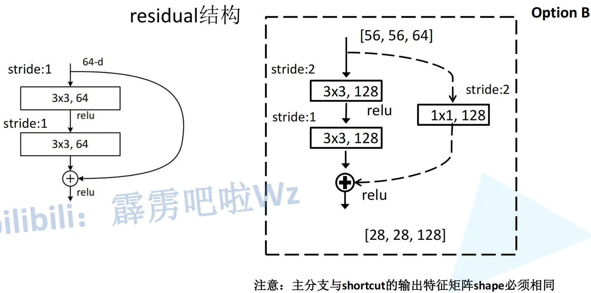
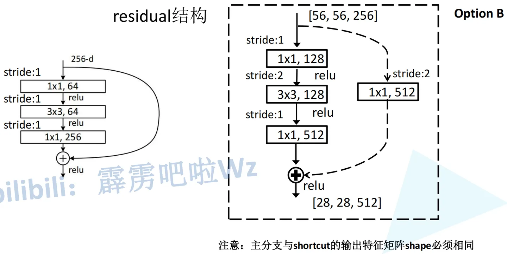
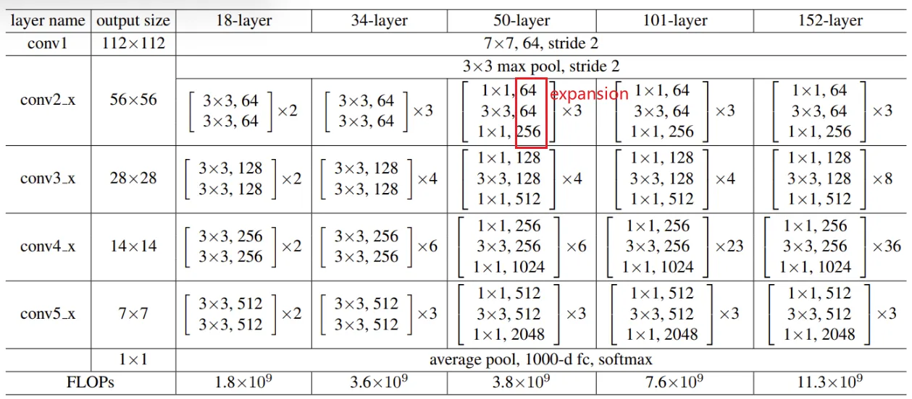
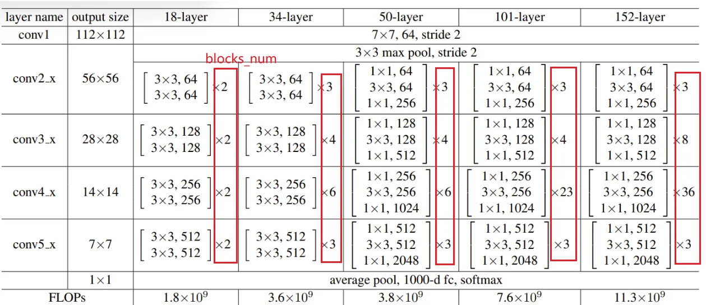
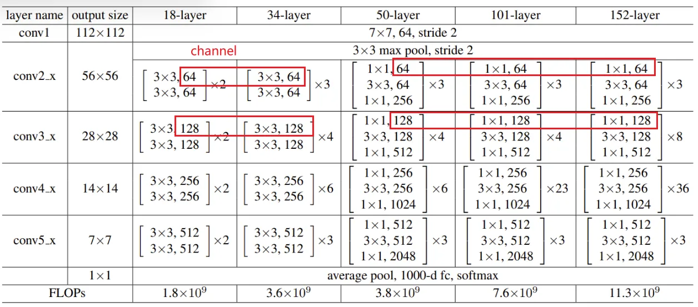

```python
参考：https://zhuanlan.zhihu.com/p/589762877
```

ResNet 使用 BasicBlock 和 Bottleneck 两种不同的残差块（Residual Block）结构，这是为了在不同的网络深度下保持模型的性能和效率。

1. **BasicBlock**：
   - BasicBlock 是 ResNet 中的标准残差块，它由两个 3x3 的卷积层组成，每个卷积层后面跟着一个批标准化层和 ReLU 激活函数。
   - BasicBlock 的优点是参数较少，计算量相对较小，适用于较浅的网络或者需要较少参数的情况下。
   - BasicBlock 在浅层网络中表现良好，因为它的结构相对简单，可以避免过拟合，并且具有较好的特征提取能力。
2. **Bottleneck**：
   - Bottleneck 是 ResNet 中的高效残差块，它由一个 1x1、一个 3x3 和一个 1x1 的卷积层组成，中间的 3x3 卷积层有较大的输出通道数。
   - Bottleneck 的设计是为了在深层网络中减少参数量和计算量，同时保持性能。通过使用 1x1 卷积来降低输入通道数和输出通道数，可以减少参数量；通过使用较小的 3x3 卷积来提取特征，可以增加网络的感受野和非线性表达能力。
   - Bottleneck 的设计使得 ResNet 能够在更深的网络中获得更好的性能和更快的收敛速度。特别是在 ImageNet 等大规模数据集上，Bottleneck 结构能够更有效地提取和表示图像特征。

综合来看，BasicBlock 适用于浅层网络或者需要较少参数的情况，而 Bottleneck 更适用于深层网络，能够在保持性能的同时减少参数量和计算量，提高网络的效率和性能。通过根据网络深度和任务需求选择不同的残差块结构，ResNet 能够在不同的场景下发挥最佳性能。


```python
import torch.nn as nn
import torch
from torchinfo import summary
```

**（1）定义残差结构：**18/34 和 50/101/152 残差结构是不一样的

- conv3_x、conv4_x、conv5_x残差结构的第一层对应的都是虚线残差结构
- **stride=1**对应**实线**残差结构，此时卷积处理不会改变图像的高和宽
- **stride=2**对应**虚线**残差结构，此时高和宽会缩减为原来的一半




```python
# ResNet-18/34 残差结构 BasicBlock
class BasicBlock(nn.Module):
    expansion = 1   # 残差结构中主分支所采用的卷积核的个数是否发生变化。对于浅层网络，每个残差结构的第一层和第二层卷积核个数一样，故是1

    # 定义初始函数
    # in_channel输入特征矩阵深度，out_channel输出特征矩阵深度（即主分支卷积核个数）
    def __init__(self, in_channel, out_channel, stride=1, downsample=None):   # downsample对应虚线残差结构捷径中的1×1卷积
        super(BasicBlock, self).__init__()
        self.conv1 = nn.Conv2d(in_channels=in_channel, out_channels=out_channel,
                               kernel_size=3, stride=stride, padding=1, bias=False)  # 使用bn层时不使用bias
        self.bn1 = nn.BatchNorm2d(out_channel)
        self.relu = nn.ReLU()
        self.conv2 = nn.Conv2d(in_channels=out_channel, out_channels=out_channel,
                               kernel_size=3, stride=1, padding=1, bias=False)  # 实/虚线残差结构主分支中第二层stride都为1
        self.bn2 = nn.BatchNorm2d(out_channel)
        self.downsample = downsample   # 默认是None

# 定义正向传播过程
    def forward(self, x):
        identity = x   # 捷径分支的输出值
        if self.downsample is not None:   # 对应虚线残差结构
            identity = self.downsample(x)

        out = self.conv1(x)
        out = self.bn1(out)
        out = self.relu(out)

        out = self.conv2(out)
        out = self.bn2(out)   # 这里不经过relu激活函数

        out += identity
        out = self.relu(out)

        return out
```

`expansion` 是 ResNet 中一个用于控制通道数的参数。在 ResNet 中，每个残差块（Residual Block）中的通道数会发生变化。这是因为在残差块中，如果输入和输出的通道数不一致，需要进行通道数的调整，以便将输入和输出相加。在标准的 BasicBlock 中，`expansion` 的默认值为 1，意味着输入和输出的通道数保持一致。但在某些情况下，特别是在更深的 ResNet 中，为了增加网络的非线性度，可能会选择使输入和输出的通道数不一致，这时就需要调整 `expansion` 的值。





```python
# ResNet-50/101/152 残差结构 Bottleneck
class Bottleneck(nn.Module):
    """
    注意：原论文中，在虚线残差结构的主分支上，第一个1x1卷积层的步距是2，第二个3x3卷积层步距是1。
    但在pytorch官方实现过程中是第一个1x1卷积层的步距是1，第二个3x3卷积层步距是2，
    这么做的好处是能够在top1上提升大概0.5%的准确率。
    可参考Resnet v1.5 https://ngc.nvidia.com/catalog/model-scripts/nvidia:resnet_50_v1_5_for_pytorch
    """
    expansion = 4    # 第三层的卷积核个数是第一层、第二层的四倍

    def __init__(self, in_channel, out_channel, stride=1, downsample=None):
        super(Bottleneck, self).__init__()

        self.conv1 = nn.Conv2d(in_channels=in_channel, out_channels=out_channel,   # out_channels是第一、二层的卷积核个数
                               kernel_size=1, stride=1, bias=False)  # squeeze channels  高和宽不变
        self.bn1 = nn.BatchNorm2d(out_channel)
        # -----------------------------------------
        self.conv2 = nn.Conv2d(in_channels=out_channel, out_channels=out_channel,
                               kernel_size=3, stride=stride, bias=False, padding=1)   # 实线stride为1，虚线stride为2
        self.bn2 = nn.BatchNorm2d(out_channel)
        # -----------------------------------------
        self.conv3 = nn.Conv2d(in_channels=out_channel, out_channels=out_channel*self.expansion,    # 卷积核个数为4倍
                               kernel_size=1, stride=1, bias=False)  # unsqueeze channels
        self.bn3 = nn.BatchNorm2d(out_channel*self.expansion)
        self.relu = nn.ReLU(inplace=True)
        self.downsample = downsample

# 正向传播过程
    def forward(self, x):
        identity = x
        if self.downsample is not None:   # 对应虚线残差结构
            identity = self.downsample(x)

        out = self.conv1(x)
        out = self.bn1(out)
        out = self.relu(out)

        out = self.conv2(out)
        out = self.bn2(out)
        out = self.relu(out)

        out = self.conv3(out)
        out = self.bn3(out)

        out += identity
        out = self.relu(out)

        return out
```

**expansion参数的含义：**残差结构中主分支的卷积核个数有没有发生变化

- 对于**浅层**来说，每个残差结构的第一层和第二层卷积核个数是一样的，故=1
- 对于**深层**来说，残差结构主分支上的三个卷积层所采用的卷积核个数不同，第一层、第二层一样，第三层是它们的四倍，故=4



**downsample参数的含义：**下采样参数，默认为None。对应虚线残差结构中，捷径的1×1的卷积层

- 对于conv3/4/5_x所对应的一系列残差结构中，第一层都是虚线残差结构，因为每一层的第一个残差结构有一个降维的作用


**（2）定义ResNet网络框架**

- 对于**浅层**18和34 layer，**conv2_x第一层为实线残差结构**；而对于**深层**50/101/152 layer，**conv2_x第一层为虚线残差结构**（仅调整深度，不调整高度和宽度，故stride=1，1×1卷积）
- 无论浅层or深层网络，conv3/4/5_x第一层都为虚线残差结构（既调整深度，也需将高度和宽度缩减为原来的一半，故stride=2，1×1卷积）
- 无论浅层or深层网络，conv2/3/4/5_x**从第二层开始**，全部都是实线残差结构。


```python
# ResNet整个网络的框架部分
class ResNet(nn.Module):

    def __init__(self,
                 block,   # 残差结构，Basicblock or Bottleneck
                 blocks_num,   # 列表参数，所使用残差结构的数目，如对ResNet-34来说即是[3,4,6,3]
                 num_classes=1000,   # 训练集的分类个数
                 include_top=True):   # 为了能在ResNet网络基础上搭建更加复杂的网络，默认为True
        super(ResNet, self).__init__()
        self.include_top = include_top   # 传入类变量

        self.in_channel = 64   # 通过max pooling之后所得到的特征矩阵的深度

        self.conv1 = nn.Conv2d(3, self.in_channel, kernel_size=7, stride=2,
                               padding=3, bias=False)   # 输入特征矩阵的深度为3（RGB图像），高和宽缩减为原来的一半
        self.bn1 = nn.BatchNorm2d(self.in_channel)
        self.relu = nn.ReLU(inplace=True)

        self.maxpool = nn.MaxPool2d(kernel_size=3, stride=2, padding=1)   # 高和宽缩减为原来的一半

        self.layer1 = self._make_layer(block, 64, blocks_num[0])   # 对应conv2_x
        self.layer2 = self._make_layer(block, 128, blocks_num[1], stride=2)   # 对应conv3_x
        self.layer3 = self._make_layer(block, 256, blocks_num[2], stride=2)   # 对应conv4_x
        self.layer4 = self._make_layer(block, 512, blocks_num[3], stride=2)   # 对应conv5_x

        if self.include_top:   # 默认为True
            # 无论输入特征矩阵的高和宽是多少，通过自适应平均池化下采样层，所得到的高和宽都是1
            self.avgpool = nn.AdaptiveAvgPool2d((1, 1))  # output size = (1, 1)
            self.fc = nn.Linear(512 * block.expansion, num_classes)   # num_classes为分类类别数

        for m in self.modules():   # 卷积层的初始化操作
            if isinstance(m, nn.Conv2d):
                nn.init.kaiming_normal_(m.weight, mode='fan_out', nonlinearity='relu')

    def _make_layer(self, block, channel, block_num, stride=1):   # stride默认为1
        # block即BasicBlock/Bottleneck
        # channel即残差结构中第一层卷积层所使用的卷积核的个数
        # block_num即该层一共包含了多少层残差结构
        downsample = None

        # 左：输出的高和宽相较于输入会缩小；右：输入channel数与输出channel数不相等
        # 两者都会使x和identity无法相加
        if stride != 1 or self.in_channel != channel * block.expansion:  # ResNet-18/34会直接跳过该if语句（对于layer1来说）
            # 对于ResNet-50/101/152：
            # conv2_x第一层也是虚线残差结构，但只调整特征矩阵深度，高宽不需调整
            # conv3/4/5_x第一层需要调整特征矩阵深度，且把高和宽缩减为原来的一半
            downsample = nn.Sequential(       # 下采样
                nn.Conv2d(self.in_channel, channel * block.expansion, kernel_size=1, stride=stride, bias=False),
                nn.BatchNorm2d(channel * block.expansion))   # 将特征矩阵的深度翻4倍，高和宽不变（对于layer1来说）

        layers = []
        layers.append(block(self.in_channel,  # 输入特征矩阵深度，64
                            channel,  # 残差结构所对应主分支上的第一个卷积层的卷积核个数
                            downsample=downsample,
                            stride=stride))
        self.in_channel = channel * block.expansion

        for _ in range(1, block_num):   # 从第二层开始都是实线残差结构
            layers.append(block(self.in_channel,  # 对于浅层一直是64，对于深层已经是64*4=256了
                                channel))  # 残差结构主分支上的第一层卷积的卷积核个数
        
        # 通过非关键字参数的形式传入nn.Sequential
        return nn.Sequential(*layers)   # *加list或tuple，可以将其转换成非关键字参数，将刚刚所定义的一切层结构组合在一起并返回

# 正向传播过程
    def forward(self, x):
        x = self.conv1(x)   # 7×7卷积层
        x = self.bn1(x)
        x = self.relu(x)
        x = self.maxpool(x)    # 3×3 max pool

        x = self.layer1(x)   # conv2_x所对应的一系列残差结构
        x = self.layer2(x)   # conv3_x所对应的一系列残差结构
        x = self.layer3(x)   # conv4_x所对应的一系列残差结构
        x = self.layer4(x)   # conv5_x所对应的一系列残差结构

        if self.include_top:
            x = self.avgpool(x)    # 平均池化下采样
            x = torch.flatten(x, 1)    
            x = self.fc(x)

        return x
```


在使用预训练的 ResNet 模型时，`include_top` 参数用于控制是否包含顶部的全连接层。这里的顶部全连接层通常用于执行特定任务，例如分类。

具体来说，当 `include_top=True` 时，模型会包含预定义的顶部全连接层。这通常是在对模型进行分类任务训练或者进行预测时所需要的。这些顶部全连接层会接受来自于 ResNet 特征提取部分的特征，并将其映射到相应的输出类别上。

而当 `include_top=False` 时，模型将不包含预定义的顶部全连接层。这通常用于特征提取的场景，即只需要利用 ResNet 的卷积部分提取特征，而不需要进行分类。这种情况下，可以在卷积部分后面添加自定义的全连接层，以适应特定的任务需求。

总之，`include_top` 参数允许在使用预训练的 ResNet 模型时根据任务的需求选择是否包含顶部的全连接层。


**blocks_num参数的含义：**列表



**channel参数的含义**：第一层卷积核个数30



**Q:为什么第一层的kernel size是7？**

在 ResNet 中，第一个卷积层通常使用较大的卷积核（kernel）大小来处理输入图像，这是为了在初始阶段增加对输入图像的局部信息的捕获范围。

在 ResNet 中，第一个卷积层的设计考虑到了以下几个方面：

1. **捕获更大范围的空间信息**：由于 ResNet 主要用于处理图像数据，使用较大的卷积核可以捕获更大范围的空间信息。这有助于提取图像中的全局特征，例如对象的整体形状和结构。
2. **减少尺寸下采样次数**：通过使用较大的卷积核，可以减少卷积层之间的下采样次数，从而在网络的初始阶段保留更多的空间信息。这有助于减轻信息丢失和梯度消失的问题，并且有助于提高网络的稳定性和性能。
3. **减少参数量和计算量**：尽管使用较大的卷积核会增加卷积层的参数量，但由于这个卷积层通常是网络的第一层，因此可以接受较高的参数量。此外，通过使用较大的卷积核，可以减少网络后续层的参数量，从而降低整个网络的复杂度。

因此，在 ResNet 中，通常将第一个卷积层的卷积核大小设置为较大的值，例如 kernel_size=7，以便更好地处理输入图像并提取全局特征。


```python
def resnet34(num_classes=1000, include_top=True):
    # https://download.pytorch.org/models/resnet34-333f7ec4.pth
    return ResNet(BasicBlock, [3, 4, 6, 3], num_classes=num_classes, include_top=include_top)


def resnet50(num_classes=1000, include_top=True):
    # https://download.pytorch.org/models/resnet50-19c8e357.pth
    return ResNet(Bottleneck, [3, 4, 6, 3], num_classes=num_classes, include_top=include_top)


def resnet101(num_classes=1000, include_top=True):
    # https://download.pytorch.org/models/resnet101-5d3b4d8f.pth
    return ResNet(Bottleneck, [3, 4, 23, 3], num_classes=num_classes, include_top=include_top)
```


```python
summary(resnet34(),input_size=(1,3,224,224))
```


    ==========================================================================================
    Layer (type:depth-idx)                   Output Shape              Param #
    ==========================================================================================
    ResNet                                   [1, 1000]                 --
    ├─Conv2d: 1-1                            [1, 64, 112, 112]         9,408
    ├─BatchNorm2d: 1-2                       [1, 64, 112, 112]         128
    ├─ReLU: 1-3                              [1, 64, 112, 112]         --
    ├─MaxPool2d: 1-4                         [1, 64, 56, 56]           --
    ├─Sequential: 1-5                        [1, 64, 56, 56]           --
    │    └─BasicBlock: 2-1                   [1, 64, 56, 56]           --
    │    │    └─Conv2d: 3-1                  [1, 64, 56, 56]           36,864
    │    │    └─BatchNorm2d: 3-2             [1, 64, 56, 56]           128
    │    │    └─ReLU: 3-3                    [1, 64, 56, 56]           --
    │    │    └─Conv2d: 3-4                  [1, 64, 56, 56]           36,864
    │    │    └─BatchNorm2d: 3-5             [1, 64, 56, 56]           128
    │    │    └─ReLU: 3-6                    [1, 64, 56, 56]           --
    │    └─BasicBlock: 2-2                   [1, 64, 56, 56]           --
    │    │    └─Conv2d: 3-7                  [1, 64, 56, 56]           36,864
    │    │    └─BatchNorm2d: 3-8             [1, 64, 56, 56]           128
    │    │    └─ReLU: 3-9                    [1, 64, 56, 56]           --
    │    │    └─Conv2d: 3-10                 [1, 64, 56, 56]           36,864
    │    │    └─BatchNorm2d: 3-11            [1, 64, 56, 56]           128
    │    │    └─ReLU: 3-12                   [1, 64, 56, 56]           --
    │    └─BasicBlock: 2-3                   [1, 64, 56, 56]           --
    │    │    └─Conv2d: 3-13                 [1, 64, 56, 56]           36,864
    │    │    └─BatchNorm2d: 3-14            [1, 64, 56, 56]           128
    │    │    └─ReLU: 3-15                   [1, 64, 56, 56]           --
    │    │    └─Conv2d: 3-16                 [1, 64, 56, 56]           36,864
    │    │    └─BatchNorm2d: 3-17            [1, 64, 56, 56]           128
    │    │    └─ReLU: 3-18                   [1, 64, 56, 56]           --
    ├─Sequential: 1-6                        [1, 128, 28, 28]          --
    │    └─BasicBlock: 2-4                   [1, 128, 28, 28]          --
    │    │    └─Sequential: 3-19             [1, 128, 28, 28]          8,448
    │    │    └─Conv2d: 3-20                 [1, 128, 28, 28]          73,728
    │    │    └─BatchNorm2d: 3-21            [1, 128, 28, 28]          256
    │    │    └─ReLU: 3-22                   [1, 128, 28, 28]          --
    │    │    └─Conv2d: 3-23                 [1, 128, 28, 28]          147,456
    │    │    └─BatchNorm2d: 3-24            [1, 128, 28, 28]          256
    │    │    └─ReLU: 3-25                   [1, 128, 28, 28]          --
    │    └─BasicBlock: 2-5                   [1, 128, 28, 28]          --
    │    │    └─Conv2d: 3-26                 [1, 128, 28, 28]          147,456
    │    │    └─BatchNorm2d: 3-27            [1, 128, 28, 28]          256
    │    │    └─ReLU: 3-28                   [1, 128, 28, 28]          --
    │    │    └─Conv2d: 3-29                 [1, 128, 28, 28]          147,456
    │    │    └─BatchNorm2d: 3-30            [1, 128, 28, 28]          256
    │    │    └─ReLU: 3-31                   [1, 128, 28, 28]          --
    │    └─BasicBlock: 2-6                   [1, 128, 28, 28]          --
    │    │    └─Conv2d: 3-32                 [1, 128, 28, 28]          147,456
    │    │    └─BatchNorm2d: 3-33            [1, 128, 28, 28]          256
    │    │    └─ReLU: 3-34                   [1, 128, 28, 28]          --
    │    │    └─Conv2d: 3-35                 [1, 128, 28, 28]          147,456
    │    │    └─BatchNorm2d: 3-36            [1, 128, 28, 28]          256
    │    │    └─ReLU: 3-37                   [1, 128, 28, 28]          --
    │    └─BasicBlock: 2-7                   [1, 128, 28, 28]          --
    │    │    └─Conv2d: 3-38                 [1, 128, 28, 28]          147,456
    │    │    └─BatchNorm2d: 3-39            [1, 128, 28, 28]          256
    │    │    └─ReLU: 3-40                   [1, 128, 28, 28]          --
    │    │    └─Conv2d: 3-41                 [1, 128, 28, 28]          147,456
    │    │    └─BatchNorm2d: 3-42            [1, 128, 28, 28]          256
    │    │    └─ReLU: 3-43                   [1, 128, 28, 28]          --
    ├─Sequential: 1-7                        [1, 256, 14, 14]          --
    │    └─BasicBlock: 2-8                   [1, 256, 14, 14]          --
    │    │    └─Sequential: 3-44             [1, 256, 14, 14]          33,280
    │    │    └─Conv2d: 3-45                 [1, 256, 14, 14]          294,912
    │    │    └─BatchNorm2d: 3-46            [1, 256, 14, 14]          512
    │    │    └─ReLU: 3-47                   [1, 256, 14, 14]          --
    │    │    └─Conv2d: 3-48                 [1, 256, 14, 14]          589,824
    │    │    └─BatchNorm2d: 3-49            [1, 256, 14, 14]          512
    │    │    └─ReLU: 3-50                   [1, 256, 14, 14]          --
    │    └─BasicBlock: 2-9                   [1, 256, 14, 14]          --
    │    │    └─Conv2d: 3-51                 [1, 256, 14, 14]          589,824
    │    │    └─BatchNorm2d: 3-52            [1, 256, 14, 14]          512
    │    │    └─ReLU: 3-53                   [1, 256, 14, 14]          --
    │    │    └─Conv2d: 3-54                 [1, 256, 14, 14]          589,824
    │    │    └─BatchNorm2d: 3-55            [1, 256, 14, 14]          512
    │    │    └─ReLU: 3-56                   [1, 256, 14, 14]          --
    │    └─BasicBlock: 2-10                  [1, 256, 14, 14]          --
    │    │    └─Conv2d: 3-57                 [1, 256, 14, 14]          589,824
    │    │    └─BatchNorm2d: 3-58            [1, 256, 14, 14]          512
    │    │    └─ReLU: 3-59                   [1, 256, 14, 14]          --
    │    │    └─Conv2d: 3-60                 [1, 256, 14, 14]          589,824
    │    │    └─BatchNorm2d: 3-61            [1, 256, 14, 14]          512
    │    │    └─ReLU: 3-62                   [1, 256, 14, 14]          --
    │    └─BasicBlock: 2-11                  [1, 256, 14, 14]          --
    │    │    └─Conv2d: 3-63                 [1, 256, 14, 14]          589,824
    │    │    └─BatchNorm2d: 3-64            [1, 256, 14, 14]          512
    │    │    └─ReLU: 3-65                   [1, 256, 14, 14]          --
    │    │    └─Conv2d: 3-66                 [1, 256, 14, 14]          589,824
    │    │    └─BatchNorm2d: 3-67            [1, 256, 14, 14]          512
    │    │    └─ReLU: 3-68                   [1, 256, 14, 14]          --
    │    └─BasicBlock: 2-12                  [1, 256, 14, 14]          --
    │    │    └─Conv2d: 3-69                 [1, 256, 14, 14]          589,824
    │    │    └─BatchNorm2d: 3-70            [1, 256, 14, 14]          512
    │    │    └─ReLU: 3-71                   [1, 256, 14, 14]          --
    │    │    └─Conv2d: 3-72                 [1, 256, 14, 14]          589,824
    │    │    └─BatchNorm2d: 3-73            [1, 256, 14, 14]          512
    │    │    └─ReLU: 3-74                   [1, 256, 14, 14]          --
    │    └─BasicBlock: 2-13                  [1, 256, 14, 14]          --
    │    │    └─Conv2d: 3-75                 [1, 256, 14, 14]          589,824
    │    │    └─BatchNorm2d: 3-76            [1, 256, 14, 14]          512
    │    │    └─ReLU: 3-77                   [1, 256, 14, 14]          --
    │    │    └─Conv2d: 3-78                 [1, 256, 14, 14]          589,824
    │    │    └─BatchNorm2d: 3-79            [1, 256, 14, 14]          512
    │    │    └─ReLU: 3-80                   [1, 256, 14, 14]          --
    ├─Sequential: 1-8                        [1, 512, 7, 7]            --
    │    └─BasicBlock: 2-14                  [1, 512, 7, 7]            --
    │    │    └─Sequential: 3-81             [1, 512, 7, 7]            132,096
    │    │    └─Conv2d: 3-82                 [1, 512, 7, 7]            1,179,648
    │    │    └─BatchNorm2d: 3-83            [1, 512, 7, 7]            1,024
    │    │    └─ReLU: 3-84                   [1, 512, 7, 7]            --
    │    │    └─Conv2d: 3-85                 [1, 512, 7, 7]            2,359,296
    │    │    └─BatchNorm2d: 3-86            [1, 512, 7, 7]            1,024
    │    │    └─ReLU: 3-87                   [1, 512, 7, 7]            --
    │    └─BasicBlock: 2-15                  [1, 512, 7, 7]            --
    │    │    └─Conv2d: 3-88                 [1, 512, 7, 7]            2,359,296
    │    │    └─BatchNorm2d: 3-89            [1, 512, 7, 7]            1,024
    │    │    └─ReLU: 3-90                   [1, 512, 7, 7]            --
    │    │    └─Conv2d: 3-91                 [1, 512, 7, 7]            2,359,296
    │    │    └─BatchNorm2d: 3-92            [1, 512, 7, 7]            1,024
    │    │    └─ReLU: 3-93                   [1, 512, 7, 7]            --
    │    └─BasicBlock: 2-16                  [1, 512, 7, 7]            --
    │    │    └─Conv2d: 3-94                 [1, 512, 7, 7]            2,359,296
    │    │    └─BatchNorm2d: 3-95            [1, 512, 7, 7]            1,024
    │    │    └─ReLU: 3-96                   [1, 512, 7, 7]            --
    │    │    └─Conv2d: 3-97                 [1, 512, 7, 7]            2,359,296
    │    │    └─BatchNorm2d: 3-98            [1, 512, 7, 7]            1,024
    │    │    └─ReLU: 3-99                   [1, 512, 7, 7]            --
    ├─AdaptiveAvgPool2d: 1-9                 [1, 512, 1, 1]            --
    ├─Linear: 1-10                           [1, 1000]                 513,000
    ==========================================================================================
    Total params: 21,797,672
    Trainable params: 21,797,672
    Non-trainable params: 0
    Total mult-adds (G): 3.66
    ==========================================================================================
    Input size (MB): 0.60
    Forward/backward pass size (MB): 59.82
    Params size (MB): 87.19
    Estimated Total Size (MB): 147.61
    ==========================================================================================


```python
# 导入必要的库
import torch
import torch.nn as nn
import torch.optim as optim
import torch.optim as optim
from torch.utils.data import DataLoader
from torchvision import datasets, transforms,models
from tqdm import *
import numpy as np
import sys

device =torch.device("mps" if torch.backends.mps.is_available() else "cpu")

#定义随机数种子
torch.manual_seed(0)

model = resnet34(num_classes=102).to(device)
optimizer = optim.SGD(model.parameters(),lr=0.02, momentum=0.9)
criterion = nn.CrossEntropyLoss()

# 设置训练集的数据交换，进行数据增强

transform_train = transforms.Compose([
    transforms.RandomRotation(30),  # 随机旋转 -30度到30度之间
    transforms.RandomResizedCrop((224, 224)),  # 随机比例裁剪并进行resize
    transforms.RandomHorizontalFlip(p=0.5),  # 随机水平翻转
    transforms.RandomVerticalFlip(p=0.5),  # 随机垂直翻转
    transforms.ToTensor(),  # 将数据转换为张量
    # 对三通道数据进行归一化（均值，标准差）， 数值是从ImageNet数据集上的百万张图片中随机抽样计算得到
    transforms.Normalize(mean=[0.485, 0.456, 0.406], std=[0.229, 0.224, 0.225])  # 对数据进行归一化
])

# 设置测试集的数据变换，进行数据增强

transform_test = transforms.Compose([
    transforms.Resize((224, 224)),  # resize
    transforms.ToTensor(),  # 将数据转化为张量
    # 对三通道数据进行归一化（均值，标准差），数值是从ImageNet数据集上的百万张图片中随机抽样计算得到
    transforms.Normalize(mean=[0.485, 0.456, 0.406], std=[0.229, 0.224, 0.225])
])

# 加载训练数据，需要特别注意的是Flowers102数据集，test簇的数据量较多些，所以这里使用"test"作为训练集

train_dataset = datasets.Flowers102(root='./data/flowers102', split="test",
                                    download=True, transform=transform_train)

# 实例化训练数据加载器

train_loader = DataLoader(train_dataset, batch_size=256, shuffle=True, num_workers=6, drop_last=False)

# 加载测试数据，使用“train”作为测试集

test_dataset = datasets.Flowers102(root='./data/flowers102', split="train",
                                   download=True, transform=transform_test)

# 实例化测试数据加载器

test_loader = DataLoader(test_dataset, batch_size=256, shuffle=False, num_workers=6, drop_last=False)

# 设置epoch数并开始训练

num_epochs = 500  # 设置epoch数
n_classes = 102  # 根据你的具体任务设置这个值, 这里对应num_classes=102
loss_history = []  # 创建损失历史记录列表
acc_history = []  # 创建准确率历史记录列表

# tqdm用于显示进度条并评估任务时间开销

for epoch in tqdm(range(num_epochs), file=sys.stdout):
    # 记录损失和预测正确数
    total_loss = 0
    total_correct = 0

    # 批量训练
    model.train()
    for inputs, labels in train_loader:
      
        # 将数据转换到指定计算资源设备上
        inputs = inputs.to(device)
        labels = labels.to(device)
     
        # 预测、损失函数、反向传播
        optimizer.zero_grad()
        outputs = model(inputs)
        loss = criterion(outputs, labels)
        loss.backward()
        optimizer.step()
     
        # 记录训练集loss
        total_loss += loss.item()
     
    # 测试模型，不计算梯度
    model.eval()
    with torch.no_grad():
        for inputs, labels in test_loader:
            # 将数据转换到指定计算资源设备上
            inputs = inputs.to(device)
            labels = labels.to(device)
     
            # 预测
            outputs = model(inputs)
            # 记录测试集预测正确数
            total_correct += (outputs.argmax(1) == labels).sum().item()
     
    # 记录训练集损失和测试集准确率
    loss_history.append(np.log10(total_loss))  # 将损失加入损失历史记录列表，由于数值有时较大，这里取对数
    acc_history.append(total_correct / len(test_dataset))  # 将准确率加入准确率历史记录列表
     
    # 打印中间值
    # 每50个epoch打印一次中间值
    if epoch % 50 == 0:
        tqdm.write("Epoch: {0} Loss: {1} Acc: {2}".format(epoch, loss_history[-1], acc_history[-1]))

# 使用Matplotlib绘制损失和准确率的曲线图

plt.plot(loss_history, label='loss')
plt.plot(acc_history, label='accuracy')
plt.legend()
plt.show()

# 输出准确率

print("Accuracy:", acc_history[-1])
```

    Epoch: 0 Loss: 2.040831465067412 Acc: 0.010784313725490196
    Epoch: 50 Loss: 1.7035742836622576 Acc: 0.38529411764705884
     11%|█         | 54/500 [2:08:59<16:04:17, 129.73s/it]

