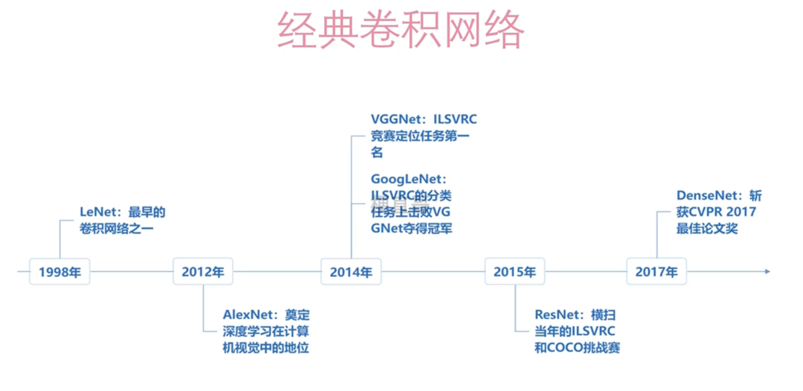
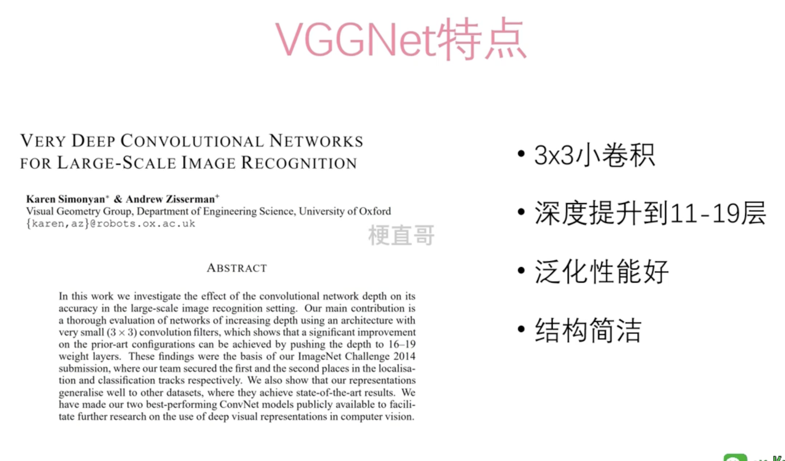
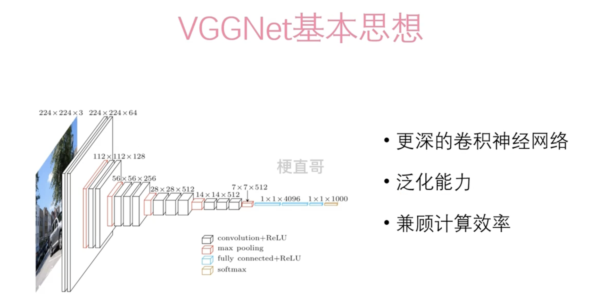

# VGGNet

VGGNet（Visual Geometry Group Network）是一种用于图像分类的深度卷积神经网络。它由多个卷积层和池化层构成的特征提取器（即卷积部分），后接上全连接层组成的分类器。


## 发展史




## 概念








1. **简单而有效的架构**：VGGNet采用了连续的小尺寸（3x3）卷积核和池化层，构建了相对简单而深度较大的网络。这种简单的结构易于理解和实现，并且在各种视觉任务中表现良好。
2. **深度和宽度的平衡**：VGGNet在深度和宽度之间取得了平衡。它通过使用多个3x3的卷积层来堆叠，从而增加了网络的深度，并在每个卷积层之后使用池化层来降低特征图的尺寸。这种设计使得网络在保持较小的参数量的同时，能够学习到更加复杂的特征。
3. **迁移学习性能好**：由于VGGNet具有通用性和易实现性，因此它在迁移学习中表现优异。可以通过在预训练的VGGNet模型上微调来适应各种视觉任务，如图像分类、物体检测和语义分割等。
4. **有效的特征提取**：VGGNet的深度和多层次的卷积结构使其能够有效地提取图像中的特征。这些特征对于各种计算机视觉任务都非常有用，因为它们能够捕获图像中的语义信息。
5. **较小的卷积核尺寸**：VGGNet采用了较小的3x3卷积核，这种设计有助于网络的学习和泛化能力。通过多次叠加3x3卷积层，网络可以学习到更加复杂的特征表示，而且参数数量相对较少。


## 详细过程


*`block1：`*

- **Conv1**

1. 输入图像大小：224 * 224 * 3 (RGB图像)
2. 卷积核(filter)大小：3 * 3
3. 卷积核个数：64
4. 步长(stride)：1
5. padding方式：SAME
6. 输出featureMap大小：224 * 224 * 64

- **Conv2**

1. 输入图像大小：224 * 224 * 64
2. 卷积核(filter)大小：3 * 3
3. 卷积核个数：64
4. 步长(stride)：1
5. padding方式：SAME
6. 输出featureMap大小：224 * 224 * 64

- **Pool1**

1. 输入图像大小：224 * 224 * 64

2. 采样大小：2 * 2

3. padding方式：SAME

4. 输出图像大小：112 * 112 * 64

   

*`block2：`*

- **Conv3**

1. 输入图像大小：112 * 112 * 64
2. 卷积核(filter)大小：3 * 3
3. 卷积核个数：128
4. 步长(stride)：1
5. padding方式：SAME
6. 输出featureMap大小：112 * 112 * 128

- **Conv4**

1. 输入图像大小：112 * 112 * 64
2. 卷积核(filter)大小：3 * 3
3. 卷积核个数：128
4. 步长(stride)：1
5. padding方式：SAME
6. 输出featureMap大小：112 * 112 * 128

- **Pool2**

1. 输入图像大小：112 * 112 * 128

2. 采样大小：2 * 2

3. padding方式：SAME

4. 输出图像大小：56 * 56 * 128

   

*`block3：`*

- **Conv5**

1. 输入图像大小：56 * 56 * 128
2. 卷积核(filter)大小：3 * 3
3. 卷积核个数：256
4. 步长(stride)：1
5. padding方式：SAME
6. 输出featureMap大小：56 * 56 * 256

- **Conv6**

1. 输入图像大小：56 * 56 * 256
2. 卷积核(filter)大小：3 * 3
3. 卷积核个数：256
4. 步长(stride)：1
5. padding方式：SAME
6. 输出featureMap大小：56 * 56 * 256

- **Conv7**

1. 输入图像大小：56 * 56 * 256
2. 卷积核(filter)大小：3 * 3
3. 卷积核个数：256
4. 步长(stride)：1
5. padding方式：SAME
6. 输出featureMap大小：56 * 56 * 256

- **Pool3**

1. 输入图像大小：56 * 56* 256

2. 采样大小：2 * 2

3. padding方式：SAME

4. 输出图像大小：28 * 28 * 256

   

*`block4：`*

- **Conv8**

1. 输入图像大小：28 * 28 * 256
2. 卷积核(filter)大小：3 * 3
3. 卷积核个数：512
4. 步长(stride)：1
5. padding方式：SAME
6. 输出featureMap大小：28 * 28 * 512

- **Conv9**

1. 输入图像大小：28 * 28 * 512
2. 卷积核(filter)大小：3 * 3
3. 卷积核个数：512
4. 步长(stride)：1
5. padding方式：SAME
6. 输出featureMap大小：28 * 28 * 512

- **Conv10**

1. 输入图像大小：28 * 28 * 512
2. 卷积核(filter)大小：3 * 3
3. 卷积核个数：512
4. 步长(stride)：1
5. padding方式：SAME
6. 输出featureMap大小：28 * 28 * 512

- **Pool4**

1. 输入图像大小：28 * 28 * 512

2. 采样大小：2 * 2

3. padding方式：SAME

4. 输出图像大小：14 * 14 * 512

   

*`block5：`*

- **Conv11**

1. 输入图像大小：14 * 14 * 512
2. 卷积核(filter)大小：3 * 3
3. 卷积核个数：512
4. 步长(stride)：1
5. padding方式：SAME
6. 输出featureMap大小：14 * 14 * 512

- **Conv12**

1. 输入图像大小：14 * 14 * 512
2. 卷积核(filter)大小：3 * 3
3. 卷积核个数：512
4. 步长(stride)：1
5. padding方式：SAME
6. 输出featureMap大小：14 * 14 * 512

- **Conv13**

1. 输入图像大小：14 * 14 * 512
2. 卷积核(filter)大小：3 * 3
3. 卷积核个数：512
4. 步长(stride)：1
5. padding方式：SAME
6. 输出featureMap大小：14 * 14 * 512

- **Pool5**

1. 输入图像大小：14 * 14 * 512
2. 采样大小：2 * 2
3. padding方式：SAME
4. 输出图像大小：7 * 7* 512


## 代码


```Python
import matplotlib.pyplot as plt

from keras.applications.vgg16 import VGG16
from keras.preprocessing import image
from keras.applications.vgg16 import preprocess_input, decode_predictions
import numpy as np


def percent(value):
    return '%.2f%%' % (value * 100)

# 下载VGG16模型，下载地址为 c:\user(用户)\.keras\models\vgg16_weights_tf_dim_ordering_tf_kernels.h5
model = VGG16(weights='imagenet', include_top=True)

# 显示模型结构
model.summary()

# Input：要预测的图片
img_path = '.\xx.png'

# img_path = '.\xx.png' 并转化为224*224的标准尺寸

img = image.load_img(img_path, target_size=(224, 224))

x = image.img_to_array(img)  # 转化为浮点型
x = np.expand_dims(x, axis=0)  # 转化为张量size为(1, 224, 224, 3)
x = preprocess_input(x)

# 预测，取得features，維度为 (1,1000)

features = model.predict(x)

# 取得前五个最可能的类别及概率

pred = decode_predictions(features, top=5)[0]

# 整理预测结果,value

values = []
bar_label = []
for element in pred:
    values.append(element[2])
    bar_label.append(element[1])

# 绘图并保存

fig = plt.figure("预测结果")
ax = fig.add_subplot(111)
ax.bar(range(len(values)), values, tick_label=bar_label, width=0.5, fc='g')
ax.set_ylabel('probability')
ax.set_title('Tree view')
for a, b in zip(range(len(values)), values):
    ax.text(a, b + 0.0005, percent(b), ha='center', va='bottom', fontsize=7)

fig = plt.gcf()
plt.show()

name = img_path[0:-4] + '_pred'
fig.savefig(name, dpi=200)
```


`model.summary()`显示模型结构


```Python
Model: "vgg16"
_________________________________________________________________
Layer (type)                 Output Shape              Param #   
=================================================================
input_1 (InputLayer)         [(None, 224, 224, 3)]     0         
_________________________________________________________________
block1_conv1 (Conv2D)        (None, 224, 224, 64)      1792      
_________________________________________________________________
block1_conv2 (Conv2D)        (None, 224, 224, 64)      36928     
_________________________________________________________________
block1_pool (MaxPooling2D)   (None, 112, 112, 64)      0         
_________________________________________________________________
block2_conv1 (Conv2D)        (None, 112, 112, 128)     73856     
_________________________________________________________________
block2_conv2 (Conv2D)        (None, 112, 112, 128)     147584    
_________________________________________________________________
block2_pool (MaxPooling2D)   (None, 56, 56, 128)       0         
_________________________________________________________________
block3_conv1 (Conv2D)        (None, 56, 56, 256)       295168    
_________________________________________________________________
block3_conv2 (Conv2D)        (None, 56, 56, 256)       590080    
_________________________________________________________________
block3_conv3 (Conv2D)        (None, 56, 56, 256)       590080    
_________________________________________________________________
block3_pool (MaxPooling2D)   (None, 28, 28, 256)       0         
_________________________________________________________________
block4_conv1 (Conv2D)        (None, 28, 28, 512)       1180160   
_________________________________________________________________
block4_conv2 (Conv2D)        (None, 28, 28, 512)       2359808   
_________________________________________________________________
block4_conv3 (Conv2D)        (None, 28, 28, 512)       2359808   
_________________________________________________________________
block4_pool (MaxPooling2D)   (None, 14, 14, 512)       0         
_________________________________________________________________
block5_conv1 (Conv2D)        (None, 14, 14, 512)       2359808   
_________________________________________________________________
block5_conv2 (Conv2D)        (None, 14, 14, 512)       2359808   
_________________________________________________________________
block5_conv3 (Conv2D)        (None, 14, 14, 512)       2359808   
_________________________________________________________________
block5_pool (MaxPooling2D)   (None, 7, 7, 512)         0         
_________________________________________________________________
flatten (Flatten)            (None, 25088)             0         
_________________________________________________________________
fc1 (Dense)                  (None, 4096)              102764544 
_________________________________________________________________
fc2 (Dense)                  (None, 4096)              16781312  
_________________________________________________________________
predictions (Dense)          (None, 1000)              4097000   
=================================================================
Total params: 138,357,544
Trainable params: 138,357,544
Non-trainable params: 0
_________________________________________________________________
2021-12-27 16:59:25.846173: I tensorflow/compiler/mlir/mlir_graph_optimization_pass.cc:176] None of the MLIR Optimization Passes are enabled (registered 2)
```

