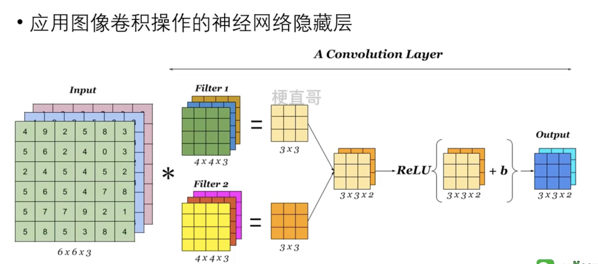
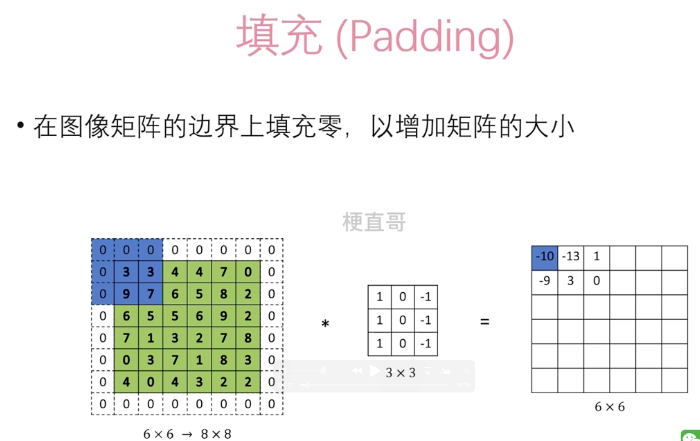
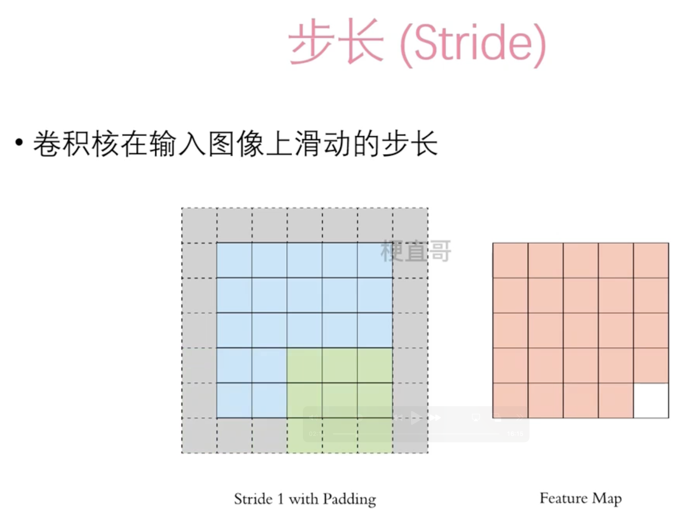
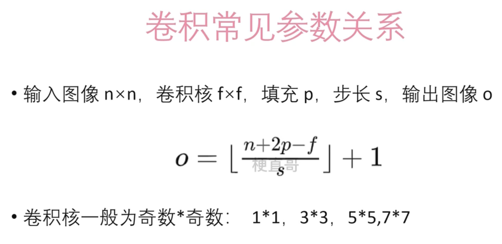
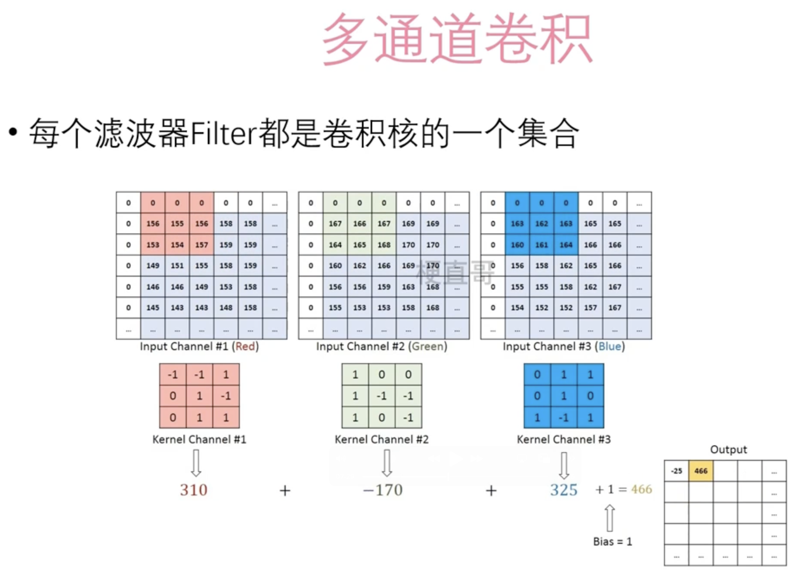
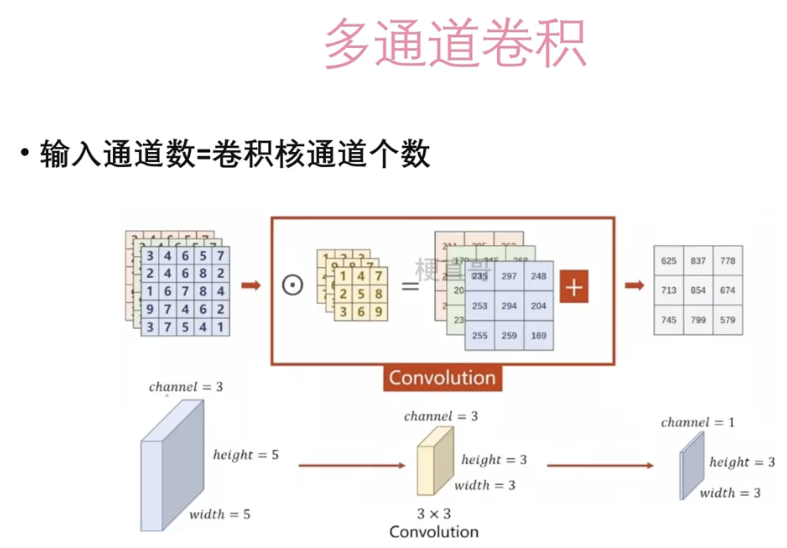
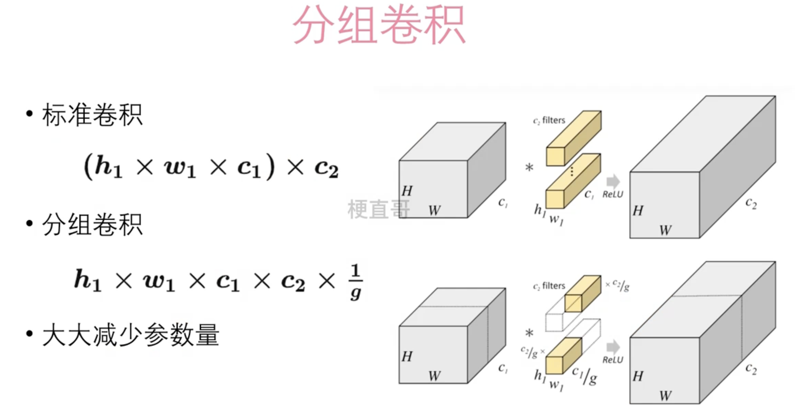

# 卷积层

## 概念

Filter 是核函数

## 感受野

在深度学习中，感受野（receptive field）是指卷积神经网络中某一层神经元的输入区域，对该神经元的输出值产生影响。换句话说，感受野描述了某一层神经元所“看到”的输入图像的区域大小。

在卷积神经网络中，每一层的神经元只与上一层的部分神经元相连，并且这种连接是局部的和稀疏的。因此，对于每个神经元来说，它只“看到”了上一层特征图中一个有限的局部区域，这个区域就是其感受野。

感受野的大小取决于网络的结构、卷积核的大小、步长（stride）、池化操作等因素。通常情况下，随着网络层数的增加，感受野会逐渐扩大，即神经元能够“看到”的输入图像区域会逐渐变大。

理解感受野的概念有助于我们了解神经网络的信息传递方式和特征提取能力。通过分析神经元的感受野，我们可以更好地理解网络的感知范围，从而优化网络结构和参数，提高网络的性能。

## 为什么需要卷积层

其主要原因如下：

1. **参数共享（Parameter Sharing）**：在卷积层中，卷积核的参数是共享的。这意味着每个卷积核都被用于对输入图像的不同位置进行特征提取，从而减少了模型的参数数量。参数共享使得模型更加简洁高效，同时也减少了过拟合的风险。
2. **稀疏连接（Sparse Connectivity）**：在卷积层中，每个神经元只与输入图像的一个局部区域连接，而不是与整个输入图像连接。这种稀疏连接的方式使得网络更加高效，减少了计算量，并且使得网络对输入图像的平移、缩放和旋转等变换具有一定的不变性。
3. **局部感知（Local Perception）**：卷积操作可以捕获输入图像的局部特征，从而使得网络能够更好地理解图像的结构和内容。通过在卷积层中使用多个不同的卷积核，可以提取出不同的局部特征，从而实现对输入图像的多层抽象表示。
4. **参数共享和权重共享（Weight Sharing）**：参数共享使得卷积层能够在不同位置共享相同的特征提取器，从而提高了模型的泛化能力和可解释性。同时，卷积操作可以看作是一种有效的权重共享方式，通过对输入图像进行局部权重共享，使得模型能够学习到更加通用和泛化的特征。

总的来说，卷积层通过参数共享、稀疏连接和局部感知等机制，使得网络能够高效地提取输入图像的特征，并且具有一定的平移、缩放和旋转不变性，从而在图像处理、计算机视觉和语音识别等领域取得了广泛的应用。

## 填充

在卷积层中进行卷积操作时，可以选择是否对输入图像进行填充（padding）。填充的主要目的是为了控制输出特征图的尺寸，并且保持输入和输出的空间信息。

以下是在卷积层中使用填充的几个主要原因：

1. **保持特征图尺寸**：在进行卷积操作时，通常会导致输出特征图的尺寸减小。通过填充输入图像，可以使得输出特征图的尺寸与输入图像的尺寸相匹配，从而更容易地构建深层神经网络，同时保留更多的空间信息。
2. **边缘信息**：填充可以保留输入图像边缘的信息。在进行卷积操作时，如果不进行填充，边缘像素的信息可能会在卷积过程中丢失，导致输出特征图中的边缘信息不足。
3. **避免信息丢失**：填充可以避免在卷积过程中出现信息丢失的问题。通过在输入图像的周围添加额外的像素值，可以确保在卷积过程中保留更多的输入信息，从而提高模型的性能和泛化能力。
4. **增加感受野**：填充可以增加卷积核在输入图像上的感受野（receptive field）。通过在输入图像周围添加填充，可以使得卷积核在边缘位置也能够看到更多的图像信息，从而提高特征提取的效果。

总的来说，填充在卷积层中起着重要的作用，它可以保持输出特征图的尺寸，保留输入图像的边缘信息，避免信息丢失，并增加卷积核的感受野，从而提高卷积神经网络的性能和泛化能力。

## 步长

## 卷积常见参数关系

在卷积神经网络中，常见的参数关系包括：

1. **卷积核大小（kernel size）和感受野（receptive field）**：卷积核大小决定了在输入图像上进行卷积操作时的窗口大小，而感受野描述了每个神经元在输入图像上“看到”的区域大小。通常情况下，卷积核大小与感受野大小相等，即卷积核的大小决定了每个神经元对输入图像的感知范围。
2. **步长（stride）和输出特征图尺寸**：步长决定了卷积核在输入图像上滑动的步长大小，从而影响了输出特征图的尺寸。较大的步长会导致输出特征图尺寸减小，而较小的步长会导致输出特征图尺寸增加。通常情况下，通过调节步长可以控制输出特征图的尺寸。
3. **填充（padding）和输出特征图尺寸**：填充决定了在输入图像的周围添加额外像素的数量，从而影响了输出特征图的尺寸。使用填充可以保持输出特征图尺寸与输入图像尺寸相等，或者增加输出特征图尺寸，以便更好地构建深层神经网络。
4. **输入特征图通道数（input channels）和卷积核通道数（input channels）**：输入特征图的通道数决定了输入图像的维度，而卷积核的通道数决定了卷积操作的维度。通常情况下，输入特征图的通道数与卷积核的通道数相等，但也可以通过适当设计卷积核的通道数来实现特定的特征提取需求。

## 多通道卷积

多通道卷积是指卷积操作同时在多个通道上进行的卷积操作。在深度学习中，通常输入图像和卷积核都具有多个通道，因此进行卷积操作时，需要在每个通道上分别进行卷积，并将结果进行求和或者拼接，得到最终的输出特征图。

具体来说，多通道卷积的过程如下：

1. 对于输入图像的每个通道，使用对应的卷积核进行卷积操作。如果输入图像具有 $C_{\text{in}}$ 个通道，卷积核也具有 $C_{\text{in}}$ 个通道，则每个通道上都会有一个单独的卷积操作。
2. 对于每个通道的卷积结果，将它们进行求和或者拼接，得到最终的输出特征图。如果使用的是求和操作，则将每个通道的卷积结果按通道相加；如果使用的是拼接操作，则将每个通道的卷积结果沿着通道维度进行拼接。

多通道卷积的主要优势在于它能够更好地提取图像中的多个特征，并且增加了网络的表达能力。通过在多个通道上进行卷积操作，网络可以学习到更加丰富和抽象的特征表示，从而提高了网络对图像的理解能力和泛化能力。

可以被抽象成为：

## 分组卷积

上面的卷积成为全连接卷积（标准卷积）。

分组卷积是一种将输入和卷积核分组处理的卷积操作。在分组卷积中，输入和卷积核被分成多个组（group），每个组分别进行卷积操作，最后将各组的结果进行拼接或求和得到最终的输出特征图。

分组卷积的主要特点包括：

1. **参数共享**：在分组卷积中，每个组内部的卷积操作是独立的，但组间的参数是共享的。这意味着每个组内部的卷积核是独立学习的，但不同组之间的卷积核参数是共享的。
2. **计算效率**：由于每个组内部的卷积操作是独立的，因此可以并行地对每个组进行卷积操作，从而提高了计算效率。分组卷积常用于对输入和输出通道较多的情况下，可以将输入和输出通道分组处理，减少计算量。
3. **参数量控制**：通过调节分组数和每个组的通道数，可以控制模型的参数量。较小的分组数和较小的组内通道数可以减少模型的参数量，从而降低过拟合的风险。

分组卷积在一些特定的神经网络结构中得到了广泛的应用，例如MobileNet等。它能够提高模型的计算效率和泛化能力，同时降低模型的参数量，适用于对计算资源有限或有参数量限制的场景。

