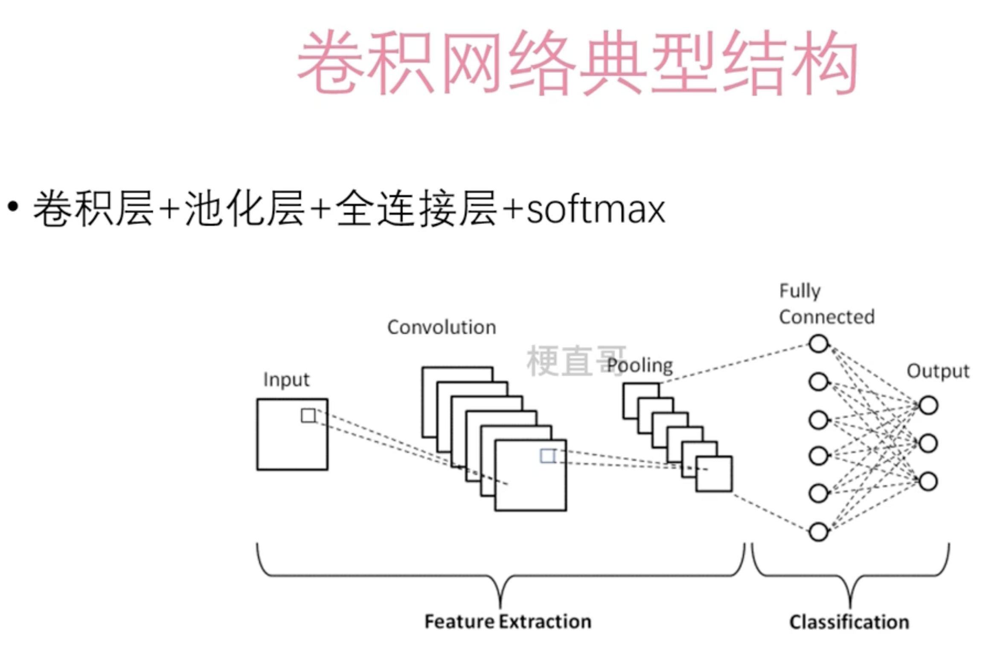
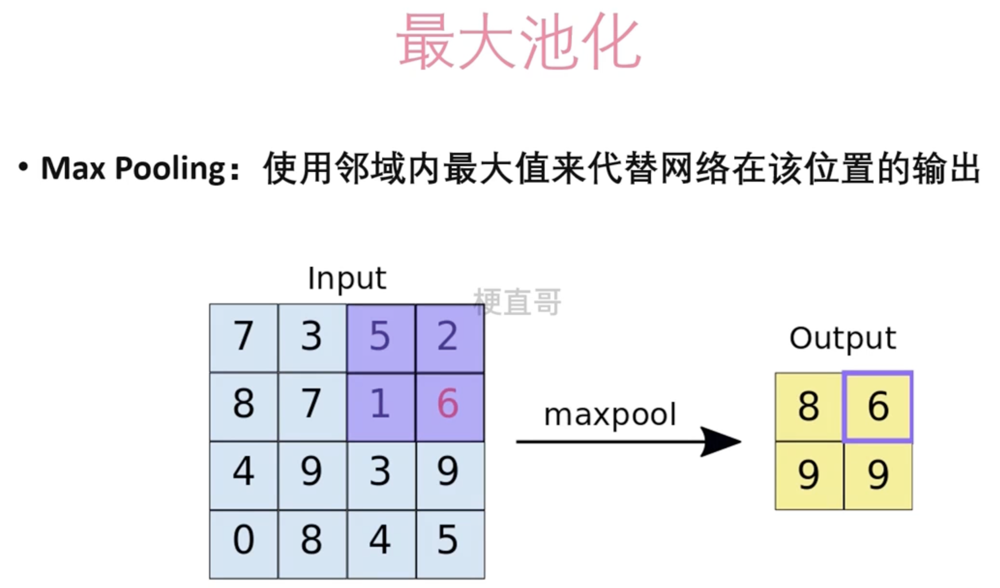
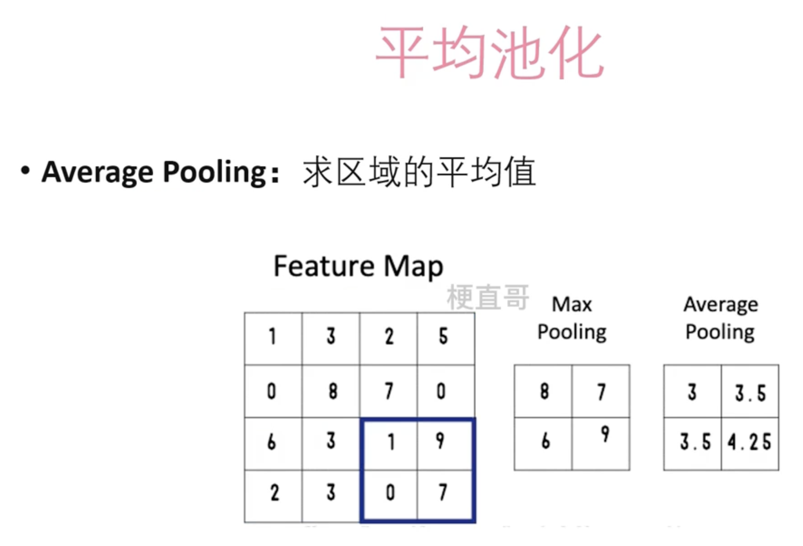
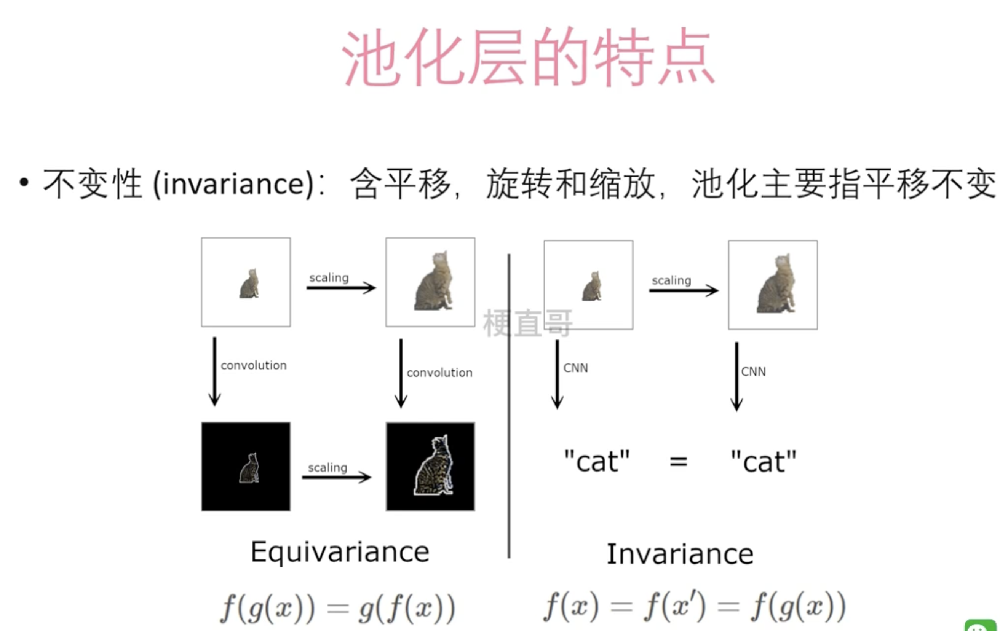
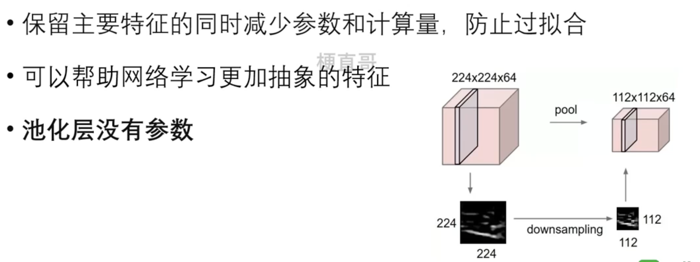

# 池化层 

## 典型结构

## 池化类型

### 最大池化

### 平均池化

## 池化层的特点

其他特征：

### 池化和下采样的区别

池化（Pooling）和下采样（Downsampling）是两个常用的操作，它们在深度学习中用于减小特征图的尺寸，但它们的作用和实现方式略有不同。

下采样是指通过降低输入图像的分辨率来减小图像的尺寸，从而减少计算量和参数数量。常见的下采样操作包括平均池化（Average Pooling）和最大池化（Max Pooling）。在下采样中，每个池化区域内的像素值都被某种统计汇总（例如取平均值或最大值），从而减小了特征图的尺寸，但保留了主要特征的信息。

池化是一种更广义的操作，它不仅可以用于减小特征图的尺寸，还可以用于提取主要特征、压缩特征表示等。池化操作通常包括下采样，但也可以包括其他操作，如对特征进行空间压缩、特征选择等。因此，池化是一种更加灵活和多样化的操作，而下采样只是池化的一种特例。

总的来说，下采样是一种特殊形式的池化操作，它主要用于减小特征图的尺寸，减少计算量和参数数量。而池化是一种更广义的操作，除了减小尺寸外，还可以用于特征提取、压缩特征表示等多种目的。