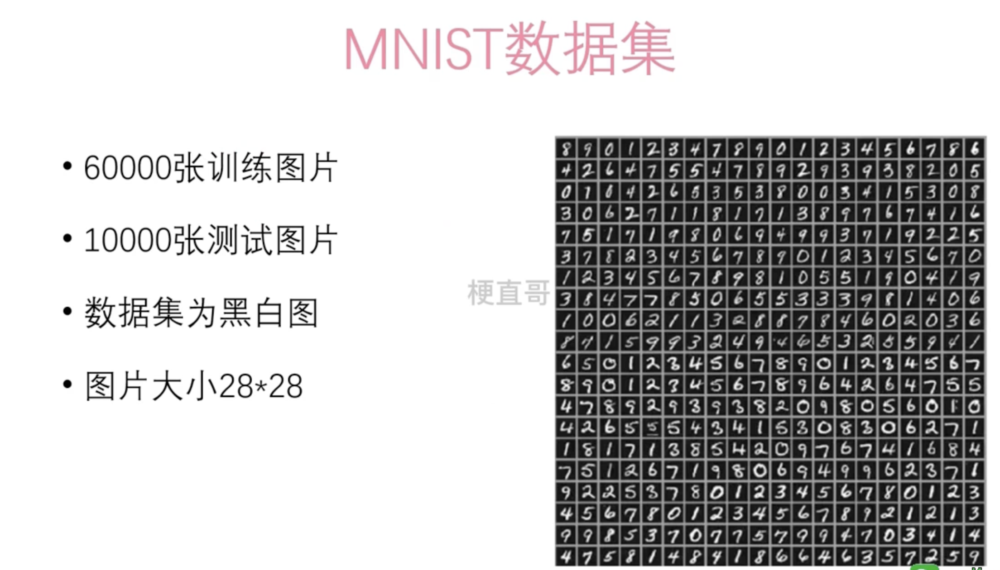
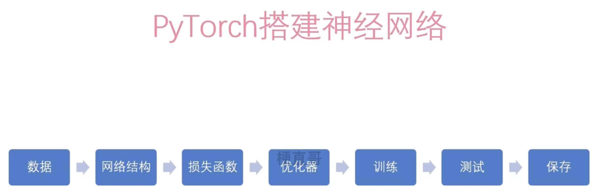

# 概念

多层感知器(Multi-Layer Perceptron,*MLP*)也叫人工神经网络(Artificial Neural Network,ANN),除了输入输出层,它中间可以有多个隐层。


# 数据构成




# 流程





# 引入依赖

```python
import torch 
from torchvision import datasets
from torchvision import transforms 
import torch.nn as nn # 神经网络包
import torch.optim as optim  # 优化器的包
```

# 加载数据


```python
train_data = datasets.MNIST(
    root="data/minst",
    train=True, #训练数据
    transform=transforms.ToTensor(), # 将下载的文件转换成pytorch认识的tensor类型，且将图片的数值大小从（0-255）归一化到（0-1）
    download=True)

test_data = datasets.MNIST(
    root="data/minst",
    train=False,  #测试数据
    transform=transforms.ToTensor(),
    download=True)
```


```python
batch_size = 100 # 从数据集中选取对应数量做每一次的训练
train_loader = torch.utils.data.DataLoader(
    dataset=train_data,
    batch_size=batch_size, 
    shuffle=True)

test_loader = torch.utils.data.DataLoader(
    dataset=test_data,
    batch_size=batch_size, 
    shuffle=False)
```

# 网络模块


```python
class MLP(nn.Module): 
    
    #初始化方法
    # input_size输入数据的维度
    # hidden_size 隐藏层大小
    # num_class 输出分类的数量
    
    def __init__(self, input_size, hidden_size, num_classes):
        #调用父类的初始化方法
        super(MLP, self).__init__()
        #定义第一个全连接层
        self.fc1=nn.Linear(input_size,hidden_size)
        #定义激活函数
        self.relu = nn.ReLU()
        #定义第二个全连接层
        self.fc2=nn.Linear(hidden_size, hidden_size)
        #定义第三个全连接层
        self.fc3=nn.Linear(hidden_size,num_classes)
         
    def forward(self,x):
        #第一层运算
        out = self.fc1(x)
        #将上一步结果送给激活函数
        out = self.relu(out)
        #将上一步结果送给fc2
        out = self.fc2(out)
        #将上一步结果送给激活函数
        out = self.relu(out)
        #将上一步结果送给fc3
        out = self.fc3(out)
        #返回结果
        return out
    
#初始化参数
input_size = 28 * 28 #输入大小（图片大小）
hidden_size = 512 #隐藏层大小
num_classes = 10 #输出大小（类别数）

# 初始化MLP
model = MLP(input_size, hidden_size, num_classes)
```

# 损失函数


```python
#因为是分类问题，所以采用了交叉熵分类函数
#交叉熵误差，cross entropy error，用来评估模型输出的概率分布和真实概率分布的差异情况，一般用于解决分类问题
criterion= nn.CrossEntropyLoss() 
```

# 优化器


```python
#优化器（optimizer）是一种用于调整神经网络模型参数以最小化损失函数的算法。
learning_rate = 0.001
optimizer = optim.Adam(model.parameters(),lr=learning_rate)
```

# 训练


```python
num_pochs = 10 # 训练轮数
for epoch in range (num_pochs):
    for i, (images, labels) in enumerate(train_loader):
        #将images转换为向量
        images = images.reshape(-1,28*28)
        #将数据送到网络中
        outputs = model(images)
        #计算损失
        loss = criterion(outputs,labels)
        
        #首先将梯度清零
        optimizer.zero_grad()
        #反向传播
        loss.backward()
        #更新参数
        optimizer.step()
        
        if(i+1) % 100 == 0:
            print(f'Epoch[{epoch+1}/{num_pochs}],Step[{i+1}/{len(train_loader)}], Loss:{loss.item():.4f}')
```

    Epoch[1/10],Step[100/600], Loss:0.3492
    Epoch[1/10],Step[200/600], Loss:0.1174
    Epoch[1/10],Step[300/600], Loss:0.2016
    Epoch[1/10],Step[400/600], Loss:0.1615
    Epoch[1/10],Step[500/600], Loss:0.0952
    Epoch[1/10],Step[600/600], Loss:0.0997
    Epoch[2/10],Step[100/600], Loss:0.0446
    Epoch[2/10],Step[200/600], Loss:0.0631
    Epoch[2/10],Step[300/600], Loss:0.0689
    Epoch[2/10],Step[400/600], Loss:0.0826
    Epoch[2/10],Step[500/600], Loss:0.0893
    Epoch[2/10],Step[600/600], Loss:0.2121
    Epoch[3/10],Step[100/600], Loss:0.0543
    Epoch[3/10],Step[200/600], Loss:0.0069
    Epoch[3/10],Step[300/600], Loss:0.0305
    Epoch[3/10],Step[400/600], Loss:0.0556
    Epoch[3/10],Step[500/600], Loss:0.0299
    Epoch[3/10],Step[600/600], Loss:0.0628
    Epoch[4/10],Step[100/600], Loss:0.0190
    Epoch[4/10],Step[200/600], Loss:0.0580
    Epoch[4/10],Step[300/600], Loss:0.0129
    Epoch[4/10],Step[400/600], Loss:0.0396
    Epoch[4/10],Step[500/600], Loss:0.0477
    Epoch[4/10],Step[600/600], Loss:0.0058
    Epoch[5/10],Step[100/600], Loss:0.0639
    Epoch[5/10],Step[200/600], Loss:0.0201
    Epoch[5/10],Step[300/600], Loss:0.0148
    Epoch[5/10],Step[400/600], Loss:0.0198
    Epoch[5/10],Step[500/600], Loss:0.0397
    Epoch[5/10],Step[600/600], Loss:0.0270
    Epoch[6/10],Step[100/600], Loss:0.0065
    Epoch[6/10],Step[200/600], Loss:0.0168
    Epoch[6/10],Step[300/600], Loss:0.0073
    Epoch[6/10],Step[400/600], Loss:0.0965
    Epoch[6/10],Step[500/600], Loss:0.0633
    Epoch[6/10],Step[600/600], Loss:0.0538
    Epoch[7/10],Step[100/600], Loss:0.0102
    Epoch[7/10],Step[200/600], Loss:0.0030
    Epoch[7/10],Step[300/600], Loss:0.0078
    Epoch[7/10],Step[400/600], Loss:0.0047
    Epoch[7/10],Step[500/600], Loss:0.0052
    Epoch[7/10],Step[600/600], Loss:0.0304
    Epoch[8/10],Step[100/600], Loss:0.0038
    Epoch[8/10],Step[200/600], Loss:0.0010
    Epoch[8/10],Step[300/600], Loss:0.0830
    Epoch[8/10],Step[400/600], Loss:0.0007
    Epoch[8/10],Step[500/600], Loss:0.0287
    Epoch[8/10],Step[600/600], Loss:0.0007
    Epoch[9/10],Step[100/600], Loss:0.0034
    Epoch[9/10],Step[200/600], Loss:0.0013
    Epoch[9/10],Step[300/600], Loss:0.0010
    Epoch[9/10],Step[400/600], Loss:0.0510
    Epoch[9/10],Step[500/600], Loss:0.0891
    Epoch[9/10],Step[600/600], Loss:0.0015
    Epoch[10/10],Step[100/600], Loss:0.0424
    Epoch[10/10],Step[200/600], Loss:0.0011
    Epoch[10/10],Step[300/600], Loss:0.0017
    Epoch[10/10],Step[400/600], Loss:0.0113
    Epoch[10/10],Step[500/600], Loss:0.0164
    Epoch[10/10],Step[600/600], Loss:0.0348


# 测试


```python
# 测试网络

with torch.no_grad():
    correct =0
    total =0
    # 从test_loader中循环读取测试数据
    for images, labels in test_loader:
        #将image转换为向量
        images = images.reshape(-1,28 * 28)
        #将数据送给网络lables
        outputs = model(images)
        #取出最大值对应的索引，即预测值
        _,predicted = torch.max(outputs.data,1)
        #累计label数
        total += labels.size(0)
        #预测值与label值对比，获取预测正确的数量
        correct += (predicted == labels).sum().item()
        
    #打印最终的准确率
    print(f'Accuracy of the network on the 10000 test images:{100 * correct / total} %')
```

    Accuracy of the network on the 10000 test images:97.81 %


# 保存


```python
torch.save(model,"mnist_mlp_model.pkl")
```
