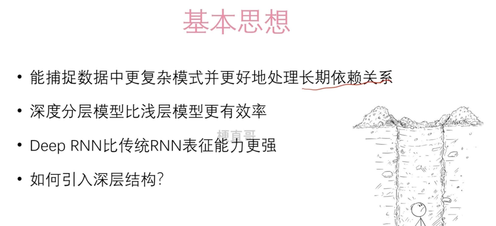
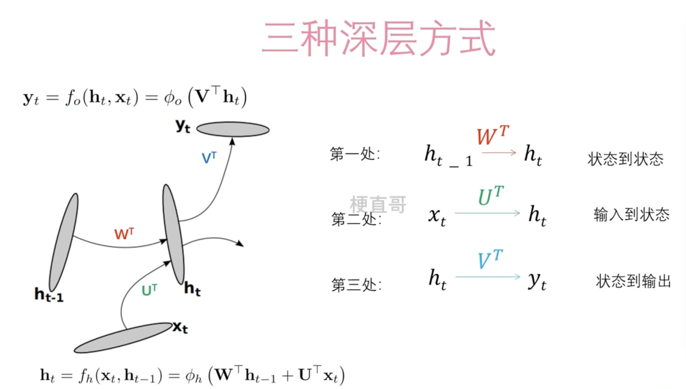
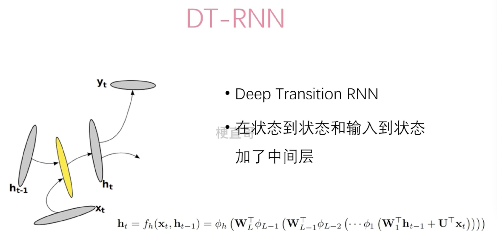
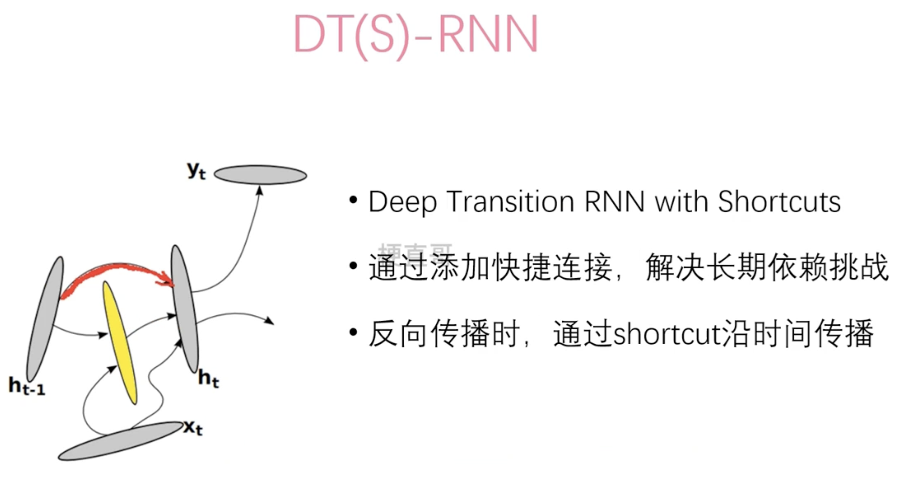

# DeepRNN

## DT-RNN

DT-RNN（Dynamic Time-Recurrent Neural Network）是一种结合了动态时间规整（Dynamic Time Warping，DTW）和循环神经网络（Recurrent Neural Network，RNN）的神经网络模型。

- **动态时间规整（DTW）**：DTW 是一种用于比较两个序列之间相似度的方法。它可以解决序列之间长度不同和时间轴偏移的问题，通过动态地对齐两个序列的时间步来计算它们之间的距离或相似度。
- **循环神经网络（RNN）**：RNN 是一种专门用于处理序列数据的神经网络模型。它具有记忆能力，可以利用序列中之前的信息来预测下一个时间步的输出。RNN 在时间上展开，形成一个循环结构，允许信息在时间步之间传递和更新。

DT-RNN 将 DTW 和 RNN 结合起来，以克服 RNN 在处理时间序列时可能遇到的长度不同和时间轴偏移的问题。它的基本思想是通过 DTW 对齐输入序列和模板序列，然后将对齐后的序列输入到 RNN 中进行进一步处理。这样可以使模型更好地捕捉到序列之间的时间关系，并提高模型在处理时间序列任务时的性能。

DT-RNN 的具体实现可能会有所不同，但总体上它是一种结合了 DTW 和 RNN 的深度学习模型，用于处理时间序列数据，并在许多领域中都有广泛的应用，如语音识别、手写识别、行为识别等。

## DT(S)-RNN

DT(S)-RNN（Dynamic Time (Segmentation)-Recurrent Neural Network）是一种结合了动态时间规整（Dynamic Time Warping，DTW）和分段技术的循环神经网络（RNN）模型。

- **动态时间规整（DTW）**：DTW 是一种用于比较两个序列之间相似度的方法。它可以解决序列之间长度不同和时间轴偏移的问题，通过动态地对齐两个序列的时间步来计算它们之间的距离或相似度。
- **分段技术**：分段技术是一种将长序列分割成多个较短子序列的方法。通过将长序列分割成多个子序列，可以降低序列的复杂性，并使模型更容易学习长期依赖关系。

DT(S)-RNN 结合了 DTW 和分段技术，以克服 RNN 在处理时间序列时可能遇到的长度不同和时间轴偏移的问题，并提高模型对长序列的建模能力。具体来说，DT(S)-RNN 的基本思想是首先使用 DTW 对输入序列和模板序列进行动态时间规整，然后将规整后的序列分割成多个较短的子序列，最后将这些子序列输入到 RNN 中进行进一步处理。

通过结合 DTW 和分段技术，DT(S)-RNN 可以更好地捕捉序列之间的时间关系，同时能够处理不同长度和不同速度的序列数据，适用于许多时间序列建模任务，如语音识别、行为识别、时间序列预测等。