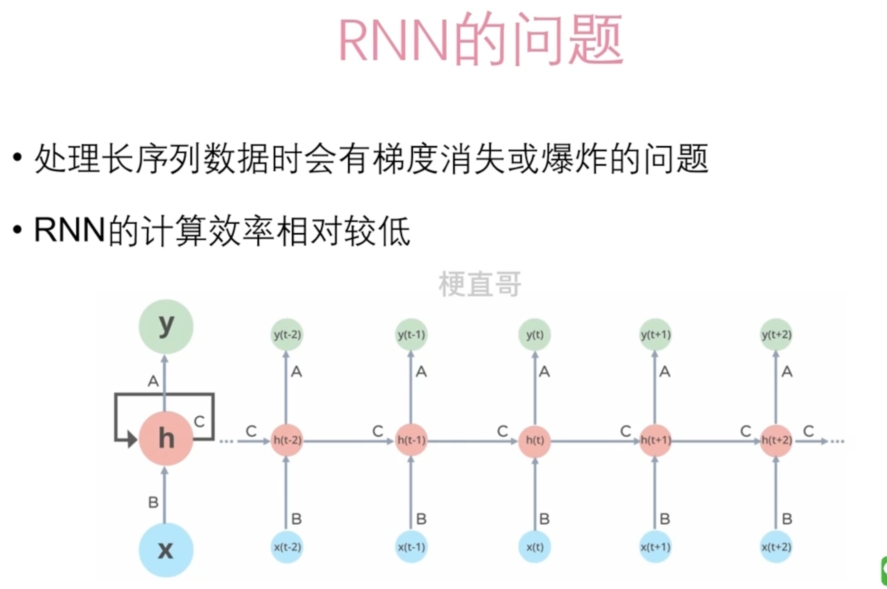
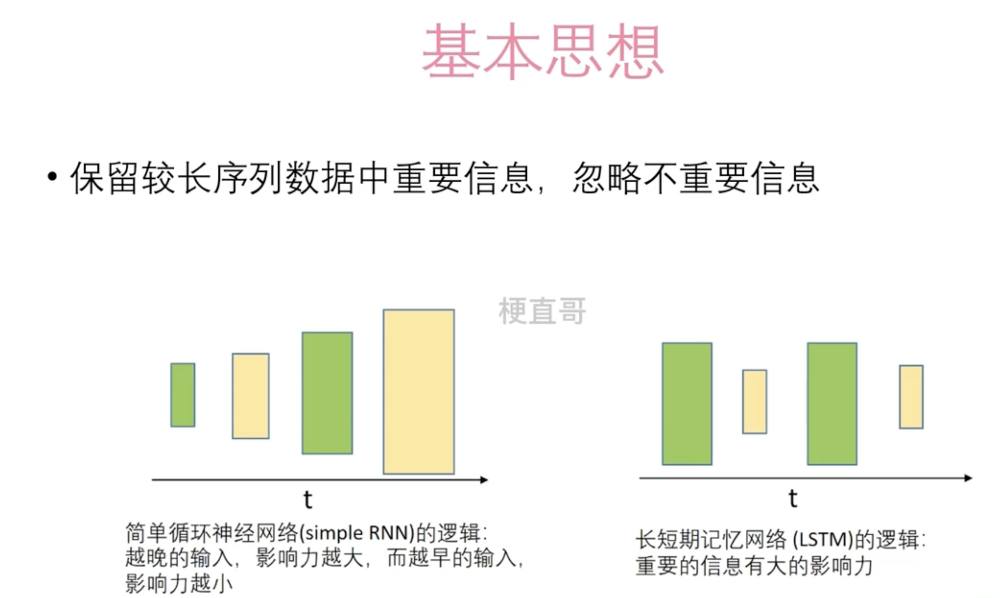
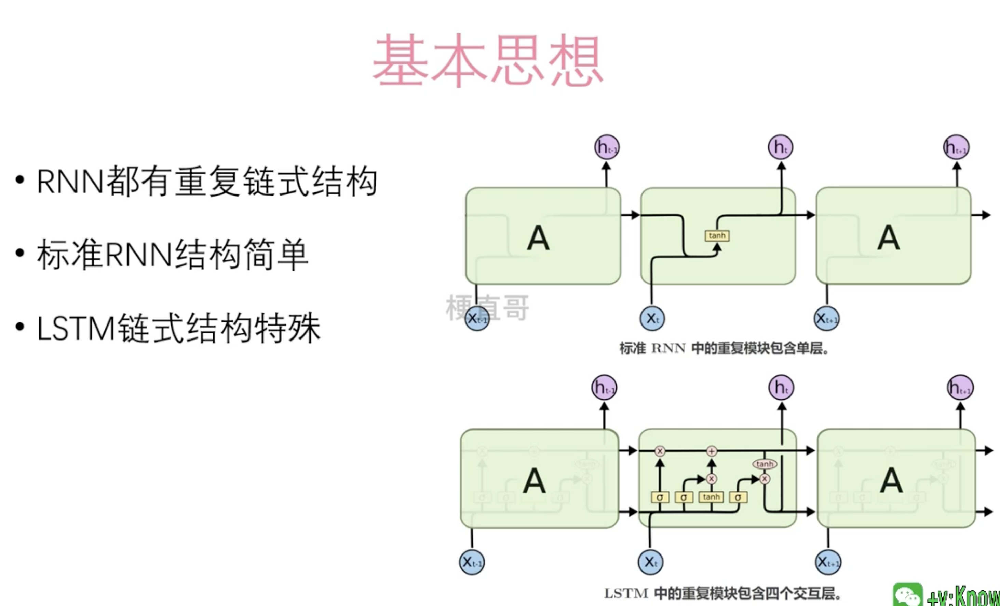
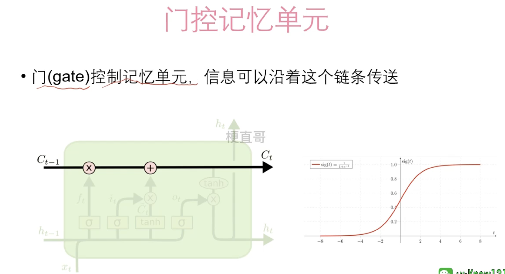
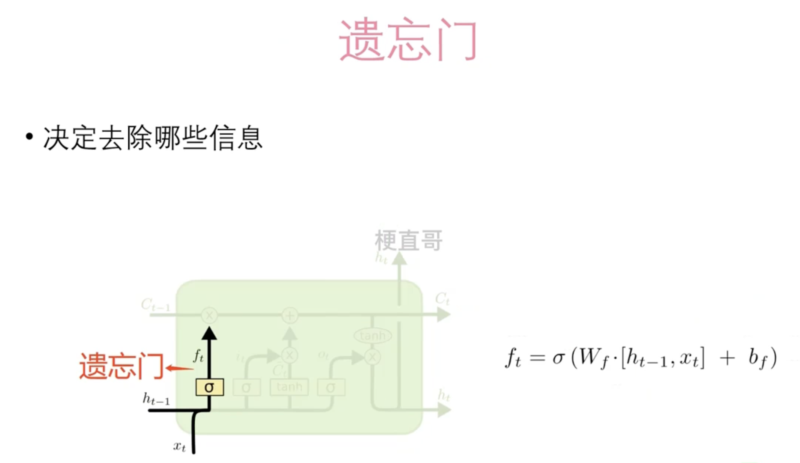
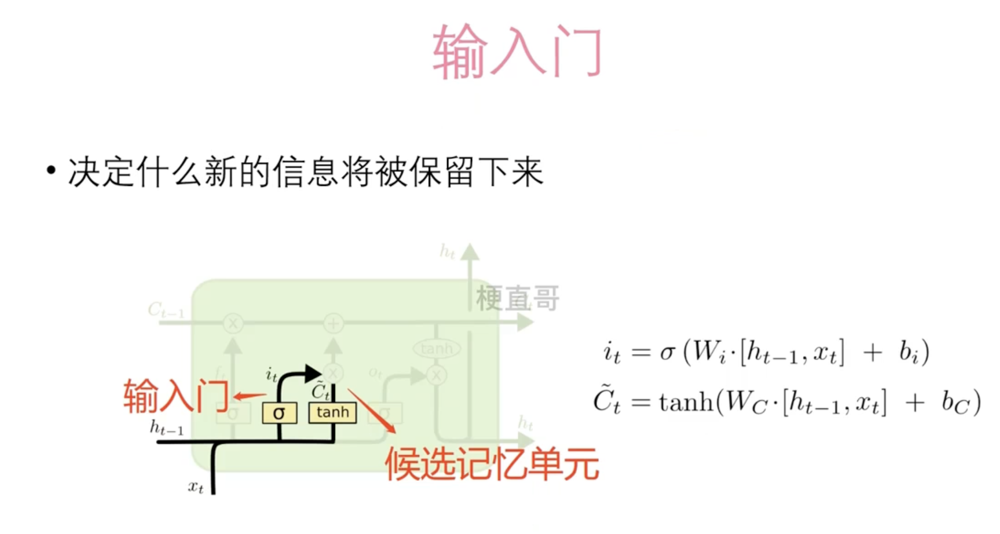
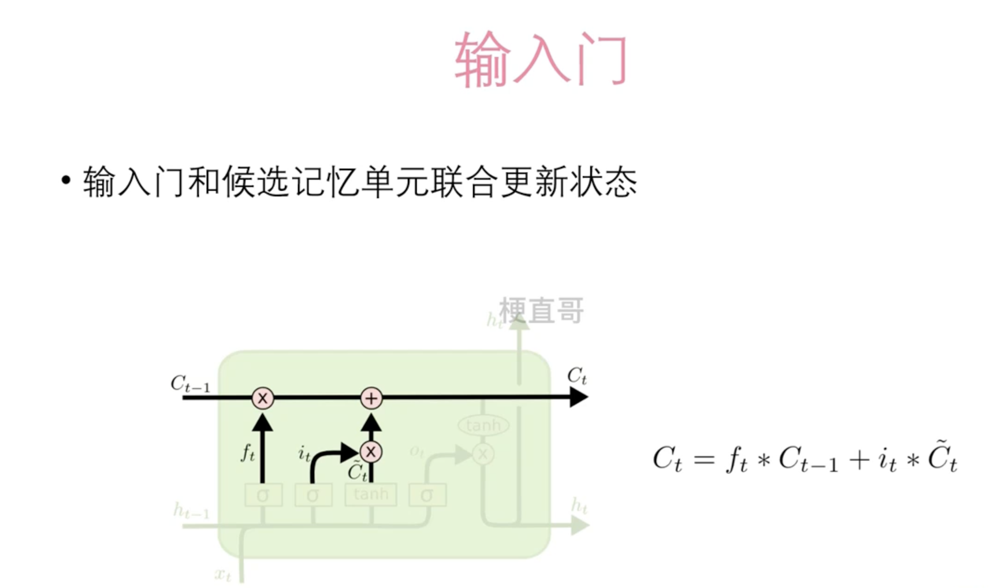
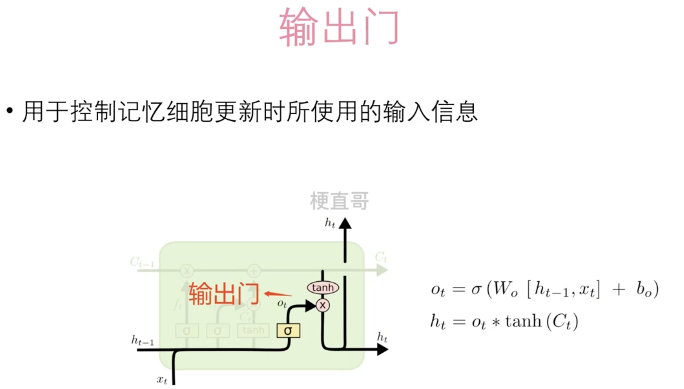

# Long-Short Term Memory

长短期记忆网络（Long-Short Term Memory）

## RNN的问题

## LSTM的设计思路

## 门控记忆单元

### 遗忘门

- ht-1 表示上一个时刻记忆的状态
- xt表示当前时间步的输入信息
- 加权和在作用到长期记忆Ct-1上

### 输入门

### 输出门

输出门用于控制长效记忆中的信息如何被输出到当前时间步的隐藏状态中。

