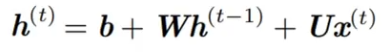

# RNN

## 背景

## 结构

 

x是一个向量，它表示**输入层**的值（这里面没有画出来表示神经元节点的圆圈）；s是一个向量，它表示**隐藏层**的值（这里隐藏层面画了一个节点，你也可以想象这一层其实是多个节点，节点数与向量s的维度相同）；U是输入层到隐藏层的**权重矩阵**，o也是一个向量，它表示**输出层**的值；V是隐藏层到输出层的**权重矩阵**。那么，现在我们来看看W是什么。**循环神经网络**的**隐藏层**的值s不仅仅取决于当前这次的输入x，还取决于上一次**隐藏层**的值s。**权重矩阵** W就是**隐藏层**上一次的值作为这一次的输入的权重。

可以被概况为：

## 为什么需要RNN（循环神经网络）

他们都只能单独的取处理一个个的输入，前一个输入和后一个输入是完全没有关系的。但是，某些任务需要能够更好的处理**序列**的信息，即前面的输入和后面的输入是有关系的。

> ***比如，当我们在理解一句话意思时，孤立的理解这句话的每个词是不够的，我们需要处理这些词连接起来的整个序列；\*** ***当我们处理视频的时候，我们也不能只单独的去分析每一帧，而要分析这些帧连接起来的整个序列。\***

***以nlp的一个最简单词性标注任务来说，将我 吃 苹果 三个单词标注词性为 我/nn 吃/v 苹果/nn。\***

那么这个任务的输入就是：

我 吃 苹果 （已经分词好的句子）

这个任务的输出是：

*我/nn 吃/v 苹果/nn(词性标注好的句子)*

对于这个任务来说，我们当然可以直接用普通的神经网络来做，给网络的训练数据格式了就是我-> 我/nn 这样的多个单独的单词->词性标注好的单词。

***但是很明显，一个句子中，前一个单词其实对于当前单词的词性预测是有很大影响的，比如预测苹果的时候，由于前面的吃是一个动词，那么很显然苹果作为名词的概率就会远大于动词的概率，因为动词后面接名词很常见，而动词后面接动词很少见。\***

所以为了解决一些这样类似的问题，能够更好的处理序列的信息，RNN就诞生了。

## 反向传播

BPTT算法通过沿着时间展开RNN，将其视为多个时间步长上的前馈神经网络。在每个时间步长，网络的状态会根据当前输入和前一个时间步的状态进行更新。BPTT利用这种时间展开的方式，将RNN转换成一个普通的前馈神经网络，从而可以使用标准的反向传播算法来训练它。

通俗来说，BPTT就像是在处理一个“展开”的RNN，把时间步骤展开成一系列前馈神经网络。然后，利用反向传播算法计算损失函数对网络参数的梯度，以便进行参数更新，使得网络在训练数据上表现更好。

## RNN的长期依赖问题

**什么是长期依赖？**

​    当前系统的状态，可能依赖很长时间之前系统状态

**长期记忆失效的原因 —— 权重矩阵连乘**

​    假定循环链接非常简单，去掉激活函数。

 h0 的系数乘指数级增长，W^t ，若W特征值的幅值如果小于1，那么就是指数级的衰减。

​    则会导致类似于蝴蝶效应的现象，初始条件的很小变化就会导致结果严重的变化。

**激活函数的选择**

​    RNN中可以用ReLU函数，但不能解决梯度消失、爆炸问题。

​    对矩阵W的初始值敏感，十分容易引发数值问题。

​    梯度的消失和爆炸沿着时间轴的级联导致的。

**为什么CNN不会出现这个问题？**

​    因为CNN中每一层卷积的权重是不相同的，并且初始化时是独立的同分布的，因此可以互相抵消，多层之后一般不会引发数值问题。

​    而RNN是共用相同的权重矩阵W，只有当W取在单位矩阵附近的时候才会有好的效果。
