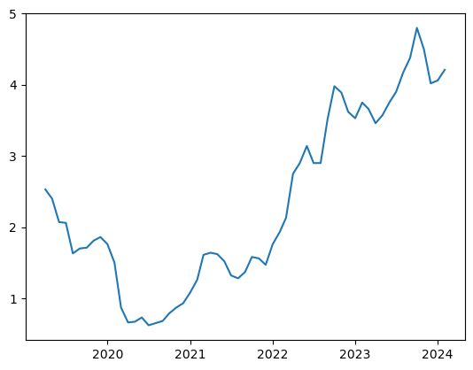
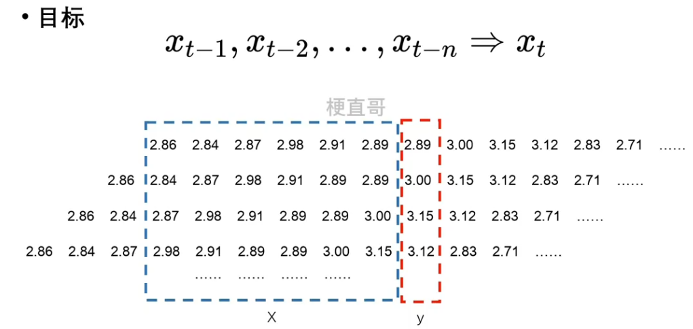
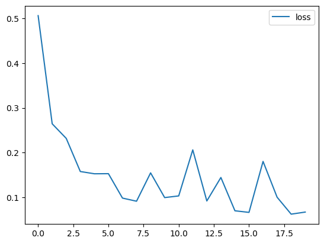
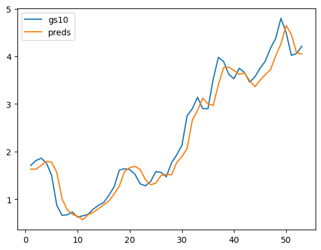
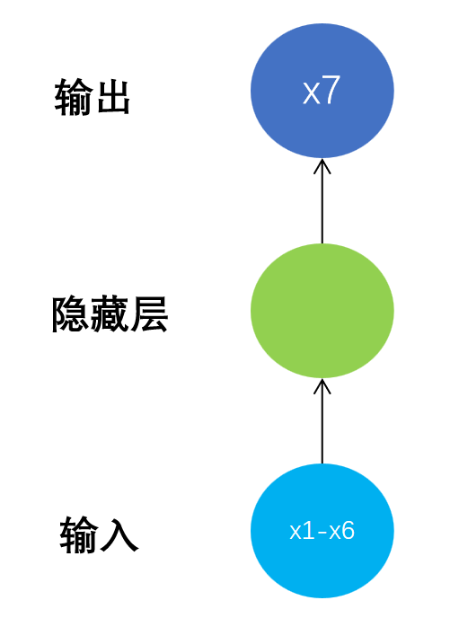
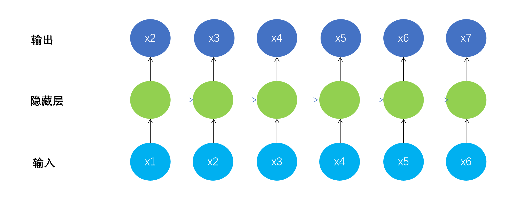
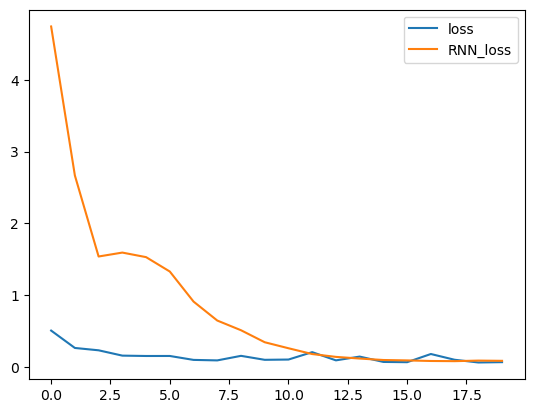
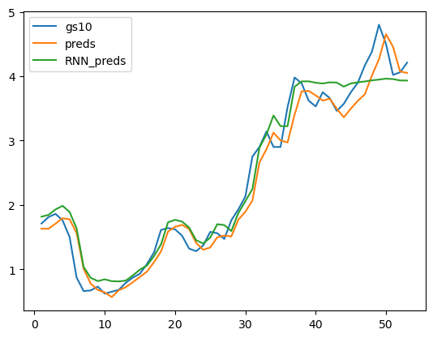

# 时间序列数据预测

参考： https://blog.csdn.net/weixin_47187147/article/details/135186010

## 数据集的引入


```python
import pandas_datareader as pdr
gs10 = pdr.get_data_fred('GS10')
gs10.head()
```


<div>
<style scoped>
    .dataframe tbody tr th:only-of-type {
        vertical-align: middle;
    }

    .dataframe tbody tr th {
        vertical-align: top;
    }
    
    .dataframe thead th {
        text-align: right;
    }
</style>
<table border="1" class="dataframe">
  <thead>
    <tr style="text-align: right;">
      <th></th>
      <th>GS10</th>
    </tr>
    <tr>
      <th>DATE</th>
      <th></th>
    </tr>
  </thead>
  <tbody>
    <tr>
      <th>2019-04-01</th>
      <td>2.53</td>
    </tr>
    <tr>
      <th>2019-05-01</th>
      <td>2.40</td>
    </tr>
    <tr>
      <th>2019-06-01</th>
      <td>2.07</td>
    </tr>
    <tr>
      <th>2019-07-01</th>
      <td>2.06</td>
    </tr>
    <tr>
      <th>2019-08-01</th>
      <td>1.63</td>
    </tr>
  </tbody>
</table>
</div>


## 绘制图像数据


```python
import matplotlib.pyplot as plt
plt.plot(gs10)
plt.show()
```





**序列数据没办法直接使用，需要进行预处理。**

​    对原始数据进行切分。

​    n 是超参数。用多少个去预测下一个元素




​    

## 数据预处理

初始化特征序列，列数就是预测序列的长度 seq，行数是 n - seq。

行数不是 n 的原因是因为最初的几条信息无法用来构建数据集，他们缺失了更早的时序信息。

- X_feature 是一个形状为 (num-seq_len, seq_len) 的全零张量，用于存储特征矩阵。

- 在循环中，从 x 中切片取出长度为 num-seq_len 的子序列，并将它们赋值给 X_feature 的不同列，以构建特征矩阵。

而这段代码的最后一行 y_label = x[seq_len:].reshape((-1, 1)) 的作用是构建输出标签 y_label，具体来说：

- x[seq_len:] 表示从 x 中切片取出从索引 seq_len 开始到末尾的子序列，即去掉了前 seq_len 个时间步的数据。

- .reshape((-1, 1)) 将切片得到的一维数组重新调整为形状为 (-1, 1) 的二维数组。其中 -1 表示自动计算该维度的大小，这里表示将数组变成一列。

特征矩阵 X_feature 的前 num-seq_len 个样本和输出标签 y_label 的前 num-seq_len 个样本作为输入。 


```python
import torch
from torch.utils.data import DataLoader, TensorDataset
 
num = len(gs10)                           # 总数据量
x = torch.tensor(gs10['GS10'].to_list())  # 股价列表
seq_len = 6                               # 预测序列长度
batch_size = 4                            # 设置批大小
 
X_feature = torch.zeros((num - seq_len, seq_len))      # 全零初始化特征矩阵，num-seq_len行，seq_len列
for i in range(seq_len):
    X_feature[:, i] = x[i: num - seq_len + i]    # 为特征矩阵赋值
y_label = x[seq_len:].reshape((-1, 1))           # 真实结果列表
 
train_loader = DataLoader(TensorDataset(X_feature[:num-seq_len], 
    y_label[:num-seq_len]), batch_size=batch_size, shuffle=True)  # 构建数据加载器
```


```
train_loader.dataset[:batch_size]
```

```
(tensor([[2.8600, 2.8400, 2.8700, 2.9800, 2.9100, 2.8900],
         [2.8400, 2.8700, 2.9800, 2.9100, 2.8900, 2.8900],
         [2.8700, 2.9800, 2.9100, 2.8900, 2.8900, 3.0000],
         [2.9800, 2.9100, 2.8900, 2.8900, 3.0000, 3.1500]]),
 tensor([[2.8900],
         [3.0000],
         [3.1500],
         [3.1200]]))
```


## 先用  基本神经网络模型 看看效果：

### 构建基本神经网络模型


```python
from torch import nn
from tqdm import *
 
class Model(nn.Module):
    def __init__(self, input_size, output_size, num_hiddens):
        super().__init__()
        self.linear1 = nn.Linear(input_size, num_hiddens)
        self.linear2 = nn.Linear(num_hiddens, output_size)
 
    def forward(self, X):
        output = torch.relu(self.linear1(X))
        output = self.linear2(output)
        return output
 
# 定义超参数
input_size = seq_len
output_size = 1
num_hiddens = 10  
lr = 0.01
 
# 建立模型
model = Model(input_size, output_size, num_hiddens)
criterion = nn.MSELoss(reduction='none')
trainer = torch.optim.Adam(model.parameters(), lr)
```

## 模型训练


```python
num_epochs = 20
loss_history = []
 
for epoch in tqdm(range(num_epochs)):
    # 批量训练
    for X, y in train_loader:
        trainer.zero_grad()
        y_pred = model(X)
        loss = criterion(y_pred, y)
        loss.sum().backward()
        trainer.step()
     # 输出损失
    model.eval()
    with torch.no_grad():
        total_loss = 0
        for X, y in train_loader:
            y_pred = model(X)
            loss = criterion(y_pred, y)
            total_loss += loss.sum()/loss.numel()
        avg_loss = total_loss / len(train_loader)
        print(f'Epoch {epoch+1}: Validation loss = {avg_loss:.4f}')
        loss_history.append(avg_loss)
    
# 绘制损失和准确率的曲线图
import matplotlib.pyplot as plt
plt.plot(loss_history, label='loss')
plt.legend()
plt.show()
```

    100%|██████████| 20/20 [00:00<00:00, 358.28it/s]
    
    Epoch 1: Validation loss = 0.5064
    Epoch 2: Validation loss = 0.2643
    Epoch 3: Validation loss = 0.2316
    Epoch 4: Validation loss = 0.1575
    Epoch 5: Validation loss = 0.1524
    Epoch 6: Validation loss = 0.1526
    Epoch 7: Validation loss = 0.0980
    Epoch 8: Validation loss = 0.0910
    Epoch 9: Validation loss = 0.1544
    Epoch 10: Validation loss = 0.0991
    Epoch 11: Validation loss = 0.1029
    Epoch 12: Validation loss = 0.2059
    Epoch 13: Validation loss = 0.0915
    Epoch 14: Validation loss = 0.1441
    Epoch 15: Validation loss = 0.0696
    Epoch 16: Validation loss = 0.0660
    Epoch 17: Validation loss = 0.1801
    Epoch 18: Validation loss = 0.0999
    Epoch 19: Validation loss = 0.0620
    Epoch 20: Validation loss = 0.0667


​    



    


## 模型预测


```python
preds = model(X_feature)
time = torch.arange(1, num+1, dtype= torch.float32)  # 时间轴
 
plt.plot(time[:num-seq_len], gs10['GS10'].to_list()[seq_len:num], label='gs10')
plt.plot(time[:num-seq_len], preds.detach().numpy(), label='preds')
plt.legend()
plt.show()
```


​    

​    


# RNN 模型
## 数据处理

 一般神经网络模型结构如下： N to 1




​    循环神经网络模型结构如下：N to N:



​    此时模型输出不再是一个简单的标量，而是x2到x7这样一个向量。

​    Y_label变成了一个矩阵。

​    为了使用RNN进行计算，需要对 X_feature 进行升维操作。


- x[i:num-seq_len+i] 表示从 x 中提取从索引 i 开始，长度为 seq_len 的子序列。

- 这个操作用于构建输入特征 X_feature。在每次循环中，我们将从 x 中切出长度为 seq_len 的子序列，并将它们放到 X_feature 的不同列中，以构建模型的输入。

- x[i+1:num-seq_len+i+1] 表示从 x 中提取从索引 i+1 开始，长度为 seq_len 的子序列。

- 这个操作用于构建输出标签 Y_label。在每次循环中，我们将从 x 中切出长度为 seq_len 的另一个子序列，并将它们放到 Y_label 的不同列中，以构建模型的输出。


综上所述，这些切片操作帮助我们按照滑动窗口的方式从时间序列数据中提取输入特征和对应的输出标签，以便用于训练模


```python
import torch
from torch.utils.data import DataLoader, TensorDataset
 
num = len(gs10)                           # 总数据量，59
x = torch.tensor(gs10['GS10'].to_list())  # 股价列表
seq_len = 6                               # 预测序列长度
batch_size = 4                            # 设置批大小
 
X_feature = torch.zeros((num - seq_len, seq_len))      # 构建特征矩阵，num-seq_len行，seq_len列，初始值均为0
Y_label = torch.zeros((num - seq_len, seq_len))        # 构建标签矩阵，形状同特征矩阵
for i in range(seq_len):
    X_feature[:, i] = x[i: num - seq_len + i]    # 为特征矩阵赋值
    Y_label[:, i] = x[i+1: num - seq_len + i + 1]    # 为标签矩阵赋值
 
train_loader = DataLoader(TensorDataset(
    X_feature[:num-seq_len].unsqueeze(2), Y_label[:num-seq_len]),
    batch_size=batch_size, shuffle=True)  # 构建数据加载器
```

在代码中，最后一个 unsqueeze(2) 的目的是为了将 X_feature 的维度从 (num-seq_len, seq_len) 转换为 (num-seq_len, seq_len, 1)。

在这段代码中，我们将时间序列数据作为特征矩阵 X_feature，其形状为 (num-seq_len, seq_len)。然而，RNN 模型通常要求输入为三维张量，其中最后一个维度表示特征的数量。

通过使用 unsqueeze(2) 函数，我们在 X_feature 张量上插入一个维度，将其形状从 (num-seq_len, seq_len) 扩展为 (num-seq_len, seq_len, 1)。这样做是为了与 RNN 模型的输入要求相匹配，其中最后一个维度表示特征的数量（这里是 1）。

需要注意的是，对于 RNN 模型来说，时间序列数据通常被看作是一个三维张量，在第一个维度上表示样本的索引，在第二个维度上表示时间步的索引，在第三个维度上表示特征值的索引。因此，为了适应 RNN 模型的输入要求，我们需要将时间序列数据转换成三维张量的形式，即 (num-seq_len, seq_len, 1)。

总之，最后的 unsqueeze(2) 操作是为了将时间序列数据转换为 RNN 模型所需的三维张量形式，以便进行训练和预测。


```python
train_loader.dataset[:batch_size]
```


    (tensor([[[2.5300],
              [2.4000],
              [2.0700],
              [2.0600],
              [1.6300],
              [1.7000]],
     
             [[2.4000],
              [2.0700],
              [2.0600],
              [1.6300],
              [1.7000],
              [1.7100]],
     
             [[2.0700],
              [2.0600],
              [1.6300],
              [1.7000],
              [1.7100],
              [1.8100]],
     
             [[2.0600],
              [1.6300],
              [1.7000],
              [1.7100],
              [1.8100],
              [1.8600]]]),
     tensor([[2.4000, 2.0700, 2.0600, 1.6300, 1.7000, 1.7100],
             [2.0700, 2.0600, 1.6300, 1.7000, 1.7100, 1.8100],
             [2.0600, 1.6300, 1.7000, 1.7100, 1.8100, 1.8600],
             [1.6300, 1.7000, 1.7100, 1.8100, 1.8600, 1.7600]]))


## 构建循环神经网络模型

因为每个元素是一个一个元素输入再一个一个输出，所以input_size和output_size都设置为1。

在 PyTorch 中，张量的 size() 方法可以返回张量的形状，也就是它在每个维度上的长度。对于一个二维张量（即矩阵）来说，size() 方法返回一个元组 (num_rows, num_cols)，其中 num_rows 表示矩阵的行数，num_cols 表示矩阵的列数。

在深度学习中，通常使用小批量训练来提高模型的泛化能力和收敛速度，因此我们需要知道每个批次的样本数量。而批次大小实际上就是输入张量的第一个维度的长度，也就是 X.size(0) 的值。

因此，通过调用 X.size(0) 方法，我们可以获取输入张量 X 的批次大小，从而在 RNN 模型中进行相应的初始化和计算。

`self.begin_state(batch_size)` 这行代码通常出现在循环神经网络（RNN）或长短期记忆网络（LSTM）等模型中。在这里，`self` 是指模型的实例，`begin_state` 是模型的一个方法，`batch_size` 是一个参数。作用是初始化模型的隐藏状态（hidden state）或记忆单元（memory cell），并返回初始状态。在训练循环神经网络或长短期记忆网络时，需要为每个输入序列初始化一个隐藏状态或记忆单元，以便在时间步之间传递信息。

在 begin_state 方法中，将隐藏状态初始化为全零张量。在这个方法中，batch_size 参数默认值为 1，这是因为在某些情况下，我们可能只需要对单个样本进行前向传播，而不是一个批次的样本。

在深度学习中，通常会使用小批量训练来提高模型的泛化能力和收敛速度。但是，有时候也会需要对单个样本进行推断或生成，例如在生成文本时，我们可能逐步生成每个单词，而不是一次生成整个句子。此时，我们只需要一个样本的隐藏状态。

因此，在 begin_state 方法中，默认将 batch_size 设置为 1，以支持单个样本的处理。当我们需要处理多个样本时，可以通过将 batch_size 参数设置为相应的值来初始化相应大小的隐藏状态


```python
from torch import nn
from tqdm import *
 
class RNNModel(nn.Module):
    def __init__(self, input_size, output_size, num_hiddens, n_layers):
        super(RNNModel, self).__init__()
        self.num_hiddens = num_hiddens
        self.n_layers = n_layers
        self.rnn = nn.RNN(input_size, num_hiddens, n_layers, batch_first = True)
        self.linear = nn.Linear(num_hiddens, output_size)
       
    def forward(self, X):
        batch_size = X.size(0)
        state = self.begin_state(batch_size)
        output, state = self.rnn(X, state)
        output = self.linear(torch.relu(output))
        return output, state
 
    def begin_state(self, batch_size=1):
        return  torch.zeros(self.n_layers, batch_size, self.num_hiddens)
 
# 定义超参数
input_size = 1
output_size = 1
num_hiddens = 10
n_layers = 1
lr = 0.01
 
# 建立模型
model = RNNModel(input_size, output_size, num_hiddens, n_layers)
criterion = nn.MSELoss(reduction='none')
trainer = torch.optim.Adam(model.parameters(), lr)
```

## 训练


```python
num_epochs = 20
rnn_loss_history = []
 
for epoch in tqdm(range(num_epochs)):
    # 批量训练
    for X, Y in train_loader:
        trainer.zero_grad()
        y_pred, state = model(X)
        loss = criterion(y_pred.squeeze(), Y.squeeze())
        loss.sum().backward()
        trainer.step()
     # 输出损失
    model.eval() #model.eval() 是 PyTorch 中用于将模型切换到评估（evaluation）模式的方法
    with torch.no_grad():
        total_loss = 0
        for X, Y in train_loader:
            y_pred, state = model(X)
            loss = criterion(y_pred.squeeze(), Y.squeeze())
            total_loss += loss.sum()/loss.numel()
        avg_loss = total_loss / len(train_loader)
        print(f'Epoch {epoch+1}: Validation loss = {avg_loss:.4f}')
        rnn_loss_history.append(avg_loss)
    
# 绘制损失曲线图
import matplotlib.pyplot as plt
plt.plot(loss_history, label='loss')
plt.plot(rnn_loss_history, label='RNN_loss')
plt.legend()
plt.show()
```

      0%|          | 0/20 [00:00<?, ?it/s]
    
    Epoch 1: Validation loss = 4.7433
    Epoch 2: Validation loss = 2.6674
    Epoch 3: Validation loss = 1.5386
    Epoch 4: Validation loss = 1.5931
    Epoch 5: Validation loss = 1.5297
    Epoch 6: Validation loss = 1.3292
    Epoch 7: Validation loss = 0.9106
    Epoch 8: Validation loss = 0.6463
    Epoch 9: Validation loss = 0.5111
    Epoch 10: Validation loss = 0.3439
    Epoch 11: Validation loss = 0.2603


    100%|██████████| 20/20 [00:00<00:00, 204.48it/s]


    Epoch 12: Validation loss = 0.1795
    Epoch 13: Validation loss = 0.1399
    Epoch 14: Validation loss = 0.1168
    Epoch 15: Validation loss = 0.0965
    Epoch 16: Validation loss = 0.0908
    Epoch 17: Validation loss = 0.0829
    Epoch 18: Validation loss = 0.0804
    Epoch 19: Validation loss = 0.0881
    Epoch 20: Validation loss = 0.0850



    


## 预测


```python
rnn_preds,_ = model(X_feature.unsqueeze(2))
preds.squeeze()
time = torch.arange(1, num+1, dtype= torch.float32)  # 时间轴
 
plt.plot(time[:num-seq_len], gs10['GS10'].to_list()[seq_len:num], label='gs10')
plt.plot(time[:num-seq_len], preds.detach().numpy(), label='preds')
plt.plot(time[:num-seq_len], rnn_preds[:,seq_len-1].detach().numpy(), label='RNN_preds')
plt.legend()
plt.show()
```


​    

​    


```python
x
```


    tensor([2.5300, 2.4000, 2.0700, 2.0600, 1.6300, 1.7000, 1.7100, 1.8100, 1.8600,
            1.7600, 1.5000, 0.8700, 0.6600, 0.6700, 0.7300, 0.6200, 0.6500, 0.6800,
            0.7900, 0.8700, 0.9300, 1.0800, 1.2600, 1.6100, 1.6400, 1.6200, 1.5200,
            1.3200, 1.2800, 1.3700, 1.5800, 1.5600, 1.4700, 1.7600, 1.9300, 2.1300,
            2.7500, 2.9000, 3.1400, 2.9000, 2.9000, 3.5200, 3.9800, 3.8900, 3.6200,
            3.5300, 3.7500, 3.6600, 3.4600, 3.5700, 3.7500, 3.9000, 4.1700, 4.3800,
            4.8000, 4.5000, 4.0200, 4.0600, 4.2100])


```python

```
