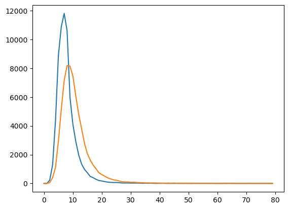

# 机器翻译Demo

## 数据准备


```python
import torch
import torch.nn as nn
 
# 直接读取
with open('data/有英语-中文普通话对应句 - 2024-03-24.tsv', encoding='utf-8') as f:
    lines = f.readlines()
print(lines[:5])
```

    ['\ufeff1277\tI have to go to sleep.\t2\t我该去睡觉了。\n', "1280\tToday is June 18th and it is Muiriel's birthday!\t5\t今天是６月１８号，也是Muiriel的生日！\n", '1282\tMuiriel is 20 now.\t7\tMuiriel现在20岁了。\n', '1283\tThe password is "Muiriel".\t8\t密码是"Muiriel"。\n', '1284\tI will be back soon.\t9\t我很快就會回來。\n']


```python
# 只读取有效内容
with open('data/有英语-中文普通话对应句 - 2024-03-24.tsv', encoding='utf-8') as f:
    data = []
    for line in f.readlines():
        data.append(line.strip().split('\t')[1]+'\t'+line.strip().split('\t')[3])
print(data[:5])
```

    ['I have to go to sleep.\t我该去睡觉了。', "Today is June 18th and it is Muiriel's birthday!\t今天是６月１８号，也是Muiriel的生日！", 'Muiriel is 20 now.\tMuiriel现在20岁了。', 'The password is "Muiriel".\t密码是"Muiriel"。', 'I will be back soon.\t我很快就會回來。']


```python
# 找出特殊字符
import re
import string
 
content = ''.join(data)
special_char = re.sub(r'[\u4e00-\u9fa5]', ' ', content)  # 匹配中文，将中文替换掉
 
print(set(special_char) - set(string.ascii_letters) - set(string.digits))
```

    {'、', '-', '@', 'ū', '（', 'ù', '\u202f', "'", '－', '！', '"', '。', '·', '「', '《', 'β', '𣬶', '\u200b', '»', '[', '!', 'é', '«', '﹐', '…', 'ç', '“', 'á', 'ń', '：', '–', 'ß', '﹣', 'ó', 'Ü', 'ö', 'α', '︀', ',', '°', '～', '—', 'ü', 'ã', '＂', '』', '」', 'ī', '‐', '？', '‘', 'ł', '⋯', 'ï', '\t', '€', '）', '８', '%', ')', '％', '６', 'ǎ', '》', '.', '『', 'Ｑ', 'ę', '$', '_', 'あ', 'ì', 'è', '０', '；', '”', '&', 'à', '’', 'ò', ':', '☭', '𣬠', ';', '１', '→', '+', 'а', 'ā', '/', '３', '(', '\xad', '‧', '─', 'í', '?', '•', '₣', '５', '，', '〇', ' ', ']', 'ō', '\u3000'}


## 数据清洗


```python
def cleaning(data):
    for i in range(len(data)):
        # 替换特殊字符
        data[i] = data[i].replace('\u200b', '')
        data[i] = data[i].replace('\u200f', '')
        data[i] = data[i].replace('\xad', '')
        data[i] = data[i].replace('\u3000', ' ')
        eng_mark = [',', '.', '!', '?'] # 因为标点前加空格
        for mark in eng_mark:
            data[i] = data[i].replace(mark, ' '+mark)
        data[i] = data[i].lower()  # 统一替换为小写
    return data
```


```python
cleaning(data)
```


    ['i have to go to sleep .\t我该去睡觉了。',
     "today is june 18th and it is muiriel's birthday !\t今天是６月１８号，也是muiriel的生日！",
     'muiriel is 20 now .\tmuiriel现在20岁了。',
     'the password is "muiriel" .\t密码是"muiriel"。',
     'i will be back soon .\t我很快就會回來。',
     "i'm at a loss for words .\t我不知道應該說什麼才好。",
     ...]


```python
def tokenize(data):
    # 分别存储源语言和目标语言的词元
    src_tokens, tgt_tokens = [], []
    for line in data:
        pair = line.split('\t')
        src = pair[0].split(' ')
        tgt = list(pair[1])
        src_tokens.append(src)
        tgt_tokens.append(tgt)
    return src_tokens, tgt_tokens
 
src_tokens, tgt_tokens = tokenize(data)
print("src:", src_tokens[:6])
print("tgt:", tgt_tokens[:6])
```

    src: [['i', 'have', 'to', 'go', 'to', 'sleep', '.'], ['today', 'is', 'june', '18th', 'and', 'it', 'is', "muiriel's", 'birthday', '!'], ['muiriel', 'is', '20', 'now', '.'], ['the', 'password', 'is', '"muiriel"', '.'], ['i', 'will', 'be', 'back', 'soon', '.'], ["i'm", 'at', 'a', 'loss', 'for', 'words', '.']]
    tgt: [['我', '该', '去', '睡', '觉', '了', '。'], ['今', '天', '是', '６', '月', '１', '８', '号', '，', '也', '是', 'm', 'u', 'i', 'r', 'i', 'e', 'l', '的', '生', '日', '！'], ['m', 'u', 'i', 'r', 'i', 'e', 'l', '现', '在', '2', '0', '岁', '了', '。'], ['密', '码', '是', '"', 'm', 'u', 'i', 'r', 'i', 'e', 'l', '"', '。'], ['我', '很', '快', '就', '會', '回', '來', '。'], ['我', '不', '知', '道', '應', '該', '說', '什', '麼', '才', '好', '。']]

在自然语言处理（NLP）中，"token"指的是文本中的一个单位，它可以是一个词、一个字符、或者是文本中的其他可分割的元素。例如，在处理句子时，通常会将句子分割成多个单词和标点符号，这些单词和标点符号就是tokens。这个过程称为分词（tokenization），它是NLP中的基本步骤之一，有助于将长文本转换为更易于分析和处理的小部分。例如，句子 "I like apples." 可以被分割成tokens "I", "like", "apples", 和 "."。

```python
import numpy as np
def statistics(tokens):
    max_len = 80 #只统计长度80以下的
    len_list = range(max_len)  # 长度值
    freq_list = np.zeros(max_len)  # 频率值
    for token in tokens:
        if len(token) < max_len:
            freq_list[len_list.index(len(token))] += 1
    return len_list, freq_list
 
s1, s2 = statistics(src_tokens)
t1, t2 = statistics(tgt_tokens)
```


```python
import matplotlib.pyplot as plt
plt.plot(s1,s2)
plt.plot(t1,t2)
```


    [<matplotlib.lines.Line2D at 0x28442ac50>]



    


## 构建词表


```python
from collections import Counter  #计数类
 
flatten = lambda l: [item for sublist in l for item in sublist]  #展平数组
 
# 构建词表
class Vocab: # 主要用于文本处理中的词汇索引
    def __init__(self, tokens):
        self.tokens = tokens  # 传入的tokens是二维列表
        self.token2index = {'<bos>': 0, '<eos>': 1, '<unk>':2, '<pad>':3}  # 先存好特殊词元
        # 将词元按词频排序后生成列表
        self.token2index.update({
            token: index + 4
            for index, (token, freq) in enumerate(
                sorted(Counter(flatten(self.tokens)).items(), key=lambda x: x[1], reverse=True))
        }) 
        #构建id到词元字典
        self.index2token = {index: token for token, index in self.token2index.items()}
 
    def __getitem__(self, query):
        # 单一索引
        if isinstance(query, (str, int)):
            if isinstance(query, str):
                return self.token2index.get(query, 0)
            elif isinstance(query, (int)):
                return self.index2token.get(query, '<unk>')
        # 数组索引
        elif isinstance(query, (list, tuple)):
            return [self.__getitem__(item) for item in query]
 
    def __len__(self):
        return len(self.index2token)
```

self.token2index 的意思：

这行代码初始化了一个名为 `self.token2index` 的字典，在 `Vocab` 类中用于存储词元（token）到索引（index）的映射关系。这里设定的是一些特殊的词元及其对应的索引值：

- `'<bos>'`: Begin Of Sentence 的缩写，表示句子的开始，赋予索引值 `0`。
- `'<eos>'`: End Of Sentence 的缩写，表示句子的结束，赋予索引值 `1`。
- `'<unk>'`: Unknown 的缩写，表示未知词元，即不在词汇表中的词，赋予索引值 `2`。
- `'<pad>'`: Padding 的缩写，用于句子长度对齐时填充空缺的位置，赋予索引值 `3`。


## 构建数据集


```python
from torch.utils.data import DataLoader, TensorDataset
 
seq_len = 48  # 序列最大长度
 
# 对数据按照最大长度进行截断和填充
def padding(tokens, seq_len):
    # 该函数针对单个句子进行处理
    # 传入的句子是词元形式
    return tokens[:seq_len] if len(tokens) > seq_len else tokens + ['<pad>'] * (seq_len - len(tokens))
 
#实例化source和target词表
src_vocab, tgt_vocab = Vocab(src_tokens), Vocab(tgt_tokens)
 
#增加结尾标识<eos>
src_data = torch.tensor([src_vocab[padding(line + ['<eos>'], seq_len)] for line in src_tokens])
tgt_data = torch.tensor([tgt_vocab[padding(line + ['<eos>'], seq_len)] for line in tgt_tokens])
 
# 训练集和测试集比例8比2，batch_size = 16
train_size = int(len(src_data) * 0.8)
test_size = len(src_data) - train_size
batch_size = 256
 
train_loader = DataLoader(TensorDataset(src_data[:train_size], tgt_data[:train_size]), batch_size=batch_size)
test_loader = DataLoader(TensorDataset(src_data[-test_size:], tgt_data[-test_size:]), batch_size=1)
```

### 代码流程解析

1. **实例化词汇表**：对源 (`src_tokens`) 和目标 (`tgt_tokens`) 数据集分别实例化 `Vocab` 类，创建词汇表。
2. **数据预处理与转换**：使用 `padding` 函数处理数据长度，确保统一长度，并将文本数据转换为索引形式，同时在每个句子末尾添加 `<eos>` 标记。
3. **构建数据加载器**：根据训练和测试集的大小，使用 `DataLoader` 和 `TensorDataset` 构造数据加载器，以便在模型训练和测试时批量加载数据。


代码解释：

通过 `Vocab` 类的实例化，为源语言 (`src_tokens`) 和目标语言 (`tgt_tokens`) 分别创建词汇表 (`src_vocab` 和 `tgt_vocab`)。这个过程包括统计词频、建立词元到索引的映射，并处理特殊词元。

`padding` 函数用于将每个句子的长度规范化到固定的序列长度 (`seq_len`)。这包括截断过长的句子或用 `<pad>` 填充过短的句子，以确保所有句子的长度一致。

使用 `src_vocab` 和 `tgt_vocab` 将文本数据转换为索引表示。对于源数据和目标数据中的每个句子，首先应用 `padding` 函数进行长度规范化，并添加 `<eos>` 标记表示句子的结束，然后通过词汇表将词元转换为对应的索引。

- 数据集被分为训练集和测试集，比例为8比2。
- 使用 `DataLoader` 和 `TensorDataset` 创建数据加载器。`train_loader` 用于训练数据，`test_loader` 用于测试数据。`batch_size` 设置为256，表示每个批次处理的数据量，而测试加载器的批量大小设置为1，可能是为了逐个评估模型性能。


# 模型训练

## 模型定义


```python
# 定义编码器
class Encoder(nn.Module):
 
    def __init__(self, vocab_size, ebd_size, hidden_size, num_layers):
        super().__init__()
        self.embedding = nn.Embedding(vocab_size, ebd_size, padding_idx=3)  # 将token表示为embedding
        self.gru = nn.GRU(ebd_size, hidden_size, num_layers=num_layers)
 
    def forward(self, encoder_inputs):
        # encoder_inputs从(batch_size, seq_len)变成(batch_size, seq_len, emb_size)再调整为(seq_len, batch_size, emb_size)
        encoder_inputs = self.embedding(encoder_inputs).permute(1, 0, 2)
        output, hidden = self.gru(encoder_inputs)
        # hidden 的形状为 (num_layers, batch_size, hidden_size)
        # 最后时刻的最后一个隐层的输出的隐状态即为上下文向量
        return hidden
 
# 定义解码器
class Decoder(nn.Module):
 
    def __init__(self, vocab_size, ebd_size, hidden_size, num_layers):
        super().__init__()
        self.embedding = nn.Embedding(vocab_size, ebd_size, padding_idx=3)
        # 拼接维度ebd_size + hidden_size
        self.gru = nn.GRU(ebd_size + hidden_size, hidden_size, num_layers=num_layers)
        self.linear = nn.Linear(hidden_size, vocab_size)
 
    def forward(self, decoder_inputs, encoder_states):
        '''
            decoder_inputs 为目标序列偏移一位的结果, 由初始形状: (batch_size, seq_len)变为(batch_size, seq_len)
            再调整为(batch_size, seq_len, emb_size) -> (seq_len, batch_size, emb_size)
        '''
        decoder_inputs = self.embedding(decoder_inputs).permute(1, 0, 2)
        context = encoder_states[-1] # 上下文向量取编码器的最后一个隐层的输出
        # context 初始形状为 (batch_size, hidden_size)，为下一步连接，需repeat为(seq_len, batch_size, hidden_size)形式 
        context = context.repeat(decoder_inputs.shape[0], 1, 1)
        output, hidden = self.gru(torch.cat((decoder_inputs, context), -1), encoder_states)
        # logits 的形状为 (seq_len, batch_size, vocab_size)
        logits = self.linear(output)
        return logits, hidden
 
# seq2seq模型
class Seq2Seq(nn.Module):
 
    def __init__(self, encoder, decoder):
        super().__init__()
        self.encoder = encoder
        self.decoder = decoder
 
    def forward(self, encoder_inputs, decoder_inputs):
        return self.decoder(decoder_inputs, self.encoder(encoder_inputs))
```

## 模型训练


```python
from tqdm import *
import matplotlib.pyplot as plt
 
# 设置是否使用GPU
device = 'mps' if torch.cuda.is_available() else 'cpu'
 
# 设置超参数
lr = 0.001
num_epochs = 50
hidden_size = 256
 
# 建立模型
encoder = Encoder(len(src_vocab), len(src_vocab), hidden_size, num_layers=2)
decoder = Decoder(len(tgt_vocab), len(tgt_vocab), hidden_size, num_layers=2)
model = Seq2Seq(encoder, decoder)
model.to(device)
 
# 交叉熵损失及adam优化器
criterion = nn.CrossEntropyLoss(reduction='none', ignore_index =3)
optimizer = torch.optim.Adam(model.parameters(), lr=lr)
 
# 记录损失变化
loss_history = []
 
#开始训练
model.train()
for epoch in tqdm(range(num_epochs)):
    for encoder_inputs, decoder_targets in train_loader:
        encoder_inputs, decoder_targets = encoder_inputs.to(device), decoder_targets.to(device)
        # 偏移一位作为decoder的输入
        # decoder的输入第一位是<bos>
        bos_column = torch.tensor([tgt_vocab['<bos>']] * decoder_targets.shape[0]).reshape(-1, 1).to(device)
        decoder_inputs = torch.cat((bos_column, decoder_targets[:, :-1]), dim=1)
        # pred的形状为 (seq_len, batch_size, vocab_size)
        pred, _ = model(encoder_inputs, decoder_inputs)
        # decoder_targets 的形状为 (batch_size, seq_len)，我们需要改变pred的形状以保证它能够正确输入
        # loss 的形状为 (batch_size, seq_len)，其中的每个元素都代表了一个词元的损失
        loss = criterion(pred.permute(1, 2, 0), decoder_targets).mean()
 
        # 反向传播
        optimizer.zero_grad()
        loss.backward()
        optimizer.step()
        loss_history.append(loss.item())
```

      4%|▍         | 2/50 [35:50<14:20:17, 1075.36s/it]
    
    KeyboardInterrupt


```python
plt.plot(loss_history)
plt.ylabel('train loss')
plt.show()
```

## 模型保存


```python
# 保存模型
torch.save(model.state_dict(), 'seq2seq_params.pt')
```

## 模型评估


```python
import math
# 计算bleu分数
def bleu(label, pred, n):
    score = math.exp(min(0, 1 - len(label) / len(pred)))
    for k in range(1, n + 1):
        num_matches = 0
        hashtable = Counter([' '.join(label[i:i + k]) for i in range(len(label) - k + 1)])
        for i in range(len(pred) - k + 1):
            ngram = ' '.join(pred[i:i + k])
            if ngram in hashtable and hashtable[ngram] > 0:
                num_matches += 1
                hashtable[ngram] -= 1
        score *= pow(num_matches / (len(pred) - k + 1), pow(0.5, k))
    return score
```

## 测试集评估 


```python
model.eval()
translation_results = []
bleu_scores = []
# 因为batch_size是1，所以每次取出来的都是单个句子
for src_seq, tgt_seq in test_loader:
    encoder_inputs = src_seq
    hidden = model.encoder(encoder_inputs.to(device))
    pred_seq = [tgt_vocab['<bos>']]
    for _ in range(8):
        # 一步步输出，decoder的输入的形状为(batch_size, seq_len)=(1,1)
        decoder_inputs = torch.tensor(pred_seq[-1]).reshape(1, 1).to(device)
        # pred形状为 (seq_len, batch_size, vocab_size) = (1, 1, vocab_size)
        pred, hidden = model.decoder(decoder_inputs, hidden)
        next_token_index = pred.squeeze().argmax().item()
        if next_token_index == tgt_vocab['<eos>']:
            break
        pred_seq.append(next_token_index)
    
    # 去掉开头的<bos>
    pred_seq = tgt_vocab[pred_seq[1:]]
    # 因为tgt_seq的形状为(1, seq_len)，我们需要将其转化成(seq_len, )的形状
    tgt_seq = tgt_seq.squeeze().tolist()
    
    # 需要注意在<eos>之前截断
    if tgt_vocab['<eos>'] in tgt_seq:
        eos_idx = tgt_seq.index(tgt_vocab['<eos>'])
        tgt_seq = tgt_vocab[tgt_seq[:eos_idx]]
    else:
        tgt_seq = tgt_vocab[tgt_seq]
    translation_results.append((' '.join(tgt_seq), ' '.join(pred_seq)))
    bleu_scores.append(bleu(tgt_seq, pred_seq, n=2))
```


```python
print(sum(bleu_scores) / test_size)
```

# 模型效果


```python
translation_results
```

