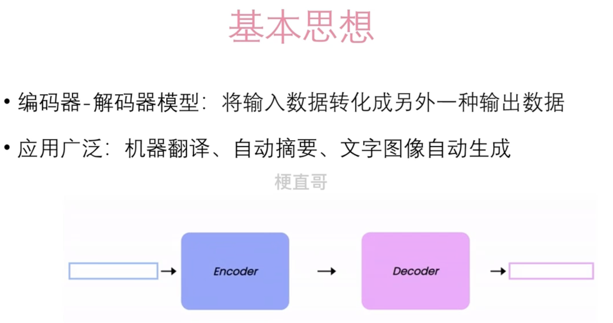
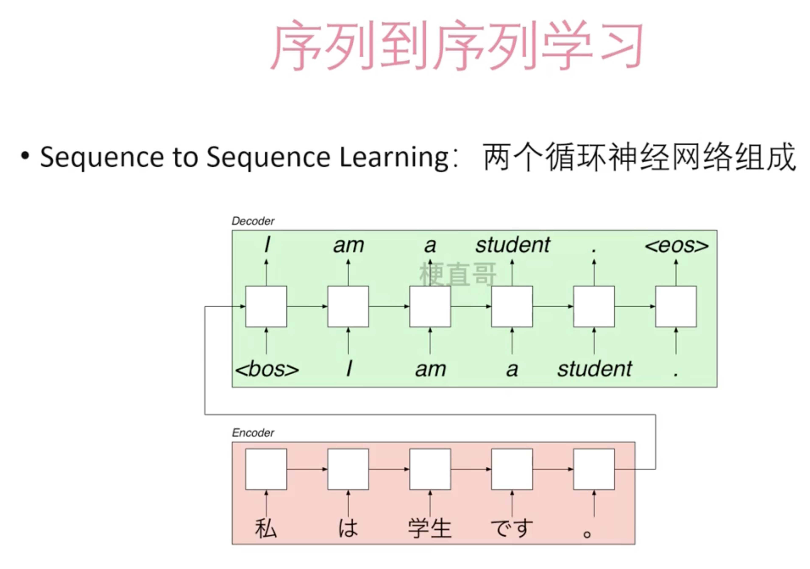
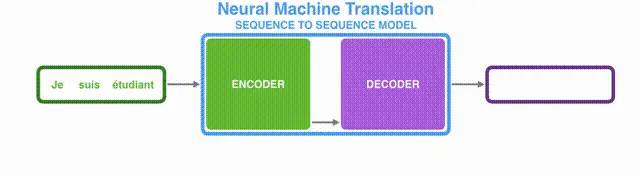
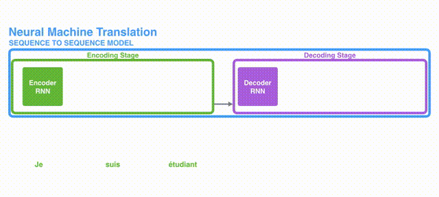
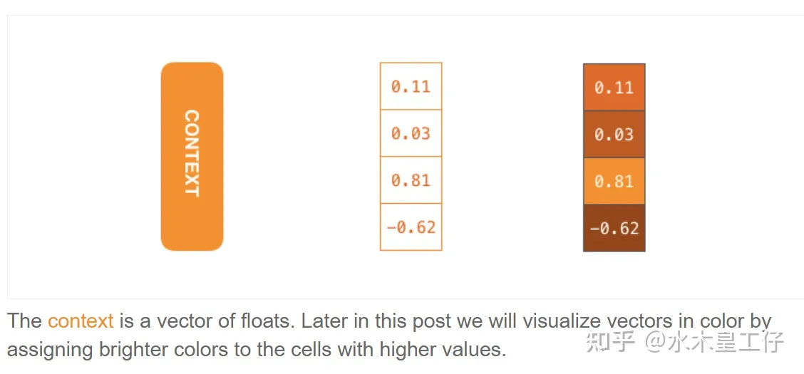
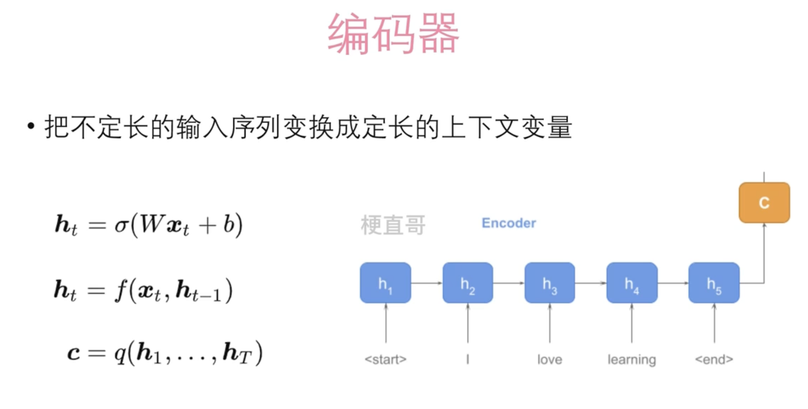
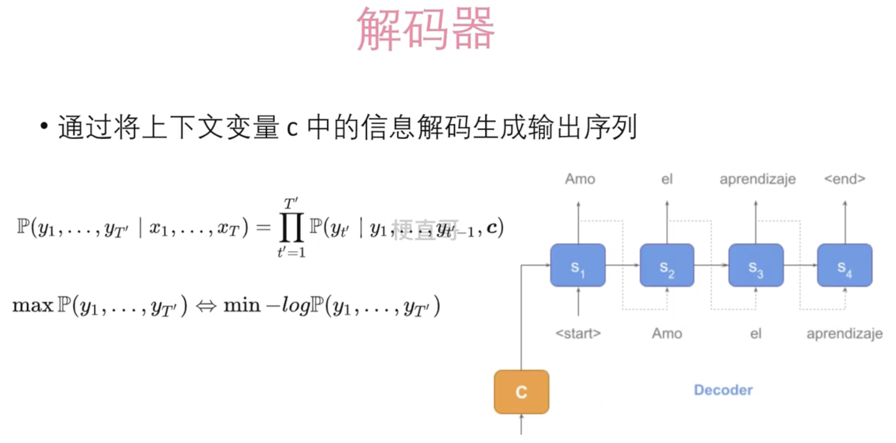

# 编码器-解码器网络

编码器-解码器结构又可以称之为：

这里我们举两个例子：

- 机器翻译：把一种语言翻译成另一种语言
- 语音识别：把一段语音识别出来，用文字表示

两个例子都有一个共同的特点，就是我们**输入一段序列，然后输出也是一段序列**，很好理解，正所谓`Sequence-to-sequence`

- Encoder
  可以看成是编码器，对序列的每个单词（文字）进行编码处理，并通过**RNN**结构传递信息，最后，整句话变成了一个向量，即上图中的**context**
- **Context**
  从上面的gif，我们可以很清晰的知道，context这个向量其实就是Encoder最后一个RNN隐藏层的输出hn
  而这个向量给我们的**直觉想法**是：**包含了整一句话的所有信息**
  例子：
  假设我们输入是“You are my friends”, 我们最终训练的encoder会把这个句子转换成一个向量
  这个向量经过训练，会变得**特别**，因为decoder一看到，它就能知道出这个向量对应的就是这个句子“You are my friends”

- Decoder
  解码器，这个时候的任务就相当于我们输入了一个带有整个句子的向量，然后输出一串序列。

## 编码器

编码器是将输入序列转换为固定长度的表示（通常是隐藏状态或上下文向量）的部分。它的作用是将输入序列的信息进行编码和压缩，以捕获输入序列的语义和语法特征，并生成一个上下文向量或隐藏状态，以便后续解码器使用。编码器通常由 RNN、LSTM 或者 Transformer 的编码器层组成，它会逐步处理输入序列的每个时间步，并生成一个综合的表示，以包含输入序列的信息。

## 解码器

解码器是将编码器生成的上下文向量或隐藏状态转换为目标序列的部分。它的作用是将编码器生成的表示解码成目标序列，通过对上下文向量或隐藏状态进行逐步处理，生成目标序列的每个时间步的预测结果。解码器通常也由 RNN、LSTM 或者 Transformer 的解码器层组成，它会逐步生成目标序列的每个时间步的输出，直到生成整个目标序列。

通俗地说，编码器就像是把输入序列的信息“压缩”成一个固定长度的语义表示，而解码器则像是从这个语义表示中“解压”出目标序列。编码器和解码器共同组成了序列到序列模型，使其能够处理序列之间的转换任务，如机器翻译、文本摘要、语音识别