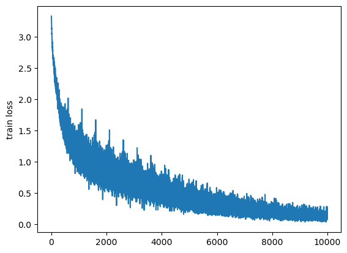

# 模型架构

## 编码器


```python
import torch
import torch.nn as nn
 
class Encoder(nn.Module):
    def __init__(self, input_size, hidden_size, num_layers):
        super(Encoder, self).__init__()
        self.lstm = nn.LSTM(input_size, hidden_size, num_layers) # LSTM模型
    
    def forward(self, x, hidden):
        x, hidden = self.lstm(x, hidden)
        return hidden  # 只需要输出hidden
```

## 解码器


```python
class Decoder(nn.Module):
    def __init__(self, output_size, hidden_size, num_layers):
        super(Decoder, self).__init__()
        self.lstm = nn.LSTM(output_size, hidden_size, num_layers)  # LSTM模型
        self.linear = nn.Linear(hidden_size, output_size)
    
    def forward(self, x, hidden):
        x, state = self.lstm(x, hidden)
        x = self.linear(x)
        return x, state
```

## seq2seq模型


```python
class Seq2Seq(nn.Module):
 
    def __init__(self, encoder, decoder):
        super().__init__()
        self.encoder = encoder
        self.decoder = decoder
 
    def forward(self, encoder_inputs, decoder_inputs):
        return self.decoder(decoder_inputs, self.encoder(encoder_inputs))
```

`return self.decoder(decoder_inputs, self.encoder(encoder_inputs))`：在前向传播过程中，首先将编码器输入 `encoder_inputs` 传递给编码器 `self.encoder` 进行编码，得到编码器的输出结果。然后将编码器的输出结果作为解码器的输入，同时传入解码器输入 `decoder_inputs`，调用解码器 `self.decoder` 进行解码。最终，将解码器的输出作为前向传播的结果返回。

## 序列到序列模型简单实现

###  数据集准备


```python
import random
 
# 数据集生成
soundmark = ['ei',  'bi:',  'si:',  'di:',  'i:',  'ef',  'dʒi:',  'eit∫',  'ai', 'dʒei', 'kei', 'el', 'em', 'en', 'əu', 'pi:', 'kju:',
        'ɑ:', 'es', 'ti:', 'ju:', 'vi:', 'd∧blju:', 'eks', 'wai', 'zi:']
 
alphabet = ['a','b','c','d','e','f','g','h','i','j','k','l','m','n','o','p','q',
         'r','s','t','u','v','w','x','y','z']
 
t = 10000 #总条数
r = 0.9   #扰动项（它允许数据包含一定程度的错误，即在目标序列中允许一定比例的字母错误）
seq_len = 6
src_tokens, tgt_tokens = [],[] #原始序列、目标序列列表
 
for i in range(t):
    src, tgt = [],[]
    for j in range(seq_len):
        ind = random.randint(0,25) #随机生成一个范围在 0 到 25 之间的索引，用于从 soundmark 和 alphabet 中随机选择元素。
        src.append(soundmark[ind])
        if random.random() < r:
            tgt.append(alphabet[ind])
        else:
            tgt.append(alphabet[random.randint(0,25)])
    src_tokens.append(src)
    tgt_tokens.append(tgt)
src_tokens[:2], tgt_tokens[:2]
```


    ([['ei', 'dʒi:', 'pi:', 'dʒei', 'eit∫', 'dʒei'],
      ['ju:', 'di:', 'di:', 'ju:', 'wai', 'dʒi:']],
     [['x', 'g', 'p', 'j', 'h', 'j'], ['u', 'd', 'd', 'u', 'y', 'g']])

`tgt.append(alphabet[ind])` 和 `tgt.append(alphabet[random.randint(0,25)])`：根据扰动项的大小，分别将从 `alphabet` 中随机选择的字母或者原始音标符号添加到目标序列中。


```python
from collections import Counter                                      #计数类
 
flatten = lambda l: [item for sublist in l for item in sublist]      #展平数组
 
# 构建词表
class Vocab:
    def __init__(self, tokens):
        self.tokens = tokens  # 传入的tokens是二维列表
        self.token2index = {'<bos>': 0, '<eos>': 1}  # 先存好特殊词元
        # 将词元按词频排序后生成列表
        self.token2index.update({
            token: index + 2
            for index, (token, freq) in enumerate(
                sorted(Counter(flatten(self.tokens)).items(), key=lambda x: x[1], reverse=True)) #统计所有词元的频次，并按照频次从高到低进行排序。
        }) 
        #构建id到词元字典
        self.index2token = {index: token for token, index in self.token2index.items()}
 
    def __getitem__(self, query):
        # 单一索引
        if isinstance(query, (str, int)):
            if isinstance(query, str):
                return self.token2index.get(query, 0)
            elif isinstance(query, (int)):
                return self.index2token.get(query, '<unk>')
        # 数组索引
        elif isinstance(query, (list, tuple)):
            return [self.__getitem__(item) for item in query]
 
    def __len__(self):
        return len(self.index2token)
```


```python
from torch.utils.data import DataLoader, TensorDataset
 
#实例化source和target词表
src_vocab, tgt_vocab = Vocab(src_tokens), Vocab(tgt_tokens)
 
#增加结尾标识<eos>
src_data = torch.tensor([src_vocab[line + ['<eos>']] for line in src_tokens])
tgt_data = torch.tensor([tgt_vocab[line + ['<eos>']] for line in tgt_tokens])
 
# 训练集和测试集比例8比2，batch_size = 16
train_size = int(len(src_data) * 0.8)
test_size = len(src_data) - train_size
batch_size = 16
 
train_loader = DataLoader(TensorDataset(src_data[:train_size], tgt_data[:train_size]), batch_size=batch_size)
test_loader = DataLoader(TensorDataset(src_data[-test_size:], tgt_data[-test_size:]), batch_size=1)
```

##  Embedding


```python
# 重新定义编码器
class Encoder(nn.Module):
 
    def __init__(self, vocab_size, ebd_size, hidden_size, num_layers):
        super().__init__()
        self.embedding = nn.Embedding(vocab_size, ebd_size)  # 将token表示为embedding，nn.Embedding(num_embeddings, embedding_dim)
        self.gru = nn.GRU(ebd_size, hidden_size, num_layers=num_layers)
 
    def forward(self, encoder_inputs):
        # encoder_inputs从(batch_size, seq_len)变成(batch_size, seq_len, emb_size)再调整为(seq_len, batch_size, emb_size)
        encoder_inputs = self.embedding(encoder_inputs).permute(1, 0, 2)
        output, hidden = self.gru(encoder_inputs)
        # hidden 的形状为 (num_layers, batch_size, hidden_size)
        # 最后时刻的最后一个隐层的输出的隐状态即为上下文向量
        return hidden
 
# 定义解码器
class Decoder(nn.Module):
 
    def __init__(self, vocab_size, ebd_size, hidden_size, num_layers):
        super().__init__()
        self.embedding = nn.Embedding(vocab_size, ebd_size)
        # 拼接维度ebd_size + hidden_size
        self.gru = nn.GRU(ebd_size + hidden_size, hidden_size, num_layers=num_layers)
        self.linear = nn.Linear(hidden_size, vocab_size)
 
    def forward(self, decoder_inputs, encoder_states):
        '''
            decoder_inputs 为目标序列偏移一位的结果, 由初始形状: (batch_size, seq_len)变为(batch_size, seq_len)
            再调整为(batch_size, seq_len, emb_size) -> (seq_len, batch_size, emb_size)
        '''
        decoder_inputs = self.embedding(decoder_inputs).permute(1, 0, 2)
        context = encoder_states[-1] # 上下文向量取编码器的最后一个隐层的输出
        # context 初始形状为 (batch_size, hidden_size)，为下一步连接，需repeat为(seq_len, batch_size, hidden_size)形式 
        context = context.repeat(decoder_inputs.shape[0], 1, 1)
        output, hidden = self.gru(torch.cat((decoder_inputs, context), -1), encoder_states)
        # logits 的形状为 (seq_len, batch_size, vocab_size)
        logits = self.linear(output)
        return logits, hidden
 
# seq2seq模型
class Seq2Seq(nn.Module):
 
    def __init__(self, encoder, decoder):
        super().__init__()
        self.encoder = encoder
        self.decoder = decoder
 
    def forward(self, encoder_inputs, decoder_inputs):
        return self.decoder(decoder_inputs, self.encoder(encoder_inputs))
```

permute的用法：

`.permute(1, 0, 2)` 对结果进行了维度变换。在 PyTorch 中，`permute` 函数用于交换张量的维度顺序。具体来说，`(1, 0, 2)` 表示将原始张量的第 1 维和第 0 维进行交换，不改变第 2 维的顺序。


```python
ebd= nn.Embedding(26, 26)
ebd(train_loader.dataset[0][0])
```


    tensor([[ 1.2756, -0.1548, -1.3601,  0.0189,  0.9716, -0.4070,  0.6169, -2.1689,
              1.3380, -1.5147,  0.5535,  0.8617, -0.0094,  0.6591,  0.5169, -0.1720,
             -1.1941, -1.6587,  2.5740,  0.0976, -0.9560, -1.4442, -0.7586, -0.7299,
             -1.5970, -1.1424],
            [-0.5799,  0.8449, -0.1164,  0.3736, -0.1405, -0.0770, -0.8993,  0.0637,
             -0.3074,  0.7223, -0.3718, -1.9197,  0.0968,  0.4022, -0.8578,  0.6983,
              0.1852,  0.6925, -1.4228,  0.7490, -0.0307, -0.6924,  0.0999, -0.3168,
              0.1281, -0.3387],
            [-0.0855, -0.1539, -1.7417, -0.4592, -1.2866, -1.0138, -0.6736,  0.4337,
              0.4113, -0.4300,  0.4491,  1.2216,  0.6607, -0.2943,  1.2285,  0.8388,
              0.8471,  0.0633,  0.4941,  0.0798, -0.4052,  1.5479, -0.2920,  0.0567,
              0.5528, -1.8597],
            [-1.2787,  0.7987, -0.4662,  0.6315,  1.6673, -0.0188,  1.2168,  2.2568,
              0.7547, -0.8308,  0.1295, -0.1750, -0.2710,  0.2820, -0.3965,  0.7933,
             -0.3111, -0.7171,  0.4347, -0.1621, -0.4853, -0.7407,  0.5275, -1.3354,
              1.3400,  1.1600],
            [ 0.4280,  1.4332, -1.9206, -0.5864,  0.0674,  0.6710, -0.6213,  0.1450,
             -0.0925, -0.1592, -0.7304,  0.3792,  0.1028,  0.5408, -0.0331, -0.0429,
              1.7340, -1.5804, -0.8560, -0.6223, -0.7459, -0.8509, -0.1178, -0.0922,
             -2.4307,  0.9100],
            [-1.2787,  0.7987, -0.4662,  0.6315,  1.6673, -0.0188,  1.2168,  2.2568,
              0.7547, -0.8308,  0.1295, -0.1750, -0.2710,  0.2820, -0.3965,  0.7933,
             -0.3111, -0.7171,  0.4347, -0.1621, -0.4853, -0.7407,  0.5275, -1.3354,
              1.3400,  1.1600],
            [ 1.4553, -0.4552,  0.7710,  0.1266, -1.5015, -2.3811,  0.3776,  0.1117,
              1.2284, -1.0054, -0.8033, -1.6287,  0.3196, -0.1327, -0.1090,  0.6805,
              2.0822, -0.3174,  0.0489, -1.2514, -0.1207,  1.1336, -0.0989,  1.2250,
             -0.3619,  0.6509]], grad_fn=<EmbeddingBackward0>)


## 模型训练


```python
from tqdm import *
import matplotlib.pyplot as plt
 
# 设置超参数
lr = 0.001
num_epochs = 20
hidden_size = 128
 
# 建立模型
encoder = Encoder(len(src_vocab), len(src_vocab), hidden_size, num_layers=2)
decoder = Decoder(len(tgt_vocab), len(tgt_vocab), hidden_size, num_layers=2)
model = Seq2Seq(encoder, decoder)
 
# 交叉熵损失及adam优化器
criterion = nn.CrossEntropyLoss(reduction='none')
optimizer = torch.optim.Adam(model.parameters(), lr=lr)
 
# 记录损失变化
loss_history = []
 
#开始训练
model.train()
for epoch in tqdm(range(num_epochs)):
    for encoder_inputs, decoder_targets in train_loader:
        encoder_inputs, decoder_targets = encoder_inputs, decoder_targets
        # 偏移一位作为decoder的输入
        # decoder的输入第一位是<bos>
        bos_column = torch.tensor([tgt_vocab['<bos>']] * decoder_targets.shape[0]).reshape(-1, 1)
        decoder_inputs = torch.cat((bos_column, decoder_targets[:, :-1]), dim=1)
        # pred的形状为 (seq_len, batch_size, vocab_size)
        pred, _ = model(encoder_inputs, decoder_inputs)
        # decoder_targets 的形状为 (batch_size, seq_len)，我们需要改变pred的形状以保证它能够正确输入
        # loss 的形状为 (batch_size, seq_len)，其中的每个元素都代表了一个词元的损失
        loss = criterion(pred.permute(1, 2, 0), decoder_targets).mean()
 
        # 反向传播
        optimizer.zero_grad()
        loss.backward()
        optimizer.step()
        loss_history.append(loss.item())
 
```

    100%|██████████| 20/20 [04:45<00:00, 14.25s/it]


```python
plt.plot(loss_history)
plt.ylabel('train loss')
plt.show()
```


​    

​    


##  模型验证


```python
model.eval()
translation_results = []
 
correct = 0
error = 0
# 因为batch_size是1，所以每次取出来的都是单个句子
for src_seq, tgt_seq in test_loader:
    encoder_inputs = src_seq
    hidden = model.encoder(encoder_inputs)
    pred_seq = [tgt_vocab['<bos>']]
    for _ in range(8):
        # 一步步输出，decoder的输入的形状为(batch_size, seq_len)=(1,1)
        decoder_inputs = torch.tensor(pred_seq[-1]).reshape(1, 1)
        # pred形状为 (seq_len, batch_size, vocab_size) = (1, 1, vocab_size)
        pred, hidden = model.decoder(decoder_inputs, hidden)
        next_token_index = pred.squeeze().argmax().item()
        if next_token_index == tgt_vocab['<eos>']:
            break
        pred_seq.append(next_token_index)
    
    # 去掉开头的<bos>
    pred_seq = tgt_vocab[pred_seq[1:]]
    # 因为tgt_seq的形状为(1, seq_len)，我们需要将其转化成(seq_len, )的形状
    tgt_seq = tgt_seq.squeeze().tolist()
    
    # 需要注意在<eos>之前截断
    if tgt_vocab['<eos>'] in tgt_seq:
        eos_idx = tgt_seq.index(tgt_vocab['<eos>'])
        tgt_seq = tgt_vocab[tgt_seq[:eos_idx]]
    else:
        tgt_seq = tgt_vocab[tgt_seq]
    translation_results.append((' '.join(tgt_seq), ' '.join(pred_seq)))
    
    for i in range(len(tgt_seq)):
        if i >= len(pred_seq) or pred_seq[i] != tgt_seq[i]:
            error += 1
        else:
            correct += 1
 
print(correct/(correct+error))
```

    0.44633333333333336


```python
translation_results
```


    [('f t x t v v', 'f t x d v y'),
     ('m r m k i y', 'm m s i c a'),
     ('e m i e c k', 'e m s e v k'),
     ('d m m r k b', 'd m m r d e'),
     ('a h w m h o', 'h a w h m s'),
     ('m n p f t k', 'm d t f y k'),
     ('v x j g n x', 'v x g n q v'),
     ('x i j h c n', 'x i f y h u'),
     ('s o m t d b', 's o m i l c'),
     ('o a p o p o', 'o a p o h s'),
     ('g c r s b b', 'g c c s i c'),
     ('a o x l x v', 'a o f l i'),
     ('y h o b n p', 'y d o b c p'),
     ('l n d v b w', 'a c d f y h'),
     ('s n u k l e', 'n u k v q f'),
     ('h l v s u i', 'h h v s i e'),
     ('i u d b n e', 'i u d i e'),
     ('t d g s b k', 'l d g c b o'),
     ('w p w d d t', 'w p w d f h'),
     ('s w l d y t', 's w m r d t'),
     ('r t t e p b', 'r t p b v w'),
     ('n w x p c v', 'n v x w c u'),
     ('c g g w b d', 'c g z w b t'),
     ('i s r z m g', 'i s r q m g'),
     ('d o m j k b', 'y m o j z b'),
     ('u o h v c p', 'u o e h m x'),
     ('j x w u c t', 'j x w u b t'),
     ('w z c t u i', 'w z n k u g'),
     ('m l g a c g', 's r a g z e'),
     ('h p v q b y', 'h p v q b y'),
     ('c j p j t o', 'c m p j t s'),
     ('j k l w p y', 'j k w l m h'),
     ('l i v r m t', 'l i v r h t'),
     ('w b y o p n', 'd b q d r m'),
     ('x v j m l x', 'x v j m l i'),
     ('g x m r x m', 'u x m r x v'),
     ('h q p l x b', 'h h p l e i'),
     ('i r g a n b', 'i r g l a f'),
     ('l b k i u n', 'l b k i s c'),
     ('e r j z f u', 'p r t q f a'),
     ('i i o r t z', 'i i r n q v'),
     ('c m m a r v', 'c m o x v z'),
     ('x r c f g q', 'x r c f p s'),
     ('k g b b s j', 'a g o b t k'),
     ('j u f n n r', 'u j f n u r'),
     ('n f j i f d', 'n f b p f d'),
     ('e b b r q v', 'e b b x v z'),
     ('h m f y i o', 'h m f t i o'),
     ('l r d k b f', 'l d r e q d'),
     ('n f f r v n', 'n f v y r'),
     ('e y x z j s', 'e y x z j o'),
     ('q p v b g d', 'q p v b g w'),
     ('p u i r p p', 'p u i z x j'),
     ('z x v e o j', 'z x v e s j'),
     ('p k a k f g', 't a l f q u'),
     ('g w t s g t', 'g w y s h i'),
     ('i c r t y z', 'v c r x b y'),
     ('q p l t m s', 'q p l t m r'),
     ('j m q i f x', 'j c q i x c'),
     ('v m e l a w', 'v m e l r y'),
     ('v h o w i o', 'i h e y h o'),
     ('i v h a u a', 'v i v w s t'),
     ('z e g f n l', 'z e s f t e'),
     ('v f t n i q', 'v f t z l u'),
     ('b c q n h y', 'b q n c y a'),
     ('o d j v p e', 'y d f v a e'),
     ('e z p a f s', 'e z p b f k'),
     ('n t q q y e', 'n t q w y e'),
     ('l e p y q o', 'l z p c y u'),
     ('b w t q l t', 'b i w h b i'),
     ('n g z e x h', 'g z t h c q'),
     ('c o m z v h', 'c o g z h u'),
     ('p j h c c h', 'p y h g h s'),
     ('w a x p r j', 'w a x i r w'),
     ('q t q a t k', 'q t t d x f'),
     ('d h v h t z', 'd h v h k y'),
     ('w a n f d q', 'w h j f d e'),
     ('l f g p r a', 'l f p u b f'),
     ('r s n c x l', 'r h c d x i'),
     ('a c e b y f', 'a p e b v w'),
     ('a b v c l n', 'a n c v a s'),
     ('u b u u k b', 'u b v u z r'),
     ('f u u s t q', 'f u s v j i'),
     ('c x m e w m', 'c a m r e w'),
     ('u e l q s c', 'u n l e u z'),
     ('f n e v b b', 'f n e v k a'),
     ('m z y d z j', 'm y z m q f'),
     ('t c e b p v', 't c e o v y'),
     ('o e e s q v', 'e o e h g y'),
     ('s p c u v r', 's p c u g y'),
     ('q c x b j g', 'v c k b q v'),
     ('a j w c x c', 'a w j x z u'),
     ('g f t x a x', 'b f t o h g'),
     ('e n i f v v', 'e h i f v k'),
     ('e i u g k l', 'e i u g d e'),
     ('d z t x s d', 'd z x e d y'),
     ('g x e u x r', 'g e x h f y'),
     ('c x e f p c', 'c x f e d k'),
     ('y t i a z r', 'm t i p c r'),
     ('x j g c o v', 'x j g c o h'),
     ('t c h c l x', 't c z o c h'),
     ('u l p e o a', 'r e p o b'),
     ('c r h h f i', 'r c h g w x'),
     ('q o w y g j', 'q o y o n j'),
     ('d d s u s v', 'd d s u v k'),
     ('n n a z k f', 'n o a z f u'),
     ('k v w u u p', 'k v w u d h'),
     ('f n w u f q', 'n w f u h s'),
     ('r m h n e u', 'r m n h u f'),
     ('j z j m y i', 'z j m j x i'),
     ('f s n n g z', 'f s n w f'),
     ('m i x i a y', 'm i y i h o'),
     ('l b g u q x', 'l b g u c e'),
     ('n w e d q g', 'n e s u f g'),
     ('b m r t t o', 'c m r t q l'),
     ('h s y a j h', 'h s y a j f'),
     ('e y k k q y', 'm y a l c i'),
     ('n s h l y e', 'n s h c w e'),
     ('t b r l w m', 't b r f h y'),
     ('a c t s p j', 'c t k t b i'),
     ('p k d k g w', 'p k d f g e'),
     ('k n u f i y', 'k n f u y r'),
     ('u r x u q q', 'r v x d e'),
     ('q j h g i z', 'q h j g h y'),
     ('n w p a o e', 'n w p a o e'),
     ('j s n f y w', 'j n f y c k'),
     ('o q m z o c', 'o q m z o j'),
     ('o y m x t o', 'o y m x z o'),
     ('d v g l g h', 'd v g l h w'),
     ('o o h j r y', 'o s h j m z'),
     ('o w l j z k', 'o w l p z b'),
     ('x y a q i g', 'x y a q i g'),
     ('x s m e j w', 'x s i e f j'),
     ('s m c a k f', 's m a c r w'),
     ('n n n i n a', 'n v g n u v'),
     ('a t w q h i', 'a t w h e u'),
     ('v l g b g b', 'v l e g b u'),
     ('b y r d g o', 'y r y d g q'),
     ('y d y g n r', 'y d h g l r'),
     ('s y s s p e', 's y s s p z'),
     ('s a o d r j', 's a c d r w'),
     ('d h r c s b', 'd r v c h o'),
     ('q y p h d c', 'q y p h o c'),
     ('l y j o q b', 'l j y k m q'),
     ('s a e b j g', 's a b e r h'),
     ('v x r u s z', 'v r x u n z'),
     ('n d l y e h', 'd n y d c e'),
     ('b c w g k l', 'b c w g k s'),
     ('e f i v w t', 'e v f z m q'),
     ('l t j j r v', 'l p j j d y'),
     ('l a m w i i', 'l a w t f r'),
     ('g o m t e x', 'g o m t e u'),
     ('o y e s m w', 'o q m r t q'),
     ('m r i w z j', 'm i r w i c'),
     ('n i w t s s', 'n i w n g u'),
     ('g l m k w o', 'g t c d e e'),
     ('p w l q a s', 'p l w h b c'),
     ('g q e b h k', 'g q t e v i'),
     ('n k w u k a', 'n k s u n g'),
     ('z x l d c l', 'z x d c z o'),
     ('g i p t y a', 'g i p c u q'),
     ('t w u f g o', 't w u b g h'),
     ('h u n k c f', 'h h p o r j'),
     ('p v s g y b', 'p v e g h o'),
     ('f z q j z c', 'f q h j v q'),
     ('g e u l d a', 'g e p l c u'),
     ('e t l o y o', 'b e l o b h'),
     ('a g e s p i', 'a g e s t i'),
     ('u o s d h o', 'u s e g d q'),
     ('t s k j z w', 't s k j m g'),
     ('m g w z q h', 'm g p z o h'),
     ('v i h k w p', 'v i l p s f'),
     ('f y a r r f', 'f d a r j u'),
     ('u k q n i k', 'k u q n i o'),
     ('c x n t t c', 'c x n o y c'),
     ('b i a l n f', 'b i a l n i'),
     ('h v t e y w', 'h v t z u j'),
     ('v d z g x i', 'v p c k i q'),
     ('q z y w s h', 'q z m y h s'),
     ('i y e m z j', 'i e m z e j'),
     ('o v i b w p', 'o v i b w i'),
     ('v r d t n t', 'v r d t c e'),
     ('f n g f b c', 'f n i e u c'),
     ('d c n k n t', 'd c t k m f'),
     ('q x z g i y', 'x l q v b a'),
     ('d q m o n p', 'd j s u c k'),
     ('z h z s w a', 'z h z s j i'),
     ('m j u c n z', 'm j u c n o'),
     ('g p x t l w', 'p x t l e i'),
     ('w z c t v z', 'w b c p z s'),
     ('e v v g p r', 'e v h l r e'),
     ('q c i n r s', 'q c n q r w'),
     ('l c x a p c', 'l c a x d q'),
     ('s x v c p i', 's x v r q i'),
     ('h v x m p c', 'h x v a s e'),
     ('z l o c n m', 'i l o n u c'),
     ('r a d r m i', 'r d a y f q'),
     ('v q z f d d', 'v e b q d c'),
     ('q i o f r a', 'c o f s v k'),
     ('e m g z j v', 'm e g z o v'),
     ('x c d d o x', 'x n d z o'),
     ('m z g i q k', 'm z i q g h'),
     ('t f l z g f', 't f l z g q'),
     ('m h p w d e', 'm h p u z e'),
     ('t c y i g s', 't q g h o f'),
     ('y a e x k m', 'y a e f p s'),
     ('t s y b t l', 't y s u t l'),
     ('b j e u t k', 'b j e t s u'),
     ('f k y w z s', 'f k y w n s'),
     ('w s k e u e', 'w s a f r m'),
     ('q p l k w r', 'q o d v h r'),
     ('o k g i z l', 'o k g i l m'),
     ('t d p h b y', 't d p h b u'),
     ('d u d f g d', 'd u k j m z'),
     ('e n a o s a', 'e n o a s j'),
     ('m r u o x j', 's s i a s e'),
     ('k r w j f q', 'k r w g j u'),
     ('j k v p q s', 'j k v a q n'),
     ('l s p x w i', 'l p s x j i'),
     ('k h z j o s', 'k h z j m s'),
     ('q p n j e a', 'q p n j v y'),
     ('t t w r r j', 't q w r i q'),
     ('v v e q r r', 'v v e g b s'),
     ('m x n i i q', 'm x n i q f'),
     ('z d x p m q', 'z d x m z q'),
     ('h a d q k r', 'h d y i q r'),
     ('p g n n g w', 'p g n q p u'),
     ('u w u e p j', 'u w u e v i'),
     ('l b t f f n', 'm b t f d c'),
     ('d d q y z v', 'd d q y v c'),
     ('p g p v c k', 'p g p v q d'),
     ('e m e w z u', 'e m e z u e'),
     ('i o i w e l', 'i n w i e k'),
     ('l y q y a k', 'l y q m k j'),
     ('e d p e b t', 'e d p e b p'),
     ('j u q f x x', 'j u q f x a'),
     ('k e i w n t', 'e r i w n t'),
     ('o r q q m t', 'o r q d m j'),
     ('f f y h p u', 'f f y h t u'),
     ('u p r e w o', 'u p r e u w'),
     ('x l n j k p', 'x l c j p q'),
     ('q z r q n i', 'q z r q n u'),
     ('f t w u h n', 'f t w h r u'),
     ('v m t y v o', 'v m y t v s'),
     ('c d r t m b', 'c r w t c u'),
     ('k n b u z a', 'k n t v z a'),
     ('b k c k s p', 'b k c t b o'),
     ('p e f v q q', 'p e f v q r'),
     ('g h l i o a', 'g h l m i k'),
     ('q b m s p e', 'q b m s p g'),
     ('k c t j f r', 'k c t f m r'),
     ('g j h q r o', 'g j h y e u'),
     ('f e m j x j', 'f m c v t u'),
     ('b s j d m d', 'b j s m e a'),
     ('n b f z j p', 'n b f q v g'),
     ('w z l f o t', 'w k l g t q'),
     ('q z u a u o', 'q g z x v'),
     ('d e w k e j', 'd e k r t q'),
     ('c m v h h n', 'c m v h s u'),
     ('l n g u j i', 'n y g u q v'),
     ('b x e a p r', 'b x e p s r'),
     ('c n j j s s', 'c n j s p f'),
     ('z d p c y q', 'z d c p s u'),
     ('c z s z p c', 'c z l z e u'),
     ('q t z a u c', 't z l t u c'),
     ('s w n d s f', 's w c d w e'),
     ('t t z x p s', 't t z x i s'),
     ('n q n z y y', 'n q n z y v'),
     ('x d b r j q', 'x d r t d j'),
     ('p p c k j t', 'p c p k q f'),
     ('v b f f u q', 'v b f f o h'),
     ('f g u d j q', 'f g t h g q'),
     ('u d r x d w', 'u r x d j m'),
     ('s q j y j x', 's j q f y j'),
     ('a d i v z g', 'd a i d g r'),
     ('z h q r i p', 'z h i r y h'),
     ('v d q h f v', 'v d q i c k'),
     ('u k z n g o', 'u k z n j u'),
     ('y z b k e p', 'y z b e z h'),
     ('p n h h w q', 'd n z w u z'),
     ('b i e g z l', 'i b i e z b'),
     ('i d n l z i', 'i d n c o i'),
     ('z g m j z p', 'z g m j z e'),
     ('t a h x w w', 't h x h m y'),
     ('x f c o r l', 'x f y o h g'),
     ('e w z d s r', 'e w i z f h'),
     ('s l m u d z', 's j m d c'),
     ('i p m t k g', 'i m m n q f'),
     ('s z p x v i', 's z p r v q'),
     ('c i p a u q', 'c i p o h'),
     ('u x z i b x', 'x z i z x j'),
     ('d j h c j d', 'd n j y f k'),
     ('j r x n m l', 'j r n x m i'),
     ('w a e s s p', 'a e w s g q'),
     ('e t r r u d', 'p z r j u n'),
     ('z b u o g q', 'z b u g q g'),
     ('c o g s c k', 'c o v s i c'),
     ('w q j m i b', 'w q u n b u'),
     ('s y i c i b', 's y c i s a'),
     ('v n e y v f', 'v n e y v k'),
     ('w g e z g t', 'w y e z g q'),
     ('d q p c k d', 'd q p c d o'),
     ('c p s f x j', 'c p s v f c'),
     ('x c b s x x', 'p b x d j f'),
     ('l p l i v a', 'l p l i v h'),
     ('n e y n q o', 'm e y n h o'),
     ('f p k i m y', 'f p w u e h'),
     ('h x v n d j', 'h v x n f y'),
     ('v g u l g v', 'v g l u g h'),
     ('v p e x r y', 'v p k v m l'),
     ('d r p q k l', 'd i k m k j'),
     ('a h y k l j', 'a u y k t q'),
     ('p q h t s o', 'p q n i d x'),
     ('a l a m w u', 'k z z m h u'),
     ('f r b d i r', 'f r b d y k'),
     ('y m l n p u', 'v m l n p s'),
     ('s f e o w f', 's r e s v f'),
     ('g c o u k e', 'c c o u t z'),
     ('b a m a a c', 'b a m g q v'),
     ('j p q o s o', 'j p q m g l'),
     ('s j q g y f', 's j q g q v'),
     ('u o a e g t', 'u m o e i l'),
     ('w b k e p e', 'w b k p e'),
     ('y e c k s a', 'y x c k n o'),
     ('i x u f f f', 'i x u f p e'),
     ('b u s z d r', 'b m s o k m'),
     ('h j x m x f', 'p p x j m'),
     ('b f o a m j', 'b f o m v q'),
     ('l f v t c g', 'l f v t q d'),
     ('w f a e c n', 'n i a m f c'),
     ('q p w s e a', 'q p s f e a'),
     ('s e w s n f', 's e s w t h'),
     ('d b t p u b', 'd b z f t h'),
     ('s k p b y w', 'f k b p m j'),
     ('b u m j l o', 'b u j m l i'),
     ('h l f s k o', 'h l f t h o'),
     ('z s k a d g', 'z k s a j g'),
     ('p x g n r n', 'p x g n u f'),
     ('i z k b o s', 'w z a g b d'),
     ('x j m o q h', 'x q o s v q'),
     ('e n c p p c', 'n q e v q c'),
     ('e n h q j i', 'e n h q f h'),
     ('y h x v h w', 'y b x h m z'),
     ('h e q m c l', 'h e q m f l'),
     ('x k q q n l', 'k x i q r n'),
     ('t d n d r n', 'x d n u z f'),
     ('f w e t l v', 'w w x w r j'),
     ('i a v j i t', 'i a v r m'),
     ('g a a x h f', 'g a d x p h'),
     ('i d s y p x', 'i d s p m q'),
     ('s q q v r u', 's q g v s u'),
     ('t d t i r z', 't d p i c a'),
     ('k i b h b n', 'k b i f b h'),
     ('e k n k v h', 'b n k m y s'),
     ('p z i b k q', 'p z b i c k'),
     ('g z f m b v', 'g z f m h b'),
     ('x z v x o l', 'x z v x q f'),
     ('l q j t p k', 'l q j t z x'),
     ('l c h h e e', 'l c m k i e'),
     ('o h o k o i', 'o h o k r h'),
     ('g g v m c b', 'g g m c i l'),
     ('t c i q o e', 'y g y d o q'),
     ('g z i f e m', 'g z n m e u'),
     ('f v j h v y', 'f v j h g y'),
     ('q u m t m b', 'q m d m j e'),
     ('r t q u g e', 'r t q u g e'),
     ('i o r w z j', 'i o r i j y'),
     ('p v c m g j', 'p v c m i q'),
     ('e k o q m s', 'r k q m f s'),
     ('l p m t h k', 'x p m i t k'),
     ('b e p p g b', 'b e p s g b'),
     ('v h e j r a', 'v h e v b r'),
     ('c t p q j m', 't p x q m f'),
     ('m f m d d e', 'm f m d e q'),
     ('m z a b k c', 'm z a i c k'),
     ('d r e f h e', 'd s r f p c'),
     ('a v s q z o', 'a v l c i o'),
     ('c k v x e g', 'c k v x k e'),
     ('b l s f u o', 'b l a b v w'),
     ('c z r o b h', 'c z o r t q'),
     ('r a r k x s', 'r a k g m l'),
     ('h g q b f k', 'h q b m f h'),
     ('z r e z r f', 'z r e p m s'),
     ('i q b l r o', 'i q l f e y'),
     ('n h a y a q', 'y n y a c q'),
     ('v v u r l i', 'v v j l h i'),
     ('b h f u z k', 'b h f u z k'),
     ('k v s m i w', 'l v s m i z'),
     ('w c u s r d', 'w e u e z d'),
     ('h w g p t f', 'h w g e v k'),
     ('p l d j t l', 'p l p h u b'),
     ('p q i v b v', 'p q f i q v'),
     ('n r l g t g', 'n r d g q v'),
     ('b i n x s o', 'i b n x z e'),
     ('y t a i p l', 'y t a z j u'),
     ('m s d i n r', 'm s d i c r'),
     ('t u v p g b', 't u v p b o'),
     ('i z a j l j', 'i z j a c r'),
     ('x e b c v t', 'x e b v j z'),
     ('e p g w y p', 'b t e u z e'),
     ('d f e x v t', 'd f e s j i'),
     ('p y u c h b', 'p y u h g q'),
     ('w t e y h r', 'w t e y h g'),
     ('e s z u h r', 'e p z u h r'),
     ('u u x d q l', 'u y f d q v'),
     ('p n p k m f', 'p p n u d c'),
     ('k k y c s c', 'k z y n c u'),
     ('x n m k z l', 'x n m z l'),
     ('f s x n c s', 'f s x h g y'),
     ('l a a w m p', 'x a w m r p'),
     ('e b c x h a', 'f v c x h d'),
     ('y o z o n o', 'y o b k c i'),
     ('d m h m l e', 'd m h p e s'),
     ('l t w e e t', 'l t w z r t'),
     ('j b g z e m', 'j b g z v u'),
     ('v f w z n v', 'v w i l h f'),
     ('z n c w z p', 'z c m z e j'),
     ('q z z z b f', 'h z z e v k'),
     ('c s o n y m', 'c s o r y t'),
     ('u s j h v p', 'u k j i s p'),
     ('u s r n w a', 'u s s r w'),
     ('t x r x x s', 't r x n h y'),
     ('f f p q a l', 'f p q h v q'),
     ('p o i j i w', 'p o h f t m'),
     ('t w a g p g', 't w a g k h'),
     ('v g k q e h', 'v g k t q f'),
     ('e k g j t n', 'k k g t b v'),
     ('u u c h k j', 'u x h c g w'),
     ('a l h p x h', 'a l p i x f'),
     ('z h i j o p', 'z h i l c u'),
     ('q x g w u m', 'q g x w r u'),
     ('f f f p y x', 'f f p h v f'),
     ('z i t n x l', 'z i t z b j'),
     ('b n t n f k', 'b n n i f r'),
     ('e x g n i e', 'e g x z i s'),
     ('y s d b k f', 'y s i b k m'),
     ('x s h c r z', 'x q h s c i'),
     ('w n u q m l', 'l n u q r u'),
     ('b f g n o u', 'b f n g h u'),
     ('g t r g g s', 't g n c o k'),
     ('s r u n i d', 's g q t u v'),
     ('p x k f z i', 'l x k f t q'),
     ('i h f e t n', 'i h f e h k'),
     ('r c h d z b', 'r c k z m j'),
     ('f x p r z u', 'l x p r y u'),
     ('w b i k j t', 'w b v f h y'),
     ('v q k m l c', 'v q w z s q'),
     ('v i a e i s', 'm z i e y k'),
     ('z l m r k o', 'z z m r n q'),
     ('b s t t o k', 'b s t b v k'),
     ('s n t b m f', 'n b n m i f'),
     ('w h f y n h', 'w h x f h o'),
     ('r l c o h c', 'c c o h m e'),
     ('o h h j c w', 'o h j r w c'),
     ('s j z q f l', 's j z q u'),
     ('b z s m b f', 'b z s o t s'),
     ('g y t y l r', 'z t y g l h'),
     ('r x s c h n', 'r x s c r p'),
     ('d h i x l s', 'd h e x i r'),
     ('n o q k v f', 'n o x d c f'),
     ('c j c i p c', 'c j b p z u'),
     ('q i v g c e', 'q i f y h e'),
     ('w f z q v g', 'w i z s q v'),
     ('c n i z l e', 'c n i z l e'),
     ('e q b c q v', 'e q b c v z'),
     ('r f s y i v', 'f r q f y a'),
     ('w e d y q p', 'w i l e d g'),
     ('r e f s f h', 'r p f s q f'),
     ('s b c d n t', 's b c d n q'),
     ('k s t x u t', 'w k x d f y'),
     ('c a j a a x', 'c j a z f q'),
     ('a a p e o c', 't a p o e m'),
     ('x x k c d s', 't k d c r w'),
     ('j a i o y v', 'j a i q c a'),
     ('o f i m d l', 'o f m i l'),
     ('v i q q h t', 'v i q i c h'),
     ('h v x d q f', 'h x v d q f'),
     ('w u r m j h', 'w d r j i p'),
     ('e e l y e l', 'e l e u z e'),
     ('r i s b q h', 'r b s i q n'),
     ('k u t d c i', 'k u k t s i'),
     ('m x s o s i', 'm k o q n g'),
     ('r f b g r v', 'f r g q v y'),
     ('c l d r a n', 'c d l o h m'),
     ('i l w s p l', 'i l m h l e'),
     ('k k e k n d', 'k k e k f t'),
     ('t i p l b t', 't i p l h e'),
     ('d a i x e m', 'd a f n e u'),
     ('y i h e u d', 'b g e d u r'),
     ('g q u r v f', 'g q u v a f'),
     ('u b k v e h', 'u b v k c r'),
     ('b z h y v a', 'b z l h v u'),
     ('e e w l m o', 'e l p j u'),
     ('l w l q f y', 'l b e f y h'),
     ('j h j v c k', 'j h j v s a'),
     ('w r l h m c', 'r l n e u'),
     ('v b x y u t', 'v b x u n p'),
     ('e n e d b a', 'e n i b u p'),
     ('t t a i n p', 't r a q n u'),
     ('p c x l y j', 'p c x d y j'),
     ('e z d j t q', 'e z k t e d'),
     ('o u r g h t', 'o d r g h y'),
     ('a w a v w s', 'a w a f g h'),
     ('d d g w r y', 'd d g w h v'),
     ('i d v j b c', 'd i v h b u'),
     ('q y n e h h', 'q y n s i'),
     ('x j b d x t', 'x j i d x k'),
     ('m j t x y f', 'm t j o m f'),
     ('c m j r r w', 'w c j r m q'),
     ('t a t a t r', 't a z t h s'),
     ('s v n z g p', 's v n r q g'),
     ('j i f k b p', 'j i f s e d'),
     ('k s p a t j', 'k s a e l i'),
     ('n e w p g i', 'n a w g b'),
     ('g n s y b x', 'o p s h t f'),
     ('z n x e b j', 'z p n b u p'),
     ('t i m j b y', 'l i l j i y'),
     ('b z n c r z', 'b n z c r p'),
     ('d h w e e y', 'd d w e h y'),
     ('x g y r e r', 'x g y n w u'),
     ('n y v v e e', 'n y v u e'),
     ('i s v n j m', 'i s u v j u'),
     ('y m p b k n', 'y m k o h m'),
     ('t f u d p m', 't u f d e u'),
     ('k j v u r q', 'k j r u z e'),
     ('w d l s k m', 'w d p s t u'),
     ('y p r d k k', 'y p r d g q'),
     ('l l o l d o', 'l l o k h m'),
     ('g b q p m n', 'b g q m d n'),
     ('n v s k x q', 'w v p k b f'),
     ('e q v o c a', 'e q o v y a'),
     ('o e m g u t', 'w v x g d s'),
     ('b e a z x o', 'e b a z x i'),
     ('r n w e q i', 'z n w e h'),
     ('i t k x c c', 'i t k g m c'),
     ('y p q m g h', 'y u q m g q'),
     ('k e n d o x', 'k e n d g c'),
     ('b y g p a i', 'b e g t b o'),
     ('k u x s v i', 'k s i y k i'),
     ('c h q u l i', 'c h o x r h'),
     ('x e e z x m', 'x e z x m j'),
     ('o l p z o l', 'o p l e i s'),
     ('p k s y s z', 'p k s m k j'),
     ('v v q g w z', 'v s q g m k'),
     ('z e u u e v', 'z e u z e v'),
     ('m l y r u h', 'l m y r h w'),
     ('c o o z f t', 'c o o f z q'),
     ('l m y k j g', 'l m y k j y'),
     ('o o b u g v', 'o o s u t r'),
     ('x c o z w j', 'x o f y w i'),
     ('s c p r f w', 's k r d r w'),
     ('m g l x f f', 'm n l i k c'),
     ('f t w u j v', 't f w x h o'),
     ('e f b i e x', 'e u f f q a'),
     ('b d c w i b', 'b d w i h b'),
     ('x h i d i l', 'x h i l h y'),
     ('l l i i d f', 'l l i i k c'),
     ('g u x z j h', 't u x f h o'),
     ('f b r f n m', 'f b m a o j'),
     ('o u s z i m', 'o u s z m j'),
     ('x e t k e u', 'm p e t f a'),
     ('h x o v j l', 'h x b w y h'),
     ('h n p s g f', 'h n p s i c'),
     ('h f l t u o', 'h f n e u c'),
     ('h b o i j k', 'h b l i j k'),
     ('n k k h e g', 'n k j m k f'),
     ('s p q p l t', 's p q p n y'),
     ('z x o c c i', 'z x q c r i'),
     ('v k f m c j', 'v f m c i q'),
     ('e k m f v i', 'e k m f g h'),
     ('e a u s f x', 'e a u f p s'),
     ('s l i d r i', 'l d l i h u'),
     ('u l u m k w', 'v z x q z s'),
     ('f e m c a c', 'f n m e u c'),
     ('h g x z j j', 'v h x z j u'),
     ('a j y e k g', 'a j m r p q'),
     ('x m n m r b', 'l m n c u z'),
     ('l s f u w q', 'l s f u h g'),
     ('e y e c k q', 'e y z v q'),
     ('o y d m u w', 'o d y m f'),
     ('p q r a d u', 'p q h m h o'),
     ('e h a f o u', 'l h a f r m'),
     ('e i f m k s', 'y i f m k e'),
     ('j g y w o b', 'j g d w q x'),
     ('h m h y b e', 'h m h y h e'),
     ('z p e t j k', 'z e p b j w'),
     ('i x x m w d', 'i x x w r u'),
     ('a v e v y s', 'a v e v z u'),
     ('j r i s a e', 'g z s i f e'),
     ('r w y q m s', 'r w q p r j'),
     ('v i w a k v', 'v b w i d c'),
     ('q m r u j x', 'q m r l j i'),
     ('s k u i b z', 's k u b i z'),
     ('m b t r y p', 'm b m r t h'),
     ('d y s y a h', 'd y s y h m'),
     ('g u w j g k', 'g u b h g w'),
     ('h y u f s h', 'e y f n u h'),
     ('b h r v r q', 'a r h v w r'),
     ('f i g g h p', 'f i g d e u'),
     ('k t b j x t', 'k t b j u p'),
     ('f u v l v q', 'u v l c h o'),
     ('k x m f o p', 'x m f t s f'),
     ('y m o z r m', 'y m o r m e'),
     ('d l e o z u', 'd l e z u c'),
     ('g u w d w q', 'g u n w h g'),
     ('k u r d w h', 'k r d y r h'),
     ('t s u m a a', 't s w m v h'),
     ('b w i b o h', 'b w i b h w'),
     ('s f e l i e', 's f e l r q'),
     ('j d x k f z', 'j d x k f w'),
     ('u u y z n e', 'u y u z e v'),
     ('o j l v h p', 'o j l h m h'),
     ('e n z g y o', 'e n y g e u'),
     ('d i z h l s', 'd i z h u x'),
     ('m c j y b e', 'm c j y e z'),
     ('v x r p k c', 'v q g a b f'),
     ('j x v j j x', 'j v x i c u'),
     ('c i y o u h', 'c y o p s c'),
     ('q x g u j s', 'q x g u v s'),
     ('h u p n f p', 'h u p n u e'),
     ('f p h p j r', 'f p y h p m'),
     ('s x w h c l', 'n x w h g q'),
     ('p u m k s u', 'p u n g q u'),
     ('p n r t i c', 'p n r t c h'),
     ('u l p g t j', 'u l p a t f'),
     ('i s s g n z', 'q s s s j p'),
     ('q k z c h u', 'q z c c h u'),
     ('s k h w s k', 'k s h w y g'),
     ('f b b k f n', 'f b b f f c'),
     ('y n x t p n', 'y n x q d y'),
     ('z f d k m r', 'z f d p c s'),
     ('t q h j p o', 't q f t h o'),
     ('b e j o k y', 'b j e g s h'),
     ('q v e l h a', 'q v x l r y'),
     ('n p d r i y', 'p d k i y s'),
     ('m z k c x j', 'm z k c m k'),
     ('v z e z f m', 'v z e z f u'),
     ('r g x x k t', 'r g x k t s'),
     ('n m w y k n', 'n m y w d c'),
     ('w r y q e h', 'y y s e h g'),
     ('b x l y n s', 'b x l z j u'),
     ('i v t e v c', 'i v e i v k'),
     ('u a j o v g', 'u a j o g z'),
     ('q b k f t j', 'q b f b v k'),
     ('p k h t n s', 'p k h x i s'),
     ('u t n s u h', 'u t n s u f'),
     ('k k e d q c', 'x k e d f q'),
     ('s k r p w w', 's k r g w i'),
     ('d v e b l i', 'd v e l i e'),
     ('v k p e j g', 'v k e p r q'),
     ('h k w z d l', 'k h k m r j'),
     ('v q u g f g', 'v v q s f q'),
     ('n u d o t z', 'n o d a c i'),
     ('l x w x a q', 'l x w l r h'),
     ('x i l b q h', 'x i l u h e'),
     ('m x d o x q', 'x m d k q m'),
     ('o d k k m x', 'o d n h p x'),
     ('s w y e a m', 's y r a m n'),
     ('s d p d e j', 's p d h m e'),
     ('t y s w l b', 't y l w h q'),
     ('z i p x q d', 'z i p x i f'),
     ('u s z m x u', 'k s z m x'),
     ('l q b r h y', 'l q b r h y'),
     ('q i c k w r', 'q i g c a r'),
     ('m t m y d v', 'm t m y h u'),
     ('k w b m e z', 'k w b u e p'),
     ('j h d g k s', 'j h d g h u'),
     ('k u c d a g', 'k d c y n q'),
     ('z c c g i m', 'z c g x d o'),
     ('h x s q r m', 'h x a s j m'),
     ('y l b b l s', 'f l b j d e'),
     ('z a j j w x', 'z a j f w x'),
     ('d e d y q e', 'd d c y k e'),
     ('z k r j j o', 'z i r j p s'),
     ('z m h o h d', 'z m h o h r'),
     ('b h k l d n', 'b h k x d s'),
     ('i q t i b r', 'a q t i l r'),
     ('a o t l t u', 'a o p b v w'),
     ('d x o x x j', 'd o m f b x'),
     ('d h d p p t', 'd h p d c q'),
     ('s k s k m t', 's k s m z j'),
     ('s n j f k l', 'n s j f z x'),
     ('l q a f p o', 'l h a f y e'),
     ('j m p u d q', 'j m p u h o'),
     ('o k p h k d', 'o g p h v u'),
     ('f z n p y x', 'f z n p v x'),
     ('f a p h p l', 'f a p h f h'),
     ('g q k p w l', 'g q x h w s'),
     ('d l p k s h', 'd y p l m q'),
     ('k q l u i v', 'k q l u v q'),
     ('l l a z x k', 'l z a t f b'),
     ('q b l b u t', 'q e b u c k'),
     ('n h a k u x', 'n h a q f x'),
     ('x w n s v x', 'x w n j u x'),
     ('g y f x p h', 'y x f y o h'),
     ('j a c x x z', 'j m c x i c'),
     ('u c t e u b', 'c j p r e d'),
     ('u x s i r c', 'x s i e c h'),
     ('x x t r v g', 'x x b v l r'),
     ('z i x x o d', 'z x i x h o'),
     ('l q m e w j', 'l q m e x f'),
     ('v b k l q m', 'v b l e d s'),
     ('p v d j k o', 'p v j p s b'),
     ('g e h y m l', 'f e h m f y'),
     ('w x b a m l', 'x w b u n z'),
     ('b s t a x s', 's b t a s r'),
     ('x n b u s z', 'x n b u m z'),
     ('p k o r b l', 'p k o r t q'),
     ('l h t k q h', 'l h j t w c'),
     ('f a k r s j', 'f a k n j u'),
     ('o n m z o g', 'o n m z o j'),
     ('t u r u w d', 't u r h d w'),
     ('c c g g f r', 'c g x c d g'),
     ('w k l i l l', 'w l i l i c'),
     ('d n q q u j', 'd x q u r j'),
     ('c n q i h k', 'c n q i d g'),
     ('p g c h d q', 'p g c h p k'),
     ('a j s g m a', 'j g s h v a'),
     ('r v j e g f', 'r t j e z r'),
     ('h b v u v v', 'h b x i a c'),
     ('i f e q x y', 'i f e q d c'),
     ('f q v e g q', 'f q v e s i'),
     ('j w f c k d', 'j w f x z s'),
     ('c s o x q w', 'c s o x i s'),
     ('x x y n f v', 'x x y n v u'),
     ('x l r v x t', 'l x x l t b'),
     ('y v t w j s', 'y n w i u r'),
     ('d z y h s r', 'd i f h m q'),
     ('z r x m k c', 'z r x d c e'),
     ('u p c b q w', 'u p c h o s'),
     ('p g r g c a', 'p g n c u p'),
     ('o m q j x t', 'o s m j r q'),
     ('c p k u z i', 'c p k o c h'),
     ('t y r c q m', 't g l c e u'),
     ('n c h h l s', 'c h n q u z'),
     ('x d t f t q', 't d p f t q'),
     ('t g b b c w', 'd g b c u n'),
     ('a l f h j x', 'a d f h x i'),
     ('f w e k z i', 'f w e z b h'),
     ('j w f c e d', 'j w v j e u'),
     ('w k j a n q', 'w k a n s p'),
     ('x t i f u e', 'x t z u o h'),
     ('u d b k k e', 'm d b i f k'),
     ('j n m q l w', 'n r m l e u'),
     ('y l h v g y', 'y h d v q a'),
     ('a w w k x s', 'a w k p x r'),
     ('k r l k y r', 'k r d q r j'),
     ('p b t q j y', 'p b p j u v'),
     ('y n w v q a', 'x n w v q a'),
     ('n f b c j d', 'n f c m h o'),
     ('n u d e o z', 'n u o e d y'),
     ('i s h h u s', 'l s h g h s'),
     ('i u k v j k', 'i u v k i j'),
     ('l j c f h o', 'l j c n h o'),
     ('s n e o m y', 's n e u z e'),
     ('p t z c y e', 'p e z o h f'),
     ('j f p x p v', 'e f a x p s'),
     ('h j e q u u', 'h j p e v u'),
     ('d i d o r m', 'd d i o c h'),
     ('i l a z p g', 'i l a z n j'),
     ('i b z d h w', 'i b z n q y'),
     ('j e n g g s', 'j e n i s k'),
     ('m k q m r x', 'm k q m x i'),
     ('l m s z o q', 'l p s h f y'),
     ('a g e o z c', 'a x e i a s'),
     ('f r k g o o', 'f k r t c s'),
     ('k q e s n r', 'k q e m s x'),
     ('n b w m i a', 'l b w m f i'),
     ('g l o f m z', 'h l o f r'),
     ('t q q b l j', 't b q j d z'),
     ('p o q v x n', 'p o q v d s'),
     ('z c u f m q', 'z c f p m e'),
     ('s m e r f o', 's m e g h u'),
     ('r s m p y g', 's r z m a k'),
     ('k h w u r c', 'k h a r h f'),
     ('t g u c i x', 't g u q v b'),
     ('g l b q e j', 'g l b p c f'),
     ('b n l q j m', 'n j l e u f'),
     ('r k d y r d', 'r k d y r w'),
     ('v n p a u d', 'v n p a f u'),
     ('s h d m v q', 's h d m k q'),
     ('q d e h x d', 'q d e x d y'),
     ('a q g o n s', 'a q g n u f'),
     ('b b j p c i', 'b j y q c s'),
     ('e i c g c p', 'e p c v k u'),
     ('y r k f m b', 'y r k f z e'),
     ('m q e z p h', 'm q m g q c'),
     ('h f t i w w', 'h f t z d j'),
     ('t y e e o k', 't y n q o f'),
     ('w t u l j i', 'w b t w g y'),
     ('f o o g r w', 'f o i r y h'),
     ('a o o e t i', 'a g h j i m'),
     ('d y j z n g', 'd y j z n o'),
     ('r e v j e g', 'r i v e s j'),
     ('d c h t q h', 'd c h t f h'),
     ('m y i s r q', 'y m y i s e'),
     ('p f r b s m', 'p f h b v u'),
     ('t n d l h j', 't l p c h o'),
     ('v y a m r s', 'y v y n u'),
     ('e y a y e c', 'e y a y h o'),
     ('p z g z j h', 'p z g c i s'),
     ('p m a j r j', 'p m a j z f'),
     ('b s t p r q', 'b s w y k m'),
     ('t s v x t y', 't s v x y h'),
     ('s b z c d f', 's c s p v s'),
     ('l a y a c t', 'l a z j v b'),
     ('x q e l c c', 'x q e l c i'),
     ('y k m p h s', 'y k m p k i'),
     ('g c v w n d', 'g c v w r i'),
     ('z n e q g z', 'z n e u z q'),
     ('c f k l q w', 'c f l k e s'),
     ('p n b q d o', 'p n b p u r'),
     ('k h k y n l', 'k h y n q c'),
     ('i r n t l f', 'i h n d j u'),
     ('m n e c r x', 'n m e v b w'),
     ('x d s m b z', 'x d f b q v'),
     ('f d y x i c', 'f d y j i z'),
     ('v u b c j b', 'v u b c f a'),
     ('d n r q d y', 'd n q r y w'),
     ('j d m e z x', 'j u m z e x'),
     ('o b c k z t', 'o b c k b o'),
     ('b x h r y m', 'b x h e y m'),
     ('q u p d e p', 'q u p s e v'),
     ('y j v d z x', 'y t d z c j'),
     ('x b u b r e', 'x b u v r w'),
     ('y t z f l q', 'y p z f h q'),
     ('y f e s q l', 'y f b q h g'),
     ('r d x r b r', 'r d x r y a'),
     ('g l z f l h', 't l z v h s'),
     ('u v z i v l', 'u v z t z q'),
     ('f w v x h b', 'f w z t h r'),
     ('l k d w b v', 'l d w r h u'),
     ('l s m t m j', 's s m m k j'),
     ('a n z n z a', 'a z n w r q'),
     ('e s p b s y', 'e u p b j u'),
     ('p t f m a i', 'p t f b i p'),
     ('u q k n l s', 'u q z n u q'),
     ('h u z z g w', 'h z z e u k'),
     ('y c a h x b', 'y c u a b i'),
     ('c e i m e v', 'e g e v h x'),
     ('h m p c g j', 'h z g x w h'),
     ('y p w b b c', 'v p w b v j'),
     ('o v t a n f', 'o v t a f r'),
     ('x x w x f t', 'x w x k i f'),
     ('n t s o y s', 'n t o y p f'),
     ('a e q n p x', 'a e p s x v'),
     ('l n g i u a', 'l n g y u c'),
     ('u h x q r c', 'd h x n u y'),
     ('x p u p b e', 'x p w d e q'),
     ('m v l p z c', 'm v p s o c'),
     ('v e x z u g', 'v e z x u z'),
     ('s g k x j r', 's g k t u r'),
     ('x h w e j e', 'x w h g w i'),
     ('x h v g e r', 'x q g r j u'),
     ('k e u u n r', 'k e u n w r'),
     ('k t n f f u', 'k t f n v o'),
     ('e o s w z b', 'e s f w b g'),
     ('m k e v c b', 'm k q v q g'),
     ('r o m s a t', 'r r u s g t'),
     ('b h s o z t', 'b h s o z e'),
     ('m a m i q z', 'm a i q m i'),
     ('u l i d i x', 'y u b d q r'),
     ('q z j z h t', 'q z j z h e'),
     ('j p e w v r', 'p g p w v k'),
     ('o u p t h z', 'o u d p r u'),
     ('e b r l p f', 'e n b a p r'),
     ('z a n r f l', 'z a f r p q'),
     ('r v d y c z', 'b d t v z e'),
     ('c z b t r b', 'c z b p b v'),
     ('s g c e n b', 's g t e u r'),
     ('i u m z c n', 'i u e z u c'),
     ('t f g q x s', 't f w q g'),
     ('e h f e l p', 'e h r f q m'),
     ('z v e g k r', 'z h g o k e'),
     ('g g j x s c', 'g g j x d s'),
     ('e u t o q d', 'e u t r o h'),
     ('l m k g x v', 'l p k g v k'),
     ('h y g t p w', 'h y g t q d'),
     ('v k w h f c', 'v k w t f h'),
     ('b m w t w g', 'b c w t s i'),
     ('u x t m b u', 'u x t r m u'),
     ('a s d c c j', 'a d c y f o'),
     ('n o j t p f', 'n o u q p s'),
     ('s h k m n i', 'h k s n p'),
     ('s n s d u x', 's d n y q u'),
     ('z u d n q s', 'z u n z o c'),
     ('c b c x s x', 'c b v x d y'),
     ('m v i v b b', 'm v i l z u'),
     ('c u c g a w', 'c a c n w r'),
     ('o h h d d y', 'o h n u y r'),
     ('c a r t c n', 'e a r t c k'),
     ('g l c f l m', 'g l c n e u'),
     ('h d p l k l', 't d p p c o'),
     ('b j i h e j', 'b b s i h j'),
     ('g z z c u l', 'g n c u d k'),
     ('h v c i t b', 'h c v e i l'),
     ('y h t i w n', 'y n h i f m'),
     ('h y q h g b', 'h y h g i f'),
     ('y w b j u d', 'y w b j d c'),
     ('t t h x v b', 't t h x v q'),
     ('d i x l d a', 'd x h s p y'),
     ('r d j m q j', 'r d j m i f'),
     ('p z a o n w', 'p z a o n f'),
     ('o h o u q w', 'o h o j z w'),
     ('b k b u q l', 'r k j s m v'),
     ('p x m k o u', 'p x m k o y'),
     ('a q g h q e', 'a q g n u e'),
     ('t y y q p w', 't y q l m g'),
     ('w a m d i y', 'w a b d r y'),
     ('a r o i j p', 'a s i k j m'),
     ('a h r g p u', 'a h g x h s'),
     ('f x v s r b', 'f x v r d'),
     ('n b x p w q', 'n x b p q r'),
     ('z f c y h v', 'z f c y h u'),
     ('v o h e h n', 'v o h e d h'),
     ('p k x c o k', 'p k m h o k'),
     ('j g f m a s', 'j g m v k u'),
     ('o i m t w w', 'o i m h t s'),
     ('e q c d t y', 'q z x d c y'),
     ('y x u s l d', 'y x l e d y'),
     ('z t o b g w', 'z t z e d q'),
     ('a w e q r u', 'a e f h e s'),
     ('l p k q t v', 'n p k q d y'),
     ('n b x v u e', 'n b x v u e'),
     ('g i k e r u', 'g i p e d y'),
     ('e q a l d x', 'e k a e d j'),
     ('s a v x j b', 's a v p b e'),
     ('v p d i i x', 'v p i l q c'),
     ('q c c o v j', 'q c o v h r'),
     ('p b l y u r', 'p b l m h r'),
     ('v p e i f z', 'v p e i f b'),
     ('n s k t n a', 's n y j t a'),
     ('x z a s h z', 's z a q z s'),
     ('f g z e u x', 'w m z o x h'),
     ('q r b u k q', 'q b r x d q'),
     ('j y m z v y', 'j m m v d u'),
     ('q e s f e k', 'q s e d f q'),
     ('o a c j j n', 'o b a c p r'),
     ('m p e r i n', 'm p e i d x'),
     ('n w c k v j', 'n w o c u z'),
     ('l m e l x x', 'l m e f t q'),
     ('h u m m m o', 'h h m u n e'),
     ('f l s e m f', 'l t z e m k'),
     ('f a l f a o', 'f a l f h g'),
     ('r z i d c t', 'r i q d m q'),
     ('c r v h g z', 'k h v b h z'),
     ('n p s b y x', 'n i s t c j'),
     ('m o v f k x', 'm o v f z h'),
     ('h t u z b c', 'h x z u b p'),
     ('x u c h o w', 'x u c h o s'),
     ('o i c g c u', 'o i c b v w'),
     ('s y e m b y', 'u y m b j m'),
     ('u m p x r e', 'u m p l i e'),
     ('a k d q d g', 'a k t u z o'),
     ('d i a u r j', 'd i u m k i'),
     ('k k t h j z', 'k k t h s f'),
     ('m n y k z k', 'm n y k c o'),
     ('t t t y m t', 't t z b m v'),
     ('f z j v o s', 'z f h v q a'),
     ('l t y m j q', 'l t y m e i'),
     ('b g w p k h', 'b g w t s k'),
     ('p g l p t y', 'p g l p h y'),
     ('m m j k b d', 'm m j z m f'),
     ('l y w d v y', 'l y d v h y'),
     ('e b p v h e', 'e p z v h e'),
     ('w r d c z g', 'w d r c d e'),
     ('l v a s u u', 'l l r c u d'),
     ('v z h e y c', 'v z h e y c'),
     ('u r r k q p', 'm r k j z e'),
     ('h n m r g e', 'h s d r e'),
     ('n w p k c v', 'n w p k c u'),
     ('q t d e g j', 't d q g e u'),
     ('i q h f y j', 'u q z b y f'),
     ('v l j e f z', 'v w j e i z'),
     ('k g m p y r', 'k g m p x r'),
     ('r g h m y a', 'r h m g q v'),
     ('o w w d s o', 'q w d e c'),
     ('e r o j w j', 'e r o i l j'),
     ('i k t e g q', 'i k e t s y'),
     ('y i p t y g', 'y i t m q g'),
     ('e x d e q h', 'e d x r d g'),
     ('r j q f j w', 'r j p f b w'),
     ('p w w h t a', 'p w w t h s'),
     ('e a q t r a', 'q a n y i'),
     ('x q m k l n', 'x q m k q m'),
     ('y b v q s e', 'y t s q f q'),
     ('z d q b i c', 'f z q b v h'),
     ('v l x z n z', 'v l e n s u'),
     ('x k d m i y', 'x d r d q u'),
     ('a k o e w h', 'k a e f w e'),
     ('a f g s a a', 'p g s v q a'),
     ('t g q a y b', 't g q a t c'),
     ('f f f l w a', 'f f b a h g'),
     ('e l f j s h', 'e l f j s h'),
     ('l c h a y w', 'l c a y e d'),
     ('g l h e i q', 'g l h m y n'),
     ('p w l q z s', 'w l k q d s'),
     ('v q i z u z', 'v q i d c u'),
     ('a i f d a d', 'a i f t h s'),
     ('t e o k f n', 't e a f h g'),
     ...]


# 问题补充&解答


### 使用 lambda 函数展平Demo

```Python
# 定义一个嵌套列表

nested_list = [[1, 2, 3], [4, 5], [6, 7, 8, 9]]

# 使用 lambda 函数展平嵌套列表

flatten = lambda l: [item for sublist in l for item in sublist]

# 展平嵌套列表

flattened_list = flatten(nested_list)

# 输出展平后的列表

print(flattened_list)
```

运行以上代码，输出结果为：

```Python
[1, 2, 3, 4, 5, 6, 7, 8, 9]
```

