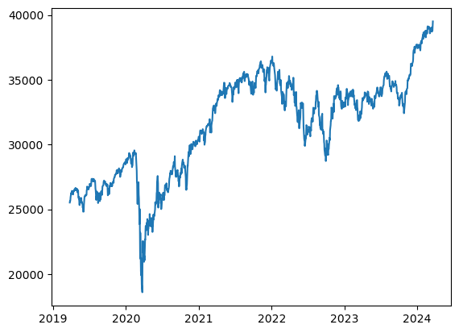
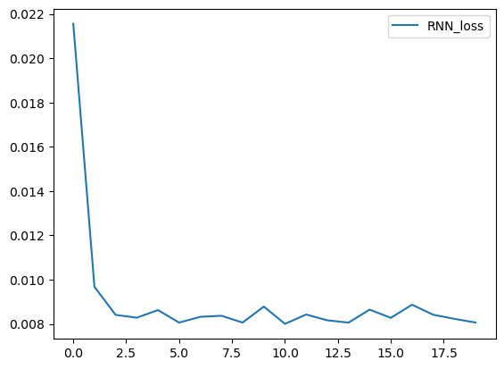
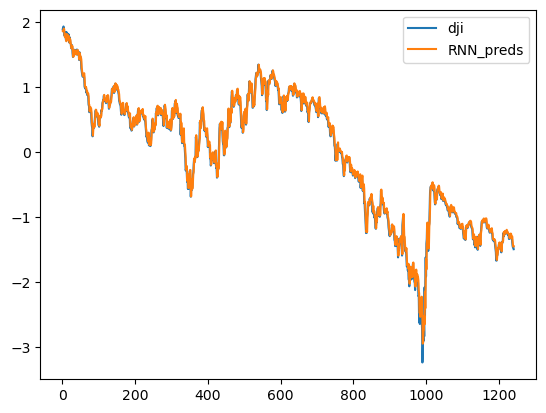

# 进阶循环神经网络

rnn模型默认激活函数是tanh，会得到loss太大了，模型几乎无法拟合样本，这是由于

数据集中 收盘价 Close 非常大，这样会导致rnn模型很容易出现 梯度消失和梯度爆炸。

我们可以通过修改激活函数来解决，初始化 加入 nonlinearity = 'relu'。

或者可以对数据进行归一化。若结果依旧不好，可能是因为学习率设置过大，一开始是0.1。但是如果出现没有拟合，是因为不能拟合原始数据了，要拟合归一化后的x。


## DRNN


```python
from torch import nn
from tqdm import *
 
class DRNN(nn.Module):
    def __init__(self, input_size, output_size, hidden_size, num_layers):
        super(DRNN, self).__init__()
        self.hidden_size = hidden_size
        self.num_layers = num_layers
        self.rnn = nn.RNN(input_size, hidden_size, num_layers, batch_first=True) 
        # batch_first 为 True时output的tensor为（batch,seq,feature）,否则为（seq,batch,feature）
        self.linear = nn.Linear(hidden_size, output_size)
    
    def forward(self, x):
        # 初始化隐藏状态和细胞状态
        state = torch.zeros(self.num_layers, x.size(0), self.hidden_size)
        # 计算输出和最终隐藏状态
        output, _ = self.rnn(x, state)
        output = self.linear(output)
        return output
    
```


```python
# 网络结构
model = DRNN(16, 16, 64, 2)
for name,parameters in model.named_parameters():
    print(name,':',parameters.size())
```

    rnn.weight_ih_l0 : torch.Size([64, 16])
    rnn.weight_hh_l0 : torch.Size([64, 64])
    rnn.bias_ih_l0 : torch.Size([64])
    rnn.bias_hh_l0 : torch.Size([64])
    rnn.weight_ih_l1 : torch.Size([64, 64])
    rnn.weight_hh_l1 : torch.Size([64, 64])
    rnn.bias_ih_l1 : torch.Size([64])
    rnn.bias_hh_l1 : torch.Size([64])
    linear.weight : torch.Size([16, 64])
    linear.bias : torch.Size([16])


## 双向循环神经网络


```python
class BRNN(nn.Module):
    def __init__(self, input_size, output_size, hidden_size, num_layers):
        super(BRNN, self).__init__()
        self.hidden_size = hidden_size
        self.num_layers = num_layers
        self.rnn = nn.RNN(input_size, hidden_size, num_layers, batch_first=True, bidirectional=True) # bidirectional为True是双向
        self.linear = nn.Linear(hidden_size * 2, output_size)  # 双向网络，因此有双倍hidden_size
    
    def forward(self, x):
        # 初始化隐藏状态
        state = torch.zeros(self.num_layers * 2, x.size(0), self.hidden_size) # 需要双倍的隐藏层
        output, _ = self.rnn(x, state)
        output = self.linear(output)
        return output
```


```python
# 网络结构
model = BRNN(16, 16, 64, 2)
for name,parameters in model.named_parameters():
    print(name,':',parameters.size())
```

    rnn.weight_ih_l0 : torch.Size([64, 16])
    rnn.weight_hh_l0 : torch.Size([64, 64])
    rnn.bias_ih_l0 : torch.Size([64])
    rnn.bias_hh_l0 : torch.Size([64])
    rnn.weight_ih_l0_reverse : torch.Size([64, 16])
    rnn.weight_hh_l0_reverse : torch.Size([64, 64])
    rnn.bias_ih_l0_reverse : torch.Size([64])
    rnn.bias_hh_l0_reverse : torch.Size([64])
    rnn.weight_ih_l1 : torch.Size([64, 128])
    rnn.weight_hh_l1 : torch.Size([64, 64])
    rnn.bias_ih_l1 : torch.Size([64])
    rnn.bias_hh_l1 : torch.Size([64])
    rnn.weight_ih_l1_reverse : torch.Size([64, 128])
    rnn.weight_hh_l1_reverse : torch.Size([64, 64])
    rnn.bias_ih_l1_reverse : torch.Size([64])
    rnn.bias_hh_l1_reverse : torch.Size([64])
    linear.weight : torch.Size([16, 128])
    linear.bias : torch.Size([16])


## 长短期记忆网络


```python
class LSTM(nn.Module):
    def __init__(self, input_size, output_size, hidden_size, num_layers):
        super(LSTM, self).__init__()
        self.hidden_size = hidden_size
        self.num_layers = num_layers
        self.lstm = nn.LSTM(input_size, hidden_size, num_layers, batch_first=True) # LSTM
        self.linear = nn.Linear(hidden_size, output_size)
    
    def forward(self, x):
        output, _ = self.lstm(x)
        output = self.linear(output)
        return output
```


```python
# 网络结构
model = LSTM(16, 16, 64, 2)
for name,parameters in model.named_parameters():
    print(name,':',parameters.size())
```

    lstm.weight_ih_l0 : torch.Size([256, 16])
    lstm.weight_hh_l0 : torch.Size([256, 64])
    lstm.bias_ih_l0 : torch.Size([256])
    lstm.bias_hh_l0 : torch.Size([256])
    lstm.weight_ih_l1 : torch.Size([256, 64])
    lstm.weight_hh_l1 : torch.Size([256, 64])
    lstm.bias_ih_l1 : torch.Size([256])
    lstm.bias_hh_l1 : torch.Size([256])
    linear.weight : torch.Size([16, 64])
    linear.bias : torch.Size([16])


## 门控循环单元


```python
class GRU(nn.Module):
    def __init__(self, input_size, output_size, hidden_size, num_layers):
        super(GRU, self).__init__()
        self.hidden_size = hidden_size
        self.num_layers = num_layers
        self.gru = nn.GRU(input_size, hidden_size, num_layers, batch_first=True) # GRU
        self.linear = nn.Linear(hidden_size, output_size)
    
    def forward(self, x):
        output, _ = self.gru(x)
        output = self.linear(output)
        return output
```


```python
# 网络结构
model = GRU(16, 16, 64, 2)
for name,parameters in model.named_parameters():
    print(name,':',parameters.size())
```

    gru.weight_ih_l0 : torch.Size([192, 16])
    gru.weight_hh_l0 : torch.Size([192, 64])
    gru.bias_ih_l0 : torch.Size([192])
    gru.bias_hh_l0 : torch.Size([192])
    gru.weight_ih_l1 : torch.Size([192, 64])
    gru.weight_hh_l1 : torch.Size([192, 64])
    gru.bias_ih_l1 : torch.Size([192])
    gru.bias_hh_l1 : torch.Size([192])
    linear.weight : torch.Size([16, 64])
    linear.bias : torch.Size([16])


# 模型实验


```python
import pandas_datareader as pdr
dji = pdr.DataReader('^DJI', 'stooq') # 道琼斯指数
dji
```


<div>
<style scoped>
    .dataframe tbody tr th:only-of-type {
        vertical-align: middle;
    }

    .dataframe tbody tr th {
        vertical-align: top;
    }
    
    .dataframe thead th {
        text-align: right;
    }
</style>
<table border="1" class="dataframe">
  <thead>
    <tr style="text-align: right;">
      <th></th>
      <th>Open</th>
      <th>High</th>
      <th>Low</th>
      <th>Close</th>
      <th>Volume</th>
    </tr>
    <tr>
      <th>Date</th>
      <th></th>
      <th></th>
      <th></th>
      <th></th>
      <th></th>
    </tr>
  </thead>
  <tbody>
    <tr>
      <th>2024-03-20</th>
      <td>39072.05</td>
      <td>39529.13</td>
      <td>38988.65</td>
      <td>39512.13</td>
      <td>336995052.0</td>
    </tr>
    <tr>
      <th>2024-03-19</th>
      <td>38819.61</td>
      <td>39122.71</td>
      <td>38761.28</td>
      <td>39110.76</td>
      <td>299971244.0</td>
    </tr>
    <tr>
      <th>2024-03-18</th>
      <td>38826.93</td>
      <td>38898.41</td>
      <td>38760.79</td>
      <td>38790.43</td>
      <td>313559132.0</td>
    </tr>
    <tr>
      <th>2024-03-15</th>
      <td>38809.65</td>
      <td>38928.13</td>
      <td>38618.20</td>
      <td>38714.77</td>
      <td>727712540.0</td>
    </tr>
    <tr>
      <th>2024-03-14</th>
      <td>39122.39</td>
      <td>39160.25</td>
      <td>38704.36</td>
      <td>38905.66</td>
      <td>347511841.0</td>
    </tr>
    <tr>
      <th>...</th>
      <td>...</td>
      <td>...</td>
      <td>...</td>
      <td>...</td>
      <td>...</td>
    </tr>
    <tr>
      <th>2019-03-29</th>
      <td>25827.31</td>
      <td>25949.32</td>
      <td>25771.67</td>
      <td>25928.68</td>
      <td>300697466.0</td>
    </tr>
    <tr>
      <th>2019-03-28</th>
      <td>25693.32</td>
      <td>25743.41</td>
      <td>25576.69</td>
      <td>25717.46</td>
      <td>237227189.0</td>
    </tr>
    <tr>
      <th>2019-03-27</th>
      <td>25676.34</td>
      <td>25758.17</td>
      <td>25425.27</td>
      <td>25625.59</td>
      <td>270329459.0</td>
    </tr>
    <tr>
      <th>2019-03-26</th>
      <td>25649.56</td>
      <td>25796.29</td>
      <td>25544.78</td>
      <td>25657.73</td>
      <td>305015321.0</td>
    </tr>
    <tr>
      <th>2019-03-25</th>
      <td>25490.72</td>
      <td>25603.27</td>
      <td>25372.26</td>
      <td>25516.83</td>
      <td>303146801.0</td>
    </tr>
  </tbody>
</table>
<p>1257 rows × 5 columns</p>
</div>


```python
import matplotlib.pyplot as plt
plt.plot(dji['Close']) #用收盘价
plt.show()
```


​    

​    


```python
import torch
from torch.utils.data import DataLoader, TensorDataset
 
num = len(dji)                           # 总数据量
x = torch.tensor(dji['Close'].to_list())  # 股价列表
 
x = (x - torch.mean(x)) / torch.std(x)  #数据归一化
 
seq_len = 16                               # 预测序列长度
batch_size = 16                            # 设置批大小
 
X_feature = torch.zeros((num - seq_len, seq_len))      # 构建特征矩阵，num-seq_len行，seq_len列，初始值均为0
Y_label = torch.zeros((num - seq_len, seq_len))        # 构建标签矩阵，形状同特征矩阵
for i in range(seq_len):
    X_feature[:, i] = x[i: num - seq_len + i]    # 为特征矩阵赋值
    Y_label[:, i] = x[i+1: num - seq_len + i + 1]    # 为标签矩阵赋值
 
train_loader = DataLoader(TensorDataset(
    X_feature[:num-seq_len].unsqueeze(2), Y_label[:num-seq_len]),
    batch_size=batch_size, shuffle=True)  # 构建数据加载器
```


```python
# 定义超参数
input_size = 1
output_size = 1
num_hiddens = 64
n_layers = 2
lr = 0.001
 
 
# 建立模型
model = DRNN(input_size, output_size, num_hiddens, n_layers)
criterion = nn.MSELoss(reduction='none')
trainer = torch.optim.Adam(model.parameters(), lr)
```


```python
# 训练轮次
num_epochs = 20
rnn_loss_history = []
 
for epoch in tqdm(range(num_epochs)):
    # 批量训练
    for X, Y in train_loader:
        trainer.zero_grad()
        y_pred = model(X)
        loss = criterion(y_pred.squeeze(), Y.squeeze())
        loss.sum().backward()
        trainer.step()
     # 输出损失
    model.eval()
    with torch.no_grad():
        total_loss = 0
        for X, Y in train_loader:
            y_pred = model(X)
            loss = criterion(y_pred.squeeze(), Y.squeeze())
            total_loss += loss.sum()/loss.numel()
        avg_loss = total_loss / len(train_loader)
        print(f'Epoch {epoch+1}: Validation loss = {avg_loss:.4f}')
        rnn_loss_history.append(avg_loss)
    
# 绘制损失曲线图
import matplotlib.pyplot as plt
# plt.plot(loss_history, label='loss')
plt.plot(rnn_loss_history, label='RNN_loss')
plt.legend()
plt.show()
```

      5%|▌         | 1/20 [00:00<00:03,  5.03it/s]
    
    Epoch 1: Validation loss = 0.0216


     15%|█▌        | 3/20 [00:00<00:03,  4.63it/s]
    
    Epoch 2: Validation loss = 0.0097
    Epoch 3: Validation loss = 0.0084


     25%|██▌       | 5/20 [00:01<00:03,  4.82it/s]
    
    Epoch 4: Validation loss = 0.0083
    Epoch 5: Validation loss = 0.0086


     35%|███▌      | 7/20 [00:01<00:02,  5.00it/s]
    
    Epoch 6: Validation loss = 0.0081
    Epoch 7: Validation loss = 0.0083


     40%|████      | 8/20 [00:01<00:02,  5.12it/s]
    
    Epoch 8: Validation loss = 0.0084


     50%|█████     | 10/20 [00:02<00:02,  3.76it/s]
    
    Epoch 9: Validation loss = 0.0081
    Epoch 10: Validation loss = 0.0088


     60%|██████    | 12/20 [00:02<00:01,  4.38it/s]
    
    Epoch 11: Validation loss = 0.0080
    Epoch 12: Validation loss = 0.0084


     65%|██████▌   | 13/20 [00:02<00:01,  4.33it/s]
    
    Epoch 13: Validation loss = 0.0082


     70%|███████   | 14/20 [00:03<00:01,  4.05it/s]
    
    Epoch 14: Validation loss = 0.0081


     75%|███████▌  | 15/20 [00:03<00:01,  4.27it/s]
    
    Epoch 15: Validation loss = 0.0086


     85%|████████▌ | 17/20 [00:03<00:00,  4.37it/s]
    
    Epoch 16: Validation loss = 0.0083
    Epoch 17: Validation loss = 0.0089


     90%|█████████ | 18/20 [00:04<00:00,  4.40it/s]
    
    Epoch 18: Validation loss = 0.0084


    100%|██████████| 20/20 [00:04<00:00,  4.37it/s]
    
    Epoch 19: Validation loss = 0.0082
    Epoch 20: Validation loss = 0.0081


​    



    


```python
rnn_preds = model(X_feature.unsqueeze(2))
rnn_preds.squeeze()
time = torch.arange(1, num+1, dtype= torch.float32)  # 时间轴
 
plt.plot(time[:num-seq_len], x[seq_len:num], label='dji')
# plt.plot(time[:num-seq_len], preds.detach().numpy(), label='preds')
plt.plot(time[:num-seq_len], rnn_preds[:,seq_len-1].detach(), label='RNN_preds')
plt.legend()
plt.show()
```


​    

​    


# 效果对比


```python
# 定义超参数
input_size = 1
output_size = 1
num_hiddens = 64
n_layers = 2
lr = 0.001
 
 
# 建立模型
model_name = ['DRNN', 'BRNN', 'LSTM', 'GRU']
drnn = DRNN(input_size, output_size, num_hiddens, n_layers)
brnn = BRNN(input_size, output_size, num_hiddens, n_layers)
lstm = LSTM(input_size, output_size, num_hiddens, n_layers)
gru = GRU(input_size, output_size, num_hiddens, n_layers)
models = [drnn, brnn, lstm, gru]
 
opts = [torch.optim.Adam(drnn.parameters(), lr), 
            torch.optim.Adam(brnn.parameters(), lr), 
            torch.optim.Adam(lstm.parameters(), lr), 
            torch.optim.Adam(gru.parameters(), lr)]
criterion = nn.MSELoss(reduction='none')
 
num_epochs = 20
rnn_loss_history = []
lr = 0.1
for epoch in tqdm(range(num_epochs)):
    # 批量训练
    for X, Y in train_loader:
        for index, model, optimizer in zip(range(len(models)), models, opts):
            y_pred = model(X)
            loss = criterion(y_pred.squeeze(), Y.squeeze())
            trainer.zero_grad()
            loss.sum().backward()
            trainer.step()
```

    100%|██████████| 20/20 [00:16<00:00,  1.22it/s]


```python
for i in range(4):
    rnn_preds = models[i](X_feature.unsqueeze(2))
    bias = torch.sum(x[seq_len:num] - rnn_preds[:,seq_len-1].detach().numpy())
    print ('{} bias : {}'.format(model_name[i],str(bias)))
```

    DRNN bias : tensor(300.3675)
    BRNN bias : tensor(27772.3750)
    LSTM bias : tensor(-87374.3672)
    GRU bias : tensor(88659.6172)


```python

```


```python

```
