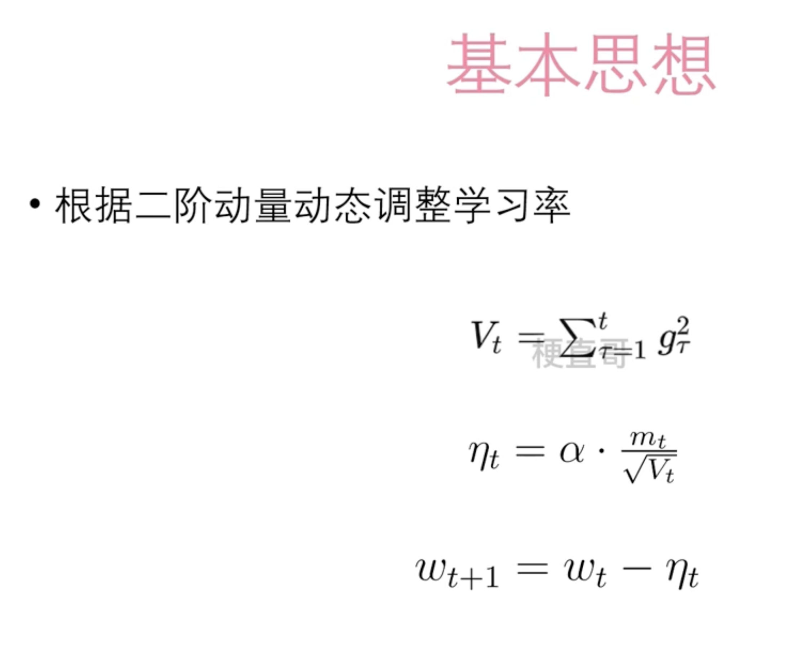
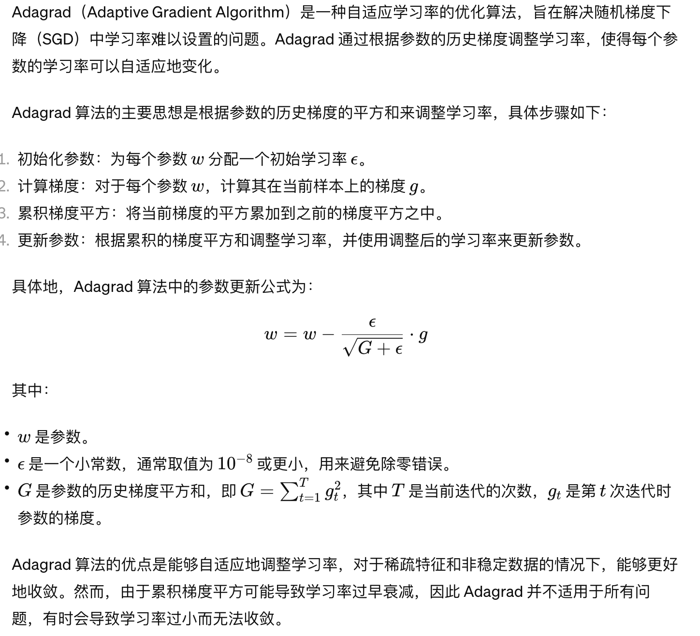

# AdaGrad算法




 





## Demo


```
import torch
import torch.nn as nn
import torch.optim as optim
import numpy as np

# 生成一些样本数据

np.random.seed(0)
X = 2 * np.random.rand(100, 1)
y = 4 + 3 * X + np.random.randn(100, 1)

# 转换为 PyTorch 的 Tensor 格式

X_tensor = torch.tensor(X, dtype=torch.float32)
y_tensor = torch.tensor(y, dtype=torch.float32)

# 定义线性回归模型

class LinearRegression(nn.Module):
    def __init__(self):
        super(LinearRegression, self).__init__()
        self.linear = nn.Linear(1, 1)  # 输入维度为1，输出维度为1

    def forward(self, x):
        return self.linear(x)

# 创建模型实例和优化器

model = LinearRegression()
optimizer = optim.Adagrad(model.parameters(), lr=0.1)  # 使用 Adagrad 算法，学习率为0.1
criterion = nn.MSELoss()  # 损失函数为均方误差损失

# 使用 Adagrad 算法进行线性回归

num_epochs = 1000
for epoch in range(num_epochs):
    # 前向传播
    outputs = model(X_tensor)
    loss = criterion(outputs, y_tensor)

    # 反向传播和优化
    optimizer.zero_grad()
    loss.backward()
    optimizer.step()
    
    # 打印损失
    if (epoch+1) % 100 == 0:
        print(f'Epoch [{epoch+1}/{num_epochs}], Loss: {loss.item():.4f}')

# 打印最终的模型参数

print("模型参数:", model.state_dict())
```

在这个示例中，我们使用 PyTorch 实现了一个简单的线性回归模型，并使用 Adagrad 算法对模型进行训练。在创建优化器时，我们使用 `optim.Adagrad` 来选择 Adagrad 算法，并设置学习率为 0.1。通过 Adagrad 算法，模型能够根据参数的历史梯度自适应地调整学习率，从而更快地收敛到最优解。


## 适用场景


Adagrad 算法适用于以下场景：

1. **稀疏数据**：当数据中存在稀疏特征时，Adagrad 能够根据每个特征的历史梯度自适应地调整学习率，从而更好地适应不同特征的稀疏性。

2. **非稳定数据**：对于具有较大方差或非稳定分布的数据，Adagrad 能够根据参数的历史梯度动态调整学习率，从而更好地应对数据的变化。

3. **凸优化问题**：在凸优化问题中，Adagrad 能够更快地收敛到全局最优解，因为它会根据参数的历史梯度来自适应地调整学习率。

4. **适合学习率递减**：由于 Adagrad 对于每个参数的学习率是自适应的，并且随着训练的进行逐渐减小，因此适合于需要学习率递减的优化问题。

   

尽管 Adagrad 在某些情况下能够表现出良好的性能，但也存在一些局限性：

1. **学习率衰减过快**：由于 Adagrad 会累积参数的历史梯度平方和，因此学习率可能会在训练的早期阶段衰减得过快，导致模型无法收敛。
2. **学习率过小**：随着训练的进行，累积的梯度平方和可能会变得非常大，从而导致学习率过小，使得模型更新变得缓慢。
3. **无法适应非凸优化问题**：在非凸优化问题中，Adagrad 可能会受到局部最优解的影响，导致无法找到全局最优解。

因此，在选择优化算法时，需要根据具体的问题和数据集来进行评估和选择。