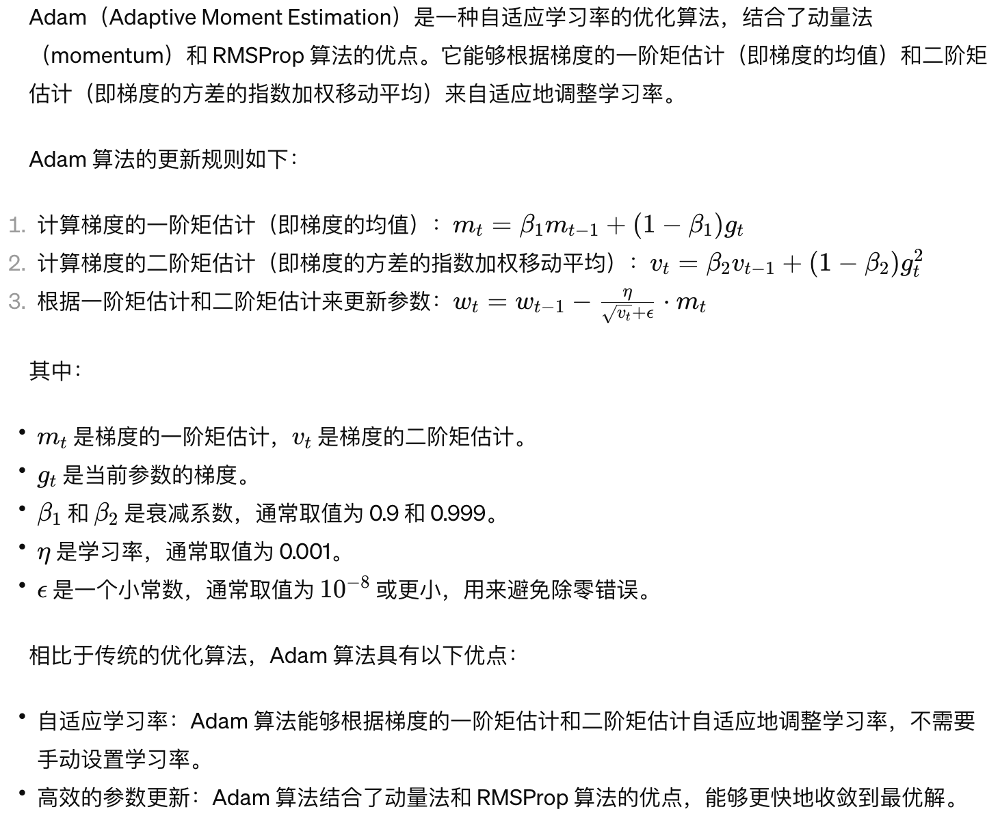
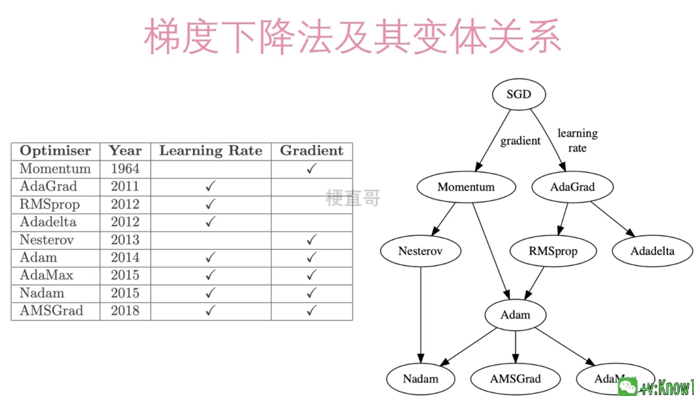
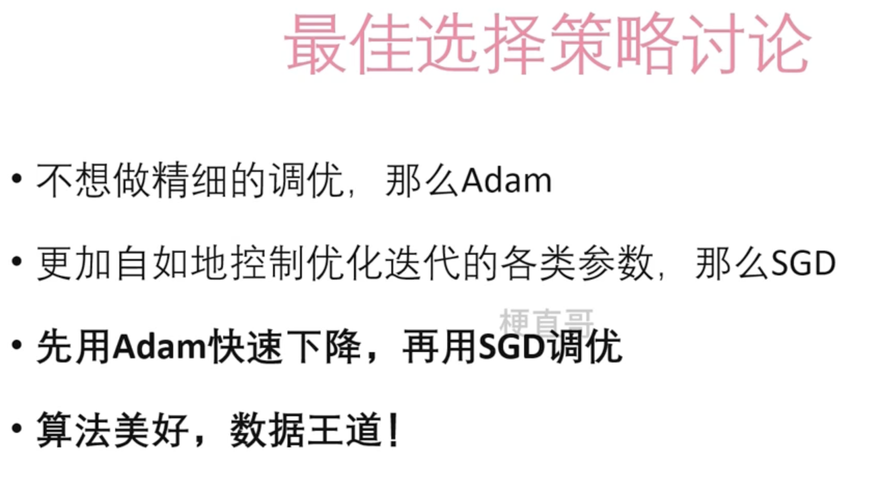

# Adam算法








## 选择策略





## Demo


```
import torch
import torch.nn as nn
import torch.optim as optim
import numpy as np

# 生成一些样本数据

np.random.seed(0)
X = 2 * np.random.rand(100, 1)
y = 4 + 3 * X + np.random.randn(100, 1)

# 转换为 PyTorch 的 Tensor 格式

X_tensor = torch.tensor(X, dtype=torch.float32)
y_tensor = torch.tensor(y, dtype=torch.float32)

# 定义线性回归模型

class LinearRegression(nn.Module):
    def __init__(self):
        super(LinearRegression, self).__init__()
        self.linear = nn.Linear(1, 1)  # 输入维度为1，输出维度为1

    def forward(self, x):
        return self.linear(x)

# 创建模型实例和优化器

model = LinearRegression()
optimizer = optim.Adam(model.parameters(), lr=0.01)  # 使用 Adam 算法，学习率为0.01
criterion = nn.MSELoss()  # 损失函数为均方误差损失

# 使用 Adam 算法进行线性回归

num_epochs = 1000
for epoch in range(num_epochs):
    # 前向传播
    outputs = model(X_tensor)
    loss = criterion(outputs, y_tensor)

    # 反向传播和优化
    optimizer.zero_grad()
    loss.backward()
    optimizer.step()
    
    # 打印损失
    if (epoch+1) % 100 == 0:
        print(f'Epoch [{epoch+1}/{num_epochs}], Loss: {loss.item():.4f}')

# 打印最终的模型参数

print("模型参数:", model.state_dict())
```

在这个示例中，我们使用 PyTorch 实现了一个简单的线性回归模型，并使用 Adam 算法对模型进行训练。在创建优化器时，我们使用 `optim.Adam` 来选择 Adam 算法，并设置学习率为 0.01。通过 Adam 算法，模型能够根据参数的一阶矩估计和二阶矩估计自适应地调整学习率，更好地适应不同的数据特性和优化问题。