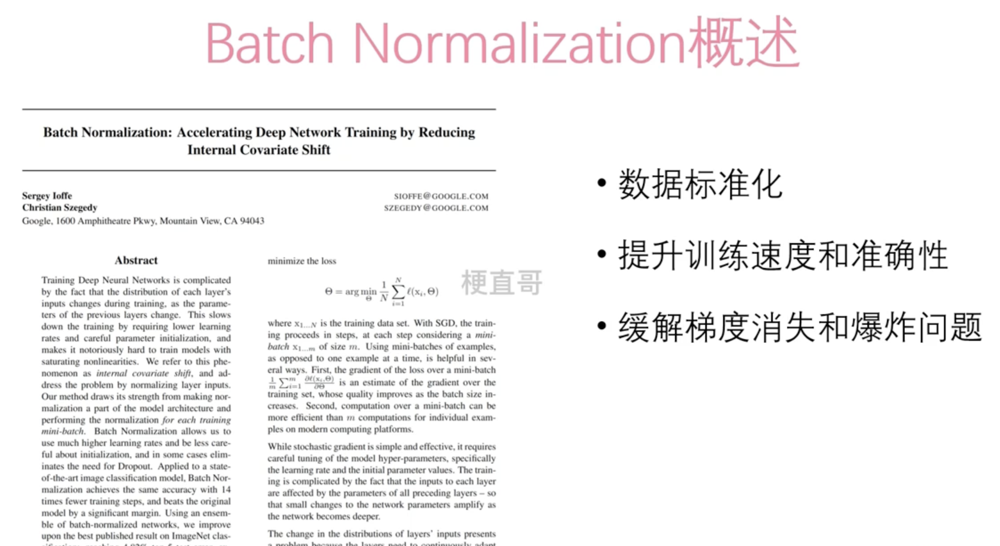
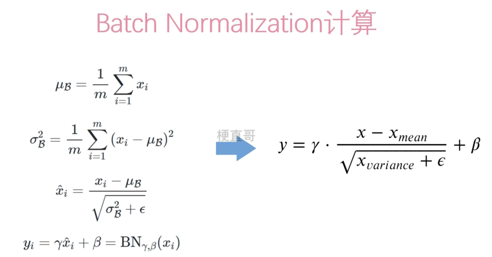

# Batch Normalization

Batch Normalization（批归一化）是一种用于加速神经网络训练并增强模型稳定性的技术。它在每个小批量的数据上对神经网络的中间输出进行归一化处理。

Batch Normalization的主要思想是将网络中的每一层的输入进行归一化，使得它们的均值接近0，标准差接近1。这样做有以下几个优点：

1. **加速训练速度**：由于每个小批量数据的分布被归一化，因此网络更容易学习到稳定的特征表示，从而加快了训练速度。
2. **减少对参数初始化的依赖**：Batch Normalization使得网络对于参数初始化的选择更加鲁棒，减少了手动调整参数初始化的需要。
3. **抑制过拟合**：Batch Normalization在训练过程中引入了一定程度的噪声，这有助于减少过拟合，提高模型的泛化能力。
4. **允许使用更高的学习率**：由于归一化的作用，网络的梯度更加稳定，因此可以使用更高的学习率来加速训练过程。
5. **网络具有更强的泛化能力**：Batch Normalization有利于网络学习到更加泛化的特征表示，从而提高了模型在未见过数据上的性能。

Batch Normalization的主要缺点包括：

1. **增加计算成本**：在训练过程中，Batch Normalization需要计算每个小批量数据的均值和方差，并对中间输出进行归一化处理，这会增加一定的计算成本。
2. **可能导致训练不稳定**：在某些情况下，Batch Normalization可能会导致网络训练不稳定，特别是在批量大小较小时。
3. **不适用于所有网络结构**：虽然Batch Normalization对于大多数深度神经网络是有效的，但并不适用于所有网络结构，尤其是对于循环神经网络（RNN）等具有复杂结构的网络。

## 适用场景

1. **深度神经网络（Deep Neural Networks）**：随着神经网络的深度增加，梯度消失和梯度爆炸等问题会变得更加严重。批归一化有助于缓解这些问题，使得更深层次的网络能够更稳定地进行训练。
2. **大型数据集**：在处理大型数据集时，批归一化可以提高模型的泛化能力，并且可以减少对超参数的敏感度。
3. **加速收敛速度**：通过减少内部协变量转移（Internal Covariate Shift），批归一化有助于加速模型的收敛速度，使得模型能够更快地学习到数据的分布特征。
4. **稳定性增强**：批归一化可以减少网络中间层的激活值的变化范围，从而使得模型更加稳定，对输入数据的小变化具有更好的鲁棒性。
5. **适用于各种激活函数**：批归一化可以与各种不同的激活函数一起使用，包括ReLU、Sigmoid、Tanh等。
6. **减少过拟合**：批归一化中的正则化效果有助于减少模型的过拟合，使得模型在训练集和测试集上都能够表现良好。

