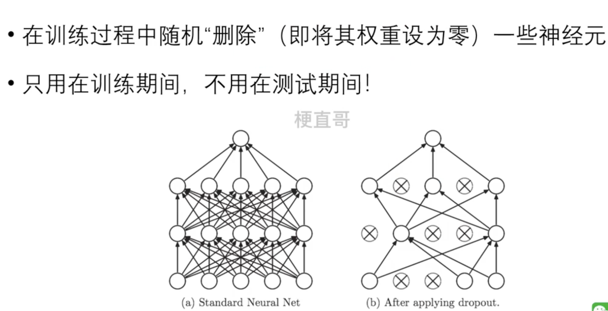

# Dropout 方法

Dropout 是一种常用的正则化技术，用于减少神经网络中的过拟合。在训练过程中，Dropout 随机地将神经网络中的一部分神经元的输出设置为零，从而在每次训练迭代中随机丢弃一部分神经元，使得模型不能过度依赖任何一个神经元，从而提高了模型的泛化能力。

具体来说，Dropout 操作如下：

1. 在每次训练迭代中，以概率 *p* （通常在0.2到0.5之间）随机选择一部分神经元，并将它们的输出置为零。
2. 在测试时，不进行 Dropout 操作，而是对所有神经元的输出进行缩放，使得模型在测试时的期望输出与在训练时保持一致。

使用 Dropout 有助于减少神经网络中的过拟合现象，因为它迫使模型在训练过程中学习到更加健壮和泛化的特征。此外，Dropout 还有一定的正则化效果，因为它引入了噪声，使得模型的学习变得更加稳健

