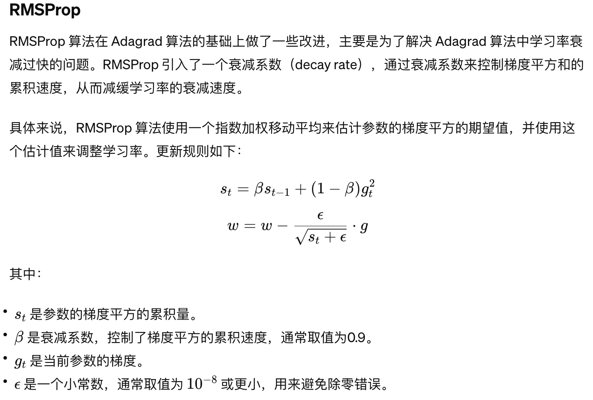
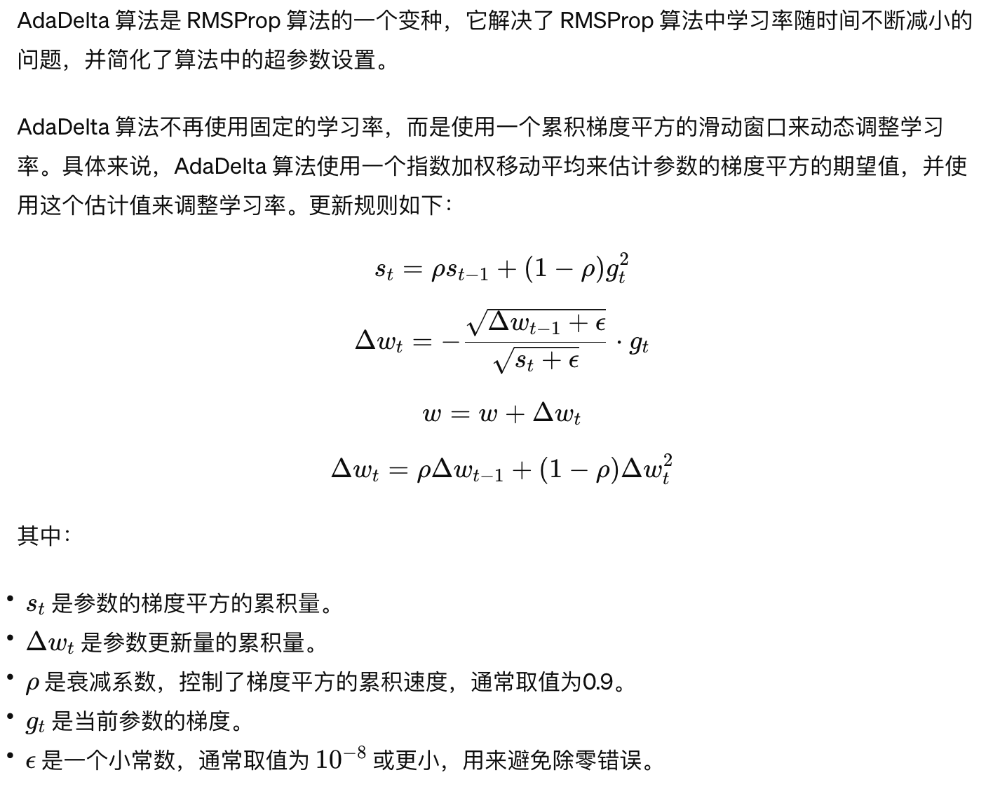

# RMSProp/AdaDelta算法

RMSProp（Root Mean Square Propagation）和 AdaDelta 算法都是基于梯度自适应的优化算法，用于解决随机梯度下降（SGD）中学习率难以设置的问题。它们通过根据参数的历史梯度自适应地调整学习率，使得每个参数的学习率可以自适应地变化。


## RMSProp

不累计全部历史梯度，而只关注过去一段时间窗口的下降梯度。




## AdaDelta

避免使用手动调整学习率的方法来控制训练过程，而是自动调整学习率，使得训练过程更加顺畅。




## 适用场景


MSProp 和 AdaDelta 算法适用于以下场景：

1. **稀疏数据和非稳定数据**：当数据中存在稀疏特征或具有较大方差的非稳定数据时，RMSProp 和 AdaDelta 能够根据参数的历史梯度自适应地调整学习率，更好地适应不同特征的稀疏性和数据的变化。
2. **适合学习率递减**：由于 RMSProp 和 AdaDelta 算法根据参数的历史梯度自适应地调整学习率，因此适合于需要学习率递减的优化问题。它们能够自动调整学习率，不需要手动设置学习率衰减的策略。
3. **适合非凸优化问题**：在非凸优化问题中，RMSProp 和 AdaDelta 能够更快地收敛到局部最优解，因为它们根据参数的历史梯度自适应地调整学习率，有助于跳出局部最优解。
4. **不需要手动设置学习率**：RMSProp 和 AdaDelta 算法不需要手动设置学习率，而是根据参数的历史梯度自适应地调整学习率，因此对于不确定最佳学习率的问题具有较好的适用性。

尽管 RMSProp 和 AdaDelta 算法在某些情况下能够表现出良好的性能，但也存在一些局限性：

1. **计算资源需求较大**：由于需要累积参数的历史梯度平方和或更新量的累积量，因此需要更多的内存和计算资源。
2. **不适用于所有问题**：RMSProp 和 AdaDelta 算法并不适用于所有优化问题，有时可能会导致学习率衰减过快或无法收敛的问题。因此，在应用时需要根据具体问题进行评估和选择。


## Demo


```Python
import torch
import torch.nn as nn
import torch.optim as optim
import numpy as np

# 生成一些样本数据

np.random.seed(0)
X = 2 * np.random.rand(100, 1)
y = 4 + 3 * X + np.random.randn(100, 1)

# 转换为 PyTorch 的 Tensor 格式

X_tensor = torch.tensor(X, dtype=torch.float32)
y_tensor = torch.tensor(y, dtype=torch.float32)

# 定义线性回归模型

class LinearRegression(nn.Module):
    def __init__(self):
        super(LinearRegression, self).__init__()
        self.linear = nn.Linear(1, 1)  # 输入维度为1，输出维度为1

    def forward(self, x):
        return self.linear(x)

# 创建模型实例和优化器

model = LinearRegression()
optimizer = optim.RMSprop(model.parameters(), lr=0.01)  # 使用 RMSProp 算法，学习率为0.01
criterion = nn.MSELoss()  # 损失函数为均方误差损失

# 使用 RMSProp 算法进行线性回归

num_epochs = 1000
for epoch in range(num_epochs):
    # 前向传播
    outputs = model(X_tensor)
    loss = criterion(outputs, y_tensor)

    # 反向传播和优化
    optimizer.zero_grad()
    loss.backward()
    optimizer.step()
    
    # 打印损失
    if (epoch+1) % 100 == 0:
        print(f'Epoch [{epoch+1}/{num_epochs}], Loss: {loss.item():.4f}')

# 打印最终的模型参数

print("模型参数:", model.state_dict())
```

在这个示例中，我们使用 PyTorch 实现了一个简单的线性回归模型，并使用 RMSProp 算法对模型进行训练。在创建优化器时，我们使用 `optim.RMSprop` 来选择 RMSProp 算法，并设置学习率为 0.01。通过 RMSProp 算法，模型能够根据参数的历史梯度自适应地调整学习率，更好地适应不同的数据特性和优化问题。