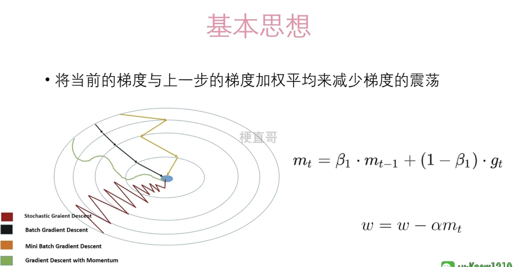
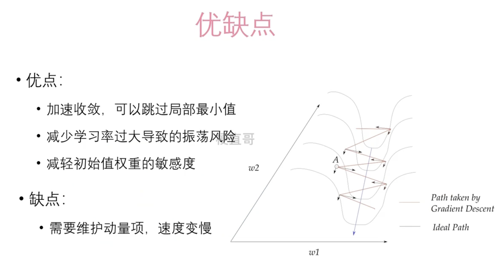

# 动量随机梯度下降法







## 一阶动量

一阶动量是指在优化算法中对参数梯度的一阶矩估计。在使用梯度下降算法优化模型参数时，一阶动量可以帮助指示梯度的变化方向和速度，从而指导参数更新的方向和步长。


具体来说，一阶动量是指对参数的梯度进行指数加权移动平均的结果，用来估计梯度的均值。在一阶动量中，较大的梯度将具有较大的权重，较小的梯度将具有较小的权重，从而平滑了梯度的变化，并且考虑了梯度的历史信息。

在优化算法中，常见的一阶动量方法包括动量法（momentum），它使用梯度的一阶动量来计算参数更新的方向和步长，从而加速收敛；以及 Adam 算法，它结合了动量法和 RMSProp 算法，使用梯度的一阶动量来自适应地调整学习率。

总的来说，一阶动量在优化算法中起到了平滑梯度、加速收敛和自适应学习率等作用。


通俗来讲它类似于你在开车时感受到的速度变化。如果你正在驾驶一辆车，你可以通过观察速度表和感受车辆加速或减速的程度来了解车速的变化。同样地，在优化算法中，我们也需要了解参数的梯度变化情况，以便调整参数的更新步长和方向。


## 二阶动量

二阶动量是指在优化算法中对参数梯度的二阶矩估计，通常用于计算梯度的方差。它可以帮助衡量梯度变化的幅度以及梯度之间的相关性，从而更准确地指导参数更新的方向和步长。


## 一阶动量和二阶动量的区别

一阶动量和二阶动量是优化算法中两种不同类型的动量估计方法，它们的主要区别在于估计的对象和使用方式：

1. **一阶动量**：
   - 估计对象：一阶动量是对参数的梯度进行估计，通常表示为梯度的一阶矩。
   - 使用方式：一阶动量主要用于估计梯度的均值，帮助指导参数更新的方向和步长。
2. **二阶动量**：
   - 估计对象：二阶动量是对参数的梯度的平方进行估计，通常表示为梯度的二阶矩。
   - 使用方式：二阶动量主要用于估计梯度的方差，帮助衡量梯度变化的幅度和梯度之间的相关性。

总的来说，一阶动量主要关注梯度的均值，用于指导参数更新的方向和步长，而二阶动量主要关注梯度的方差，用于衡量梯度变化的幅度和梯度之间的相关性。在一些优化算法中，如 Adam、RMSProp 和 AdaDelta，会同时使用一阶动量和二阶动量来自适应地调整学习率，以更有效地优化模型。


## Demo


```
import torch
import torch.nn as nn
import torch.optim as optim
import numpy as np

# 生成一些样本数据

np.random.seed(0)
X = 2 * np.random.rand(100, 1)
y = 4 + 3 * X + np.random.randn(100, 1)

# 转换为 PyTorch 的 Tensor 格式

X_tensor = torch.tensor(X, dtype=torch.float32)
y_tensor = torch.tensor(y, dtype=torch.float32)

# 定义线性回归模型

class LinearRegression(nn.Module):
    def __init__(self):
        super(LinearRegression, self).__init__()
        self.linear = nn.Linear(1, 1)  # 输入维度为1，输出维度为1

    def forward(self, x):
        return self.linear(x)

# 创建模型实例和优化器

model = LinearRegression()
optimizer = optim.SGD(model.parameters(), lr=0.1, momentum=0.9)  # 使用动量法，设置动量参数为0.9
criterion = nn.MSELoss()  # 损失函数为均方误差损失

# 使用动量法进行线性回归

num_epochs = 1000
for epoch in range(num_epochs):
    # 前向传播
    outputs = model(X_tensor)
    loss = criterion(outputs, y_tensor)

    # 反向传播和优化
    optimizer.zero_grad()
    loss.backward()
    optimizer.step()
    
    # 打印损失
    if (epoch+1) % 100 == 0:
        print(f'Epoch [{epoch+1}/{num_epochs}], Loss: {loss.item():.4f}')

# 打印最终的模型参数

print("模型参数:", model.state_dict())
```

这个示例中，我们使用 PyTorch 实现了一个简单的线性回归模型，并使用动量法（Momentum）对模型进行训练。在创建优化器时，我们将 `momentum` 参数设置为 0.9，表示使用动量法，并设置动量参数为 0.9。通过动量法，模型在参数更新时将考虑之前的梯度动量，从而更快地收敛到最优解。


在 PyTorch 中，动量参数的取值通常在 0 到 1 之间。具体来说，当动量参数设置为 0 时，表示不考虑之前的梯度，等同于标准的随机梯度下降（SGD）。当动量参数设置为 1 时，表示完全考虑之前的梯度，相当于完全使用之前的梯度信息。


一般来说，动量参数的取值为 0.9 或 0.99 是比较常见的选择，它们在实践中通常能够取得较好的效果。较大的动量参数可以帮助模型更快地收敛，尤其是在存在大量平坦区域或局部最优解时，但同时也可能增加过拟合的风险。因此，动量参数的选择需要根据具体问题和数据集进行调整。