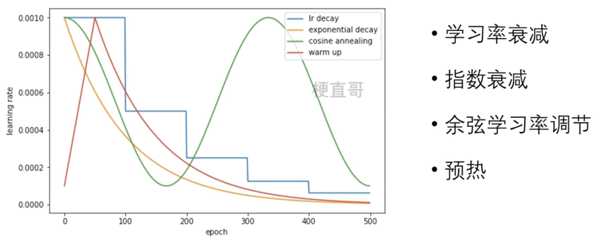
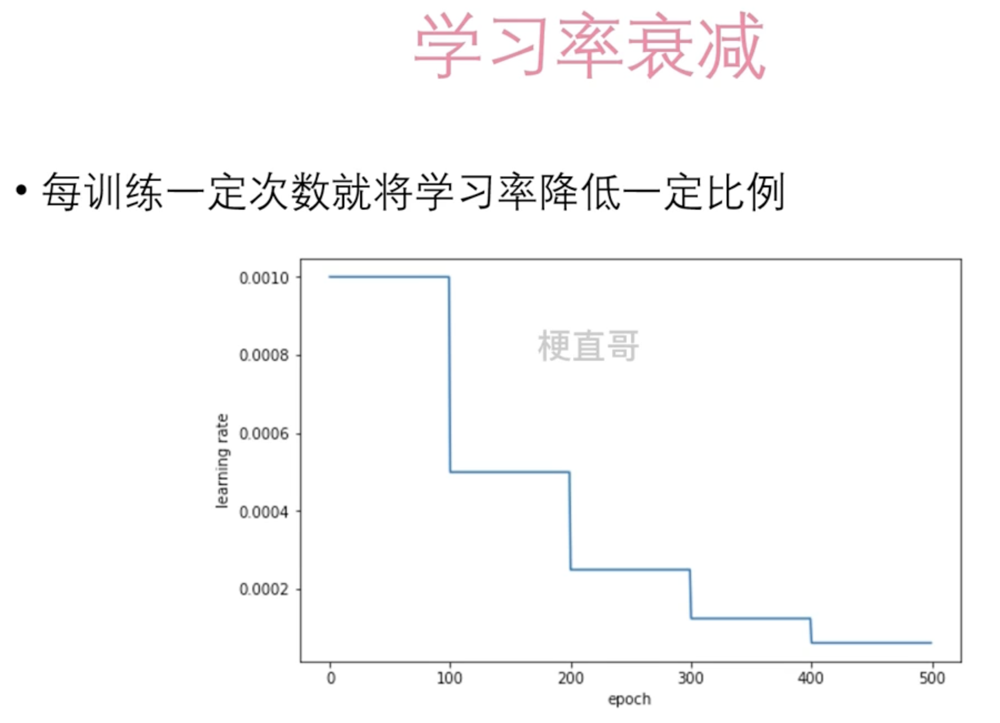
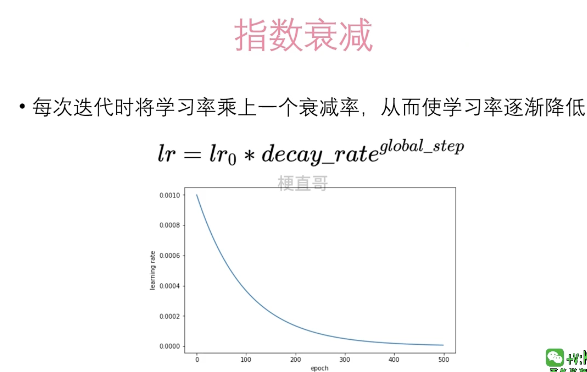
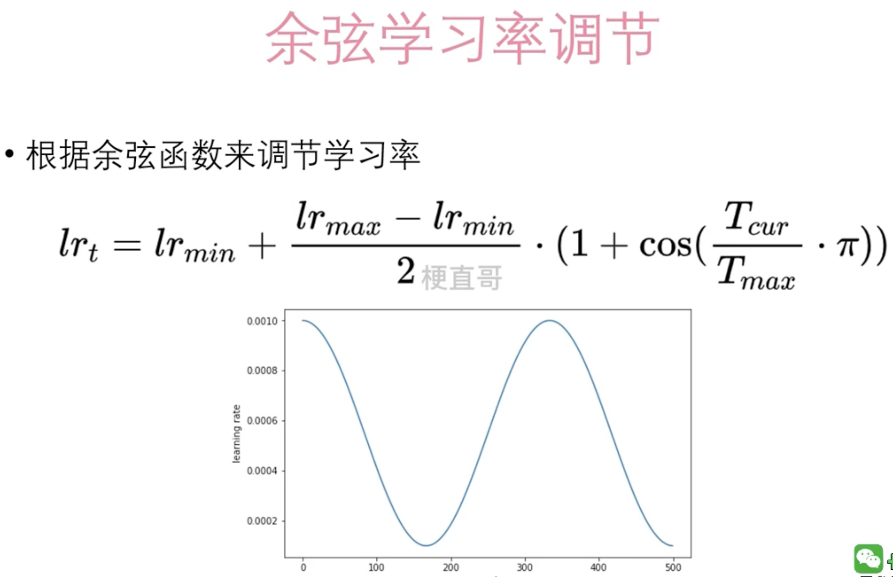
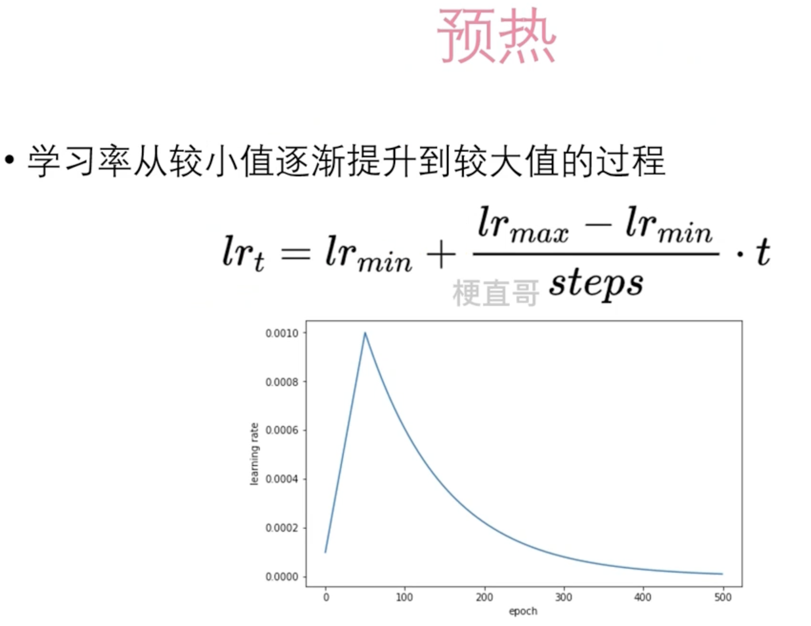

# 学习率调节器


在深度学习中，学习率调节器是一种用于动态调整学习率的工具。它们能够根据训练过程中的不同阶段或模型的性能表现，自适应地调整学习率的大小，以提高训练效果并加速模型收敛。


## 常见学习率调节器





## 学习率衰减





##  指数衰减





## 余弦学习率衰减




cur表示当前


## 预热（warnup）





## Demo

下面是一个使用 PyTorch 实现的学习率调节器的简单示例代码，其中使用了 `torch.optim.lr_scheduler` 模块中的 `StepLR` 调节器。在这个示例中，我们使用线性回归模型对一个简单的数据集进行训练，并在每个指定的 epoch 后降低学习率。

```
import torch
import torch.nn as nn
import torch.optim as optim
import numpy as np

# 生成一些样本数据

np.random.seed(0)
X = 2 * np.random.rand(100, 1)
y = 4 + 3 * X + np.random.randn(100, 1)

# 转换为 PyTorch 的 Tensor 格式
X_tensor = torch.tensor(X, dtype=torch.float32)
y_tensor = torch.tensor(y, dtype=torch.float32)

# 定义线性回归模型
class LinearRegression(nn.Module):
    def __init__(self):
        super(LinearRegression, self).__init__()
        self.linear = nn.Linear(1, 1)  # 输入维度为1，输出维度为1

    def forward(self, x):
        return self.linear(x)

# 创建模型实例和优化器

model = LinearRegression()
optimizer = optim.SGD(model.parameters(), lr=0.01)  # 使用 SGD 优化器，初始学习率为0.01
criterion = nn.MSELoss()  # 损失函数为均方误差损失

# 创建学习率调节器

scheduler = optim.lr_scheduler.StepLR(optimizer, step_size=20, gamma=0.1)  # 每20个epoch将学习率乘以0.1

# 使用学习率调节器进行线性回归训练

num_epochs = 100
for epoch in range(num_epochs):
    # 前向传播
    outputs = model(X_tensor)
    loss = criterion(outputs, y_tensor)

    # 反向传播和优化
    optimizer.zero_grad()
    loss.backward()
    optimizer.step()
    
    # 更新学习率
    scheduler.step()
    
    # 打印学习率和损失
    if (epoch+1) % 10 == 0:
        print(f'Epoch [{epoch+1}/{num_epochs}], Learning Rate: {scheduler.get_lr()[0]:.6f}, Loss: {loss.item():.4f}')

# 打印最终的模型参数

print("模型参数:", model.state_dict())
```

在这个示例中，我们首先定义了一个简单的线性回归模型，并创建了一个使用 SGD 优化器的优化器实例。然后，我们创建了一个 `StepLR` 调节器，设置了每20个 epoch 将学习率乘以0.1的策略。在训练过程中，我们每个 epoch 后都更新一次学习率，并且在每个 10 个 epoch 打印一次当前的学习率和损失。通过这个示例，你可以了解如何在 PyTorch 中使用学习率调节器来动态调整学习率。


## 常见的学习率调节器库


1. **StepLR**：在训练的每个指定的epoch之后，将学习率按照一个因子进行衰减。例如，在每个epoch之后将学习率乘以一个衰减因子。
2. **MultiStepLR**：类似于StepLR，但是可以在预先指定的epoch处进行学习率的衰减，而不是在每个epoch后都衰减。
3. **ExponentialLR**：按照指数函数衰减学习率，即每个epoch后将学习率乘以一个指数因子。
4. **CosineAnnealingLR**：按照余弦函数的形式动态调整学习率，在每个epoch后根据余弦函数调整学习率的大小。
5. **ReduceLROnPlateau**：监控验证集的性能，并在验证性能停止提升时降低学习率。这种调节器通常用于自适应地调整学习率以应对训练过程中的停滞情况。
6. **CyclicLR**：在一个周期内动态地调整学习率，即先增加学习率，然后逐渐减小学习率，形成一个周期性的调节过程。
7. **OneCycleLR**：在整个训练过程中动态地调整学习率，使学习率先逐渐增加，然后逐渐减小，并在训练结束前恢复到初始值