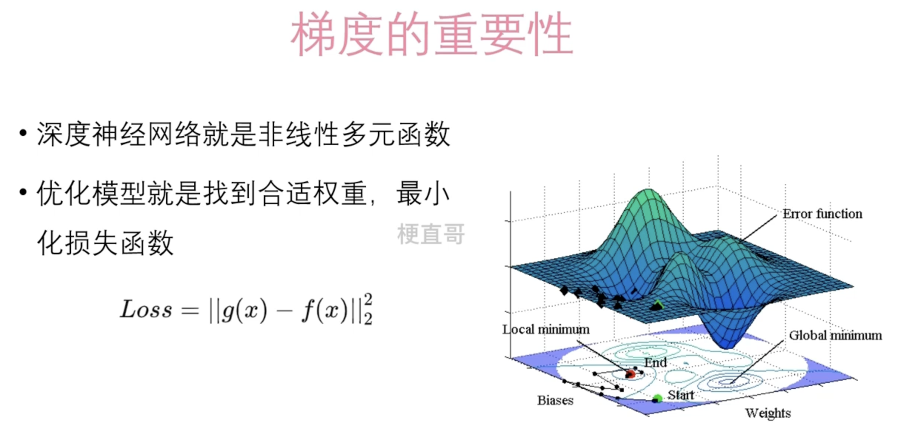
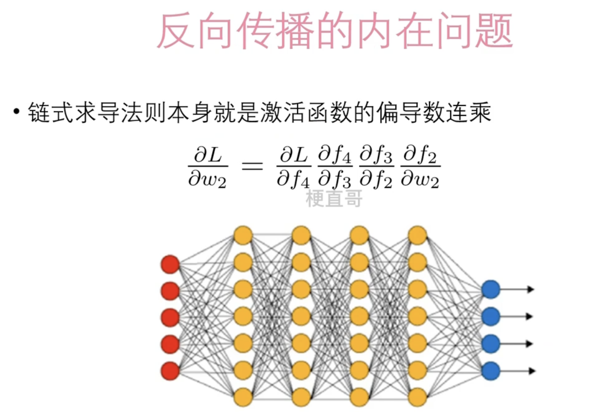
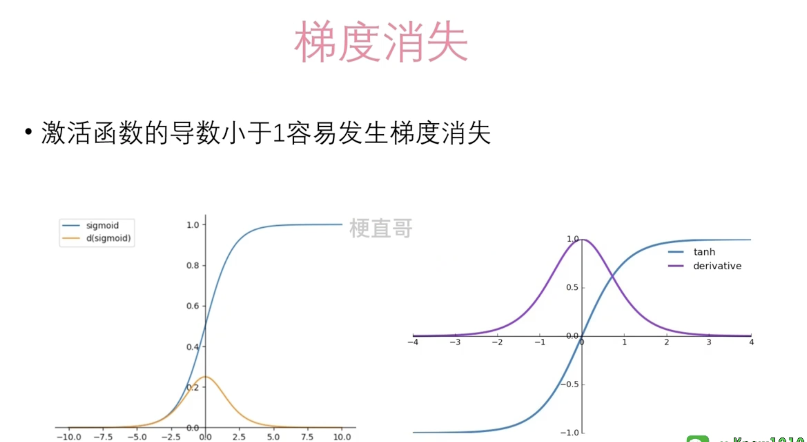
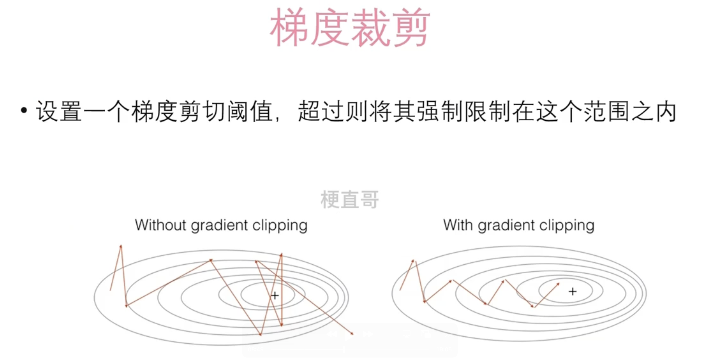
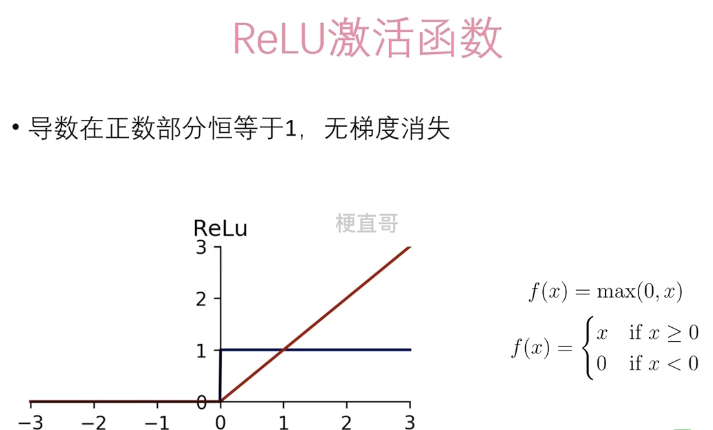
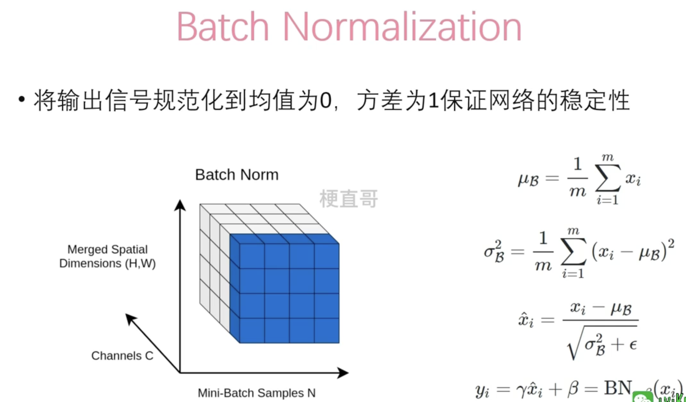

# 梯度消失和梯度爆炸


## 背景






## 梯度消失

梯度消失是指在深度神经网络中，随着网络层数的增加，梯度在反向传播过程中逐渐变小，甚至变为零的现象。这会导致深层网络中底层的参数几乎无法更新，从而影响模型的训练效果。


梯度消失通常发生在使用某些激活函数时，特别是在网络很深的情况下，因为这些激活函数的导数可能会小于1，或者是在梯度反向传播过程中，多次连续相乘可能导致梯度衰减。


有几种方法可以缓解梯度消失问题：

1. **使用合适的激活函数**：某些激活函数，如 ReLU 和其变种（LeakyReLU、ReLU6等），具有较大的导数，在一定程度上缓解了梯度消失问题。
2. **使用批量归一化**：批量归一化可以加速模型的收敛，减少梯度消失问题的影响。
3. **使用残差连接**：残差连接（Residual Connection）可以使得梯度能够直接传递到较浅的层，从而缓解梯度消失问题。
4. **使用适当的初始化方法**：良好的参数初始化可以减少梯度消失问题的发生。例如，使用 Xavier 初始化方法。
5. **使用梯度裁剪**：梯度裁剪可以限制梯度的大小，防止梯度爆炸的同时，也可以减轻梯度消失问题。
6. **减少网络的深度**：在实践中，如果梯度消失问题严重，可以尝试减少网络的深度，或者采用其他架构设计策略。




比如左图中黄色，最高的梯度是0.25,当很多个0.25相乘，则梯度就会非常小，最终消失。改进版是右边的tanh函数。


## 梯度爆炸


梯度爆炸是指在深度神经网络中，随着网络层数的增加，梯度在反向传播过程中逐渐变大，甚至变得非常大的现象。这会导致模型参数的更新过程不稳定，甚至出现溢出的情况，从而影响模型的训练效果。

梯度爆炸通常发生在深层神经网络中，特别是在网络的层数较多或者在 RNN（循环神经网络）等架构中，由于梯度在反向传播过程中多次连续相乘，梯度会呈指数增长的趋势。

有几种方法可以缓解梯度爆炸问题：

1. **梯度裁剪**：梯度裁剪可以限制梯度的大小，防止梯度爆炸的发生。通过设置一个阈值，如果梯度的范数超过这个阈值，就对梯度进行缩放，使其不超过阈值。
2. **使用适当的优化算法**：一些优化算法，如 Adam、RMSProp 等，具有自适应学习率调整的特性，能够在一定程度上减缓梯度爆炸的发生。
3. **使用合适的初始化方法**：良好的参数初始化可以减少梯度爆炸问题的发生。例如，使用 Xavier 初始化方法或者 Kaiming 初始化方法。
4. **使用合适的激活函数**：某些激活函数的导数可能会导致梯度爆炸的发生，因此选择合适的激活函数也是缓解梯度爆炸问题的一个策略。
5. **减少学习率**：适当地减小学习率可以减缓梯度爆炸的发生，使得参数更新的过程更加稳定。
6. **减少网络的深度**：在实践中，如果梯度爆炸问题严重，可以尝试减少网络的深度，或者采用其他架构设计策略。


## 梯度裁剪




使用torch.nn.utils.clip_grad_norm_函数进行裁剪。例子：

```python
import torch
import torch.nn as nn

# 构建一个简单的深度神经网络

class DeepNet(nn.Module):
    def __init__(self):
        super(DeepNet, self).__init__()
        self.fc1 = nn.Linear(100, 1000)  # 第一层全连接层
        self.fc2 = nn.Linear(1000, 1000)  # 第二层全连接层
        self.fc3 = nn.Linear(1000, 1000)  # 第三层全连接层
        self.fc4 = nn.Linear(1000, 1000)  # 第四层全连接层
        self.fc5 = nn.Linear(1000, 1)  # 输出层

    def forward(self, x):
        x = torch.relu(self.fc1(x))
        x = torch.relu(self.fc2(x))
        x = torch.relu(self.fc3(x))
        x = torch.relu(self.fc4(x))
        x = self.fc5(x)
        return x

# 创建模型实例
model = DeepNet()

# 构造一个输入张量
input_tensor = torch.randn(10, 100)

# 前向传播
output = model(input_tensor)

# 计算损失
loss_fn = nn.MSELoss()
loss = loss_fn(output, torch.randn(10, 1))

# 反向传播
loss.backward()

# 对梯度进行裁剪
max_norm = 1.0  # 设定裁剪阈值
torch.nn.utils.clip_grad_norm_(model.parameters(), max_norm)

# 输出第一层全连接层的梯度范数
print("第一层全连接层的梯度范数:", torch.norm(model.fc1.weight.grad))
```

输出：

```
第一层全连接层的梯度范数: tensor(0.1160)
```


## Relu函数




ReLU激活函数的优点包括：

1. **非线性特性**：ReLU函数是一种非线性函数，可以帮助神经网络学习到更复杂的模式和特征，提高模型的表达能力。

2. **计算简单**：ReLU函数的计算非常简单，只需要比较输入和零的大小，计算量小，训练速度快。

3. **缓解梯度消失问题**：ReLU函数在输入为正时梯度为常数1，不会引起梯度消失问题，能够更有效地进行梯度反向传播。

4. **稀疏激活性**：在实际应用中，ReLU函数通常会使一部分神经元的输出为零，从而增强了模型的稀疏性，有助于减少过拟合。

   

虽然ReLU函数具有很多优点，但也存在一些缺点，如神经元的输出在负数部分为零，可能会导致“神经元死亡”问题，即该神经元在训练过程中停止了更新。为了缓解这个问题，可以使用ReLU的变种，如Leaky ReLU、PReLU、ELU等。


## Batch Normalization

Batch Normalization（批标准化）是一种用于加速神经网络训练和提高模型性能的技术。它通过对每个输入特征进行标准化，使得神经网络中每一层的输入分布更加稳定，从而加速模型的收敛，并且有助于防止梯度消失或梯度爆炸的问题。

Batch Normalization 的基本思想是对每个特征维度进行标准化，使得每个特征的均值为0，方差为1。具体来说，对于一个输入批次（即一批样本），Batch Normalization 的计算过程如下：

1. 对于每个特征维度，计算该维度上所有样本的均值和方差。
2. 使用计算得到的均值和方差，对该特征维度上的每个样本进行标准化，即减去均值并除以标准差。
3. 使用可学习的缩放因子（scale factor）和偏置（bias）对标准化后的特征进行缩放和平移。

Batch Normalization 在训练过程中对每个批次的数据进行标准化，因此可以缓解训练中的内部协变量偏移（Internal Covariate Shift）问题，即每一层网络的输入分布随着网络参数的更新而发生变化，导致训练过程不稳定的问题。

在 PyTorch 中，可以通过 `torch.nn.BatchNorm1d`（用于一维输入，如全连接层）、`torch.nn.BatchNorm2d`（用于二维输入，如卷积层）、`torch.nn.BatchNorm3d`（用于三维输入，如3D卷积层）等类来实现 Batch Normalization。Batch Normalization 通常在激活函数之前应用，用于加速模型训练并提高模型性能。




对某一个通道（比如蓝色部分）进行标准化。


例子：

```Python
import torch
import torch.nn as nn

# 构建一个简单的神经网络模型

class SimpleNet(nn.Module):
    def __init__(self):
        super(SimpleNet, self).__init__()
        self.fc1 = nn.Linear(784, 300)  # 输入层到隐藏层的全连接层
        self.bn1 = nn.BatchNorm1d(300)  # 对隐藏层的输出进行批标准化
        self.fc2 = nn.Linear(300, 100)  # 隐藏层到输出层的全连接层
        self.bn2 = nn.BatchNorm1d(100)  # 对输出层的输出进行批标准化
        self.fc3 = nn.Linear(100, 10)   # 输出层

    def forward(self, x):
        x = torch.relu(self.fc1(x))     # 隐藏层的激活函数ReLU
        x = self.bn1(x)                 # 批标准化
        x = torch.relu(self.fc2(x))     # 隐藏层的激活函数ReLU
        x = self.bn2(x)                 # 批标准化
        x = self.fc3(x)                 # 输出层
        return x

# 创建模型实例
model = SimpleNet()

# 定义损失函数
criterion = nn.CrossEntropyLoss()

# 定义优化器
optimizer = torch.optim.Adam(model.parameters(), lr=0.001)

# 构造一个输入张量
input_tensor = torch.randn(64, 784)  # 64个样本，每个样本有784个特征

# 构造一个目标标签张量
target_tensor = torch.randint(0, 10, (64,))  # 随机生成64个样本的目标标签

# 训练模型
for epoch in range(10):
```

在这个示例中，我们创建了一个简单的神经网络模型 `SimpleNet`，包含了两个隐藏层和一个输出层。在隐藏层之间和输出层之前，我们分别添加了 Batch Normalization 层 `nn.BatchNorm1d` 来对特征进行标准化。然后，我们定义了损失函数、优化器，并进行模型的训练。在训练过程中，每个批次的输入数据都会经过 Batch Normalization 层进行标准化，从而加速模型的收敛并提高模型性能。